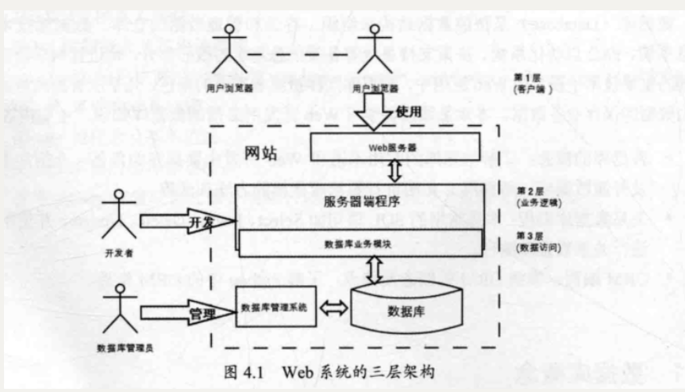
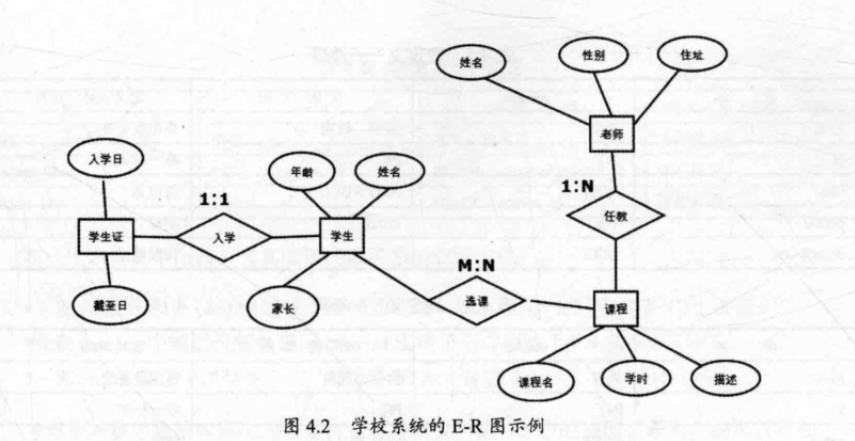
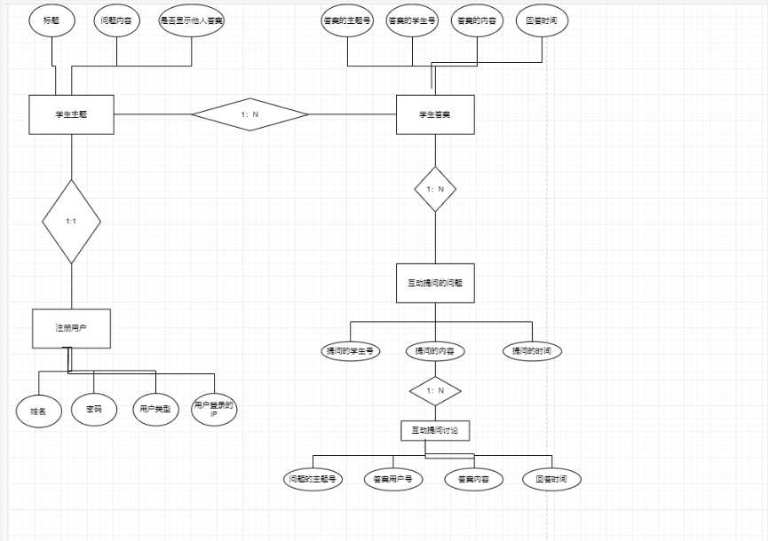

# 数据库及ORM


## Web开发中的数据库

网站系统设计一般遵循三层架构。分为：

```
客户端层（HTML、CSS、JavaSctipt）
业务逻辑层（Python）
数据访问层（Python）
```



各自行为表现为：

```
用户：通过客户端软件（web浏览器）访问网站，通过业务逻辑层和数据访问层间接的获得数据服务

开发者：设计和开发所有三层架构中的所有程序，包括数据库模型建立、数据访问代码开发等。

数据管理员: 通过数据库管理系统（DBMS），对数据库进行维护和配置，包括数据库性能分析、性能改进、数据备份、数据恢复等。
```

## 关系数据库建模

关系数据库建模通常由以下两步完成。

- 设计E-R图：构造一个反映现实世界实体之间联系的模型。

- 关系表设计：将E-R图转换成关系表，并定义列类型，建立主键、外键等各种约束。

### 1. 设计E-R图

E-R图，即实体-关系图。E-R图通过以下3种概念描述信息结构。

- 实体：客观存在的事务、事件、角色等，比如采购员、老师、课程、订单等。
- 实体属性：描述实体的特性，每个实体可以有多个属性，比如老师的性别、名字、住址等。
- 关系：反映两个实体之间客观存在的关系。


设计E-R图围绕着识别系统中实体和明确实体之间关系而进行的。E-R图中两个实体（实体A、实体B）的关系被分为以下3类。

- 一对一关系：典型的一对一关系包括人与身份证、丈夫与妻子等，一对一关系在E-R图中被标记为1:1 
- 一对多关系：典型的一对多关系包括班级与学生、人与银行卡等，一对多关系在E-R图中被标记为1：N
- 多对多关系：典型的多对多关系包括老师和班级、学生与课程等，多对多关系在E-R图中被标记为M:N 

E-R图的绘制中，通常方块表示实体，圆圈表示属性，实体之间的菱形表示关系，一个学校系统的E-R图示例如下：




图中的3个关系分别是：

课程与老师之间的关系是1：N；

课程与学生之间的关系是M: N；

学生与学生证之间的关系是1: 1；

### 2.关系表设计

数据库选型，例如MySQL、Oracle、PostgreSQL、SQLite、SQL Server

将每个实体转换为一个数据表，将实体的属性转换为表中的列，为每个列定义相应的数据类型。

对于1:1关系的两个表，为两个表设置相同的主键列。

对于1：N关系的两个表，在N中添加一个外键列，该列与1表中的主键相关联。

对于M: N关系，生成一个单独的表表示该关系，该关系的列由两个表的主键组成。

重新审核所有的表，对需要的地方添加约束，对常用的条件字段设置索引。

综上所述，可以将4.2中实体关系模型转换为具体的关系表。

该图可以生成5个表，4个实体表和1个关系表。


### 3.数据库中的键型、索引、约束解释

- Index：索引，对数据库中一列或者多列值进行排序的一种结构，对常用的查询字段添加索引可显著提高SQL语句的性能。
- Constraint：约束，是对列数据取值的某种限定，常见的约束有主键、外键、非空、唯一等。
- PK：主键（primary key），唯一标识一条记录，不允许为空，在大多数数据库中主键列也是一个索引列。
- FK：外键（foreign key），是另一个表的主键，表示关联关系，可以是空字段。
- NUT NULL：非空约束，即不允许列值为空。


## 数据库建模举例

设计一个学生答题管理系统。示例图如下：



根据示例图，画出E-R数据库建模图。


导出数据SQL文件，导出的数据SQL文件可用于建库操作。


## 一款在线ER模型设计工具.md

<https://blog.51cto.com/486221/2421425>

