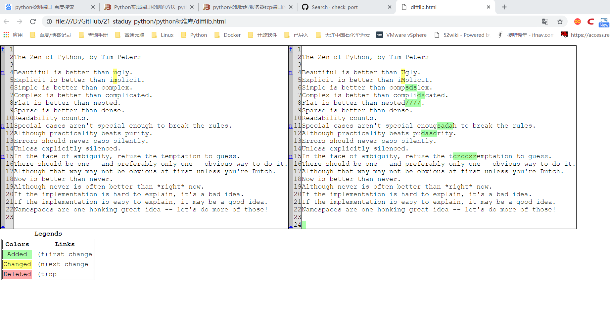

.. contents::
   :depth: 3
..

difflib文本比较模块
===================

eg

::

   #!/usr/bin/env python
   # -*- coding:utf8 -*-
   # auther; 18793
   # Date：2019/4/17 13:39
   # filename: 4.diff模块对比文件.py
   import difflib

   text1 = """
   The Zen of Python, by Tim Peters

   Beautiful is better than ugly.
   Explicit is better than implicit.
   Simple is better than complex.
   Complex is better than complicated.
   Flat is better than nested.
   Sparse is better than dense.
   Readability counts.
   Special cases aren't special enough to break the rules.
   Although practicality beats purity.
   Errors should never pass silently.
   Unless explicitly silenced.
   In the face of ambiguity, refuse the temptation to guess.
   There should be one-- and preferably only one --obvious way to do it.
   Although that way may not be obvious at first unless you're Dutch.
   Now is better than never.
   Although never is often better than *right* now.
   If the implementation is hard to explain, it's a bad idea.
   If the implementation is easy to explain, it may be a good idea.
   Namespaces are one honking great idea -- let's do more of those!

   """

   text2 = """
   The Zen of Python, by Tim Peters

   Beautiful is better than Ugly.
   Explicit is better than iMplicit.
   Simple is better than compsdslex.
   Complex is better than complidscated.
   Flat is better than nested////.
   Sparse is better than dense.
   Readability counts.
   Special cases aren't special enougsadah to break the rules.
   Although practicality beats pudasdrity.
   Errors should never pass silently.
   Unless explicitly silenced.
   In the face of ambiguity, refuse the tczccxzemptation to guess.
   There should be one-- and preferably only one --obvious way to do it.
   Although that way may not be obvious at first unless you're Dutch.
   Now is better than never.
   Although never is often better than *right* now.
   If the implementation is hard to explain, it's a bad idea.
   If the implementation is easy to explain, it may be a good idea.
   Namespaces are one honking great idea -- let's do more of those!

   """

   if __name__ == '__main__':
       # 以行进行分割，便于比较
       text1_line = text1.splitlines()
       text2_line = text2.splitlines()

       d = difflib.Differ()  # 创建differ()对象
       diff = d.compare(text1_line, text2_line)
       print("\n".join(list(diff)))

生成美观对比HTML格式文档
------------------------

::

   ######################## 生成美观的html文件 查看比对情况 ######################################
   d = difflib.HtmlDiff()
   import os
   if not os.path.exists(html_file):
       with open(html_file, "w") as file:
           file.write(d.make_file(text1_lines, text2_lines))
   else:
       print(html_file + "is exists....")

对比Nginx配置文件
~~~~~~~~~~~~~~~~~

.. code:: python

   #!/usr/bin/env python
   #-*- coding:utf8 -*-
   # auther; 18793
   # Date：2019/4/17 13:54
   # filename: 4.1对比nginx配置文件.py
   import difflib
   import sys,os

   try:
       textfile1=sys.argv[1]       #获取参数1
       textfile2 = sys.argv[2]     #获取参数2
   except Exception as e:
       print("Error: "+str(e))
       print("Usage: python 4.1对比nginx配置文件.py nginx1.cfg  nginx2.cfg")
       sys.exit()

   def readfile(filename):
       try:
           fileHanle = open(filename, "rb")
           text = fileHanle.read().splitlines()        #读取后以行进行分隔
           fileHanle.close()
           return text
       except Exception as e:
           print("Read file Error :" + str(e))
           sys.exit()

   if textfile1 == "" or textfile2 =="":
       print("Usage: python 4.1对比nginx配置文件.py nginx1.cfg  nginx2.cfg")
       sys.exit()

   if __name__ == '__main__':
       text1_lines = readfile(textfile1)       #调用函数，获取分隔后的字符串
       text2_lines = readfile(textfile2)

       d = difflib.HtmlDiff()      #创建HtmlDiff对象
       html_file = "difflib_nginx.html"
       if not os.path.exists(html_file):
           with open(html_file, "w") as file:
               file.write(d.make_file(text1_lines, text2_lines))
       else:
           print(html_file + "is exists....")
