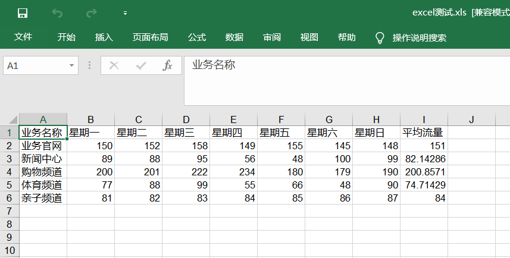

# Excel操作XlsxWriter模块

### XlsxWriter安装

##### pip安装
        
    pip install X1sxWriter              #pip 安装方法
    easy_install X1sxWriter             #easy_install 安装方法
    
    
##### 源码安装方法

    # curl -O -L http://github.com/jmcnamara/XlsxWriter/archive/master.tar.gz
    # tar zxvf master.tar.gz
    # cd XlsxWriter-master/
    # sudo python setup.py install
   


#### 使用示例1
``` 
#!/usr/bin/env python
# -*- coding:utf8 -*-
# auther; 18793
# Date：2019/4/18 10:03
# filename: 6.Excel操作模块.py
import xlsxwriter

workbook = xlsxwriter.Workbook("测试表格.xlsx")  # 创建一个Excel文件
worksheet = workbook.add_worksheet()  # 创建一个工作表对象

worksheet.set_column("A:A", 20)  # 第一列A宽度为20像素
bold = workbook.add_format({"bold":True})  # 定义加粗格式对象
worksheet.write("A1", "Hello")  # A1单元格写入"Hello"
worksheet.write("A2", "World", bold)  # A2单元格写入"World"并引用加粗格式对象bold
worksheet.write("B2", "胡建力学python", bold)  # B2单元格写入中文并引用加粗格式对象bold

worksheet.write(2, 0, 32)  # 用行列表示法写入数字"32"和"35"
worksheet.write(3, 0, 35.5)
worksheet.write(4, 0, '=SUM(A3:A4)')
worksheet.insert_textbox("B5", "content.txt")   #在B5单元格插入txt文件
workbook.close()

```

#### 方法使用参考文献
https://xlsxwriter.readthedocs.io/contents.html


##### 使用示例2
``` 
#!/usr/bin/env python
# -*- coding:utf8 -*-
# auther; 18793
# Date：2019/4/18 10:38
# filename: Excel2模块.py
import xlsxwriter

workbook = xlsxwriter.Workbook("chart.xlsx")  # 创建一个Excel文件
worksheet = workbook.add_worksheet()  # 创建一个工作表对象
chart = workbook.add_chart({"type": "column"})  # 窗机一个图标对象

# 定义数据表头列表
title = ["业务名称", "星期一", "星期二", "星期三", "星期四", "星期五", "星期六", "星期日", "平均流量"]

# 定义5频道名称
buname = ["业务官网", "新闻中心", "购物频道", "体育频道", "亲子频道"]

# 定义5频道一周7天的流量数据
data = [
    [150, 152, 158, 149, 155, 145, 148],
    [89, 88, 95, 56, 48, 100, 99],
    [200, 201, 222, 234, 180, 179, 190],
    [77, 88, 99, 55, 66, 48, 90],
    [81, 82, 83, 84, 85, 86, 87],
]

format = workbook.add_format()
format.set_border(1)

format_title = workbook.add_format()
format_title.set_border(1)
format_title.set_bg_color('#cccccc')
format_title.set_align('center')
format_title.set_bold()

format_ave = workbook.add_format()
format_ave.set_border(1)
format_ave.set_num_format('0.00')

worksheet.write_row('A1', title, format_title)
worksheet.write_column('A2', buname, format)
worksheet.write_row('B2', data[0], format)
worksheet.write_row('B3', data[1], format)
worksheet.write_row('B4', data[2], format)
worksheet.write_row('B5', data[3], format)
worksheet.write_row('B6', data[4], format)


def chart_series(cur_row):
    worksheet.write_formula('I' + cur_row, \
                            '=AVERAGE(B' + cur_row + ':H' + cur_row + ')', format_ave)
    chart.add_series({
        'categories': '=Sheet1!$B$1:$H$1',
        'values': '=Sheet1!$B$' + cur_row + ':$H$' + cur_row,
        'line': {'color': 'black'},
        'name': '=Sheet1!$A$' + cur_row,
    })


for row in range(2, 7):
    chart_series(str(row))

# chart.set_table()
# chart.set_style(30)
chart.set_size({'width': 577, 'height': 287})
chart.set_title({'name': u'业务流量周报图表'})
chart.set_y_axis({'name': 'Mb/s'})

worksheet.insert_chart('A8', chart)
workbook.close()


```

## Excel写入文件
``` 
#!/usr/bin/env python
# -*- coding:utf8 -*-
# auther; 18793
# Date：2019/8/5 22:19
# filename: python写入excel表格.py
"""
http://pypi.python.org/pypi/xlwt

安装xlwt
安装方式一样是python setup.py install就可以了，或者直接解压到你的工程目录中。
"""
import xlwt as ExcelWrite


def writeXLS(file_name):
    value = [["name", "jim", "hmm", "lilei"], ["sex", "man", "woman", "man"], ["age", 19, 24, 24],
             ["country", "USA", "CHN", "CHN"]]
    xls = ExcelWrite.Workbook()
    sheet = xls.add_sheet("Sheet1")

    for i in range(4):
        for j in range(0, len(value)):
            sheet.write(j, i, value[i][j])
            xls.save(file_name)


if __name__ == '__main__':
    writeXLS("./test_write.xls")

```


eg
``` 
def save_excel(info_list, name="小猪租房信息.xls"):
    header = ["标题", "地址", "价格", "房东姓名", "房东性别", "房东图片", "房源链接"]
    book = xlwt.Workbook(encoding="utf-8")
    sheet = book.add_sheet("Sheet1")
    for h in range(len(header)):
        sheet.write(0, h, header[h])
    i = 1
    for list in info_list:
        j = 0
        for data in list:
            sheet.write(i, j, data)
            j += 1
        i += 1

    book.save(name)
```

eg

``` 
#!/usr/bin/env python
# -*- coding:utf8 -*-
# auther; 18793
# Date：2019/8/17 10:34
# filename: python操作Excel方法.py

import xlwt

# 定义数据表头列表
title = ["业务名称", "星期一", "星期二", "星期三", "星期四", "星期五", "星期六", "星期日", "平均流量"]

# 定义5频道一周7天的流量数据
data = [
    ["业务官网", 150, 152, 158, 149, 155, 145, 148],
    ["新闻中心", 89, 88, 95, 56, 48, 100, 99],
    ["购物频道", 200, 201, 222, 234, 180, 179, 190],
    ["体育频道", 77, 88, 99, 55, 66, 48, 90],
    ["亲子频道", 81, 82, 83, 84, 85, 86, 87],
]

# for da in data:
#     da.append(sum(da[1:])/len(da[1:]))

# 计算平均值
[da.append(sum(da[1:]) / len(da[1:])) for da in data]

book = xlwt.Workbook(encoding="utf-8")
sheet = book.add_sheet("Sheet1")

for h in range(len(title)):
    sheet.write(0, h, title[h])

i = 1
for list in data:
    j = 0
    for data in list:
        sheet.write(i, j, data)
        j += 1
    i += 1

book.save("excel测试.xls")

```




#### 创建excel并写入数据
``` 
#!/usr/bin/env python
# -*- coding:utf8 -*-
import xlwt
import os


def set_style(name, height, bold=False):
    style = xlwt.XFStyle()  # 初始化样式
    font = xlwt.Font()  # 为样式创建字体
    font.name = name
    font.bold = bold
    font.color_index = 4
    font.height = height
    style.font = font
    return style


def write_excel(path):
    # 创建工作簿
    workbook = xlwt.Workbook(encoding='uft-8')
    # 创建sheet
    data_sheet = workbook.add_sheet('demo')
    row0 = [u'字段名称', u'大致时段', 'CRNTI', 'CELL-ID']
    row1 = [u'测试', '15:50:33-15:52:14', 22706, 4190202]

    # 生成第一行和第二行
    for i in range(len(row0)):
        data_sheet.write(0, i, row0[i], set_style('Times New Roman', 220, True))
        data_sheet.write(1, i, row1[i], set_style('Times New Roman', 220, True))
    workbook.save(path)


if __name__ == '__main__':
    path = os.path.basename(os.path.abspath(__file__)) + "-" + 'deam.xls'
    write_excel(path)
    print(u'创建demo.xls文件成功')

```


### 读取Excel数据
``` 
#!/usr/bin/env python
# -*- coding:utf8 -*-
# auther; 18793
# Date：2019/8/18 13:32
# filename: 读取Excel表格.py
import xlrd  # 导入xlrd模块


class ExcelData():
    def __init__(self, data_path, sheetname):
        self.data_path = data_path  # excle表格路径，需传入绝对路径
        self.sheetname = sheetname  # excle表格内sheet名
        self.data = xlrd.open_workbook(self.data_path)  # 打开excel表格
        self.table = self.data.sheet_by_name(self.sheetname)  # 切换到相应sheet
        self.keys = self.table.row_values(0)  # 第一行作为key值
        self.rowNum = self.table.nrows  # 获取表格行数
        self.colNum = self.table.ncols  # 获取表格列数
        # print(self.rowNum)
        # print(self.colNum)

    def readExcel(self):
        if self.rowNum < 2:
            print("excle内数据行数小于2")
        else:
            L = []  # 列表L存放取出的数据
            for i in range(1, self.rowNum):  # 从第二行（数据行）开始取数据
                sheet_data = {}  # 定义一个字典用来存放对应数据
                for j in range(self.colNum):  # j对应列值
                    sheet_data[self.keys[j]] = self.table.row_values(i)[j]  # 把第i行第j列的值取出赋给第j列的键值，构成字典
                L.append(sheet_data)  # 一行值取完之后（一个字典），追加到L列表中
            # print(type(L))
            return L


if __name__ == '__main__':
    data_path = "D:/downloads/test_write.xls"  # 文件的绝对路径
    sheetname = "Sheet1"
    get_data = ExcelData(data_path, sheetname)  # 定义get_data对象
    print(get_data.readExcel())

```

输出信息如下：


## openpyxl三方库

append_values.py
``` 
from openpyxl import Workbook

book_obj = Workbook()
excel_sheet = book_obj.active

rows = (
    (11, 12, 13),
    (21, 22, 23),
    (31, 32, 33),
    (41, 42, 43)
)

for values in rows:
	excel_sheet.append(values)
	print()

print("values are successfully appended")
book_obj.save('test.xlsx')

```

示例

create_excel.py

``` 
from openpyxl import Workbook

book_obj = Workbook()

excel_sheet = book_obj.active
excel_sheet['A1'] = 'Name'
excel_sheet['A2'] = 'student'
excel_sheet['B1'] = 'age'
excel_sheet['B2'] = '24'

book_obj.save("test.xlsx")
print("Excel created successfully")

```


