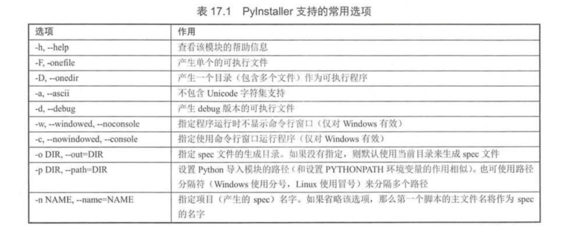
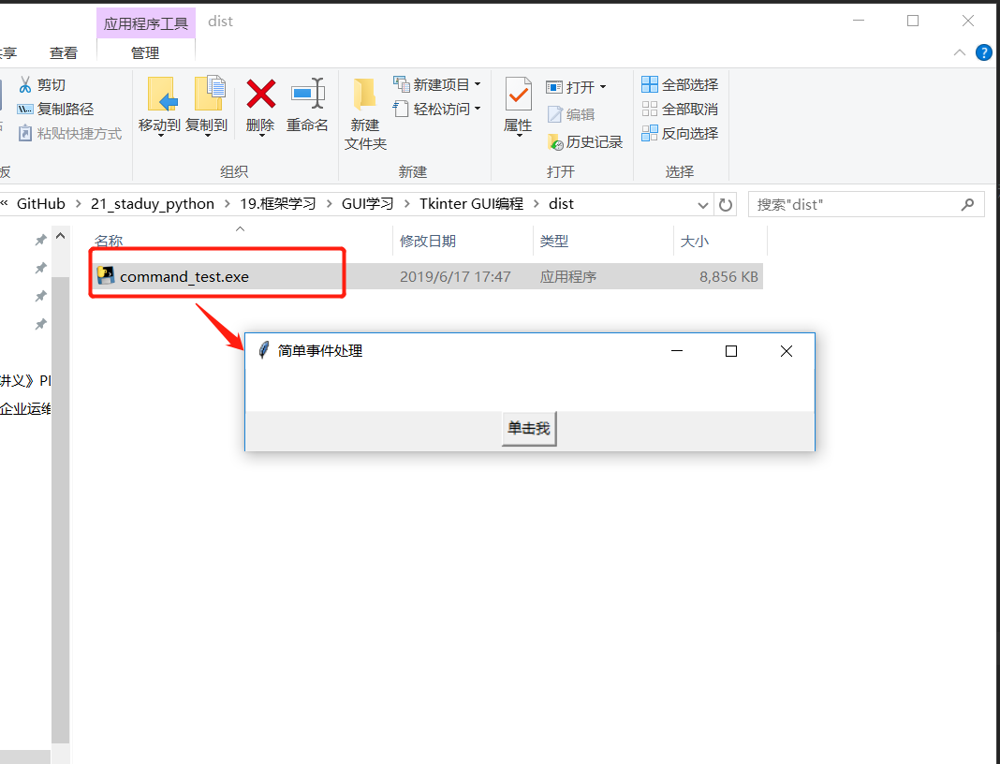
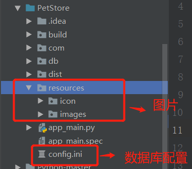

# 使用PyInstaller生成可执行程序

## 安装PyInstaller
    pip install pyinstaller

​    或者

```
pip install -upgrade pyinstaller
```

## 生成可执行程序
Pyinstaller工具的命令语法如下：
    
    pyinstaller 选项 Python源文件
    
    不管这个Pyhton应用是单文件的应用，还是多文件的应用，只要在使用pyinstaller命令时编译作为程序入口的Python程序即可。




    pyinstaller -F -w command_test.py
    
    -F 选项指定生成单个的可执行程序，
    -w 选项指定生成图形用户界面程序（不需要命令行界面）

    
    
    pyinstaller -D -w command_test.py
    -D 选项产生一个目录（包含多个文件）作为可执行程序


```
1.打包多个py文件并且去除cmd黑框

格式：pyinstaller.exe -F 路径\文件名.py 路径\文件名.py --noconsole


在我们打包的时候：如果是直接指定python文件进行pyinstaller打包的话，需要添加--noconsole
例如：pyinstaller -F mycode.py --noconsole

或者如下
pyinstaller -F -w mycode.py （-w就是取消窗口）


pyinstaller -D code.py
pyinstaller -F code.py
pyinstaller -w -F code.py

```


pyinstaller打包教程
``` 
方法如下：

1.确保已安装python解释器

2.确认pip是否是最新版本

python -m pip install --upgrade pip
3.安装pyinstaller

pip install pyinstaller
4.使用pyinstaller打包程序

在要打包的python文件的目录下执行如下命令：

pyinstaller -F -i res\app.ico 你的python文件名.py
其中res目录为你的项目文件下的资源目录，项目中用到的图片均放置在里面，其中app.ico是生成你的可执行文件的图标。

5.拷贝资源文件目录res到生成目录下的dist目录下
执行dist目录下的exe文件，打包完成。


6.如果你想加个图标、取消运行时跳出控制台:
python pyinstaller.py  -w  --onefile --icon="my.ico" sspw.py  

```

后记：
```
1.程序设置自定义图标：pyinstaller -F -i ico_path  py_path 
首先需要下载一张正常的ico，不能用直接修改后缀的。
下载图片：　　  https://www.easyicon.net
图片改为ico:　　http://www.ico.la/
输入命令 pyinstaller -F -i "demo.ico" "main.py"

2.报错提示：
pyinstaller -F -i "demo.ico" "main.py" 命令格式一定是先图标路径，再程序路径。
路径最好为英文，没有中文字符；脚本名称里没有特殊字符如 .
使用utf8编码
图标文件必须是正常格式，不能直接更改后缀。
tuble index out of range ---》pyinstaller版本尚未支持python的版本

3.窗口程序
使用 pyinstaller -F -w  -i ico_path  py_path ，这样脚本不会弹出命令窗，前提是用了GUI库. 

4.导入模块问题
pyinstaller -F -w  -i  --hidden-import queue ico_path  py_path 加上选项

```


### 打包一个大型项目

`pip install pyinstaller`

项目结构图


``` 
# 可以使用 pyi-makespec 命令生成规范文件，本项目的主模块是app_main.py,使用命令如下：
pyi-makespec app_main.py            

# 如果要加上图标，打包成一个单一文件，使用如下：
pyi-makespec -F -i D:\downloads\cat001.ico app_main.py

可以通过pyi-makespec demo.py来生成demo.spec文件。
```
打包图标如果出现如下报错
``` 
from_buffer() cannot return the address of the raw string within a str or unicode or bytearray object
```
网上看了一下，一般setuptools运行完就可以打包程序了，可能这是python3.5的bug？通过大神一顿操作分析，我得知问题在于日志信息中的cffi报错，于是安装了cffi

`pip install --upgrade cffi `


然后在当前目录下生成app_main.spec文件。
```
# -*- mode: python -*-

block_cipher = None


a = Analysis(['app_main.py'],
             pathex=['D:\\GitHub\\PetStore'],
             binaries=[],
             datas=[],         
             ............

```
dates变量可以设置要添加的资源文件，修改app_main.spec文件内容如下：

```
# -*- mode: python -*-

block_cipher = None

added_files = [ ('resources', 'resources'),
                ('config.ini', '.')
                ]

a = Analysis(['app_main.py'],
             pathex=['D:\\GitHub\\PetStore'],
             binaries=[],
             datas=added_files,
             ....................
```


发布成功之后，exe文件生成目录：PetStore\dist\app_main下 app_main.exe
```
pyinstaller app_main.spec
```


[python打包exe能运行但是没有结果解决方案](http://www.xz577.com/j/24847.html)


打包exe的命令如下：

```python
pyinstaller -F k:/exedemo1/geometric.py --distpath k:/exedemo1 --icon k:/exedemo1/b1.ico
```

`--distpath k:/exedemo1 `用于指定.exe的存储路径

`--icon k:/exedemo1/b1.ico`用于指定.exe文件的图标，即不使用默认图标。


参考文献：

https://shazhenyu.blog.csdn.net/article/details/104054250

http://blog.itpub.net/26736162/viewspace-2644904/

https://www.cnblogs.com/gopythoner/p/6337543.html

https://www.jianshu.com/p/48f6dea265eb


使用pyinstaller将pyqt5打包成exe格式

https://blog.csdn.net/qq_40587575/article/details/85076934

https://blog.csdn.net/wolencoder/article/details/80557311

https://blog.csdn.net/qq_27197395/article/details/83411114


​    
​    
​    
​    
