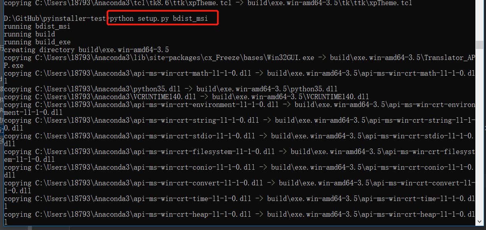
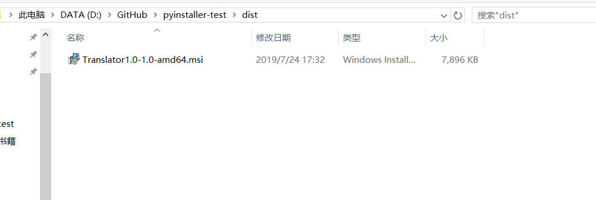

# 用cx_freeze生成可执行文件

安装cx_freeze模块

``` 
pip install cx_freeze
```

在要打包的py文件目录下新建一个`setup.py`文件

setup.py文件内容
``` 
#!/usr/bin/env python
#-*- coding:utf8 -*-
# auther; 18793
# Date：2019/7/24 17:18
# filename: dabao01.py

import sys
import os
from cx_Freeze import setup, Executable

os.environ['TCL_LIBRARY'] = r'C:\Users\18793\Anaconda3\tcl\tcl8.6'
os.environ['TK_LIBRARY'] = r'C:\Users\18793\Anaconda3\tcl\tk8.6'

base = None
if sys.platform == 'win32':
    base = 'Win32GUI'

executables = [
    Executable('GUI001.py', targetName='Translator_APP.exe', base=base)
]

include_files = [
    r'C:\Users\18793\Anaconda3\DLLs\tcl86t.dll',
    r'C:\Users\18793\Anaconda3\DLLs\tk86t.dll'
]

buildOptions = dict(
    packages=[], excludes=[],
    include_files=include_files,
)

setup(
    name='测试1.0',
    version='1.0',
    description='测试',
    options=dict(build_exe=buildOptions),
    executables=executables
)
```

`执行 python setup.py build`
后目录下会出现一个 build 目录，即为打包好的exe文件目录。

`执行python setup.py bdist_msi`
待执行完毕，可以项目文件下生成两个文件夹dist中为msi安装文件，
在其他windows服务器安装后就为build下的文件内容，在build下的exe.win-amd64-3.6下的windows.exe 就可打开小工具

`setup.py是利用cx_Freeze打包成windows的mis安装小程序，方便使用`







参考文献

https://www.jianshu.com/p/854bbecee84c
