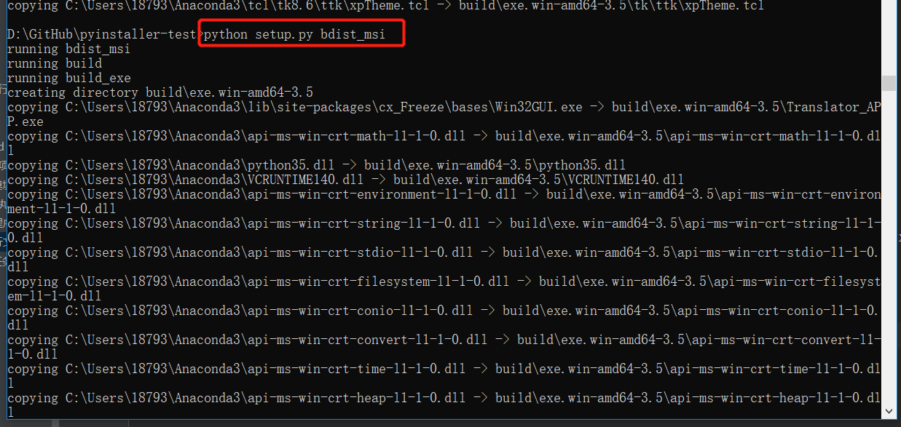
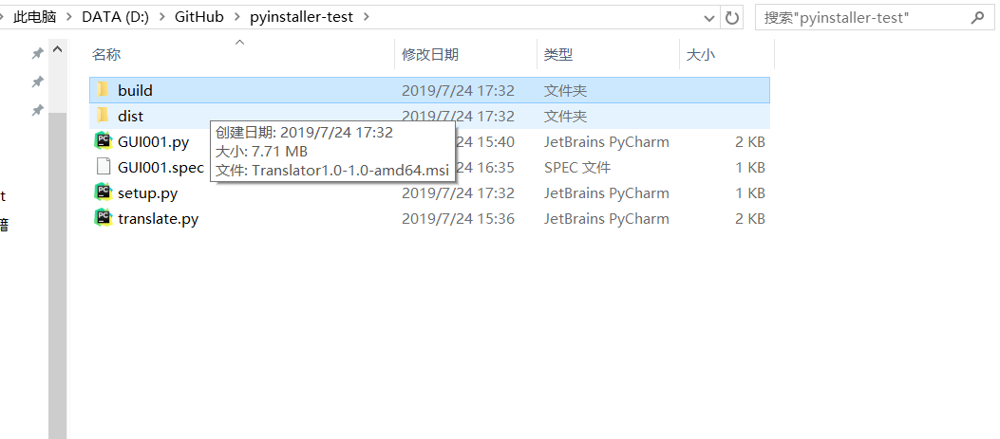
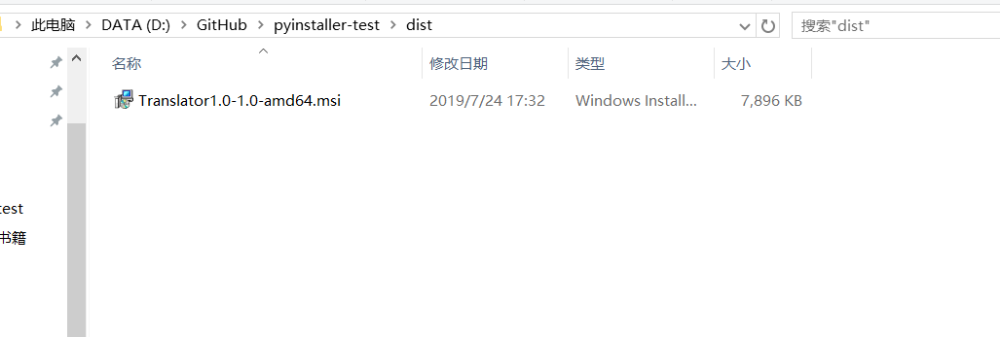

.. contents::
   :depth: 3
..

用cx_freeze生成可执行文件
=========================

安装cx_freeze模块

::

   pip install cx_freeze

在要打包的py文件目录下新建一个\ ``setup.py``\ 文件

setup.py文件内容

::

   #!/usr/bin/env python
   #-*- coding:utf8 -*-
   # auther; 18793
   # Date：2019/7/24 17:18
   # filename: dabao01.py

   import sys
   import os
   from cx_Freeze import setup, Executable

   os.environ['TCL_LIBRARY'] = r'C:\Users\18793\Anaconda3\tcl\tcl8.6'
   os.environ['TK_LIBRARY'] = r'C:\Users\18793\Anaconda3\tcl\tk8.6'

   base = None
   if sys.platform == 'win32':
       base = 'Win32GUI'

   executables = [
       Executable('GUI001.py', targetName='Translator_APP.exe', base=base)
   ]

   include_files = [
       r'C:\Users\18793\Anaconda3\DLLs\tcl86t.dll',
       r'C:\Users\18793\Anaconda3\DLLs\tk86t.dll'
   ]

   buildOptions = dict(
       packages=[], excludes=[],
       include_files=include_files,
   )

   setup(
       name='测试1.0',
       version='1.0',
       description='测试',
       options=dict(build_exe=buildOptions),
       executables=executables
   )

``执行 python setup.py build`` 后目录下会出现一个 build
目录，即为打包好的exe文件目录。

``执行python setup.py bdist_msi``
待执行完毕，可以项目文件下生成两个文件夹dist中为msi安装文件，
在其他windows服务器安装后就为build下的文件内容，在build下的exe.win-amd64-3.6下的windows.exe
就可打开小工具

``setup.py是利用cx_Freeze打包成windows的mis安装小程序，方便使用``

参考文献

https://www.jianshu.com/p/854bbecee84c
