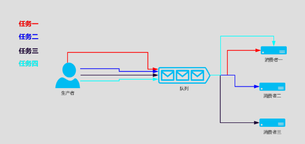
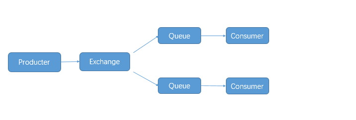
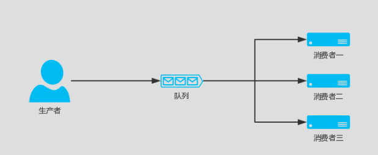
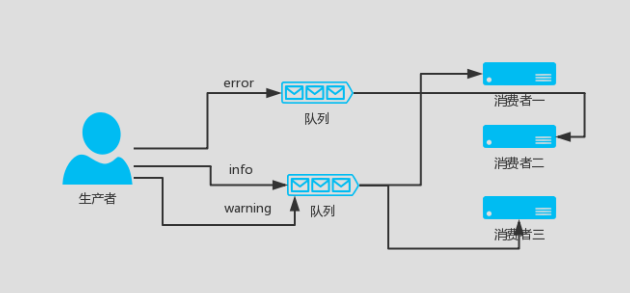
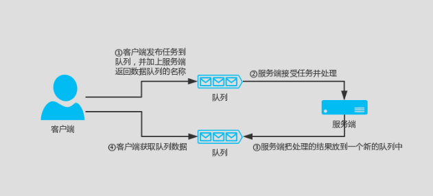

# Python操作Rabbitmq详解

## python操作rabbitmq
RabbitMQ是消息代理，一个消息传递的中介。它给应用程序中一个共同的平台来发送和接收消息，并安全的保存消息，直到收到消息。

Rabbitmq由Erlang语言写成，以高性能、健壮以及可伸缩性著称。


你可以把Rabbitmq想象成一个邮局、邮箱、邮递员，你会相信邮递员最终会将邮件发送到收件人手上。
Rabbitmq不处理文件，而是接收，并存储和以二进制形式将消息转发。


## 技术亮点
```
可靠性
RabbitMQ 提供了多种技术可以让你在性能和可靠性之间进行权衡。这些技术包括持久性、投递确认、发布者证实和高可用性。

灵活的路由
消息在到达队列前是通过交换机进行路由的。RabbitMQ 为典型的路由逻辑提供了多种内置交换机类型。如果你有更复杂的路由需求，可以将这些交换机组合起来使用，甚至你可以写自己的交换机类型，并且当做 RabbitMQ 的插件来使用。

集群
在相同局域网中的多个 RabbitMQ 服务器可以被聚合在一起，作为一个独立的逻辑代理来使用。

联合
对于服务器来说，它比集群需要更多的松散和非可靠链接。为此 RabbitMQ 提供了联合模型。

高可用的队列
在同一个集群中，队列可以被镜像到多个机器中，以确保当其中某些硬件出现事故后，你的消息仍然是安全的。

多协议
RabbitMQ 支持多种消息协议中的消息传递。

广泛的客户端
只要是你能想到的语言几乎都有与其相适配的 RabbitMQ 客户端。

可视化管理工具
RabbitMQ 附带了一个易于使用的可视化管理工具，它可以帮助你监控消息代理的每一个环节。

追踪
如果你的消息系统有异常行为，RabbitMQ 还提供了追踪的支持，让你能够发现问题所在。

插件系统
RabbitMQ 附带了各种各样的插件来对自己进行扩展。甚至你也可以写自己的插件来使用。

商业支持
可以提供商业支持，包括培训和咨询。

大型社区
围绕着 RabbitMQ 有一个大型的社区，在那儿产生了各种各样的客户端、插件、指南等等。快加入我们的邮件列表参与其中吧！
```

## RabbitMQ 消息队列介绍

RabbitMQ也是消息队列，那RabbitMQ和之前python的Queue有什么区别么？
``` 
py 消息队列:
    线程 queue（同一进程下线程之间进行交互）
    进程 Queue（父子进程进行交互 或者 同属于同一进程下的多个子进程进行交互）
```

如果是两个完全独立的python程序，也是不能用上面两个queue进行交互的，
或者和其他语言交互有哪些实现方式呢。

【Disk、Socket、其他中间件】这里中间件不仅可以支持两个程序之间交互，可以支持多个程序，
可以维护好多个程序的队列。

像这种公共的中间件有好多成熟的产品：
```
RabbitMQ
ZeroMQ
ActiveMQ
........
```

RabbitMQ：erlang语言 开发的。

Python中连接RabbitMQ的模块：
```
pika 、Celery(分布式任务队列) 、haigha可以维护很多的队列
```
RabbitMQ 教程官网：http://www.rabbitmq.com/getstarted.html


### 几个概念说明：
``` 
Broker：简单来说就是消息队列服务器实体。
Exchange：消息交换机，它指定消息按什么规则，路由到哪个队列。
Queue：消息队列载体，每个消息都会被投入到一个或多个队列。
Binding：绑定，它的作用就是把exchange和queue按照路由规则绑定起来。
Routing Key：路由关键字，exchange根据这个关键字进行消息投递。
vhost：虚拟主机，一个broker里可以开设多个vhost，用作不同用户的权限分离。
producer：消息生产者，就是投递消息的程序。
consumer：消息消费者，就是接受消息的程序。
channel：消息通道，在客户端的每个连接里，可建立多个channel，每个channel代表一个会话任务
```


### 1.RabbitMq生产和消费简单示例

在本机安装有rabbitmq服务器的前提下。



生产者（producter）：队列消息的产生者，负责生产消息，并将消息传入队列
producer.py
``` 
#!/usr/bin/env python
# -*- coding:utf8 -*-
# auther; 18793
# Date：2020/1/7 17:01
# filename: producer.py
import time

import pika
import json

credentials = pika.PlainCredentials('user', 'password')  # mq用户名和密码
# 虚拟队列需要指定参数 virtual_host，如果是默认的可以不填。
connection = pika.BlockingConnection(
    pika.ConnectionParameters('localhost', port=5672))

channel = connection.channel()      # 声明一个管道，在管道里发消息
# 申明消息队列，消息在这个队列传递，如果不存在，则创建队列,在管道里声明queue
result = channel.queue_declare(queue='python-test')

for i in range(50):
    message = json.dumps({'OrderId': "1000%s" % i})
    time.sleep(0.1)
    # 向队列插入数值 routing_key是队列名
    channel.basic_publish(exchange='', routing_key='python-test', body=message)
    print(message)
connection.close()

```


consumer.py
``` 
#!/usr/bin/env python
# -*- coding:utf8 -*-
# auther; 18793
# Date：2020/1/7 17:02
# filename: consumer.py

import pika

credentials = pika.PlainCredentials('user', 'password')  # mq用户名和密码
connection = pika.BlockingConnection(
    pika.ConnectionParameters(host='localhost', port=5672))

channel = connection.channel()      ## 声明一个管道，在管道里发消息
# 申明消息队列，消息在这个队列传递，如果不存在，则创建队列,在管道里声明queue
channel.queue_declare(queue='python-test', durable=False)


# 定义一个回调函数来处理消息队列中的消息，这里是打印出来
def callback(ch, method, properties, body):
    ch.basic_ack(delivery_tag=method.delivery_tag)
    print(body.decode())


# 告诉rabbitmq，用callback来接收消息
channel.basic_consume('python-test', callback)
# 开始接收信息，并进入阻塞状态，队列里有信息才会调用callback进行处理
channel.start_consuming()

```

执行生产者，生成消息队列。
``` 
[root@ftnode-172-16-72-19 module]# python producer.py 

{"OrderId": "10000"}
{"OrderId": "10001"}
{"OrderId": "10002"}
{"OrderId": "10003"}
{"OrderId": "10004"}
{"OrderId": "10005"}
{"OrderId": "10006"}
{"OrderId": "10007"}
{"OrderId": "10008"}
{"OrderId": "10009"}
{"OrderId": "100010"}
{"OrderId": "100011"}
{"OrderId": "100012"}
{"OrderId": "100013"}
{"OrderId": "100014"}
{"OrderId": "100015"}
{"OrderId": "100016"}

```
查看消息队列中数据

RabbitMQ 相关命令
``` 
[root@ftnode-172-16-72-19 module]# rabbitmqctl list_queues
WARNING: ignoring /etc/rabbitmq/rabbitmq.conf -- location has moved to /etc/rabbitmq/rabbitmq-env.conf
Listing queues ...
hello	2
python-test	50

```
python-test这个队列里面有50条数据，暂未处理。

执行消费者 consumer.py  

消费者会一直阻塞在这里，等待有新的队列信息进来。
``` 
[root@172-16-72-19 module]# python consumer.py 
{"OrderId": "10000"}
{"OrderId": "10001"}
{"OrderId": "10002"}
{"OrderId": "10003"}
{"OrderId": "10004"}
{"OrderId": "10005"}
{"OrderId": "10006"}
{"OrderId": "10007"}
{"OrderId": "10008"}
{"OrderId": "10009"}
{"OrderId": "100010"}
{"OrderId": "100011"}
{"OrderId": "100012"}
{"OrderId": "100013"}
{"OrderId": "100014"}
{"OrderId": "100015"}
{"OrderId": "100016"}
{"OrderId": "100017"}
{"OrderId": "100018"}
{"OrderId": "100019"}
{"OrderId": "100020"}
{"OrderId": "100021"}
{"OrderId": "100022"}
{"OrderId": "100023"}
{"OrderId": "100024"}
{"OrderId": "100025"}
{"OrderId": "100026"}
{"OrderId": "100027"}
{"OrderId": "100028"}
{"OrderId": "100029"}
{"OrderId": "100030"}
{"OrderId": "100031"}
{"OrderId": "100032"}
{"OrderId": "100033"}
{"OrderId": "100034"}
{"OrderId": "100035"}
{"OrderId": "100036"}
{"OrderId": "100037"}
{"OrderId": "100038"}
{"OrderId": "100039"}
{"OrderId": "100040"}
{"OrderId": "100041"}
{"OrderId": "100042"}
{"OrderId": "100043"}
{"OrderId": "100044"}
{"OrderId": "100045"}
{"OrderId": "100046"}
{"OrderId": "100047"}
{"OrderId": "100048"}
{"OrderId": "100049"}

```

再次查看队列里面的信息如下：

已经全部取出。
``` 
[root@ftnode-172-16-72-19 module]# rabbitmqctl list_queues
WARNING: ignoring /etc/rabbitmq/rabbitmq.conf -- location has moved to /etc/rabbitmq/rabbitmq-env.conf
Listing queues ...
hello	2
python-test	0
...done.
```

## 2.RabbitMq 持久化

MQ默认建立的是临时 queue 和 exchange，如果不声明持久化，一旦 rabbitmq 挂掉，queue、exchange 将会全部丢失。
所以我们一般在创建 queue 或者 exchange 的时候会声明 持久化。

1.queue 声明持久化
```
# 声明消息队列，消息将在这个队列传递，如不存在，则创建。durable = True 代表消息队列持久化存储，False 非持久化存储
result = channel.queue_declare(queue = 'python-test',durable = True)
```

2.exchange 声明持久化
```
# 声明exchange，由exchange指定消息在哪个队列传递，如不存在，则创建.durable = True 代表exchange持久化存储，False 非持久化存储
channel.exchange_declare(exchange = 'python-test', durable = True)
```

注意：如果已存在一个非持久化的 queue 或 exchange ，执行上述代码会报错，因为当前状态不能更改 queue 或 exchange 存储属性，需要删除重建。
如果 queue 和 exchange 中一个声明了持久化，另一个没有声明持久化，则不允许绑定。

3.消息持久化

虽然 exchange 和 queue 都申明了持久化，但如果消息只存在内存里，rabbitmq 重启后，内存里的东西还是会丢失。所以必须声明消息也是持久化，从内存转存到硬盘。
``` 
# 向队列插入数值 routing_key是队列名。delivery_mode = 2 声明消息在队列中持久化，delivery_mod = 1 消息非持久化
    channel.basic_publish(exchange = '',routing_key = 'python-test',body = message,
                          properties=pika.BasicProperties(delivery_mode = 2))
```

4.acknowledgement 消息不丢失

消费者（consumer）调用callback函数时，会存在处理消息失败的风险，如果处理失败，则消息丢失。但是也可以选择消费者处理失败时，将消息回退给 rabbitmq ，重新再被消费者消费，这个时候需要设置确认标识。
``` 
channel.basic_consume(callback,queue = 'python-test',
# no_ack 设置成 False，在调用callback函数时，未收到确认标识，消息会重回队列。True，无论调用callback成功与否，消息都被消费掉
                      no_ack = False)
```

示例

通过远程连接rabbitmq-Server服务器。

producer.py
``` 
#!/usr/bin/env python
# -*- coding:utf8 -*-
# auther; 18793
# Date：2020/1/7 17:01
# filename: producer.py
import time

import pika
import json

credentials = pika.PlainCredentials('user', 'password')  # mq用户名和密码
# 虚拟队列需要指定参数 virtual_host，如果是默认的可以不填。
connection = pika.BlockingConnection(
    pika.ConnectionParameters('172.16.72.19', port=5672, virtual_host='/', credentials=credentials))

channel = connection.channel()  # 声明一个管道，在管道里发消息

# 申明消息队列，消息在这个队列传递，如果不存在，则创建队列,在管道里声明queue
result = channel.queue_declare(queue='python-test', durable=True)

for i in range(50):
    message = json.dumps({'OrderId': "1000%s" % i})
    time.sleep(0.1)
    # 向队列插入数值 routing_key是队列名
    channel.basic_publish(exchange='', routing_key='python-test', body=message,
                          properties=pika.BasicProperties(delivery_mode=2))
    print(message)
connection.close()

```


consumer.py 
``` 
#!/usr/bin/env python
# -*- coding:utf8 -*-
# auther; 18793
# Date：2020/1/7 17:02
# filename: consumer.py

import pika

credentials = pika.PlainCredentials('user', 'password')  # mq用户名和密码
# 虚拟队列需要指定参数 virtual_host，如果是默认的可以不填。
connection = pika.BlockingConnection(
    pika.ConnectionParameters('172.16.72.19', port=5672, virtual_host='/', credentials=credentials))

channel = connection.channel()  ## 声明一个管道，在管道里发消息

# 申明消息队列，消息在这个队列传递，如果不存在，则创建队列,在管道里声明queue
channel.queue_declare(queue='python-test', durable=True)


# 定义一个回调函数来处理消息队列中的消息，这里是打印出来
def callback(ch, method, properties, body):
    ch.basic_ack(delivery_tag=method.delivery_tag)
    print(body.decode())


# 告诉rabbitmq，用callback来接收消息.
channel.basic_consume('python-test', callback)        #acknowledgement 消息不丢失

# 开始接收信息，并进入阻塞状态，队列里有信息才会调用callback进行处理
channel.start_consuming()
```

向队列里面放入持久化的数据

```
[root@ftnode-172-16-72-19 module]# python producer.py 
{"OrderId": "10000"}
{"OrderId": "10001"}
{"OrderId": "10002"}
{"OrderId": "10003"}
{"OrderId": "10004"}
{"OrderId": "10005"}
{"OrderId": "10006"}
{"OrderId": "10007"}
{"OrderId": "10008"}
{"OrderId": "10009"}
{"OrderId": "100010"}
{"OrderId": "100011"}
{"OrderId": "100012"}
...........


[root@ftnode-172-16-72-19 module]# rabbitmqctl list_queues
WARNING: ignoring /etc/rabbitmq/rabbitmq.conf -- location has moved to /etc/rabbitmq/rabbitmq-env.conf
Listing queues ...
hello	2
python-test	0
python-test2	82

```

运行消费者
``` 
[root@172-16-72-19 module]# python consumer.py 
{"OrderId": "10000"}
{"OrderId": "10001"}
{"OrderId": "10002"}
{"OrderId": "10003"}
{"OrderId": "10004"}
{"OrderId": "10005"}
{"OrderId": "10006"}
{"OrderId": "10007"}
{"OrderId": "10008"}
.........
```

## 3.消息公平分发
每一个消费者同时只处理一个任务，比如说现在有三个消费者，刚开始来了三个任务，平均分配给了三个消费者，
那么这三个消费者目前都在同时执行任务，当第四个任务到来的时候依旧会分配给第一个消费者，
第五个任务到来的时候会分配给第二个消费者，以此类推。

那么以上的状况有什么不妥呢？譬如说不同的消费者执行任务的时间不同，
我们现在需要的时候，当三个消费者都在执行任务的时候，
比如说第二个消费者任务执行完了，其他消费者都还在执行任务，
当第四个任务到来的时候希望交给第二个消费者，若要实现此功能，只需要在消费者加上一下代码即可：

``` 
channel.basic_qos(prefetch_count=1)
```

发布者  
producer.py
```
#!/usr/bin/env python
#-*- coding:utf8 -*-
# auther; 18793
# Date：2020/1/8 12:44
# filename: producer.py

import pika
import sys

credentials = pika.PlainCredentials('user', 'password')  # mq用户名和密码
# 虚拟队列需要指定参数 virtual_host，如果是默认的可以不填。
connection = pika.BlockingConnection(
    pika.ConnectionParameters('172.16.72.19', port=5672, virtual_host='/', credentials=credentials))

channel = connection.channel()

channel.queue_declare(queue='task_queue', durable=True)

for n in range(10):
    message = "Hello World! %s" % (n + 1)
    channel.basic_publish(exchange='',
                          routing_key='task_queue',
                          body=message,
                          properties=pika.BasicProperties(
                              delivery_mode=2,  # make message persistent
                          ))
    print(" [x] Sent %r" % message)
connection.close()
```

订阅者
consumer.py
``` 
#!/usr/bin/env python
# -*- coding:utf8 -*-
# auther; 18793
# Date：2020/1/8 12:44
# filename: consumer.py
import pika
import time

credentials = pika.PlainCredentials('user', 'password')  # mq用户名和密码
# 虚拟队列需要指定参数 virtual_host，如果是默认的可以不填。
connection = pika.BlockingConnection(
    pika.ConnectionParameters('172.16.72.19', port=5672, virtual_host='/', credentials=credentials))
channel = connection.channel()

channel.queue_declare(queue='task_queue', durable=True)
print(' [*] Waiting for messages. To exit press CTRL+C')


def callback(ch, method, properties, body):
    print(" [x] Received %r" % body)
    time.sleep(1)
    print(" [x] Done")
    ch.basic_ack(delivery_tag=method.delivery_tag)

```

消费者一直监听，执行如下：
``` 
root@ftnode-172-16-72-19 ftinstall.v3.5-distributed]# python consumer.py 
 [*] Waiting for messages. To exit press CTRL+C
 [x] Received 'Hello World! 3'
 [x] Done
 [x] Received 'Hello World! 4'
 [x] Done
 [x] Received 'Hello World! 5'
 [x] Done
 [x] Received 'Hello World! 6'
 [x] Done
 [x] Received 'Hello World! 7'
 [x] Done
 [x] Received 'Hello World! 8'
 [x] Done
 [x] Received 'Hello World! 9'

```

生产者，往里面送数据
``` 
[root@ftnode-172-16-72-19 ftinstall.v3.5-distributed]# python producer.py 
 [x] Sent 'Hello World! 1'
 [x] Sent 'Hello World! 2'
 [x] Sent 'Hello World! 3'
 [x] Sent 'Hello World! 4'
 [x] Sent 'Hello World! 5'
 [x] Sent 'Hello World! 6'
 [x] Sent 'Hello World! 7'
 [x] Sent 'Hello World! 8'
 [x] Sent 'Hello World! 9'
 [x] Sent 'Hello World! 10'

```


## 4.RabbitMq 发布与订阅

rabbitmq 的发布与订阅要借助交换机（Exchange）的原理实现：



· `Exchange 一共有三种工作模式：fanout, direct, topicd`


### 模式一:fanout纯广播、all
这种模式下，传递到 exchange 的消息将会转发到所有与其绑定的 queue 上。


```
不需要指定 routing_key ，即使指定了也是无效。
需要提前将 exchange 和 queue 绑定，一个 exchange 可以绑定多个 queue，一个queue可以绑定多个exchange。
需要先启动 订阅者，此模式下的队列是 consumer 随机生成的，发布者 仅仅发布消息到 exchange ，由 exchange 转发消息至 queue。
```

· `注意：广播，是实时的，收不到就没了，消息不会存下来，类似收音机。`


· producer01.py     

发布者
``` 
#!/usr/bin/env python
# -*- coding:utf8 -*-
# auther; 18793
# Date：2020/1/7 17:01
# filename: producer01.py
import pika
import json

credentials = pika.PlainCredentials('user', 'password')  # mq用户名和密码
# 虚拟队列需要指定参数 virtual_host，如果是默认的可以不填。
connection = pika.BlockingConnection(
    pika.ConnectionParameters('172.16.72.19', port=5672, virtual_host='/', credentials=credentials))

channel = connection.channel()
# 声明exchange，由exchange指定消息在哪个队列传递，如不存在，则创建。durable = True 代表exchange持久化存储，False 非持久化存储
channel.exchange_declare(exchange='python-test', durable=True, exchange_type='fanout')
for i in range(20):
    message = json.dumps({'OrderId': "1000%s" % i})
    # 向队列插入数值 routing_key是队列名。delivery_mode = 2 声明消息在队列中持久化，delivery_mod = 1 消息非持久化。routing_key 不需要配置
    channel.basic_publish(exchange='python-test', routing_key='', body=message,
                          properties=pika.BasicProperties(delivery_mode=2))
    print(message)
connection.close()

```
``` 
# 广播数据不会存储
[root@ftnode-172-16-72-19 module]# python producer.py 
{"OrderId": "10000"}
{"OrderId": "10001"}
{"OrderId": "10002"}
{"OrderId": "10003"}
{"OrderId": "10004"}
{"OrderId": "10005"}
{"OrderId": "10006"}
{"OrderId": "10007"}
{"OrderId": "10008"}
{"OrderId": "10009"}
{"OrderId": "100010"}
[root@ftnode-172-16-72-19 module]# rabbitmqctl list_queues
WARNING: ignoring /etc/rabbitmq/rabbitmq.conf -- location has moved to /etc/rabbitmq/rabbitmq-env.conf
Listing queues ...
...done.

```

· consumer01.py  

执行订阅者，先阻塞着，等待生产者产生数据，因为是广播，不会存储到队列中。

``` 
#!/usr/bin/env python
# -*- coding:utf8 -*-
# auther; 18793
# Date：2020/1/7 17:01
import pika

credentials = pika.PlainCredentials('user', 'password')  # mq用户名和密码
# 虚拟队列需要指定参数 virtual_host，如果是默认的可以不填。
connection = pika.BlockingConnection(
    pika.ConnectionParameters('172.16.72.19', port=5672, virtual_host='/', credentials=credentials))

channel = connection.channel()
# 创建临时队列,队列名传空字符，consumer关闭后，队列自动删除
result = channel.queue_declare('', exclusive=True)
# 声明exchange，由exchange指定消息在哪个队列传递，如不存在，则创建。durable = True 代表exchange持久化存储，False 非持久化存储
channel.exchange_declare(exchange='python-test', durable=True, exchange_type='fanout')
# 绑定exchange和队列  exchange 使我们能够确切地指定消息应该到哪个队列去
channel.queue_bind(exchange='python-test', queue=result.method.queue)


# 定义一个回调函数来处理消息队列中的消息，这里是打印出来
def callback(ch, method, properties, body):
    ch.basic_ack(delivery_tag=method.delivery_tag)
    print(body.decode())


channel.basic_consume(result.method.queue, callback,
                      # 设置成 False，在调用callback函数时，未收到确认标识，消息会重回队列。True，无论调用callback成功与否，消息都被消费掉
                      auto_ack=False)
channel.start_consuming()

```


### 模式二:direct有选择的接收消息

direct(关键字)
RabbitMQ还支持根据关键字发送，即：队列绑定关键字，发送者将数据根据关键字发送到消息exchange，exchange根据 关键字 判定应该将数据发送至指定队列。



```
这种工作模式的原理是 消息发送至 exchange，

exchange 根据 路由键（routing_key）转发到相对应的 queue 上。

  可以使用默认 exchange =' ' ，也可以自定义 exchange这种模式下不需要将 exchange 和 任何进行绑定，当然绑定也是可以的。可以将 exchange 和 queue ，routing_key 和 queue 进行绑定
传递或接受消息时 需要 指定 routing_key
需要先启动 订阅者，此模式下的队列是 consumer 随机生成的，发布者 仅仅发布消息到 exchange ，由 exchange 转发消息至 queue。
```

producer02.py
``` 
#!/usr/bin/env python
# -*- coding:utf8 -*-
# auther; 18793
# Date：2020/1/8 10:15
# filename: producer02.py
import sys
import pika

credentials = pika.PlainCredentials('user', 'password')  # mq用户名和密码
# 虚拟队列需要指定参数 virtual_host，如果是默认的可以不填。
connection = pika.BlockingConnection(
    pika.ConnectionParameters('172.16.72.19', port=5672, virtual_host='/', credentials=credentials))
channel = connection.channel()

channel.exchange_declare(exchange='direct_logs', exchange_type='direct')
# 设置 过滤 级别
log_levels = sys.argv[1] if len(sys.argv) > 1 else 'info'

message = ' '.join(sys.argv[2:]) or 'Hello World!'
channel.basic_publish(
    exchange='direct_logs', routing_key=log_levels, body=message)
print(" [x] Sent %r:%r" % (log_levels, message))
connection.close()


```

consumer02.py
``` 
#!/usr/bin/env python
# -*- coding:utf8 -*-
# auther; 18793
# Date：2020/1/8 10:17
# filename: consumer02.py
import sys
import pika

credentials = pika.PlainCredentials('user', 'password')  # mq用户名和密码
# 虚拟队列需要指定参数 virtual_host，如果是默认的可以不填。
connection = pika.BlockingConnection(
    pika.ConnectionParameters('172.16.72.19', port=5672, virtual_host='/', credentials=credentials))
channel = connection.channel()

channel.exchange_declare(exchange='direct_logs', exchange_type='direct')

result = channel.queue_declare('', exclusive=True)
queue_name = result.method.queue

# 拿到接收的 级别
log_levels = sys.argv[1:]
if not log_levels:
    sys.stderr.write("Usage: %s [info] [warning] [error]\n" % sys.argv[0])
    sys.exit(1)

# 可能有多个级别
for severity in log_levels:
    channel.queue_bind(
        exchange='direct_logs', queue=queue_name, routing_key=severity)

print(' [*] Waiting for logs. To exit press CTRL+C')


def callback(ch, method, properties, body):
    print(" [x] %r:%r" % (method.routing_key, body))


channel.basic_consume(
    queue=queue_name, on_message_callback=callback, auto_ack=True)

channel.start_consuming()
```

``` 
[root@ftnode-172-16-72-19 ftinstall.v3.5-distributed]# python producer02.py 123 32dsadasds122
 [x] Sent '123':'32dsadasds122'


[root@ftnode-172-16-72-19 ftinstall.v3.5-distributed]# python consumer02.py 123 321
 [*] Waiting for logs. To exit press CTRL+C
 [x] '123':'321'
 [x] '123':'32122'
 [x] '123':'32dsadasds122'
```

### 模式三:topic更细致的过滤
表达式符号说明：

|    符号    | 描述 |
| ---------- | --- |
| # |  表示可以匹配0个或多个单词 |
| *      |  表示只能匹配一个单词 |


比如把error中，apache和mysql的分别或取出来

producer04.py
``` 
#!/usr/bin/env python
# -*- coding:utf8 -*-
# auther; 18793
# Date：2020/1/8 10:58
# filename: producer04.py

import sys
import pika

credentials = pika.PlainCredentials('user', 'password')  # mq用户名和密码
# 虚拟队列需要指定参数 virtual_host，如果是默认的可以不填。
connection = pika.BlockingConnection(
    pika.ConnectionParameters('172.16.72.19', port=5672, virtual_host='/', credentials=credentials))

channel = connection.channel()

channel.exchange_declare(exchange='topic_logs', exchange_type='topic')

# 这里上面不同，这里是用 点 距隔
routing_key = sys.argv[1] if len(sys.argv) > 2 else 'anonymous.info'
message = ' '.join(sys.argv[2:]) or 'Hello World!'

channel.basic_publish(
    exchange='topic_logs', routing_key=routing_key, body=message)
print(" [x] Sent %r:%r" % (routing_key, message))
connection.close()

```

consumer04.py
``` 
#!/usr/bin/env python
# -*- coding:utf8 -*-
# auther; 18793
# Date：2020/1/8 10:58
# filename: consumer04.py

import pika
import sys

credentials = pika.PlainCredentials('user', 'password')  # mq用户名和密码
# 虚拟队列需要指定参数 virtual_host，如果是默认的可以不填。
connection = pika.BlockingConnection(
    pika.ConnectionParameters('172.16.72.19', port=5672, virtual_host='/', credentials=credentials))

channel = connection.channel()

channel.exchange_declare(exchange='topic_logs', exchange_type='topic')

result = channel.queue_declare('', exclusive=True)
queue_name = result.method.queue

binding_keys = sys.argv[1:]

if not binding_keys:
    sys.stderr.write("Usage: %s [binding_key]...\n" % sys.argv[0])
    sys.exit(1)

for binding_key in binding_keys:
    channel.queue_bind(
        exchange='topic_logs', queue=queue_name, routing_key=binding_key)

print(' [*] Waiting for logs. To exit press CTRL+C')


def callback(ch, method, properties, body):
    print(" [x] %r:%r" % (method.routing_key, body))


channel.basic_consume(
    queue=queue_name, on_message_callback=callback, auto_ack=True)

channel.start_consuming()
```


生产者
```
[root@ftnode-172-16-72-19 ftinstall.v3.5-distributed]# python producer04.py mysql
 [x] Sent 'anonymous.info':'Hello World!'
[root@ftnode-172-16-72-19 ftinstall.v3.5-distributed]# python producer04.py ms12131
 [x] Sent 'anonymous.info':'Hello World!'

```

消费者
``` 
## 接收所有消息
[root@ftnode-172-16-72-19 ftinstall.v3.5-distributed]# python consumer04.py "#"
 [*] Waiting for logs. To exit press CTRL+C
 [x] 'anonymous.info':'Hello World!'
 [x] 'anonymous.info':'Hello World!'
```


* 把error中，apache和mysql的分别或取出来

生产者
```
[root@ftnode-172-16-72-19 ftinstall.v3.5-distributed]# python producer04.py aaa.error mysql.aaa
 [x] Sent 'aaa.error':'mysql.aaa'


```

消费者 
``` 
[root@ftnode-172-16-72-19 ftinstall.v3.5-distributed]# python consumer04.py *.error mysql.*
 [*] Waiting for logs. To exit press CTRL+C
 [x] 'aaa.error':'mysql.aaa'
```


### RPC(Remote procedure call)

客户端发送一个任务到服务端，服务端把任务的执行结果再返回给客户端



RPC_Server.py  消费端
``` 
#_*_coding:utf-8_*_
import pika
import time
# 链接socket
connection = pika.BlockingConnection(pika.ConnectionParameters(
        host='localhost'))
channel = connection.channel()

# 生成rpc queue
channel.queue_declare(queue='rpc_queue')

#　斐波那契数列
def fib(n):
    if n == 0:
        return 0
    elif n == 1:
        return 1
    else:
        return fib(n-1) + fib(n-2)


# 收到消息就调用
# ch 管道内存对象地址
# method 消息发给哪个queue
# props 返回给消费的返回参数
# body数据对象
def on_request(ch, method, props, body):
    n = int(body)

    print(" [.] fib(%s)" % n)
    # 调用斐波那契函数 传入结果
    response = fib(n)

    ch.basic_publish(exchange='',
                     # 生产端随机生成的queue
                     routing_key=props.reply_to,
                     # 获取UUID唯一 字符串数值
                     properties=pika.BasicProperties(correlation_id = \
                                                   props.correlation_id),
                     # 消息返回给生产端
                     body=str(response))
    # 确保任务完成
    ch.basic_ack(delivery_tag = method.delivery_tag)

# rpc_queue收到消息:调用on_request回调函数
# queue='rpc_queue'从rpc内收
channel.basic_consume(on_request, queue='rpc_queue')

print(" [x] Awaiting RPC requests")
channel.start_consuming()
```

RPC_Client.py  生产端
``` 
# coding:utf-8
import pika
import uuid
import time


# 斐波那契数列 前两个数相加依次排列
class FibonacciRpcClient(object):
    def __init__(self):
        # 链接远程
        self.connection = pika.BlockingConnection(pika.ConnectionParameters(
            host='localhost'))
        self.channel = self.connection.channel()

        # 生成随机queue
        result = self.channel.queue_declare(exclusive=True)
        # 随机取queue名字，发给消费端
        self.callback_queue = result.method.queue

        # self.on_response 回调函数:只要收到消息就调用这个函数。
        # 声明收到消息后就 收queue=self.callback_queue内的消息
        self.channel.basic_consume(self.on_response, no_ack=True,
                                   queue=self.callback_queue)

    # 收到消息就调用
    # ch 管道内存对象地址
    # method 消息发给哪个queue
    # body数据对象
    def on_response(self, ch, method, props, body):
        # 判断本机生成的ID 与 生产端发过来的ID是否相等
        if self.corr_id == props.correlation_id:
            # 将body值 赋值给self.response
            self.response = body

    def call(self, n):
        # 赋值变量，一个循环值
        self.response = None

        # 　随机一次唯一的字符串
        self.corr_id = str(uuid.uuid4())

        # routing_key='rpc_queue' 发一个消息到rpc_queue内
        self.channel.basic_publish(exchange='',
                                   routing_key='rpc_queue',
                                   properties=pika.BasicProperties(

                                       # 执行命令之后结果返回给self.callaback_queue这个队列中
                                       reply_to=self.callback_queue,
                                       # 生成UUID 发送给消费端
                                       correlation_id=self.corr_id,
                                   ),
                                   # 发的消息，必须传入字符串，不能传数字
                                   body=str(n))
        # 没有数据就循环收
        while self.response is None:
            # 非阻塞版的start_consuming()
            # 没有消息不阻塞
            self.connection.process_data_events()
            print("no msg...")
            time.sleep(0.5)
        return int(self.response)


# 　实例化
fibonacci_rpc = FibonacciRpcClient()

print(" [x] Requesting fib(30)")
response = fibonacci_rpc.call(6)
print(" [.] Got %r" % response)


```

参考相关资料：
https://www.cnblogs.com/shenh/p/10497244.html

https://www.jb51.net/article/158056.htm


