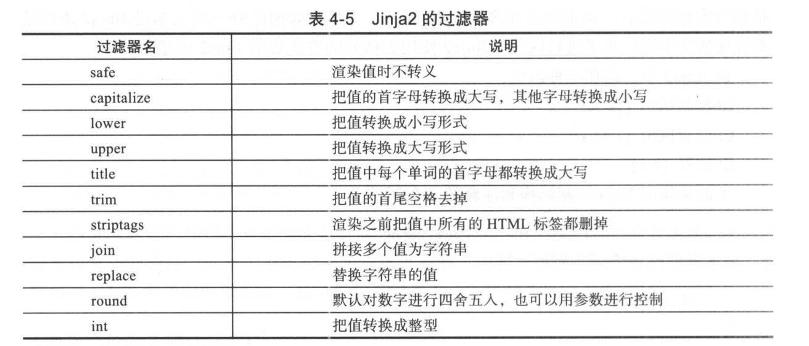

# Jinja2模板

## 模板介绍

### Python标准库中自带的简单模板
``` 
#!/usr/bin/env python
# -*- coding:utf8 -*-
# auther; 18793
# Date：2020/3/19 15:00
# filename: sample01.py

from string import Template

s = Template('$who is a $role')
print(s.substitute(who="hujianli", role="teacher"))
print(s.substitute(who="xiaojian", role="student"))


# hujianli is a teacher
# xiaojian is a student
```

Jinja2是Flask的一个依赖，如果已经安装了Flask，Jinja2也会随之安装，
当然，也可以单独安装Jinja2:
``` 
C:\Users\18793>pip install jinja2

C:\Users\18793>python -c "import jinja2"
```

### 1.语法块
Jinja2中，存在三种语法：
``` 
1.控制结构
2.变量取值{{}}
3.注释{# #}
```

### 2.变量

Jinja2 模板中使用{{}}语法表示一个变量，它是一种特殊的占位符，告诉模板引擎这个位置的值在渲染模板时获取。
Jinja2识别所有的Python数据类型，甚至是一些复杂的类型，如列表、字典和对象等。
``` 
<p> A value from a dictionary : {{ mydict['key'] }}.</p>
<p> A value from a list : {{ mylist[3] }}.</p>
<p> A value from a list,with a variable index: {{ mylist[myintvar] }}.</p>
<p> A value from an object's method: {{ myobj.somemethod() }}.</p>
```


### 3.Jinja2中的过滤器



### 4.Jinja2中的控制结构
Jinja2中if语句，类似Python中的if语句，需要使用endif语句作为调节判断的结束。
``` 

    Kenny is sick.

    You ki11ed Kenny！ You bastard!!!

    Kenny 100 Okay

```


### 5.Jinja2的for循环
``` 
<h1>Members</h1>
<ul>
    
    <li> {{ user.username }} </li>
    
</ul>
```


``` 
<dl>
    
    <dt>{{ key }}</dt>
    <dd>{{ value }}</dd>
    
</dl>
```


### Jinja2实战

### 案例1 基本功能演示
`simple.html`

``` 
<!DOCTYPE html>
<html lang="en">
<head>
    <meta charset="UTF-8">
    <title>{{ title |trim }}</title>
</head>
<body>
<!-- 注释 -->
<ul id="navigation">
    <!-- for语句,以endfor结束 -->
    
        <!-- 访问变量的属性 -->
        <li> <a href="{{ item.href }}">{{ item['caption'] }}</a> </li>
    
    <p>
        {{ content }}
    </p>

</ul>

</body>
</html>
```

`simple.py`

``` 
#!/usr/bin/env python
# -*- coding:utf8 -*-
# auther; 18793
# Date：2020/3/19 15:50
# filename: sample.py
import jinja2
import os


def render(tpl_path, **kwargs):
    path, filename = os.path.split(tpl_path)
    return jinja2.Environment(
        loader=jinja2.FileSystemLoader(path or "./")
    ).get_template(filename).render(**kwargs)


def ceshi01_simple():
    title = "Title H  "
    items = [{'href': 'a.com', 'caption': 'ACaption'}, {'href': 'b:com', 'caption': 'Bcaption'}]
    content = "This is content"
    result = render("simple.html", **locals())
    print(result)


if __name__ == '__main__':
    ceshi01_simple()

```

###  案例2 使用Jinja2生成HTML表格和XML配置文件

`hzfc.html`
``` 
<!DOCTYPE html>
<html lang="en">
<head>
    <meta charset="UTF-8">
    <title>Title</title>
</head>
<body>
<table>
    
    <tr>
    <td>{{ loop.index }}</td>
    <td><a href="{{ item['href'] }}">{{ item['title'] }}</a> </td>
    </tr>
    

</table>
</body>
</html>
```


`sample02.py`
``` 
#!/usr/bin/env python
# -*- coding:utf8 -*-
# auther; 18793
# Date：2020/3/19 16:09
# filename: sample02.py
import jinja2
import os


def render(tpl_path, **kwargs):
    path, filename = os.path.split(tpl_path)
    return jinja2.Environment(
        loader=jinja2.FileSystemLoader(path or "./")
    ).get_template(filename).render(**kwargs)


links = [{'title': '杭州地铁三期规划正式获批 3号线即将上马', 'href': 'http://zzhz.zjol.com.cn/system/2016/12/21/021323123.shtml'},
         {'title': '杭州地铁三期规划正式获批 4号线即将上马', 'href': 'http://zzhz.zjol.com.cn/system/2017/11/12/021323123.shtml'},
         {'title': '杭州地铁三期规划正式获批 5号线即将上马', 'href': 'http://zzhz.zjol.com.cn/system/2017/10/10/021323123.shtml'},
         ]

content = render('hzfc.html', items=links)
print(content)
```


### 使用Jinja2生成XML配置文件
下面这个例子使用Jinja2生成xml格式的配置文件。

`base.cfg`

``` 
<?xml version="1.0" encoding="UTF-8" ?>

<pass_service1>
    <issa_server_a_host>{{ issa_server_a_host }}</issa_server_a_host>
    <issa_server_a_port>{{ issa_server_a_port }}</issa_server_a_port>
    <issa_server_c>{{ issa_server_c_host }}:{{ issa_server_c_port }}</issa_server_c>
</pass_service1>

```

`pass_service1_template_xml`

``` 
<?xml version="1.0" encoding="UTF-8" ?>

<pass_service1>
    <issa_server_a_host>{{ issa_server_a_host }}</issa_server_a_host>
    <issa_server_a_port>{{ issa_server_a_port }}</issa_server_a_port>
    <issa_server_c>{{ issa_server_c_host }}:{{ issa_server_c_port }}</issa_server_c>
</pass_service1>
```

`pass_service2_template_xml`

``` 
<?xml version="1.0" encoding="UTF-8" ?>

<pass_service2>
    <issa_server_b_host>{{ issa_server_b_host }}</issa_server_b_host>
    <issa_server_b_port>{{ issa_server_b_port }}</issa_server_b_port>
    <issa_server_c>{{ issa_server_c_host }}:{{ issa_server_c_port }}</issa_server_c>
</pass_service2>
```

`sample03.py`
``` 
#!/usr/bin/env python
# -*- coding:utf8 -*-
# auther; 18793
# Date：2020/3/19 16:25
# filename: sample03.py

import os
import jinja2

try:
    import configparser
except:
    import ConfigParser as configparser

NAMES = ["issa_server_a_host", "issa_server_a_port", "issa_server_b_host", "issa_server_b_port", "issa_server_c_host",
         "issa_server_c_port"]


def render(tpl_path, **kwargs):
    path, filename = os.path.split(tpl_path)
    return jinja2.Environment(
        loader=jinja2.FileSystemLoader(path or "./")
    ).get_template(filename).render(**kwargs)


def parser_vars_into_globals(filename):
    parser = configparser.ConfigParser()
    parser.read(filename)

    for NAME in NAMES:
        globals()[NAME] = parser.get('DEFAULT', NAME)


def main():
    parser_vars_into_globals("base.cfg")
    with open("pass_service1.xml", "w") as f:
        f.write(render("pass_service1_template.xml", **globals()))

    with open("pass_service2.xml", "w") as f:
        f.write(render("pass_service2_template.xml", **globals()))


if __name__ == '__main__':
    main()
```

生成的`pass_service1.xml`文件内容如下：
``` 
<?xml version="1.0" encoding="UTF-8" ?>

<pass_service1>
    <issa_server_a_host>10.166.226.151</issa_server_a_host>
    <issa_server_a_port>8101</issa_server_a_port>
    <issa_server_c>10.166.226.153:8103</issa_server_c>
</pass_service1>
```


