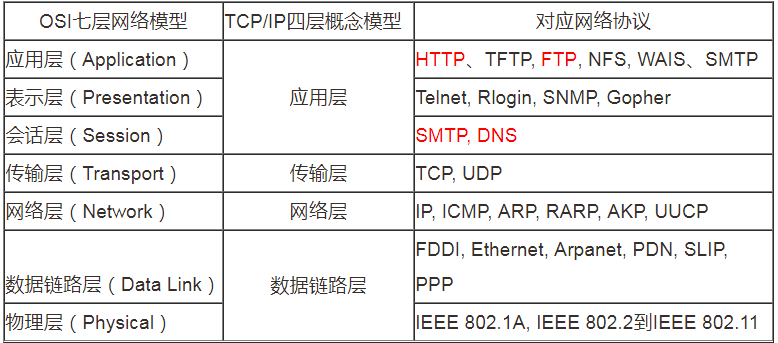
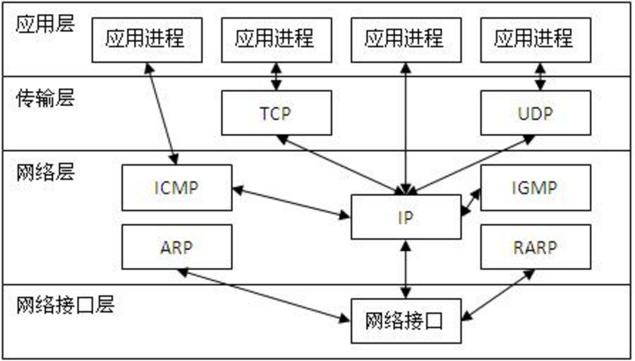
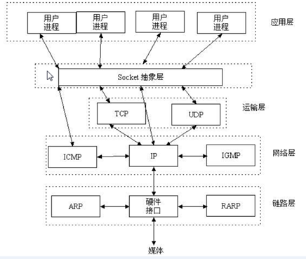

.. contents::
   :depth: 3
..

TCP/IP协议
==========

OSI七层网络模型
---------------

::

   应用层
   表示层
   会话层
   传输层
   网络层
   数据链路层
   物理层

OSI七层模型和TCP/IP四层模型 对应的网络协议
------------------------------------------

-  如图所示 |image1|

TCP/IP协议中，其各层之间的通信机制
----------------------------------

-  如图所示 |image2|

什么是socket套接字？
--------------------

::

   socket又称“套接字”，应用程序通常通过“套接字”向网络发出请求或者应答网络请求，使主机间或者一台计算机上的进程间可以通讯。白话说，socket就是两个节点为了互相通信，而在各自家里装的一部‘电话’

-  理解socket，如图所示 |image3|

::

   我们的应用程序，不再需要苦逼的去和TCP/IP协议通信了，而是通过socket这个“代理”帮我们完成通信工作，我们只需要简单地向socket发布“命令”，不用考虑底层的网络通信问题。
   需要强调的是，socket是一个通用的技术，并不是python专属的，在各个领域都被广泛使用，尤其是Linux中。
   为了支持socket网络编程，Python 提供了两个级别访问网络的服务：
   低级别的网络服务支持基本的socket模块，它提供了标准的BSD Sockets API，可以访问底层操作系统socket接口的全部方法。
   高级别的网络服务模块socketserver，它提供了服务器中心类，可以简化网络服务器的开发。

