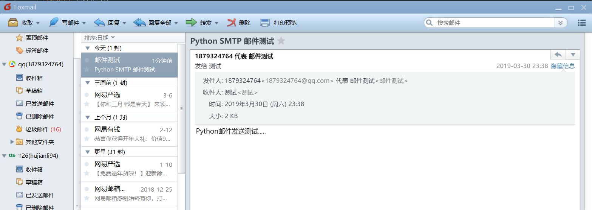
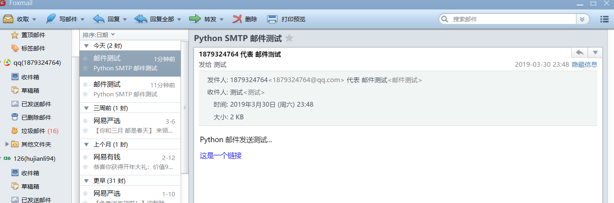
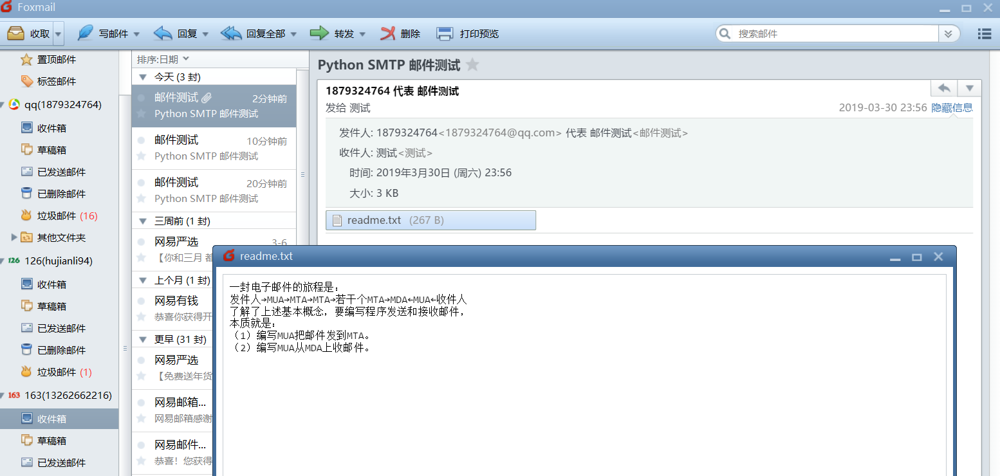
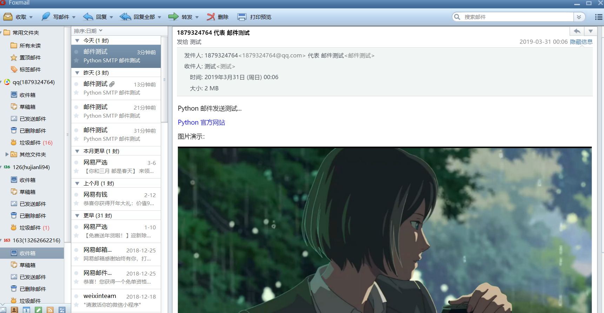
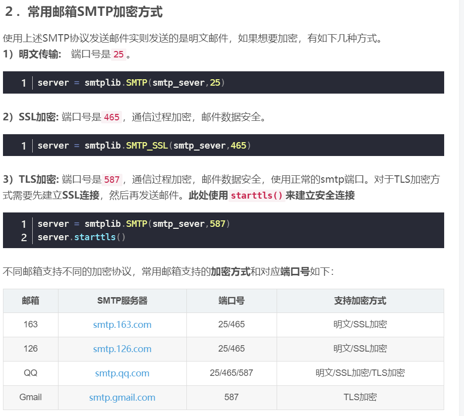

# Python发送邮件
    MTP（Simple Mail Transfer Protocol）即简单邮件传输协议,它是一组用于由源地址到目的地址传送邮件的规则，由它来控制信件的中转方式。
    python的smtplib提供了一种很方便的途径发送电子邮件。它对smtp协议进行了简单的封装。
    Python创建 SMTP 对象语法如下：

    import smtplib
    smtpObj = smtplib.SMTP( [host [, port [, local_hostname]]] )
    参数说明：
        host: SMTP 服务器主机。 你可以指定主机的ip地址或者域名如: runoob.com，这个是可选参数。
        port: 如果你提供了 host 参数, 你需要指定 SMTP 服务使用的端口号，一般情况下 SMTP 端口号为25。
        local_hostname: 如果 SMTP 在你的本机上，你只需要指定服务器地址为 localhost 即可。
        Python SMTP 对象使用 sendmail 方法发送邮件，语法如下：

    SMTP.sendmail(from_addr, to_addrs, msg[, mail_options, rcpt_options])
    参数说明：

    from_addr: 邮件发送者地址。
    to_addrs: 字符串列表，邮件发送地址。
    msg: 发送消息
    这里要注意一下第三个参数，msg 是字符串，表示邮件。我们知道邮件一般由标题，发信人，收件人，邮件内容，附件等构成，发送邮件的时候，要注意 msg 的格式。这个格式就是 smtp 协议中定义的格式。

### 发送一个简单的test邮件
#### 代码如下
```
#Python对SMTP支持有smtplib和email两个模块，email负责构造邮件，smtplib负责发送邮件。
import smtplib
from email.mime.text import MIMEText

msg = MIMEText("hello,send by Python....你好.", 'plain', 'utf-8')
#注意到构造MIMEText对象时
# 第一个参数就是邮件正文，
# 第二个参数是MIME的subtype，传入'plain'表示纯文本，最终的MIME就是'text/plain'，
# 最后一定要用utf-8编码保证多语言兼容性。


#通过SMTP发出去
#Email地址和口令
from_addr = "1879324764@qq.com"
from_passwd = "rpesbfgwmqcycceh"   #使用网页邮件中生成的授权码
#收件人地址
to_addr = "13262662216@163.com"
#SMTP服务器地址
smtp_server = "smtp.qq.com"

try:
    server = smtplib.SMTP(smtp_server, 25) # SMTP协议默认端口是25
    server.set_debuglevel(1)
    server.login(from_addr, from_passwd)
    server.sendmail(from_addr, [to_addr], msg.as_string())
    server.quit()
except Exception as e:
    print(e)
finally:
    server.close()
```

### 完整的发送邮件代码
#### 代码示例 1

```
#!/usr/bin/env python
#-*- coding:utf8 -*-
from email import encoders
from email.header import Header
from email.mime.text import MIMEText
from email.utils import parseaddr, formataddr
import smtplib

def _format_addr(s):
    name, addr = parseaddr(s)
    return formataddr((Header(name, 'utf-8').encode(), addr))

#通过SMTP发出去
#Email地址和口令
from_addr = "1879324764@qq.com"
from_passwd = "rpesbfgwmqcycceh"   #使用网页邮件中生成的授权码
#收件人地址
to_addr = "13262662216@163.com"
#SMTP服务器地址
smtp_server = "smtp.qq.com"


msg = MIMEText('hello, send by Python...', 'plain', 'utf-8')
msg['From'] = _format_addr('%s %s <%s>' % ("hujianli","test",from_addr))
msg['To'] = _format_addr('收件者 <%s>' % to_addr)
msg['Subject'] = Header('邮件的主题信息……', 'utf-8').encode()


if __name__ == '__main__':
    #开始发送邮件
    try:
        server = smtplib.SMTP(smtp_server, 25)
        server.set_debuglevel(1)
        server.login(from_addr, from_passwd)
        server.sendmail(from_addr, [to_addr], msg.as_string())
        server.quit()
    except Exception as e:
        print(e)
    finally:
        server.close()
```

#### 代码示例 2
```
#!/usr/bin/python
# -*- coding: UTF-8 -*-

import smtplib
from email.mime.text import MIMEText
from email.header import Header

# 第三方 SMTP 服务
mail_host="smtp.qq.com"  #设置服务器
mail_user="1879324764@qq.com"   #用户名
mail_pass="rpesbfgwmqcycceh"  #口令


sender = "1879324764@qq.com"
receivers = ["13262662216@163.com"]  # 接收邮件，可设置为你的QQ邮箱或者其他邮箱

message = MIMEText('Python 邮件发送测试...', 'plain', 'utf-8')
message['From'] = Header("测试邮件发送", 'utf-8')
message['To'] =  Header("测试", 'utf-8')

subject = 'Python SMTP 邮件测试'
message['Subject'] = Header(subject, 'utf-8')


try:
    smtpObj = smtplib.SMTP()
    smtpObj.connect(mail_host, 25)    # 25 为 SMTP 端口号
    smtpObj.login(mail_user,mail_pass)
    smtpObj.sendmail(sender, receivers, message.as_string())
    print("邮件发送成功")
except smtplib.SMTPException:
    print("Error: 无法发送邮件")

finally:
    server.close()

```



#### 代码示例 3
```
#!/usr/bin/env python
#-*- coding:utf8 -*-
import smtplib
from email.mime.text import MIMEText

SMTP_SERVER = 'smtp.qq.com'
SMTP_PORT =25


def send_mail(user,pwd,to,subject,text):
    msg = MIMEText(text)
    msg['From'] = user
    msg['To'] = to
    msg['Subject'] = subject

    smtp_server = smtplib.SMTP(SMTP_SERVER,SMTP_PORT)
    print("Connecting to mail server.")

    try:
        smtp_server.ehlo()
        print("Starting Encrypted Seccion.")

        smtp_server.starttls()
        smtp_server.ehlo()
        print("Logging Into Mail Server")

        smtp_server.login(user,pwd)
        print("Sending mail ..")

        smtp_server.sendmail(user,to,msg.as_string())
    except Exception as err:
        print("Sending Mail Failed :{0}".format(err))
    
    finally:
        smtp_server.quit()


def main():
    send_mail('1879324764@qq.com','qvhsgcjnkvyccedc','13262662216@163.com','Inportant','Test message')

if __name__ == '__main__':
    main()
```

* 如果本地主机安装了sendmail服务，发送邮件的代码可以更改为：
```
'''


sender = 'from@163.com' 
receivers = ['to@aliyun.com'] # 接收邮件，可设置为你的邮箱 

# 三个参数：第一个为文本内容，第二个 plain 设置文本格式，第三个 utf-8 设置编码 
message = MIMEText('Python 邮件发送测试...', 'plain', 'utf-8') 
message['From'] = Header("邮件测试", 'utf-8') 
message['To'] = Header("测试", 'utf-8') 
subject = 'Python SMTP 邮件测试' 
message['Subject'] = Header(subject, 'utf-8') 

try:     
    smtpObj = smtplib.SMTP("localhost")     
    smtpObj.sendmail(sender, receivers, message.as_string())     
    print ("邮件发送成功") 
except smtplib.SMTPException as e:     
    print ("Error: 无法发送邮件.Case:%s" % e)

finally:
    server.close()

'''
```

### 发送HTML的邮件
代码示例1

```
#!/usr/bin/env python
#-*- coding:utf8 -*-
from email import encoders
from email.header import Header
from email.mime.text import MIMEText
from email.utils import parseaddr, formataddr
import smtplib

def _format_addr(s):
    name, addr = parseaddr(s)
    return formataddr((Header(name, 'utf-8').encode(), addr))

#通过SMTP发出去
#Email地址和口令
from_addr = "1879324764@qq.com"
from_passwd = "rpesbfgwmqcycceh"   #使用网页邮件中生成的授权码
#收件人地址
to_addr = "13262662216@163.com"
#SMTP服务器地址
smtp_server = "smtp.qq.com"


msg = MIMEText('<html><body><h1>小健的博客</h1>' +
    '<p>博客浏览地址: <a href="https://xiaojian722.readthedocs.io/en/latest/index.html">小健的自动化运维之路</a> 开启学习旅程</p>' +
    '</body></html>', 'html', 'utf-8')
msg['From'] = _format_addr('%s %s <%s>' % ("hujianli","test",from_addr))
msg['To'] = _format_addr('收件者 <%s>' % to_addr)
msg['Subject'] = Header('邮件的主题信息……', 'utf-8').encode()

server = smtplib.SMTP(smtp_server, 25)
server.set_debuglevel(1)
server.login(from_addr, from_passwd)
server.sendmail(from_addr, [to_addr], msg.as_string())
server.quit()
```

### 发送html邮件示例2
```python

#!/usr/bin/env python
#-*- coding:utf8 -*-
import smtplib
from email.mime.text import MIMEText
from email.header import Header

sender = "1879324764@qq.com"    #发件的邮箱
pwd = "ducszyrzqulyhjeg"        #开通邮箱服务后，设置的客户端授权密码

receivers = ['13262662216@163.com']     #接收的邮箱

mail_msg = """
<p>Python 邮件发送测试...</p> 
<p><a href="http://www.runoob.com">这是一个链接</a></p>
"""

# 三个参数：第一个为文本内容，第二个 plain 设置文本格式，第三个 utf-8 设置编码
message = MIMEText(mail_msg, "html", "utf-8")
message['From'] = Header('邮件测试', 'utf-8')
message['To'] = Header('测试', 'utf-8')
subject = 'Python SMTP 邮件测试'
message['Subject'] = Header(subject, 'utf-8')

try:
    # 使用非本地服务器，需要建立ssl连接
    smtpObj = smtplib.SMTP_SSL('smtp.qq.com',465)
    smtpObj.login(sender, pwd)
    smtpObj.sendmail(sender, receivers, message.as_string())
    print('邮件发送成功....')
except smtplib.SMTPException as e:
    print('Error :无法发送邮件.Case:{}'.format(e))
    
finally:
    server.close()
```



### 发送代码示例3
``` 
#coding: utf-8
import smtplib
from email.mime.text import MIMEText

HOST = "smtp.gmail.com"
SUBJECT = u"官网流量数据报表"
TO = "test@qq.com"
FROM = "test@gmail.com"

msg = MIMEText("""
    <table width="800" border="0" cellspacing="0" cellpadding="4">
      <tr>
        <td bgcolor="#CECFAD" height="20" style="font-size:14px">*官网数据  <a href="monitor.domain.com">更多>></a></td>
      </tr>
      <tr>
        <td bgcolor="#EFEBDE" height="100" style="font-size:13px">
        1）日访问量:<font color=red>152433</font>  访问次数:23651 页面浏览量:45123 点击数:545122  数据流量:504Mb<br>
        2）状态码信息<br>
        &nbsp;&nbsp;500:105  404:3264  503:214<br>
        3）访客浏览器信息<br>
        &nbsp;&nbsp;IE:50%  firefox:10% chrome:30% other:10%<br>
        4）页面信息<br>
        &nbsp;&nbsp;/index.php 42153<br>
        &nbsp;&nbsp;/view.php 21451<br>
        &nbsp;&nbsp;/login.php 5112<br>
	</td>
      </tr>
    </table>""","html","utf-8")
	
msg['Subject'] = SUBJECT
msg['From']=FROM
msg['To']=TO
try:
    server = smtplib.SMTP()
    server.connect(HOST,"25")
    server.starttls()
    server.login("test@gmail.com","123456")
    server.sendmail(FROM, TO, msg.as_string())
    server.quit()
    print "邮件发送成功！"
except Exception, e:  
    print "失败："+str(e) 


```


### 发送带附件的邮件

代码示例1 (适用于发送小的txt文件附件)
```python
#!/usr/bin/python3
 
import smtplib
from email.mime.text import MIMEText
from email.mime.multipart import MIMEMultipart
from email.header import Header
 
sender = 'from@runoob.com'
receivers = ['429240967@qq.com']  # 接收邮件，可设置为你的QQ邮箱或者其他邮箱
 
#创建一个带附件的实例
message = MIMEMultipart()
message['From'] = Header("菜鸟教程", 'utf-8')
message['To'] =  Header("测试", 'utf-8')
subject = 'Python SMTP 邮件测试'
message['Subject'] = Header(subject, 'utf-8')
 
#邮件正文内容
message.attach(MIMEText('这是菜鸟教程Python 邮件发送测试……', 'plain', 'utf-8'))
 
# 构造附件1，传送当前目录下的 test.txt 文件
att1 = MIMEText(open('test.txt', 'rb').read(), 'base64', 'utf-8')
att1["Content-Type"] = 'application/octet-stream'
# 这里的filename可以任意写，写什么名字，邮件中显示什么名字
att1["Content-Disposition"] = 'attachment; filename="test.txt"'
message.attach(att1)
 
# 构造附件2，传送当前目录下的 runoob.txt 文件
att2 = MIMEText(open('runoob.txt', 'rb').read(), 'base64', 'utf-8')
att2["Content-Type"] = 'application/octet-stream'
att2["Content-Disposition"] = 'attachment; filename="runoob.txt"'
message.attach(att2)
 
try:
    smtpObj = smtplib.SMTP('localhost')
    smtpObj.sendmail(sender, receivers, message.as_string())
    print ("邮件发送成功")
except smtplib.SMTPException:
    print ("Error: 无法发送邮件")
```



#### 代码示例2(使用 MIMEApplication,传输文件中文文件会乱码，暂时无解决办法)
```python
import smtplib
from email.mime.text import MIMEText
from email.mime.multipart import MIMEMultipart
from email.header import Header
from email.mime.application import MIMEApplication

sender = "1879324764@qq.com"  # 发件的邮箱
pwd = "ducszyrzqulyhjeg"  # 开通邮箱服务后，设置的客户端授权密码

receivers = ['13262662216@163.com']  # 接收的邮箱

# 创建一个带附件的实例
message = MIMEMultipart()
message['From'] = Header('邮件测试', 'utf-8')
message['To'] = Header('测试', 'utf-8')
subject = 'Python SMTP 邮件测试'
message['Subject'] = Header(subject, 'utf-8')

# 邮件正文内容
message.attach(MIMEText("这是Python邮件发送测试....", "plan", 'utf-8'))

# 构造附件1，传送当前目录下的test.txt文件
zipFile = "华为云Fusioncloud整体规划.xlsx"
att1 = MIMEApplication(open("doc/" + zipFile, "rb").read())
att1["Content-Type"] = 'application/octet-stream'
# 这里的filename 可以任意写，写什么名字，邮件中就显示什么名字
att1.add_header('Content-Disposition', 'attachment', filename=zipFile)
message.attach(att1)

try:
    # 使用非本地服务器，需要建立ssl连接
    smtpObj = smtplib.SMTP_SSL('smtp.qq.com', 465)
    smtpObj.login(sender, pwd)
    smtpObj.sendmail(sender, receivers, message.as_string())
    print('邮件发送成功....')
except smtplib.SMTPException as e:
    print('Error :无法发送邮件.Case:{}'.format(e))

finally:
    smtpObj.close()


```

代码示例2
```
# ！/usr/bin/env python
# -*-coding:utf-8 -*-

#需求2:发送邮件正文加附件

import time
import smtplib

from email import encoders
from email.header import Header
from email.mime.base import MIMEBase
from email.mime.text import MIMEText
from email.utils import parseaddr, formataddr
from email.mime.multipart import MIMEMultipart

def _format_addr(s):
    name, addr = parseaddr(s)
    return formataddr((Header(name, 'utf-8').encode(), addr))


def send_email(info,file_paths):
    # 发件人地址
    from_addr = '1879324764@qq.com'
    # 邮箱密码
    password = 'rpesbfgwmqcycceh'
    # 收件人地址,可同时添加多个
    to_addrs = [
        '13262662216@163.com',
        'hujl<hujl@futongcloud.com.cn>',
    ]
    # 邮箱服务器地址
    smtp_server = 'smtp.qq.com'

    local_time = time.strftime('%Y-%m-%d %H:%M:%S')

    content = '''
        小伙伴们，everybody
        {info}
        邮件发送时间时间: {local_time}
    '''.format(info=info, local_time=local_time)
    # 设置邮件信息
    msg = MIMEMultipart()
    body = MIMEText(content.encode(), 'plain', 'utf-8')
    msg.attach(body)


    # 构造附件
    for file_name in file_paths:
        attachment = MIMEBase('application', 'octet-stream')#参数的意义未深究
        attachment.set_payload(open(file_name, 'rb').read())
        encoders.encode_base64(attachment)
        attachment.add_header('Content-Disposition','attachment', filename=file_name)# 前2个参数意义未深究
        msg.attach(attachment)

    msg['From'] = _format_addr('胡小健 <%s>' % from_addr)
    msg['To'] = _format_addr('501运维小伙子们 <%s>' % to_addrs)
    msg['Subject'] = Header('活动计划表', 'utf-8').encode()

    # 发送邮件
    server = smtplib.SMTP_SSL(host=smtp_server, port=465)
    server.login(from_addr, password)
    server.sendmail(from_addr, to_addrs=to_addrs, msg=msg.as_string())

    server.quit()

if __name__ == '__main__':
    info = '''
        早上好,吃饭了吗~
        小胡，小健，小力。小肥脸、林梦成
    '''
    file_paths=["1.SMTP发送邮件_test.py"]
    send_email(info, file_paths)
```

代码示例3
```

import smtplib
from email.mime.text import MIMEText
from email.header import Header
from smtplib import SMTP_SSL

from email.mime.text import MIMEText
from email.mime.multipart import MIMEMultipart
from email.header import Header


#qq邮箱smtp服务器
host_server = 'smtp.qq.com'
#sender_qq为发件人的qq号码
sender_qq = '1879324764@qq.com'
#pwd为qq邮箱的授权码
pwd = 'qvhsgcjnkvyccedc' ##
#发件人的邮箱
sender_qq_mail = '1879324764@qq.com'
#收件人邮箱
receiver = '13262662216@163.com'

#邮件的正文内容
mail_content = "你好，<p>这是使用python登录qq邮箱发送HTML格式邮件的测试：</p><p><a href='http://www.yiibai.com'>易百教程</a></p>"
#邮件标题
mail_title = 'Maxsu的邮件'

#邮件正文内容
msg = MIMEMultipart()
#msg = MIMEText(mail_content, "plain", 'utf-8')
msg["Subject"] = Header(mail_title, 'utf-8')
msg["From"] = sender_qq_mail
msg["To"] = Header("接收者测试", 'utf-8') ## 接收者的别名

#邮件正文内容
msg.attach(MIMEText(mail_content, 'html', 'utf-8'))


# 构造附件1，传送当前目录下的 test.txt 文件
att1 = MIMEText(open('发送邮件.py', 'rb').read(), 'base64', 'utf-8')
att1["Content-Type"] = 'application/octet-stream'
# 这里的filename可以任意写，写什么名字，邮件中显示什么名字
att1["Content-Disposition"] = 'attachment; filename="sedmain1.py"'
msg.attach(att1)


# 构造附件2，传送当前目录下的 runoob.txt 文件
att2 = MIMEText(open('test.py', 'rb').read(), 'base64', 'utf-8')
att2["Content-Type"] = 'application/octet-stream'
att2["Content-Disposition"] = 'attachment; filename="test.py"'
msg.attach(att2)


#ssl登录
smtp = SMTP_SSL(host_server)
#set_debuglevel()是用来调试的。参数值为1表示开启调试模式，参数值为0关闭调试模式
smtp.set_debuglevel(1)
smtp.ehlo(host_server)
smtp.login(sender_qq, pwd)

smtp.sendmail(sender_qq_mail, receiver, msg.as_string())
smtp.quit()
```


### 加密SMTP邮件
代码示例1
```
#!/usr/bin/env python
#-*- coding:utf8 -*-

from email import encoders
from email.header import Header
from email.mime.text import MIMEText
from email.utils import parseaddr, formataddr
import smtplib

def _format_addr(s):
    name, addr = parseaddr(s)
    return formataddr((Header(name, 'utf-8').encode(), addr))

#通过SMTP发出去
#Email地址和口令
from_addr = "1879324764@qq.com"
from_passwd = "rpesbfgwmqcycceh"   #使用网页邮件中生成的授权码
#收件人地址
to_addr = "13262662216@163.com"
#SMTP服务器地址
smtp_server = "smtp.qq.com"
smtp_port = 587
server = smtplib.SMTP(smtp_server,smtp_port)
server.starttls()
server.set_debuglevel(1)


msg = MIMEText('<html><body><h1>小健的博客</h1>' +
    '<p>博客浏览地址: <a href="https://xiaojian722.readthedocs.io/en/latest/index.html">小健的自动化运维之路</a> 开启学习旅程</p>' +
    '</body></html>', 'html', 'utf-8')
msg['From'] = _format_addr('%s %s <%s>' % ("hujianli","test",from_addr))
msg['To'] = _format_addr('收件者 <%s>' % to_addr)
msg['Subject'] = Header('邮件的主题信息……', 'utf-8').encode()
try:
    server = smtplib.SMTP(smtp_server, 25)
    server.set_debuglevel(1)
    server.login(from_addr, from_passwd)
    server.sendmail(from_addr, [to_addr], msg.as_string())
    server.quit()
    print("邮件发送成功！")
except Exception as e:
    print("email 发送失败",e)
```

### Python 发送图片到邮件正文
'''
* 大部分邮件服务商都会自动屏蔽带有外链的图片，因为不知道这些链接是否指向恶意网站。

* 要把图片嵌入邮件正文，我们只需按照发送附件的方式把邮件作为附件添加进去，
然后在HTML中通过引用src="cid:0"把附件作为图片嵌入。如果有多张图片，就需要给它们依次编号，然后引用不同的cid:x。

'''
```python
#!/usr/bin/env python
#-*- coding:utf8 -*-
import smtplib
from email.mime.text import MIMEText
from email.mime.image import MIMEImage
from email.mime.multipart import MIMEMultipart
from email.header import Header

sender = "1879324764@qq.com"    #发件的邮箱
pwd = "ducszyrzqulyhjeg"        #开通邮箱服务后，设置的客户端授权密码

receivers = ['13262662216@163.com']     #接收的邮箱

# 创建一个带附件的实例
message = MIMEMultipart('related')
message['From'] = Header('邮件测试', 'utf-8')
message['To'] = Header('测试', 'utf-8')
subject = 'Python SMTP 邮件测试'
message['Subject'] = Header(subject, 'utf-8')

msgAlternative = MIMEMultipart('alternative')
message.attach(msgAlternative)

mail_msg = """ <p>Python 邮件发送测试...</p> 
<p><a href="https://www.python.org">Python 官方网站</a></p> 
<p>图片演示：</p> <p></p> """

msgAlternative.attach(MIMEText(mail_msg, 'html', 'utf-8'))

#指定图片为当前目录
fp = open('test.png','rb')
msgImage = MIMEImage(fp.read())
fp.close()

# 定义图片 ID，在 HTML 文本中引用
msgImage.add_header('Content-ID', '<image1>')
message.attach(msgImage)

try:
    # 使用非本地服务器，需要建立ssl连接
    smtpObj = smtplib.SMTP_SSL('smtp.qq.com',465)
    smtpObj.login(sender, pwd)
    smtpObj.sendmail(sender, receivers, message.as_string())
    print('邮件发送成功....')
except smtplib.SMTPException as e:
    print('Error :无法发送邮件.Case:{}'.format(e))

```


#### 发送图片作为附件如下
```python
# 邮件对象:
msg = MIMEMultipart()
msg['From'] = _format_addr('Python爱好者 <%s>' % from_addr)
msg['To'] = _format_addr('管理员 <%s>' % to_addr)
msg['Subject'] = Header('来自SMTP的问候……', 'utf-8').encode()

# 邮件正文是MIMEText:
msg.attach(MIMEText('send with file...', 'plain', 'utf-8'))

# 添加附件就是加上一个MIMEBase，从本地读取一个图片:
with open('/Users/michael/Downloads/test.png', 'rb') as f:
    # 设置附件的MIME和文件名，这里是png类型:
    mime = MIMEBase('image', 'png', filename='test.png')
    # 加上必要的头信息:
    mime.add_header('Content-Disposition', 'attachment', filename='test.png')
    mime.add_header('Content-ID', '<0>')
    mime.add_header('X-Attachment-Id', '0')
    # 把附件的内容读进来:
    mime.set_payload(f.read())
    # 用Base64编码:
    encoders.encode_base64(mime)
    # 添加到MIMEMultipart:
    msg.attach(mime)
```

#### 带图片及附件的邮件
* 实现带附件格式的业务服务质量周报邮件

```python
#!/usr/bin/env python
# -*- coding:utf8 -*-
# auther; 18793
# Date：2019/4/17 15:18
# filename: 5.周报邮件带附件.py
import smtplib
from email.mime.multipart import MIMEMultipart
from email.mime.text import MIMEText
from email.mime.image import MIMEImage
from email.mime.base import MIMEBase  # MIME子类的基类
from email import encoders  # 导入编码器

HOST = "smtp.qq.com"
SUBJECT = u"官网业务服务质量周报"
TO = "13262662216@163.com"
FROM = "1879324764@qq.com"


def addimg(src, imgid):
    '''
    :param src: 图片路径
    :param imgid: 图片id
    :return:
    '''
    fp = open(src, 'rb')  # 打开文件
    msgImage = MIMEImage(fp.read())  # 创建MIMEImage对象，读取图片内容作为参数
    fp.close()  # 关闭文件
    msgImage.add_header('Content-ID', imgid)  # 指定图片文件的Content-ID
    return msgImage  # 返回msgImage对象


# 创建一个带附件的实例
msg = MIMEMultipart('related')
msg['Subject'] = SUBJECT
msg['From'] = FROM
msg['To'] = TO

# 邮件正文内容
msgtext = MIMEText("<font color=red>官网业务周平均延时图表:<br><br>详细内容见附件。</font>", "html",
                   "utf-8")
msg.attach(msgtext)  # 将msgtext内容附加到MIMEMultipart对象中
msg.attach(addimg("img/manhua.png", 'weekly'))  # 使用MIMEMultipart对象附加MIMEImage的内容

# 附件文件1定义
# 创建一个MIMEText对象，附加表格文件（week.xlsx）
Path = "doc/"
filename = '华为云Fusioncloud整体规划.xlsx'
attachfile = MIMEBase('applocation', 'octet-stream')  # 创建对象指定主要类型和次要类型
attachfile.set_payload(open(Path + filename, 'rb').read())  # 将消息内容设置为有效载荷
attachfile.add_header('Content-Disposition', 'attachment', filename=('utf-8', '', filename))  # 扩展标题设置
encoders.encode_base64(attachfile)
msg.attach(attachfile)  # 附加对象加入到msg


# 附件文件2定义
# 创建一个MIMEText对象，附加表格文件（xxx.png）
Path = "img/"
filename = 'manhua.png'
attachfile_png = MIMEBase('applocation', 'octet-stream')  # 创建对象指定主要类型和次要类型
attachfile_png.set_payload(open(Path + filename, 'rb').read())  # 将消息内容设置为有效载荷
attachfile_png.add_header('Content-Disposition', 'attachment', filename=('utf-8', '', filename))  # 扩展标题设置
encoders.encode_base64(attachfile_png)
msg.attach(attachfile_png)  # 附加对象加入到msg


# 附件文件3定义
# 创建一个MIMEText对象，附加表格文件（xxx.pdf）
filename = 'Java从小白到大牛.pdf'
attachfile_pdf = MIMEBase('applocation', 'octet-stream')  # 创建对象指定主要类型和次要类型
attachfile_pdf.set_payload(open(filename, 'rb').read())  # 将消息内容设置为有效载荷
attachfile_pdf.add_header('Content-Disposition', 'attachment', filename=('utf-8', '', filename))  # 扩展标题设置
encoders.encode_base64(attachfile_pdf)
msg.attach(attachfile_pdf)  # 附加对象加入到msg

"""
smtpObj = smtplib.SMTP([host [, port [, local_hostname]]])
语法中各个参数说明如下。 
host: SMTP服务器主机。可以指定主机的IP地址或域名（如www.baidu.com），是可选参数。 
port：如果提供了host参数，就需要指定SMTP服务使用的端口号。一般情况下SMTP的端口号为25。 
local_hostname：如果SMTP在本地主机上，只需要指定服务器地址为localhost即可。


SMTP.sendmail(from_addr, to_addrs, msg[, mail_options, rcpt_options]
语法中各个参数说明如下。

from_addr：邮件发送者的地址。
to_addrs：字符串列表，邮件发送地址。
msg：发送消息。
"""
# try:
#     server = smtplib.SMTP()
#     server.connect(HOST, "25")        ##通过 connect 方法连接 smtp 主机
#     server.starttls()                 ## 启动安全传输模式
#     server.login("1879324764@qq.com", "ducszyrzqulyhjeg") # 邮箱账号登录校验
#     server.sendmail(FROM, TO, msg.as_string())    # 邮件发送
#     server.quit()                     # 断开 smtp 连接
#     print("邮件发送成功！")
# except Exception as e:
#     print("失败：" + str(e))

try:
    # 使用非本地服务器，需要建立ssl连接
    smtpObj = smtplib.SMTP_SSL('smtp.qq.com', 465)
    smtpObj.login("1879324764@qq.com", "ducszyrzqulyhjeg")
    smtpObj.sendmail(FROM, TO, msg.as_string())
    print('邮件发送成功....')
except smtplib.SMTPException as e:
    print('Error :无法发送邮件.Case:{}'.format(e))

finally:
    smtpObj.close()

```


### 同时支持HTML和Plain格式的邮件
```python
#!/usr/bin/env python
#-*- coding:utf8 -*-
'''
如果我们发送HTML邮件，收件人通过浏览器或Outlook之类的软件就可以正常浏览邮件内容。
如果收件人使用的设备太古老，查看不了HTML邮件怎么办呢？
办法是在发送HTML的同时附加一个纯文本，如果收件人无法查看HTML格式的邮件，
就可以自动降级查看纯文本邮件。

'''

import smtplib
from email.mime.image import MIMEImage
from email.mime.multipart import MIMEMultipart
from email.mime.text import MIMEText
from email.header import Header


sender = "1879324764@qq.com"    #发件的邮箱
pwd = "ducszyrzqulyhjeg"        #开通邮箱服务后，设置的客户端授权密码

receivers = ['13262662216@163.com']     #接收的邮箱

msgRoot = MIMEMultipart('related')
msgRoot['From'] = Header('邮件测试', 'utf-8')
msgRoot['To'] = Header('测试', 'utf-8')
subject = 'Python SMTP 邮件测试'
msgRoot['Subject'] = Header(subject, 'utf-8')

msgAlternative = MIMEMultipart('alternative')
msgRoot.attach(msgAlternative)

msgAlternative.attach(MIMEText('send with file', 'plain', 'utf-8'))
mail_msg = '<html><body><h1>Hello</h1></body></html>'
msgAlternative.attach(MIMEText(mail_msg, 'html', 'utf-8'))

# 指定图片为当前目录
fp = open('test.png', 'rb')
msgImage = MIMEImage(fp.read())
fp.close()


# 定义图片 ID，在 HTML 文本中引用
msgImage.add_header('Content-ID', '<image1>')
msgRoot.attach(msgImage)


try:
    # 使用非本地服务器，需要建立ssl连接
    smtpObj = smtplib.SMTP_SSL('smtp.qq.com', 465)
    smtpObj.login(sender, pwd)
    smtpObj.sendmail(sender, receivers, message.as_string())
    print('邮件发送成功....')
except smtplib.SMTPException as e:
    print('Error :无法发送邮件.Case:{}'.format(e))

finally:
    smtpObj.close()

```

### 加密SMTP协议

```python
#!/usr/bin/env python
#-*- coding:utf8 -*-
import smtplib
from email.mime.text import MIMEText
from email.header import Header

sender = "1879324764@qq.com"    #发件的邮箱
pwd = "ducszyrzqulyhjeg"        #开通邮箱服务后，设置的客户端授权密码

receivers = ['13262662216@163.com']     #接收的邮箱


# 三个参数：第一个为文本内容，第二个 plain 设置文本格式，第三个 utf-8 设置编码
message = MIMEText("Python邮件发送测试.....", "plain", "utf-8")
message['From'] = Header('邮件测试', 'utf-8')
message['To'] = Header('测试', 'utf-8')

subject = 'Python SMTP 邮件测试'
message['Subject'] = Header(subject, 'utf-8')

try:
    # 使用非本地服务器，需要建立ssl连接
    # smtpObj = smtplib.SMTP_SSL('smtp.qq.com',465)
    smtp_server = "smtp.qq.com"
    smtpObj = smtplib.SMTP(smtp_server, 587)
    smtpObj.starttls()
    smtpObj.set_debuglevel(1)
    smtpObj.login(sender, pwd)
    smtpObj.sendmail(sender, receivers, message.as_string())
    print('邮件发送成功....')
except smtplib.SMTPException as e:
    print('Error :无法发送邮件.Case:{}'.format(e))


'''
常用邮箱SMTP加密方式

使用上述SMTP协议发送邮件实则发送的是明文邮件，如果想要加密，有如下几种方式。
1）明文传输:　端口号是25。
server = smtplib.SMTP(smtp_sever,25)


2）SSL加密: 端口号是465，通信过程加密，邮件数据安全。
server = smtplib.SMTP_SSL(smtp_sever,465)


3）TLS加密: 端口号是587，通信过程加密，邮件数据安全，使用正常的smtp端口。
对于TLS加密方式需要先建立SSL连接，然后再发送邮件。此处使用starttls()来建立安全连接
server = smtplib.SMTP(smtp_sever,587)
server.starttls()

'''

# 如果本地主机安装了sendmail服务，发送邮件的代码可以更改为：
'''


sender = 'from@163.com' 
receivers = ['to@aliyun.com'] # 接收邮件，可设置为你的邮箱 

# 三个参数：第一个为文本内容，第二个 plain 设置文本格式，第三个 utf-8 设置编码 
message = MIMEText('Python 邮件发送测试...', 'plain', 'utf-8') 
message['From'] = Header("邮件测试", 'utf-8') 
message['To'] = Header("测试", 'utf-8') 
subject = 'Python SMTP 邮件测试' 
message['Subject'] = Header(subject, 'utf-8') 

try:     
    smtpObj = smtplib.SMTP("localhost")     
    smtpObj.sendmail(sender, receivers, message.as_string())     
    print ("邮件发送成功") 
except smtplib.SMTPException as e:     
    print ("Error: 无法发送邮件.Case:%s" % e)

'''
```



### POP3下载查阅邮件
代码示例 1
```
#!/usr/bin/env python3
# -*- coding: utf-8 -*-

from email.parser import Parser
from email.header import decode_header
from email.utils import parseaddr

import poplib

# 输入邮件地址, 口令和POP3服务器地址:
email = "1879324764@qq.com"
password = "rpesbfgwmqcycceh"
pop3_server = "smtp.qq.com"

def guess_charset(msg):
    charset = msg.get_charset()
    if charset is None:
        content_type = msg.get('Content-Type', '').lower()
        pos = content_type.find('charset=')
        if pos >= 0:
            charset = content_type[pos + 8:].strip()
    return charset

def decode_str(s):
    value, charset = decode_header(s)[0]
    if charset:
        value = value.decode(charset)
    return value

def print_info(msg, indent=0):
    if indent == 0:
        for header in ['From', 'To', 'Subject']:
            value = msg.get(header, '')
            if value:
                if header=='Subject':
                    value = decode_str(value)
                else:
                    hdr, addr = parseaddr(value)
                    name = decode_str(hdr)
                    value = u'%s <%s>' % (name, addr)
            print('%s%s: %s' % ('  ' * indent, header, value))
    if (msg.is_multipart()):
        parts = msg.get_payload()
        for n, part in enumerate(parts):
            print('%spart %s' % ('  ' * indent, n))
            print('%s--------------------' % ('  ' * indent))
            print_info(part, indent + 1)
    else:
        content_type = msg.get_content_type()
        if content_type=='text/plain' or content_type=='text/html':
            content = msg.get_payload(decode=True)
            charset = guess_charset(msg)
            if charset:
                content = content.decode(charset)
            print('%sText: %s' % ('  ' * indent, content + '...'))
        else:
            print('%sAttachment: %s' % ('  ' * indent, content_type))

# 连接到POP3服务器:
server = poplib.POP3(pop3_server)
# 可以打开或关闭调试信息:
server.set_debuglevel(1)
# 可选:打印POP3服务器的欢迎文字:
print(server.getwelcome().decode('utf-8'))
# 身份认证:
server.user(email)
server.pass_(password)
# stat()返回邮件数量和占用空间:
print('Messages: %s. Size: %s' % server.stat())
# list()返回所有邮件的编号:
resp, mails, octets = server.list()
# 可以查看返回的列表类似[b'1 82923', b'2 2184', ...]
print(mails)
# 获取最新一封邮件, 注意索引号从1开始:
index = len(mails)
resp, lines, octets = server.retr(index)
# lines存储了邮件的原始文本的每一行,
# 可以获得整个邮件的原始文本:
msg_content = b'\r\n'.join(lines).decode('utf-8')
# 稍后解析出邮件:
msg = Parser().parsestr(msg_content)
print_info(msg)
# 可以根据邮件索引号直接从服务器删除邮件:
# server.dele(index)
# 关闭连接:
server.quit()
```

### 封装一个发送邮件的函数
```python
#!/usr/bin/env python
#-*- coding:utf8 -*-
# auther; 18793
# Date：2019/4/17 20:27
# filename: 发送邮件函数封装.py

import smtplib
from email.mime.base import MIMEBase
from email.mime.text import MIMEText
from email.mime.multipart import MIMEMultipart
from email.header import Header
from email import encoders


# Python对SMTP支持有smtplib和email两个模块，email负责构造邮件，smtplib负责发送邮件。


def get_email_obj(email_subject, email_from, to_addr_list):
    '''
    构造邮件对象，并设置邮件主题、发件人、收件人，最后返回邮件对象
    :param email_subject:邮件主题
    :param email_from:发件人
    :param to_addr_list:收件人列表
    :return :邮件对象 email_obj
    '''
    # 构造 MIMEMultipart 对象做为根容器
    email_obj = MIMEMultipart()
    email_to = ','.join(to_addr_list)  # 将收件人地址用“,”连接
    # 邮件主题、发件人、收件人
    email_obj['Subject'] = Header(email_subject, 'utf-8')
    email_obj['From'] = Header(email_from, 'utf-8')
    email_obj['To'] = Header(email_to, 'utf-8')
    return email_obj


def attach_content(email_obj, email_content, content_type='plain', charset='utf-8'):
    '''
    创建邮件正文，并将其附加到跟容器：邮件正文可以是纯文本，也可以是HTML（为HTML时，需设置content_type值为 'html'）
    :param email_obj:邮件对象
    :param email_content:邮件正文内容
    :param content_type:邮件内容格式 'plain'、'html'..，默认为纯文本格式 'plain'
    :param charset:编码格式，默认为 utf-8
    :return:
    '''
    content = MIMEText(email_content, content_type, charset)  # 创建邮件正文对象
    email_obj.attach(content)  # 将邮件正文附加到根容器


def attach_part(email_obj, source_path, part_name):
    '''
    添加附件：附件可以为照片，也可以是文档
    :param email_obj:邮件对象
    :param source_path:附件源文件路径
    :param part_name:附件名
    :return:
    '''
    part = MIMEBase('application', 'octet-stream')  # 'octet-stream': binary data   创建附件对象
    part.set_payload(open(source_path, 'rb').read())  # 将附件源文件加载到附件对象
    encoders.encode_base64(part)
    part.add_header('Content-Disposition', 'attachment', filename=('gbk', '', '%s' % part_name))  # 给附件添加头文件
    email_obj.attach(part)  # 将附件附加到根容器


def send_email(email_obj, email_host, host_port, from_addr, pwd, to_addr_list):
    '''
    发送邮件
    :param email_obj:邮件对象
    :param email_host:SMTP服务器主机
    :param host_port:SMTP服务端口号
    :param from_addr:发件地址
    :param pwd:发件地址的授权码，而非密码
    :param to_addr_list:收件地址
    :return:发送成功，返回 True；发送失败，返回 False
    '''
    try:
        '''
            # import smtplib
            # smtp_obj = smtplib.SMTP([host[, port[, local_hostname]]] )
                # host: SMTP服务器主机。
                # port: SMTP服务端口号，一般情况下SMTP端口号为25。
            # smtp_obj = smtplib.SMTP('smtp.qq.com', 25)
        '''
        smtp_obj = smtplib.SMTP_SSL(email_host, host_port)  # 连接 smtp 邮件服务器
        smtp_obj.login(from_addr, pwd)
        smtp_obj.sendmail(from_addr, to_addr_list, email_obj.as_string())  # 发送邮件：email_obj.as_string()：发送的信息
        smtp_obj.quit()  # 关闭连接
        print("发送成功！")
        return True
    except smtplib.SMTPException:
        print("发送失败！")
        return False


if __name__ == "__main__":
    # （QQ邮箱）
    email_host = "smtp.qq.com"  # smtp 邮件服务器
    host_port = 465  # smtp 邮件服务器端口：SSL 连接
    from_addr = "发件地址"  # 发件地址
    pwd = "授权码"  # 发件地址的授权码，而非密码

    # （163邮箱）
    # email_host = "smtp.163.com"             # smtp 邮件服务器
    # host_port = 465                         # smtp 邮件服务器端口：SSL 连接
    # from_addr = "发件地址"                  # 发件地址
    # pwd = "授权码"                    # 发件地址的授权码，而非密码

    to_addr_list = ["邮箱1", "邮箱2"]  # 收件地址

    email_content = "邮件主题"
    email_content_html = """
    <p>Python 邮件发送...</p>
    <p><a href="http://www.runoob.com">菜鸟教程链接</a></p>
    <p>图片：</p>
    <p></p>
    """
    email_subject = "邮件主题"
    email_from = "发件人"
    source_path = r"D:\我的文档\My Pictures\avatar.jpg"
    part_name = 'avatar.png'

    email_obj = get_email_obj(email_subject, email_from, to_addr_list)
    attach_content(email_obj, email_content)
    attach_part(email_obj, source_path, part_name)
    send_email(email_obj, email_host, host_port, from_addr, pwd, to_addr_list)

```


### 封装一个发邮件的类
```python
# !/usr/bin/python
# encoding=utf-8
# Filename: send_email.py
from email.mime.image import MIMEImage
from email.mime.multipart import MIMEMultipart
from email.mime.text import MIMEText
import smtplib


class SendEmail:
    # 构造函数：初始化基本信息
    def __init__(self, host, user, passwd):
        l_info = user.split("@")
        self._user = user
        self._account = l_info[0]
        self._me = self._account + "<" + self._user + ">"

        server = smtplib.SMTP()
        server.connect(host)
        server.login(self._account, passwd)
        self._server = server

        # 发送文件或html邮件

    def sendTxtMail(self, to_list, sub, content, subtype='html'):
        # 如果发送的是文本邮件，则_subtype设置为plain
        # 如果发送的是html邮件，则_subtype设置为html
        msg = MIMEText(content, _subtype=subtype, _charset='utf-8')
        msg['Subject'] = sub
        msg['From'] = self._me
        msg['To'] = ";".join(to_list)
        try:
            self._server.sendmail(self._me, to_list, msg.as_string())
            return True
        except Exception as e:
            print(str(e))
            return False

    # 发送带附件的文件或html邮件
    def sendAttachMail(self, to_list, sub, content, subtype='html'):
        # 创建一个带附件的实例
        msg = MIMEMultipart()
        # 增加附件1
        att1 = MIMEText(open(r'readme1', 'rb').read(), 'base64', 'utf-8')
        att1["Content-Type"] = 'application/octet-stream'
        # 这里的filename可以任意写，写什么名字，邮件中显示什么名字
        att1["Content-Disposition"] = 'attachment; filename="readme1.txt"'
        msg.attach(att1)

        # 增加附件2
        att2 = MIMEText(open(r'readme2', 'rb').read(), 'base64', 'utf-8')
        att2["Content-Type"] = 'application/octet-stream'
        att2["Content-Disposition"] = 'attachment; filename="readme2.txt"'
        msg.attach(att2)

        # 增加邮件内容
        msg.attach(MIMEText(content, _subtype=subtype, _charset='utf-8'))

        msg['Subject'] = sub
        msg['From'] = self._me
        msg['To'] = ";".join(to_list)

        try:
            self._server.sendmail(self._me, to_list, msg.as_string())
            return True
        except Exception as e:
            print(str(e))
            return False

    # 发送带附件的文件或html邮件
    def sendImageMail(self, to_list, sub, content, subtype='html'):
        # 创建一个带附件的实例
        msg = MIMEMultipart()

        # 增加邮件内容
        msg.attach(MIMEText(content, _subtype=subtype, _charset='utf-8'))

        # 增加图片附件
        image = MIMEImage(open(r'test.png', 'rb').read())
        # 附件列表中显示的文件名
        image.add_header('Content-Disposition', 'attachment;filename=test.jpg')
        msg.attach(image)

        msg['Subject'] = sub
        msg['From'] = self._me
        msg['To'] = ";".join(to_list)

        try:
            self._server.sendmail(self._me, to_list, msg.as_string())
            return True
        except Exception as e:
            print(str(e))
            return False

    # 析构函数：释放资源
    def __del__(self):
        self._server.quit()
        self._server.close()


if __name__ == '__main__':

    mailto_list = ['13262662216@163.com']
    mail = SendEmail('smtp.qq.com', '1879324764@qq.com', 'ducszyrzqulyhjeg')
    if mail.sendTxtMail(mailto_list, "测试邮件", "hello world！<br><br><h1>你好，发送文本文件测试<h1>"):
        print("发送成功")
    else:
        print("发送失败")

    if mail.sendAttachMail(mailto_list, "测试邮件-带两个附件", "hello world！<br><br><h1>你好，发送文本文件测试<h1>"):
        print("发送成功")
    else:
        print("发送失败")

    if mail.sendImageMail(mailto_list, "测试邮件-带一个图片的附件", "hello world！<br><br><h1>你好，发送文本文件测试<h1>"):
        print("发送成功")
    else:
        print("发送失败")


```
### 封装一个发邮件的类2,
* 借鉴--博客园Py.qi
```python

import smtplib
from email.mime.text import MIMEText
from email.mime.multipart import MIMEMultipart
from email.mime.base import MIMEBase
from email import encoders

class mailsender(object):
    _from = None
    _attachments = []

    def __init__(self,host,port):
        self.smtp = smtplib.SMTP()
        self.smtp_ssl = smtplib.SMTP_SSL()
        self.smtp.connect(host,port)

    def login(self, user, pwd):
        self._from = user
        print("login ...")
        self.smtp.login(user, pwd)

    def add_attachment(self, filename): #添加附加
        att = MIMEBase('application', 'octet-stream')
        att.set_payload(open(filename,'rb').read())
        att.add_header('Content-Disposition', 'attachment', filename = ('utf-8','',filename))
        encoders.encode_base64(att)
        self._attachments.append(att)

    def send(self, subject, content, to_addr):
        msg = MIMEMultipart('alternative')
        contents = MIMEText(content, 'plain', _charset ='utf-8')
        msg['subject'] = subject
        msg['from'] = self._from
        msg['to'] = to_addr
        for att in self._attachments:
            msg.attach(att)
        msg.attach(contents)
        try:
            self.smtp.sendmail(self._from, to_addr, msg.as_string())
            self.smtp.quit()
            print('邮件发送成功！')
        except Exception as e:
            print(str(e))

if __name__ == '__main__':
    emailtext,to_email = input('邮件消息：').split()
    email = mailsender('smtp.163.com','25')
    email.login('92066@163.com','xxxxx')
    email.add_attachment('2.png')
    email.send('hello test',emailtext,to_email)
```


- 更多邮件发送可以参考如下博客：

[廖雪峰老师的教程](https://www.liaoxuefeng.com/wiki/0014316089557264a6b348958f449949df42a6d3a2e542c000/001432005226355aadb8d4b2f3f42f6b1d6f2c5bd8d5263000)

[菜鸟教程](http://www.runoob.com/python/python-email.html)

[脚本之家](https://www.jb51.net/article/49216.htm)

[博客园经典发邮件](http://www.cnblogs.com/zhangxinqi/p/9113859.html)