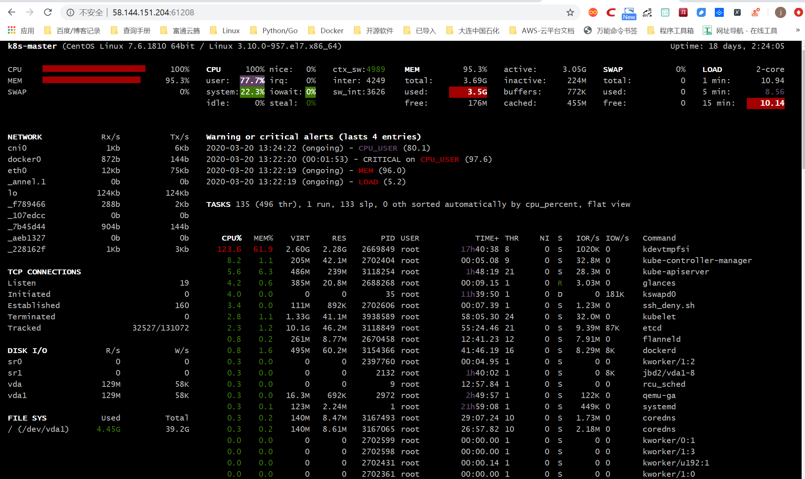

# 业务服务监控详解

## 文件内容差异对比方法

### 1.两个字符串的差异对比方法

打印输出差异
``` 
def File_difference(src_file, dest_file):
    import os
    import difflib
    if os.path.isfile(src_file) and os.path.isfile(dest_file):
        d = difflib.Differ()
        text1_info = open(src_file).read().splitlines()
        text2_info = open(dest_file).read().splitlines()
        diff = d.compare(text1_info, text2_info)
        print("\n".join(list(diff)))
    else:
        raise Exception("The object of this function comparison must be a file!")


File_difference("test001.txt", "test002.txt")
```

转换为html后查看差异输出
``` 
def File_difference_to_Html(src_file, dest_file):
    import os
    import difflib
    if os.path.isfile(src_file) and os.path.isfile(dest_file):
        d = difflib.HtmlDiff()
        text1_info = open(src_file).read().splitlines()
        text2_info = open(dest_file).read().splitlines()
        html = d.make_file(text1_info, text2_info)
        with open("comp.html", "w") as f:
            f.write(html)
    else:
        raise Exception("The object of this function comparison must be a file!")
        
File_difference_to_Html("test001.txt", "test002.txt")
```


### 2.对比Nginx配置文件差异

``` 
#!/usr/bin/python
import difflib
import sys

try:
    textfile1 = sys.argv[1]
    textfile2 = sys.argv[2]
except Exception as e:
    print("Error:" + str(e))
    print("Usage: simple3.py filename1 filename2")
    sys.exit()


def readfile(filename):
    try:
        fileHandle = open(filename, 'rb')
        text = fileHandle.read().splitlines()
        fileHandle.close()
        return text
    except IOError as error:
        print('Read file Error:' + str(error))
        sys.exit()


if textfile1 == "" or textfile2 == "":
    print("Usage: simple3.py filename1 filename2")
    sys.exit()

text1_lines = readfile(textfile1)
text2_lines = readfile(textfile2)

d = difflib.HtmlDiff()
print(d.make_file(text1_lines, text2_lines))

```


## 文件与目录差异对比

### 实践：校验源与备份目录差异

定期校验源目录和备份目录，并进行增量补备份
``` 
#!/usr/bin/env python
'''
定期校验源目录和备份目录，并进行增量补备份
'''

import os, sys
import filecmp
import re
import shutil

holderlist = []


def compareme(dir1, dir2):
    dircomp = filecmp.dircmp(dir1, dir2)
    only_in_one = dircomp.left_only
    diff_in_one = dircomp.diff_files
    dirpath = os.path.abspath(dir1)
    [holderlist.append(os.path.abspath(os.path.join(dir1, x))) for x in only_in_one]
    [holderlist.append(os.path.abspath(os.path.join(dir1, x))) for x in diff_in_one]
    if len(dircomp.common_dirs) > 0:
        for item in dircomp.common_dirs:
            compareme(os.path.abspath(os.path.join(dir1, item)), \
                      os.path.abspath(os.path.join(dir2, item)))
        return holderlist


def main():
    if len(sys.argv) > 2:
        dir1 = sys.argv[1]
        dir2 = sys.argv[2]
    else:
        print("Usage: ", sys.argv[0], "datadir backupdir")
        sys.exit()

    source_files = compareme(dir1, dir2)
    dir1 = os.path.abspath(dir1)

    if not dir2.endswith('/'): dir2 = dir2 + '/'
    dir2 = os.path.abspath(dir2)
    destination_files = []
    createdir_bool = False

    for item in source_files:
        destination_dir = re.sub(dir1, dir2, item)
        destination_files.append(destination_dir)
        if os.path.isdir(item):
            if not os.path.exists(destination_dir):
                os.makedirs(destination_dir)
                createdir_bool = True

    if createdir_bool:
        destination_files = []
        source_files = []
        source_files = compareme(dir1, dir2)
        for item in source_files:
            destination_dir = re.sub(dir1, dir2, item)
            destination_files.append(destination_dir)

    print("update item:")
    print(source_files)

    copy_pair = zip(source_files, destination_files)
    for item in copy_pair:
        if os.path.isfile(item[0]):
            shutil.copyfile(item[0], item[1])


if __name__ == '__main__':
    main()

```

## 发送电子邮件模块smtplib

### 1.简单的邮件
``` 
import smtplib
import string
 
HOST = "smtp.gmail.com"
SUBJECT = "Test email from Python"
TO = "test@qq.com"
FROM = "test@gmail.com"
text = "Python rules them all!"
BODY = string.join((
        "From: %s" % FROM,
        "To: %s" % TO,
        "Subject: %s" % SUBJECT ,
        "",
        text
        ), "\r\n")
server = smtplib.SMTP()
server.connect(HOST,"25")
server.starttls()
server.login("test@gmail.com","123456")
server.sendmail(FROM, [TO], BODY)
server.quit()

```

### 2.实现html数据报表格式的邮件
``` 
#coding: utf-8
import smtplib
from email.mime.multipart import MIMEMultipart
from email.mime.text import MIMEText
from email.mime.image import MIMEImage

HOST = "smtp.gmail.com"
SUBJECT = u"业务性能数据报表"
TO = "test@qq.com"
FROM = "test@gmail.com"

def addimg(src,imgid):
    fp = open(src, 'rb')
    msgImage = MIMEImage(fp.read())
    fp.close()
    msgImage.add_header('Content-ID', imgid)
    return msgImage

msg = MIMEMultipart('related')
msgtext = MIMEText("""
<table width="600" border="0" cellspacing="0" cellpadding="4">
      <tr bgcolor="#CECFAD" height="20" style="font-size:14px">
        <td colspan=2>*官网性能数据  <a href="monitor.domain.com">更多>></a></td>
      </tr>
      <tr bgcolor="#EFEBDE" height="100" style="font-size:13px">
        <td>
         </td><td>
         </td>
      </tr>
      <tr bgcolor="#EFEBDE" height="100" style="font-size:13px">
         <td>
         </td><td>
         </td>
      </tr>
    </table>""","html","utf-8")
msg.attach(msgtext)
msg.attach(addimg("img/bytes_io.png","io"))
msg.attach(addimg("img/myisam_key_hit.png","key_hit"))
msg.attach(addimg("img/os_mem.png","men"))
msg.attach(addimg("img/os_swap.png","swap"))

msg['Subject'] = SUBJECT
msg['From']=FROM
msg['To']=TO
try:
    server = smtplib.SMTP()
    server.connect(HOST,"25")
    server.starttls()
    server.login("test@gmail.com","123456")
    server.sendmail(FROM, TO, msg.as_string())
    server.quit()
    print "邮件发送成功！"
except Exception, e:  
    print "失败："+str(e) 

```

### 3.实现图文格式的服务器性能报表邮件
``` 
#coding: utf-8
import smtplib
from email.mime.multipart import MIMEMultipart
from email.mime.text import MIMEText
from email.mime.image import MIMEImage

HOST = "smtp.gmail.com"
SUBJECT = u"业务性能数据报表"
TO = "test@qq.com"
FROM = "test@gmail.com"

def addimg(src,imgid):
    fp = open(src, 'rb')
    msgImage = MIMEImage(fp.read())
    fp.close()
    msgImage.add_header('Content-ID', imgid)
    return msgImage

msg = MIMEMultipart('related')
msgtext = MIMEText("""
<table width="600" border="0" cellspacing="0" cellpadding="4">
      <tr bgcolor="#CECFAD" height="20" style="font-size:14px">
        <td colspan=2>*官网性能数据  <a href="monitor.domain.com">更多>></a></td>
      </tr>
      <tr bgcolor="#EFEBDE" height="100" style="font-size:13px">
        <td>
         </td><td>
         </td>
      </tr>
      <tr bgcolor="#EFEBDE" height="100" style="font-size:13px">
         <td>
         </td><td>
         </td>
      </tr>
    </table>""","html","utf-8")
msg.attach(msgtext)
msg.attach(addimg("img/bytes_io.png","io"))
msg.attach(addimg("img/myisam_key_hit.png","key_hit"))
msg.attach(addimg("img/os_mem.png","men"))
msg.attach(addimg("img/os_swap.png","swap"))

msg['Subject'] = SUBJECT
msg['From']=FROM
msg['To']=TO
try:
    server = smtplib.SMTP()
    server.connect(HOST,"25")
    server.starttls()
    server.login("test@gmail.com","123456")
    server.sendmail(FROM, TO, msg.as_string())
    server.quit()
    print "邮件发送成功！"
except Exception, e:  
    print "失败："+str(e) 

```

### 4.实现带附件格式的业务服务质量周报邮件
``` 
#coding: utf-8
import smtplib
from email.mime.multipart import MIMEMultipart
from email.mime.text import MIMEText
from email.mime.image import MIMEImage

HOST = "smtp.gmail.com"
SUBJECT = u"业务性能数据报表"
TO = "test@qq.com"
FROM = "test@gmail.com"

def addimg(src,imgid):
    fp = open(src, 'rb')
    msgImage = MIMEImage(fp.read())
    fp.close()
    msgImage.add_header('Content-ID', imgid)
    return msgImage

msg = MIMEMultipart('related')
msgtext = MIMEText("""
<table width="600" border="0" cellspacing="0" cellpadding="4">
      <tr bgcolor="#CECFAD" height="20" style="font-size:14px">
        <td colspan=2>*官网性能数据  <a href="monitor.domain.com">更多>></a></td>
      </tr>
      <tr bgcolor="#EFEBDE" height="100" style="font-size:13px">
        <td>
         </td><td>
         </td>
      </tr>
      <tr bgcolor="#EFEBDE" height="100" style="font-size:13px">
         <td>
         </td><td>
         </td>
      </tr>
    </table>""","html","utf-8")
msg.attach(msgtext)
msg.attach(addimg("img/bytes_io.png","io"))
msg.attach(addimg("img/myisam_key_hit.png","key_hit"))
msg.attach(addimg("img/os_mem.png","men"))
msg.attach(addimg("img/os_swap.png","swap"))

msg['Subject'] = SUBJECT
msg['From']=FROM
msg['To']=TO
try:
    server = smtplib.SMTP()
    server.connect(HOST,"25")
    server.starttls()
    server.login("test@gmail.com","123456")
    server.sendmail(FROM, TO, msg.as_string())
    server.quit()
    print "邮件发送成功！"
except Exception, e:  
    print "失败："+str(e) 

```

## 探测Web服务质量
``` 
#!/usr/bin/python
#encoding:utf-8
#*/30 * * * * /usr/bin/python /root/dnstime.py >> /root/myreport.txt 2>&1
import os
import time
import sys
import pycurl
#import commands
import time

URL="http://imp-east.example.net"
ISOTIMEFORMAT="%Y-%m-%d %X"
c = pycurl.Curl()
c.setopt(pycurl.URL, URL)
c.setopt(pycurl.CONNECTTIMEOUT, 5)
c.setopt(pycurl.TIMEOUT, 5)
c.setopt(pycurl.FORBID_REUSE, 1)
c.setopt(pycurl.MAXREDIRS, 1)
c.setopt(pycurl.NOPROGRESS, 1)
c.setopt(pycurl.DNS_CACHE_TIMEOUT,30)
indexfile = open(os.path.dirname(os.path.realpath(__file__))+"/content.txt", "wb")
c.setopt(pycurl.WRITEHEADER, indexfile)
c.setopt(pycurl.WRITEDATA, indexfile)
try:
    c.perform()
except Exception,e:
    print "connecion error:"+str(e)
    indexfile.close()
    c.close()
    sys.exit()

NAMELOOKUP_TIME =  c.getinfo(c.NAMELOOKUP_TIME)
CONNECT_TIME =  c.getinfo(c.CONNECT_TIME)
PRETRANSFER_TIME =   c.getinfo(c.PRETRANSFER_TIME)
STARTTRANSFER_TIME = c.getinfo(c.STARTTRANSFER_TIME)
TOTAL_TIME = c.getinfo(c.TOTAL_TIME)
HTTP_CODE =  c.getinfo(c.HTTP_CODE)
SIZE_DOWNLOAD =  c.getinfo(c.SIZE_DOWNLOAD)
HEADER_SIZE = c.getinfo(c.HEADER_SIZE)
SPEED_DOWNLOAD=c.getinfo(c.SPEED_DOWNLOAD)

print "HTTP状态码：%s" %(HTTP_CODE)
print "DNS解析时间：%.2f ms"%(NAMELOOKUP_TIME*1000)
print "建立连接时间：%.2f ms" %(CONNECT_TIME*1000)
print "准备传输时间：%.2f ms" %(PRETRANSFER_TIME*1000)
print "传输开始时间：%.2f ms" %(STARTTRANSFER_TIME*1000)
print "传输结束总时间：%.2f ms" %(TOTAL_TIME*1000)

print "下载数据包大小：%d bytes/s" %(SIZE_DOWNLOAD)
print "HTTP头部大小：%d byte" %(HEADER_SIZE)
print "平均下载速度：%d bytes/s" %(SPEED_DOWNLOAD)

indexfile.close()
c.close()

print time.strftime( ISOTIMEFORMAT, time.gmtime( time.time() ) )
print "================================================================"

```

## 检测主机存活状态
``` 
#!/usr/bin/python
import os
import re
import time
import sys
import subprocess

lifeline = re.compile(r"(\d) received")
report = ("No response","Partial Response","Alive")

print time.ctime()
for host in range(1,254):
   ip = "192.168.1."+str(host)
   pingaling = subprocess.Popen(["ping","-q", "-c 2", "-r", ip], shell=False, stdin=subprocess.PIPE, stdout=subprocess.PIPE)
   print "Testing ",ip,
   while 1:
      pingaling.stdout.flush()
      line = pingaling.stdout.readline()
      if not line: break
      igot = re.findall(lifeline,line)
      if igot:
           print report[int(igot[0])]
print time.ctime()

```

## 检测主机存活状态示例1
``` 
#!/usr/bin/env python
# -*- coding:utf8 -*-
# auther; 18793
# Date：2020/3/21 10:50
# filename: ping001.py

from __future__ import print_function
import subprocess
import threading


def is_reacheable(ip):
    if subprocess.call(["ping", "-c", "1", ip]):
        print("{0} is alive".format(ip))
    else:
        print("{0} is unreacheable".format(ip))


def main():
    with open('ips.txt') as f:
        lines = f.readlines()
        threads = []
        for line in lines:
            thr = threading.Thread(target=is_reacheable, args=(line,))
            thr.start()
            threads.append(thr)

        for thr in threads:
            thr.join()


if __name__ == '__main__':
    main()

```

## 使用生产者消费者模型来减少线程数量
``` 
#!/usr/bin/env python
# -*- coding:utf8 -*-
# auther; 18793
# Date：2020/3/21 10:54
# filename: ping002.py
from __future__ import print_function
import subprocess
import threading
from queue import Queue
from queue import Empty


def call_ping(ip):
    if subprocess.call(["ping", "-c", "1", ip]):
        print("{0} is alive".format(ip))
    else:
        print("{0} is unreacheable".format(ip))


def is_reacheable(q):
    try:
        while True:
            ip = q.get_nowait()
            call_ping(ip)
    except Empty:
        pass


def main():
    q = Queue()
    with open('ips.txt') as f:
        for line in f:
            q.put(line)

    threads = []
    for i in range(10):
        thr = threading.Thread(target=is_reacheable, args=(q,))
        thr.start()
        threads.append(thr)

    for thr in threads:
        thr.join()


if __name__ == '__main__':
    main()

```
## Python实现端口扫描

### 示例1
``` 
#!/usr/bin/env python
# -*- coding:utf8 -*-
# auther; 18793
# Date：2020/3/21 10:58
# filename: sample01.py
from __future__ import print_function
from socket import *


def conn_scan(host, port):
    conn = socket(AF_INET, SOCK_STREAM)
    try:
        conn.connect((host, port))
        print(host, port, 'is available')
    except Exception as e:
        print(host, port, 'is not available', e)
    finally:
        conn.close()


def main():
    host = "192.168.0.1"
    for port in range(60, 5000):
        conn_scan(host, port)


if __name__ == '__main__':
    main()
```

### 示例2，使用telnet模块
新增一个超时的时间
``` 
#!/usr/bin/env python
# -*- coding:utf8 -*-
# auther; 18793
# Date：2020/3/21 11:01
# filename: smaple02.py

# !/usr/bin/python
from __future__ import print_function
import telnetlib


def conn_scan(host, port):
    t = telnetlib.Telnet()
    try:
        t.open(host, port, timeout=1)
        print(host, port, 'is avaliable')
    except Exception as e:
        print(host, port, 'is not avaliable',e)
    finally:
        t.close()


def main():
    host = '192.168.0.1'
    for port in range(80, 5000):
        conn_scan(host, port)


if __name__ == '__main__':
    main()

```

## 实现高效的端口扫描器

``` 
#!/usr/bin/env python
# -*- coding: utf-8 -*-
import sys
import nmap

scan_row = []
input_data = raw_input('Please input hosts and port: ')
scan_row = input_data.split(" ")
if len(scan_row) != 2:
    print
    "Input errors,example \"192.168.1.0/24 80,443,22\""
    sys.exit(0)
hosts = scan_row[0]  # 接收用户输入的主机
port = scan_row[1]  # 接收用户输入的端口

try:
    nm = nmap.PortScanner()  # 创建端口扫描对象
except nmap.PortScannerError:
    print('Nmap not found', sys.exc_info()[0])
    sys.exit(0)
except:
    print("Unexpected error:", sys.exc_info()[0])
    sys.exit(0)

try:
    nm.scan(hosts=hosts, arguments=' -v -sS -p ' + port)  # 调用扫描方法，参数指定扫描主机hosts，nmap扫描命令行参数arguments
except Exception, e:
    print
    "Scan erro:" + str(e)

for host in nm.all_hosts():  # 遍历扫描主机
    print('----------------------------------------------------')
    print('Host : %s (%s)' % (host, nm[host].hostname()))  # 输出主机及主机名
    print('State : %s' % nm[host].state())  # 输出主机状态，如up、down

    for proto in nm[host].all_protocols():  # 遍历扫描协议，如tcp、udp
        print('----------')
        print('Protocol : %s' % proto)  # 输入协议名

        lport = nm[host][proto].keys()  # 获取协议的所有扫描端口
        lport.sort()  # 端口列表排序
        for port in lport:  # 遍历端口及输出端口与状态
            print('port : %s\tstate : %s' % (port, nm[host][proto][port]['state']))
```

## 使用进程池ThreadPoolExecutor抢占模式并发扫描
``` 
#!/usr/bin/env python
# -*- coding:utf8 -*-
# auther; 18793
# Date：2020/3/21 10:58
# filename: sample01.py
from __future__ import print_function
from socket import *


def conn_scan(port):
    conn = socket(AF_INET, SOCK_STREAM)
    host = "192.168.0.1"
    try:
        conn.connect((host, port))
        print(host, port, 'is available')
    except Exception as e:
        print(host, port, 'is not available', e)
    finally:
        conn.close()


def mulit_run(func, max_workers, args):
    """
    多线程执行命令
    :param func:  执行函数
    :param max_workers: 最多线程数
    :param args: 可迭代对象
    :return:
    """
    from concurrent.futures import ThreadPoolExecutor, wait, ALL_COMPLETED, FIRST_COMPLETED
    executor = ThreadPoolExecutor(max_workers=max_workers)
    all_task = [executor.submit(func, i) for i in args]
    wait(all_task, return_when=ALL_COMPLETED)


def main():
    ports = [p for p in range(60, 1000)]
    mulit_run(conn_scan, len(ports), ports)


if __name__ == '__main__':
    main()
```

## Redis内存检测
``` 
#!/usr/bin/python
#Check redis Nagios Plungin,Please install the redis-py module.
import redis
import sys 

STATUS_OK = 0
STATUS_WARNING = 1
STATUS_CRITICAL = 2

HOST = sys.argv[1]
PORT = int(sys.argv[2])
WARNING = float(sys.argv[3])
CRITICAL = float(sys.argv[4])

def connect_redis(host, port):
    r = redis.Redis(host, port, socket_timeout = 5, socket_connect_timeout = 5)
    return r

def main():
    r = connect_redis(HOST, PORT)
    try:
        r.ping()
    except:
        print HOST,PORT,'down'
        sys.exit(STATUS_CRITICAL)

    redis_info = r.info()
    used_mem = redis_info['used_memory']/1024/1024/1024.0
    used_mem_human = redis_info['used_memory_human']

    if WARNING <= used_mem < CRITICAL:
        print HOST,PORT,'use memory warning',used_mem_human
        sys.exit(STATUS_WARNING)
    elif used_mem >= CRITICAL:
        print HOST,PORT,'use memory critical',used_mem_human
        sys.exit(STATUS_CRITICAL)
    else:
        print HOST,PORT,'use memory ok',used_mem_human
        sys.exit(STATUS_OK)

if __name__ == '__main__':
    main()

```

## 交互式监控工具glances

galnces是一款使用Python语言开发、基于psutil的跨平台系统监控工具，在所有的Linux命令行工具中，它与top命令最相似。
都是命令行交互式监控工具，但是glances实现了比top命令更齐全的监控，提供了更加丰富的功能。

### 安装
``` 
pip install glances
```


### 使用
``` 
k8s-master (CentOS Linux 7.6.1810 64bit / Linux 3.10.0-957.el7.x86_64)                                                                                   Uptime: 18 days, 2:20:22

CPU  [|||||||||||||||||||||||||||||||||||||||||||||||100.0%]   CPU     100.0%  nice:     0.0%  ctx_sw:    2K   MEM     94.9%  active:    3.07G   SWAP      0.0%   LOAD    2-core
MEM  [||||||||||||||||||||||||||||||||||||||||||||    94.9%]   user:    98.0%  irq:      0.0%  inter:   2590   total:  3.69G  inactive:   238M   total:       0   1 min:    5.57
SWAP [                                                 0.0%]   system:   2.0%  iowait:   0.0%  sw_int:  2517   used:   3.50G  buffers:   8.73M   used:        0   5 min:    8.79
                                                               idle:     0.0%  steal:    0.0%                  free:    193M  cached:     492M   free:        0   15 min:  10.76

NETWORK                  Rx/s   Tx/s   TASKS 133 (483 thr), 2 run, 130 slp, 1 oth sorted automatically by CPU consumption
cni0                      1Kb    1Kb
docker0                    0b     0b   CPU%   MEM%  VIRT  RES       PID USER          TIME+ THR  NI S  R/s W/s  Command
eth0                      5Kb   10Kb   189.5  61.9  2.60G 2.28G 2669849 root       65h26:10 8     0 S    0 0    /tmp/kdevtmpfsi
flannel.1                  0b     0b   4.0    0.6   394M  22.8M 2667601 root           0:00 1     0 R    0 0    /usr/bin/python /usr/bin/glances
lo                       58Kb   58Kb   2.3    1.2   1.33G 46.8M 3938589 root          34:30 24    0 S   1M 0    /usr/bin/kubelet --bootstrap-kubeconfig=/etc/kubernetes/bootstrap
veth0f789466               0b     0b   1.3    1.6   495M  61.1M 3154366 root          41:29 16    0 S    0 0    /usr/bin/dockerd -H tcp://0.0.0.0:2375 -H unix://var/run/docker.s
veth7b45d44                0b     0b   0.7    6.3   486M  238M  3118254 root        1h48:12 21    0 S    0 0    kube-apiserver --advertise-address=192.168.1.10 --allow-privilege
veth107edcc                0b     0b   0.7    1.3   10.1G 47.8M 3118849 root          50:27 21    0 S 169K 13K  etcd --advertise-client-urls=https://192.168.1.10:2379 --cert-fil
vethaeb1327                0b     0b   0.3    0.2   140M  9.44M 3167493 root          12:04 10    0 S 346K 0    //coredns -conf /etc/coredns/Corefile
vethe228162f              1Kb    1Kb   0.3    0.2   46.5M 9.05M 3860464 root           0:07 1     0 S    0 0    /usr/lib/systemd/systemd-journald
                                       0.3    0.2   140M  8.62M 3167065 root          12:15 10    0 S    0 0    //coredns -conf /etc/coredns/Corefile
TCP CONNECTIONS                        0.0    0.9   1.13G 35.3M  156209 root           8:15 30    0 S    0 0    /usr/bin/containerd
Listen                            16   0.0    0.8   623M  31.8M 2656039 root           0:00 7     0 S    0 0    docker -H 159.255.180.10 ps -a --no-trunc
Initiated                          0   0.0    0.5   415M  18.0M    5021 root           2:36 3     0 S    0 5K   /usr/sbin/rsyslogd -n
Established                      156   0.0    0.4   117M  13.7M 2665945 root           2:16 7     0 S 189K 0    /var/tmp/kinsing
Terminated                         0   0.0    0.3   560M  10.9M    4725 root           2:56 5     0 S    0 0    /usr/bin/python2 -Es /usr/sbin/tuned -l -P
Tracked                 14922/131072   0.0    0.2   598M  9.02M    2762 polkitd        1:04 7     0 S    0 0    /usr/lib/polkit-1/polkitd --no-debug
                                       0.0    0.2   121M  8.95M 2477499 root           0:00 1     0 S    0 0    -bash
DISK I/O                 R/s    W/s    0.0    0.2   121M  8.95M 3216944 root           1:43 8     0 S    0 0    //portainer
sr0                         0      0   0.0    0.2   137M  8.92M 3166958 root           5:58 8     0 S   3M 0    /usr/local/bin/kube-proxy --config=/var/lib/kube-proxy/config.con
sr1                         0      0   0.0    0.2   261M  8.03M 2670458 root           3:24 12    0 S    0 0    flanneld --ip-masq --kube-subnet-mgr
vda                     2.86M    22K   0.0    0.2   74.5M 6.39M  566323 root           9:01 9     0 S    0 0    /etc/lvmetad
vda1                    2.86M    22K   0.0    0.1   110M  4.23M 2667602 root           0:00 1     0 S    0 0    sshd: [accepted]    
                                       0.0    0.1   105M  3.02M 3166776 root           0:08 10    0 S    0 0    containerd-shim -namespace moby -workdir /var/lib/containerd/io.c
FILE SYS                 Used  Total   0.0    0.1   123M  2.65M       1 root           8:39 1     0 S    0 0    /usr/lib/systemd/systemd --system --deserialize 15
/ (vda1)                4.45G  39.2G   0.0    0.0   151M  1.44M 2474275 root           0:00 1     0 S    0 0    0    
                                       0.0    0.0   105M  1.37M 3166814 root           0:07 10    0 S    0 0    containerd-shim -namespace moby -workdir /var/lib/containerd/io.c
                                       0.0    0.0   57.0M 1.37M    2763 dbus           3:01 1     0 S    0 0    /usr/bin/dbus-daemon --system --address=systemd: --nofork --nopid
                                       0.0    0.0   26.0M 1.23M    2760 root           1:21 1     0 S    0 0    /usr/lib/systemd/systemd-logind
                                       0.0    0.0   110M  1.21M  279077 root           1:05 1     0 S    0 0    /usr/sbin/sshd -D

```

如果我们安装了Bottle这个web框架，还能够通过web浏览器显示和命令行终端相同的监控界面。
``` 
[root@k8s-master ~]# pip install Bottle
[root@k8s-master ~]# glances -w
Glances Web User Interface started on http://0.0.0.0:61208/

```


glances还支持将采集的数据导人到其他服务中心,包括
```
InfluxDB,Cassandra,CouchDB,OpenTSDB,Prometheus,StatsD,ElasticSearch,RabbitMQ/ActiveMQ,ZeroMQ,Kafka和Riemann。
```


## 使用Python监控Linux

``` 
#!/usr/bin/env python
# -*- coding:utf8 -*-
# auther; 18793
# Date：2020/3/20 14:06
# filename: sample01.py
from collections import namedtuple

Disk = namedtuple('Disk', ' major_number minor_number device_name'
                          ' read_count read_merged_count read_sections'
                          ' time_spent_reading write_count write_merged_count'
                          ' write_sections time_spent_write io_request'
                          ' time_spent_doing_io weighted_time_spent_doing_io')


def get_disk_info(device):
    """
    从/proc/diskstats中读取磁盘的IO信息
    cat /proc/diskstats 
    253       0 vda 371112865 1361738 48576597402 2709064336 13868406 4698463 234200920 77805203 0 81962145 2378917941
    :param device:
    :return:
    """
    with open("/proc/diskstats") as f:
        for line in f:
            if line.split()[2] == device:
                return Disk(*(line.split()))
    raise RuntimeError("device ({0}) not found !".format(device))


def main():
    disk_info = get_disk_info("vdc")
    print(disk_info)

    print("磁盘写次数: {0}".format(disk_info.write_count))
    print("磁盘写字节数: {0}".format(disk_info.write_sections * 512))
    print("磁盘写延迟: {0}".format(disk_info.time_spent_write))


if __name__ == '__main__':
    main()
```


