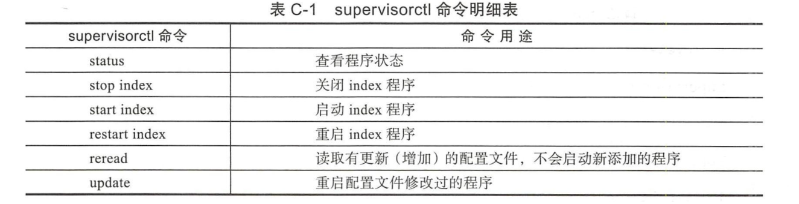

.. contents::
   :depth: 3
..

Supervisor在Devops工作中的应用
==============================

Supervisor简单来说就是Python编写的一个简单的多进程管理工具，虽然在shell下面我们可以用nohup命令的方式
将程序放在后台执行，一个或几个可能还比较方便，但是如果很多重要的进程需要管理的话，
那就不方便了，此时，我们可以用Supervisor进行进程的批量管理。

1.Supervisor的安装
------------------

::

   # 提前安装epel源
   yum -y install epel*

   yum -y install supervisor

启动Supervisor的命令也很简单，代码如下所示：

::

   supervisord -c /etc/supervisord.conf 

   [root@172-16-74-11 centos]# ps aux |grep supervisor
   root     19537  0.0  0.0 219264 11804 ?        Ss   06:19   0:00 /usr/bin/python /bin/supervisord -c /etc/supervisord.conf
   root     24225  0.0  0.0 112712   980 pts/0    S+   06:20   0:00 grep --color=auto supervisor

Supervisor的配置文件为/etc/supersord.conf,比较简单，其配置文件文档可以参考官方文档。

我们可以根据需要修改里面的配置。比如说，这里每个不同的项目，都使用了一个单独的配置的文件，
放置在/etc/supervisor/下面，于是修改/etc/supervisord.conf,加上如下内容：

::

   [include]
   files = /etc/supervisor/*.conf

这样做的好处就是如果有很多进程需要管理，可以进行批量管理，这是一种方法；
或者直接在/etc/supervisor.conf文件里添加多个进程管理，这也是可以的。

使用cat查看supervisord.conf文件，命令如下所示：

::

   [root@172-16-74-11 centos]# cat /etc/supervisord.conf |grep -v "^;"

   [unix_http_server]
   file=/var/run/supervisor/supervisor.sock   ; (the path to the socket file)

   [supervisord]
   logfile=/var/log/supervisor/supervisord.log  ; (main log file;default $CWD/supervisord.log)
   logfile_maxbytes=50MB       ; (max main logfile bytes b4 rotation;default 50MB)
   logfile_backups=10          ; (num of main logfile rotation backups;default 10)
   loglevel=info               ; (log level;default info; others: debug,warn,trace)
   pidfile=/var/run/supervisord.pid ; (supervisord pidfile;default supervisord.pid)
   nodaemon=false              ; (start in foreground if true;default false)
   minfds=1024                 ; (min. avail startup file descriptors;default 1024)
   minprocs=200                ; (min. avail process descriptors;default 200)

   [rpcinterface:supervisor]
   supervisor.rpcinterface_factory = supervisor.rpcinterface:make_main_rpcinterface

   [supervisorctl]
   serverurl=unix:///var/run/supervisor/supervisor.sock ; use a unix:// URL  for a unix socket

   [include]
   files = /etc/supervisor/*.conf

Supervisor配置文件说明
----------------------

Supervisor日志文件路径

::

   logfile=/var/log/supervisor/supervisord.log 

Supervisor日志文件大小，超出会rotate：

::

   logfile_maxbytes=50MB

日志文件保留备份数量，默认值为10

::

   logfile_backups=10

Supervisor日志级别，这里为info

::

   loglevel=info  

Supervisor的pid文件路径：

::

   pidfile=/var/run/supervisord.pid 

Supervisor以daemon的方式运行:

::

   nodaemon=false

可以打开文件描述符的最小值，这里为1024：

::

   minfds=1024 

可以打开进程数的最小值，这里为200

::

   minprocs=200 

通过unix socket连接Supervisor：

::

   [supervisorctl]
   serverurl=unix:///var/run/supervisor/supervisor.sock ;

Supervisor配置文件至少需要一个\ ``[program:x]``\ 部分的配置，来告诉Supervisor需要管理哪个进程。
``[program:x]``\ 语法中的x表示程序的名字，将会显示在客户端(supervisorctl界面)，supervisorctl通过
这个值来对程序进行start、restart、stop等操作，示例代码如下：

::

   [program:xx]是被管理的进程配置参数，xx是进程的名称
   [program:xx]
   command=/opt/apache-tomcat-8.0.35/bin/catalina.sh run ; 程序启动命令
   autostart=true    ; 在supervisord启动的时候也自动启动
   startsecs=10     ; 启动10秒后没有异常退出，就表示进程正常启动了，默认为1秒
   autorestart=true   ; 程序退出后自动重启,可选值：[unexpected,true,false]，默认为unexpected，表示进程意外杀死后才重启
   startretries=3    ; 启动失败自动重试次数，默认是3
   user=tomcat     ; 用哪个用户启动进程，默认是root
   priority=999     ; 进程启动优先级，默认999，值小的优先启动
   redirect_stderr=true ; 把stderr重定向到stdout，默认false
   stdout_logfile_maxbytes=20MB ; stdout 日志文件大小，默认50MB
   stdout_logfile_backups = 20  ; stdout 日志文件备份数，默认是10
   ;stdout 日志文件，需要注意当指定目录不存在时无法正常启动，所以需要手动创建目录（supervisord 会自动创建日志文件）
   stdout_logfile=/opt/apache-tomcat-8.0.35/logs/catalina.out
   stopasgroup=false   ;默认为false,进程被杀死时，是否向这个进程组发送stop信号，包括子进程
   killasgroup=false   ;默认为false，向进程组发送kill信号，包括子进程

可以输入supervisorctl命令进入supervisorctl的Shell界面，然后就可以执行不同的命令了。显示结果如下所示：

::

   [root@172-16-74-11 centos]# supervisorctl 
   supervisor> 

supervisorctl命令及用途如下表所示 |image1|

分享线上的\ ``supervisord.conf``\ 配置文件，我们用其管理4个redis实例。配置如下所示：

::

   [program:redis_6376]
   command=/usr/local/bin/redis-server /etc/redis_6376.conf
   stdout_logfile=/var/log/supervisor/%(program_name)s.log
   stderr_logfile=/var/log/supervisor/%(program_name)s.log
   process_name=%(program_name)s
   numprocs=l
   directory=/tmp
   umask=022
   priority=999
   autostart=true
   autorestart=true

   [program:redis_6377]
   command=/usr/local/bin/redis-server /etc/redis_6377.conf
   stdout_logfile=/var/log/supervisor/%(program_name)s.log
   stderr_logfile=/var/log/supervisor/%(program_name)s.log
   process_name=%(program_name)s
   numprocs=l
   directory=/tmp
   umask=022
   priority=999
   autostart=true
   autorestart=true

   [program:redis_6378]
   command=/usr/local/bin/redis-server /etc/redis_6378.conf
   stdout_logfile=/var/log/supervisor/%(program_name)s.log
   stderr_logfile=/var/log/supervisor/%(program_name)s.log
   process_name=%(program_name)s
   numprocs=l
   directory=/tmp
   umask=022
   priority=999
   autostart=true
   autorestart=true

   [program:redis_6379]
   command=/usr/local/bin/redis-server /etc/redis_6379.conf
   stdout_logfile=/var/log/supervisor/%(program_name)s.log
   stderr_logfile=/var/log/supervisor/%(program_name)s.log
   process_name=%(program_name)s
   numprocs=l
   directory=/tmp
   umask=022
   priority=999
   autostart=true
   autorestart=true

Docker中利用Supervisor管理多进程
--------------------------------

Docker容器在启动的时候一般是开启单个进程，例如,一个SSH或者Apache的Daemon服务，但我们在工作中，经常要在一个机器上开启多个服务。
做到这一点可以有很多方法，最简单的一个方法就是把多个启动命令放到一个启动脚本里面，启动时直接启动这个脚本即可。

还有一种方式就是利用Supervisor来管理容器中的多个进程。使用Supervisor，我们可以更好地控制、管理、重启我们希望运行的进程。

这里演示一下如何同时使用SSH和Nginx服务

``supervisord.conf``\ 文件内容如下所示：

::

   [program:sshd]
   command=/usr/sbin/sshd -D
   [program:nginx]
   command=/usr/sbin/nginx -g "daemon off;"
   priority=900
   stdout_logfile=/dev/stdout
   stdout_logfile_maxbytes=0
   stderr_logfile=/dev/stderr
   stderr_logfile_maxbytes=0
   autorestart=true

Dokerfile文件内容如下所示：

::

   FROM ubuntu:16.04

   RUN apt-get update
   RUN apt-get install -y openssh-server nginx supervisor
   RUN rm -rf /var/lib/apt/lists/*
   RUN mkdir -p /var/log/supervisor

   COPY supervisord.conf /etc/supervisor/conf.d/supervisord.conf
   CMD ["/usr/bin/supervisord"]

具体的镜像打包命令和启动容器的方法这里暂且略过。

熟练使用Supervisor可以极大地提升工作效率。

参考文献
--------

https://www.cnblogs.com/LC161616/p/8947382.html

