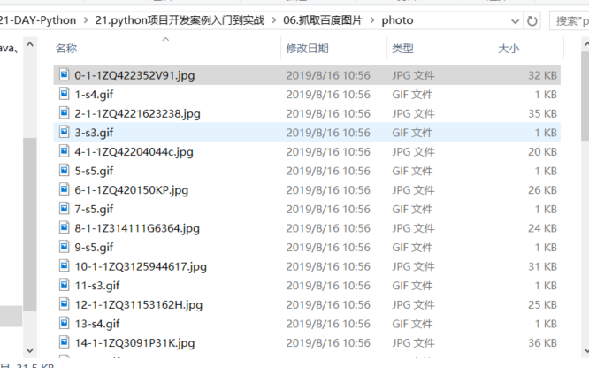
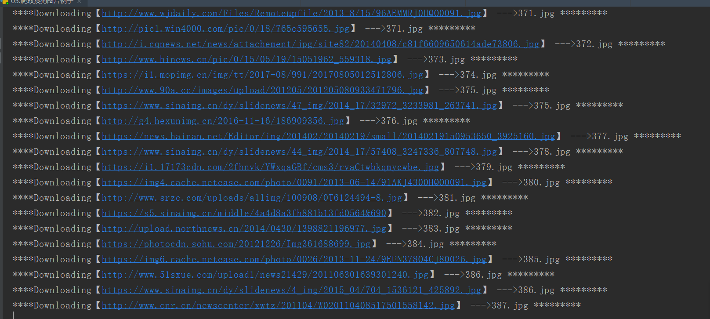

# Python的网络请求
## urllib

Python 的urllib 库其中包含了如下4 个模块。
    
    urllib.request 模块：用于打开和读写URL 资源。
    urllib.error 模块：包含了由urllib. request 引发的异常。
    urllib.parse 模块：用于解析URL 。
    urllib.robotparser 模块：分析robots.txt 文件
    
    在访问互联网资源时主要使用的模块是urllib.request 、urllib.parse 和urllib.error ，
    其中最核心的是urllib.request 模块

 
```
在urllib.request 模块中访问互联网资源
主要使用urllib.request.urlopen() 函数和
urllib.request.Request 对象，
urllib .request. urlopen() 函数可以用于简单的网络资访问， 
而urllib.request.Request 对象可以访问复杂网络资源。

urllib.request.urltetrieve()函数可以把对应的文件下载到本地

```

下载文件
``` 
filename = urllib.request.urlretrieve("https://mbd.baidu.com",filename="test.html")
```


python2和python3的Urllib库的区别：
```
python2X  中 import urlparse ------ python3X 使用 import urllib.parse
python2X  中 import urllib2 ------ python3X 使用 import urllib.request,urllib.error
python2X  中 import urllib ------ python3X 使用 import urllib.request,urllib.error，urllib.parse
python2X  中 import urllib2.urlopen ------ python3X 使用 import urllib.request.urlopen
python2X  中 urllib.quote ------ python3X 使用 import urllib.request.quote
python2X  中 urllib2.Request ------ python3X 使用 import urllib.request.Request
python2X  中 cookielib.CookieJar------ python3X 使用 http.CookieJar
python2X  中 import urllib2.urlencode ------ python3X 使用 import urllib.parse.urlencode
```


### python2和python3的urllib区别

```python
#!/usr/bin/env python
#-*- coding:utf8 -*-
# auther; 18793
# Date：2019/8/19 15:03
# filename: urllib-urlopen函数.py

"""
#高级用法
import urllib.request

response = urllib.request.urlopen("http://www.python.org")
print(response.read().decode('utf-8'))
"""

# python3
import urllib.request

response = urllib.request.urlopen("http://www.python.org")
print(response.status)              #200
print(response.getheaders())
print(response.getheader('Server'))     #nginx


#python2
"""
import urllib2
response = urllib2.urlopen("http://www.python.org")
print(response.status)              #200
print(response.getheaders())
print(response.getheader('Server'))     #nginx

"""
```

代码示例：
```python

# 导入urllib
import urllib.request
# 打开URL
response = urllib.request.urlopen('https://movie.douban.com/', None, 2)
# 读取返回的内容
html = response.read().decode('utf8')
# 写入txt
f = open('code1.txt', 'w', encoding='utf8')
f.write(html)
f.close()

```


``` 
#!/usr/bin/env python
#-*- coding:utf8 -*-
# auther; 18793
# Date：2019/5/22 14:03
# filename: urllib模块.py
import urllib.request

#使用urlopen()函数打开网站。使用with as代码块自动管理资源释放
with urllib.request.urlopen("http://www.sina.com.cn/") as response:
    #读取数据，该数据是字节序列数据
    data = response.read()
    
    # 将字节序列数据转换为字符串
    html = data.decode()
    print(html)

```

urllib.request.urlopen()函数可以很轻松地打开一个网站，读取网页信息。


``` 
from urllib import request

# urlopen()函数既可以打开对象，也可以是字符串
req = request.Request("http://fanyi.baidu.com")
response = request.urlopen(req)
html = response.read()
html = html.decode("utf-8")
print(html)


if __name__ == '__main__':
    #打开字符串
    res = request.urlopen("http://fanyi.baidu.com")
    html = res.read()
    html = html.decode("utf-8")
    print(html)

```


### 获取服务响应信息

#### 发送get请求
``` 
#!/usr/bin/env python
# -*- coding:utf8 -*-
# auther; 18793
# Date：2019/7/24 14:17
# filename: 获取服务器的响应信息.py
from urllib import request

f = request.urlopen("https://fanyi.baidu.com/")
data = f.read()

# 返回请求HTTP后的状态，reason返回未被响应的原因
print("Status:", f.status, f.reason)

# 返回HTTP响应的头信息
for k, v in f.getheaders():
    print("{}:{}".format(k, v))

```


``` 
#!/usr/bin/env python
# -*- coding:utf8 -*-
# auther; 18793
# Date：2019/7/24 14:23
# filename: urllib中Response对象的一些方法.py
from urllib import request

req = request.Request("https://fanyi.baidu.com/")
response = request.urlopen(req)

#获取url地址
print("geturl打印信息:{}".format(response.geturl()))
print("*" * 100)
#获取响应信息
print("info打印信息;{}".format(response.info()))
print("*" * 100)

#获取响应HTTP状态码
print("getcode打印信息:{}".format(response.getcode()))

```

获得静态数据
```
#!/usr/bin/env python
#-*- coding:utf8 -*-
# auther; 18793
# Date：2019/5/22 16:27
# filename: 获得静态数据.py
import urllib.request

url = "http://q.stock.sohu.com/cn/bk_4188.shtml"
req = urllib.request.Request(url)

with urllib.request.urlopen(req) as response:
    data = response.read()
    htmlstr = data.decode('gbk')
    print(htmlstr)
```

#### 发送post网络请求
```
import urllib.request
import urllib.parse  # 导入解析模块

# 创建参数
data = bytes(urllib.parse.urlencode({"word": "hello"}), encoding="utf-8")

# 发送post网络请求
response = urllib.request.urlopen("http://httpbin.org/post", data=data)
html = response.read()
print(html)
```


## Downloader下载图片

下载并保存到文件的完整过程如下：
```
1．调用 requests.get()下载该文件。
2．用'wb'调用 open()，以写二进制的方式打开一个新文件。
3．利用 Respose 对象的 iter_content()方法做循环。
4．在每次迭代中调用 write()，将内容写入该文件。
5．调用 close()关闭该文件。
```

### 使用request下载图片
```
#!/usr/bin/env python
# -*- coding:utf8 -*-
# auther; 18793
# Date：2020/3/22 22:46
# filename: web下载.py
import requests

response = requests.get("https://cdn.fuhao321.com/uploads/1811/1-1Q12G04221108.jpg")
"""
方式1
"""
try:
    response.raise_for_status()
    with open("image.jpg", "wb") as f:
        for chunk in response.iter_content(100000):
            f.write(chunk)
except Exception as e:
    print(e)


"""
方式2
"""
# if response.status_code == 200:
#     code_image = response.content
#     with open("image.jpg", "wb") as f:
#         f.write(code_image)

```


### 使用urllib下载图片

``` 
#!/usr/bin/env python
# -*- coding:utf8 -*-
# auther; 18793
# Date：2019/5/22 14:08
# filename: urlib模块2.py
import urllib.parse
import urllib.request

url = "http://www.cncrk.com/up/1801/201801051228459384.jpg"
with urllib.request.urlopen(url) as response:
    data = response.read()
    f_name = "download.png"

    with open(f_name, "wb") as f:
        f.write(data)
        print("下载文件成功....")

```


``` 
def writeImage(link):
    """
        作用：将html内容写入到本地
        link：图片连接
    """
    #print "正在保存 " + filename
    headers = {"User-Agent" : "Mozilla/5.0 (Windows NT 10.0; Win64; x64) AppleWebKit/537.36 (KHTML, like Gecko) Chrome/54.0.2840.99 Safari/537.36"}
    # 文件写入
    request = urllib2.Request(link, headers = headers)
    # 图片原始数据
    image = urllib2.urlopen(request).read()
    # 取出连接后10位做为文件名
    filename = link[-10:]
    # 写入到本地磁盘文件内
    with open(filename, "wb") as f:
        f.write(image)
    print "已经成功下载 "+ filename
```

## 总结下载图片的几种方式


``` 
# 方式1
# filename: 01.图片文件下载到本地-方式1.py
from urllib import request

request.urlretrieve(
    "https://timgsa.baidu.com/timg?image&quality=80&size=b9999_10000&sec=1565931658646&di=7481c26c3e7334361c58239fdba0b7d3&imgtype=0&src=http%3A%2F%2Fdownhdlogo.yy.com%2Fhdlogo%2F640640%2F640%2F640%2F45%2F1662457261%2Fu1662457261wYlxdOY.jpeg",
    "cat.jpg")

```

函数原型如下：

------

```
     urlretrieve(url, filename=None, reporthook=None, data=None)
```

以天堂图片网为例（<http://www.ivsky.com/tupian/ziranfengguang/> ），提取当前网址中的图片链接，并将图片下载到当前目录下。代码如下：

```python
#!/usr/bin/env python
# -*- coding:utf8 -*-
# auther; 18793
# Date：2020/5/6 13:19
# filename: sample01.py
import os
from urllib import request
from lxml import etree
import requests

Base_path = os.path.dirname(os.path.abspath(os.path.normpath(__file__))) + "/photo"


def mkdir_dir(pathname):
    if not os.path.exists(pathname):
        os.mkdir(pathname)


def Schedule(blocknum, blocksize, totalsize):
    '''''
    blocknum:已经下载的数据块
    blocksize:数据块的大小
    totalsize:远程文件的大小
    '''
    per = 100.0 * blocknum * blocksize / totalsize
    if per > 100:
        per = 100
    print('当前下载进度：%d' % per)


user_agent = 'Mozilla/4.0 (compatible; MSIE 5.5; Windows NT)'
headers = {'User-Agent': user_agent}
r = requests.get('http://www.ivsky.com/tupian/ziranfengguang/', headers=headers)
# 使用lxml解析网页
html = etree.HTML(r.text)
img_urls = html.xpath('.// img/@src')  # 先找到所有的img

mkdir_dir(Base_path)

i = 0
for img_url in img_urls:
    images = "https:" + img_url
    image_name = 'img' + str(i) + '.jpg'
    # print(images)
    request.urlretrieve(images, Base_path + "/" + image_name, Schedule)
    i += 1
```


```
# 方式2
# filename: 02.图片下载到本地-方式2.py
from urllib import request
import urllib

url = "https://timgsa.baidu.com/timg?image&quality=80&size=b9999_10000&sec=1565931658646&di=7481c26c3e7334361c58239fdba0b7d3&imgtype=0&src=http%3A%2F%2Fdownhdlogo.yy.com%2Fhdlogo%2F640640%2F640%2F640%2F45%2F1662457261%2Fu1662457261wYlxdOY.jpeg"
url1 = urllib.request.Request(url)  # Request()函数将url添加到头部，模拟浏览器访问

page = urllib.request.urlopen(url1).read()  # 将url页面的源码保存成字符串

# 下载图片write()方式
with open("cat2.jpg", 'wb') as f:
    f.write(page)

```


```
# 方式3
#!/usr/bin/env python
# -*- coding:utf8 -*-
# auther; 18793
# Date：2019/5/22 14:08
# filename: urlib模块2.py
import urllib.parse
import urllib.request

url = "http://www.cncrk.com/up/1801/201801051228459384.jpg"

with urllib.request.urlopen(url) as response:
    data = response.read()
    f_name = "download.png"

    with open(f_name, "wb") as f:
        f.write(data)
        print("下载文件成功....")
```


```
data = requests.get("http:" + photo_url, headers=header)
with open(file_name, "wb") as f:
    f.write(data.content)  # 把图片内容写入文件


或者

try:
    response.raise_for_status()
    with open("image.jpg", "wb") as f:
        for chunk in response.iter_content(100000):
            f.write(chunk)
except Exception as e:
    print(e)
```


## urllib3
``` 
import urllib3  # 导入标准库升级版模块

# 创建PoolManager对象，用于处理与线程的连接以及线程安全
http = urllib3.PoolManager()

# 发送网络请求
# response = http.request("GET", "http://www.baidu.com")
response = http.request("POST", "http://httpbin.org/post",fields={"word": "hello"})

print(response.data.decode())

```

## requests

### 下载网页使用requests.get()方法

```python
import requests

url = "http://www.deepstone.com.tw/"
htmlfile = requests.get(url)
if htmlfile.status_code == requests.codes.ok:
    print("取得网页内容成功")       # 取得网页内容成功
else:
    print("取得网页内容失败")

print("网页内容大小:{}".format(len(htmlfile.text)))       #网页内容大小:26649
print("\n")
print("网页源码内容如下:")
print(htmlfile.text)
```


### 认识Response对象

```python
htmlfile.status_code == requests.codes.ok
print("网页内容大小:{}".format(len(htmlfile.text)))       #网页内容大小:26649
print("\n")
print("网页源码内容如下:")
print(htmlfile.text)
```

### 搜索页特定内容

```python
import re
import requests

url = "http://www.deepstone.com.tw/"
htmlfile = requests.get(url)
if htmlfile.status_code == requests.codes.ok:
    pattern = input("请输入要搜索的字符串：")
    if pattern in htmlfile.text:
        print("搜索%s成功" % pattern)
    else:
        print("搜索%s失败" % pattern)

    # 使用方法2
    name = re.findall(pattern, htmlfile.text)
    if name != None:
        print("%s 出现 %d 次" % (pattern, len(name)))
    else:
        print("%s 出现 0 次" % pattern)
else:
    print("网页下载失败")


# 请输入要搜索的字符串：上奇科技
# 搜索上奇科技成功
# 上奇科技 出现 6 次
```

### Request伪装成浏览器

```python
import requests

url = "http://www.deepstone.com.tw/"
headers = {
            "User-Agent": "Mozilla/5.0 (Windows NT 10.0; Win64; x64) AppleWebKit/537.36 (KHTML, like Gecko) Chrome/76.0.3809.100 Safari/537.36"
        }


try:
    htmlfile = requests.get(url, headers=headers)
    htmlfile.raise_for_status()
    print("下载成功,且伪装成浏览器提取网络数据")

except Exception as e:
    print(e)


def get_one_page(url):
    """
    获取源码
    :param url:
    :return:
    """
    try:
        headers = {
            "User-Agent": "Mozilla/5.0 (Windows NT 10.0; Win64; x64) AppleWebKit/537.36 (KHTML, like Gecko) Chrome/76.0.3809.100 Safari/537.36"
        }
        response = requests.get(url, headers=headers)

        if response.status_code == 200:
            return response.text
        return None
    except Exception:
        return None
```

### 存储下载网页

```python
import requests

url = "http://www.deepstone.com.tw/files/file_pool/2/0K021134525097875375/9789865004286_300.jpg"

def get_one_page(url):
    """
    获取源码
    :param url:
    :return:
    """
    try:
        headers = {
            "User-Agent": "Mozilla/5.0 (Windows NT 10.0; Win64; x64) AppleWebKit/537.36 (KHTML, like Gecko) Chrome/76.0.3809.100 Safari/537.36"
        }
        response = requests.get(url, headers=headers)

        if response.status_code == 200:
            return response.content
        return None
    except Exception:
        return None


# 使用request下载图片
html_text = get_one_page(url)
name_url = url.split("/")[-1]
with open(name_url, "wb") as file_Obj:
    file_Obj.write(html_text)
```


``` python
import requests  # 导入网络请求模块
#表单参数
data = {"word":"hello"}
# 发送网络请求
# response = requests.get("http://www.baidu.com/")
response = requests.post("http://httpbin.org/post",data)

print(response.status_code)
print(response.content.decode())

# # 打印状态码
# print("状态码：", response.status_code)
#
# # 打印请求地址
# print("请求地址", response.url)
#
# # 打印头部信息
# print("打印头部信息", response.headers)
# # 打印cookies信息
# print("cookie信息", response.cookies)
# # 打印文本源码
# print("打印文本源码", response.text)

# print("encoding---->", response.encoding)
# # 打印字节流源码
# print("打印字节码源码", response.content)
```

```python
#!/usr/bin/env python
# -*- coding:utf8 -*-
# auther; 18793
# Date：2020/5/6 10:35
# filename: sample01.py
import requests

# 以GET请求为例，最简单的形式如下：
r = requests.get('http://www.baidu.com')
print(r.content)

# 演示一下POST请求，同样是非常简短，更加具有Python风格
import requests

postdata = {'key': 'value'}
r = requests.post('https://www.douban.com/', data=postdata)
print(r.content)

# 请求头headers处理
import requests

user_agent = 'Mozilla/4.0 (compatible; MSIE 5.5; Windows NT)'
headers = {'User-Agent': user_agent}
r = requests.get('http://www.baidu.com', headers=headers)
print(r.content)

# Cookie处理

# 如果响应中包含Cookie的值，可以如下方式获取Cookie字段的值，示例如下：
import requests

user_agent = 'Mozilla/4.0 (compatible; MSIE 5.5; Windows NT)'
headers = {'User-Agent': user_agent}
r = requests.get('http://www.baidu.com', headers=headers)
# 遍历出所有的cookie字段的值
for cookie in r.cookies.keys():
    print(cookie + ':' + r.cookies.get(cookie))

# 重定向与历史信息
import requests

r = requests.get('http://github.com')
print(r.url)
print(r.status_code)
print(r.history)

# 超时设置
requests.get('http://github.com', timeout=2)


# 代理设置
import requests

proxies = {
    "http": "http://0.10.1.10:3128",
    "https": "http://10.10.1.10:1080",
}
requests.get("http://example.org", proxies=proxies)
```


## 网络超时
``` python
import requests
#导入网络请求模块中的三种异常类
from requests.exceptions import ReadTimeout,HTTPError,RequestException

# 循环发送50次网络请求
for i in range(0, 50):
    try:
        response = requests.get("http://www.whatismyip.com/", timeout=0.5)
        print(response.status_code)    #打印请求码

    except ReadTimeout:
        # print("异常"+str(e))          #打印异常
        print("timeout ")


    except HTTPError:
        print("Http error")

    except RequestException:
        print("requerror")

```

## 代理IP
国内代理服务器IP地址：

`https://www.xicidaili.com/`

方式一

``` 
import requests

proxy = {"https": "124.205.155.146:9090",
         "http": "218.64.69.79:8080"}


respones = requests.get("http://www.mingrisoft.com/", proxies=proxy)
print(respones.content)

```

方式二
``` 
#!/usr/bin/env python
# -*- coding:utf8 -*-
# auther; 18793
# Date：2019/8/11 21:30
# filename: 代理服务器的设置.py
import urllib.request


def use_proxy(proxy_addr, url):
    proxy = urllib.request.ProxyHandler({"http": proxy_addr})
    opener = urllib.request.build_opener(proxy, urllib.request.HTTPHandler)
    urllib.request.install_opener(opener)
    data = urllib.request.urlopen(url).read().decode('utf-8')
    return data


proxy_addr = "222.249.238.138:8080"
data = use_proxy(proxy_addr, "https://movie.douban.com/")
# print(len(data))
print(data)

```

```python
import urllib.request
url = 'https://movie.douban.com/'
# 设置代理IP
proxy_handler = urllib.request.ProxyHandler({
    'http': '218.56.132.157:8080',
    'https': '183.30.197.29:9797'})
# 必须使用build_opener()函数来创建带有代理IP功能的opener对象
opener = urllib.request.build_opener(proxy_handler)
response = opener.open(url)
html = response.read().decode('utf-8')
f = open('code3.txt', 'w', encoding='utf8')
f.write(html)
f.close()
```

## cookie处理
``` 
#!/usr/bin/env python
# -*- coding:utf8 -*-
# auther; 18793
# Date：2019/9/12 23:05
# filename: example.py
from urllib import request,parse
from http.cookiejar import CookieJar

headers = {
    'User-Agent': 'Mozilla/5.0 (Windows NT 10.0; Win64; x64) AppleWebKit/537.36 (KHTML, like Gecko) Chrome/62.0.3202.94 Safari/537.36'
}

def get_opener():
    cookiejar = CookieJar()
    handler = request.HTTPCookieProcessor(cookiejar)
    opener = request.build_opener(handler)
    return opener

def login_renren(opener):
    data = {"email": "13262662216", "password": "cu0gu0ai@94"}#邮箱密码请设置成自己的
    data = parse.urlencode(data).encode('utf-8')
    login_url = "http://www.renren.com/PLogin.do"
    req = request.Request(login_url, headers=headers, data=data)
    opener.open(req)

def visit_profile(opener):
    url = 'http://www.renren.com/880151247/profile'
    req = request.Request(url,headers=headers)
    resp = opener.open(req)
    with open('renren.html','w') as fp:
        fp.write(resp.read().decode("utf-8"))

if __name__ == '__main__':
    opener = get_opener()
    login_renren(opener)
    visit_profile(opener)

```

## 伪装成浏览器
`使用headers头部信息`

``` 
#!/usr/bin/env python
#-*- coding:utf8 -*-
# auther; 18793
# Date：2019/6/27 14:39
# filename: 伪装成浏览器.py


import urllib.request


url = 'http://www.ctrip.com/'

req = urllib.request.Request(url)
req.add_header('User-Agent',
               'Mozilla/5.0 (iPhone; CPU iPhone OS 10_2_1 like Mac OS X) AppleWebKit/602.4.6 (KHTML, like Gecko) Version/10.0 Mobile/14D27 Safari/602.1')

with urllib.request.urlopen(req) as response:
    data = response.read()
    htmlstr = data.decode()
    if htmlstr.find('mobile') != -1:
        print('移动版')
```

```python

# 导入urllib
import urllib.request
url = 'https://movie.douban.com/'
# 自定义请求头
headers = {
    'User-Agent': 'Mozilla/5.0 (Windows NT 6.1; WOW64) AppleWebKit/537.36 (KHTML, like Gecko)'
    'Chrome/45.0.2454.85 Safari/537.36 115Browser/6.0.3',
    'Referer': 'https://movie.douban.com/',
    'Connection': 'keep-alive'}
# 设置request的请求头
req = urllib.request.Request(url, headers=headers)
# 使用urlopen打开req
html = urllib.request.urlopen(req).read().decode('utf-8')
# 写入文件
f = open('code2.txt', 'w', encoding='utf8')
f.write(html)
f.close()

```


## 获取网页源码的函数
`request`方式一
``` 
import requests
def get_one_page(url):
    """
    获取源码
    :param url:
    :return:
    """
    try:
        headers = {
            "User-Agent": "Mozilla/5.0 (Windows NT 10.0; Win64; x64) AppleWebKit/537.36 (KHTML, like Gecko) Chrome/76.0.3809.100 Safari/537.36"
        }
        response = requests.get(url, headers=headers)
        if response.status_code == 200:
            return response.text
        return None
    except Exception:
        return None

```


`request`方式二

``` 
#!/usr/bin/env python
# -*- coding:utf8 -*-
# auther; 18793
# Date：2019/7/8 16:36
# filename: 01.浏览器模拟-headers属性01.py
import requests

def get_url(url):
    headers = {
        "User-Agent": "Mozilla/5.0 (Windows NT 10.0; Win64; x64) AppleWebKit/537.36 (KHTML, like Gecko) Chrome/75.0.3770.100 Safari/537.36"
    }
    
    #使用请求头部之后，对请求进行了包装
    res = requests.get(url, headers=headers)
    
    try:
        print(res.text)
    except ConnectionError:
        print("拒绝连接")

```

`request`方式
```python
import requests

def get_html(url, headers):
    html = requests.get(url, timeout=100, headers=headers).text
    return html
```


`urllib`方式三

``` 
#!/usr/bin/env python
# -*- coding:utf8 -*-
# auther; 18793
# Date：2019/9/12 22:53
# filename: example01.py
import urllib.request
import re


def getHtmlCode(url):
    """
    获取url返回的源代码
    :param url:
    :return:
    """
    headers = {
        "User-Agent": "Mozilla/5.0 (Windows NT 10.0; Win64; x64) AppleWebKit/537.36 (KHTML, like Gecko) Chrome/76.0.3809.132 Safari/537.36"}

    url1 = urllib.request.Request(url, headers=headers)  ## Request()函数将url添加到头部，模拟浏览器访问


    page = urllib.request.urlopen(url1).read()  # 将url页面的源代码保存成字符串
    page = page.decode('UTF-8')  # 字符串转码
    return page

print(getHtmlCode("https://movie.douban.com/"))


```


## 几个图片爬取的示例

下载网页图片示例 (`爬取指定网页中的图片(re).py` 使用正则表达式)
``` 
#!/usr/bin/env python
# -*- coding:utf8 -*-
# auther; 18793
# Date：2019/8/16 10:20
# filename: 03.爬取指定网页中的图片(re).py
import urllib.request
import re
from typing import Any, Union

head = "https"


def getHtmlCode(url):
    """
    获取url返回的源代码
    :param url:
    :return:
    """
    headers = {
        'user-agent': 'Mozilla/5.0 (Windows NT 10.0; Win64; x64) AppleWebKit/537.36 (KHTML, like Gecko) Chrome/76.0.3809.100 Safari/537.36'}

    url1 = urllib.request.Request(url, headers=headers)  ## Request()函数将url添加到头部，模拟浏览器访问
    page = urllib.request.urlopen(url1).read()  # 将url页面的源代码保存成字符串
    page = page.decode('UTF-8')  # 字符串转码
    return page


def getImg(page):
    """
    该方法传入html源码，经过re获取img标签，将图片保存到本地
    :param page:
    :return:
    """

    imgList = re.findall(r'(http:[^\s]*?(jpg|png|gif))', page, re.S)  # 匹配非[^\s]空白字符
    x = 0
    for imgUrl in imgList:
        try:
            print("正在下载:{}".format(imgUrl[0]))
            # urllib.request.urlretrieve(url,local)
            p_name = imgUrl[0].split('/')[-1]
            p_name = str(x) + "-" + p_name

            urllib.request.urlretrieve(imgUrl[0],
                                       'D:/21-DAY-Python/21.python项目开发案例入门到实战/06.抓取百度图片/photo/{}'.format(p_name))
            x += 1
        except:
            continue


if __name__ == '__main__':
    url = "http://www.xz577.com/e/cxsj/"
    page = getHtmlCode(url)
    getImg(page)

```




下载网页图片示例 (`爬取指定网页中的图片(Beautifulsoup).py` 使用Beautifulsoup实现)
``` 
#!/usr/bin/env python
# -*- coding:utf8 -*-
# auther; 18793
# Date：2019/8/16 10:20
# filename: 03.爬取指定网页中的图片(Beautiful).py
import urllib.request
import re
from bs4 import BeautifulSoup

head = "https"


def getHtmlCode(url):
    """
    获取url返回的源代码
    :param url:
    :return:
    """
    headers = {
        'user-agent': 'Mozilla/5.0 (Windows NT 10.0; Win64; x64) AppleWebKit/537.36 (KHTML, like Gecko) Chrome/76.0.3809.100 Safari/537.36'}

    url1 = urllib.request.Request(url, headers=headers)  ## Request()函数将url添加到头部，模拟浏览器访问
    page = urllib.request.urlopen(url1).read()  # 将url页面的源代码保存成字符串
    page = page.decode('UTF-8')  # 字符串转码
    return page


def getImg(page, LocalPath):
    """
    该方法传入html源码，经过re获取img标签，将图片保存到本地
    :param page:
    :return:
    """

    soup = BeautifulSoup(page, "lxml")  # 按照lxml格式解析页面
    imgList = soup.find_all('img')  # 返回包含所有img标签的列表
    x = 0
    for imgUrl in imgList:
        imgUrl_info = imgUrl.get('src')
        try:
            print("正在下载:{}".format(imgUrl_info))
            # urllib.request.urlretrieve(url,local)
            urllib.request.urlretrieve(imgUrl_info,
                                       LocalPath + "%d.jpg" % x)
            x += 1
        except:
            continue


if __name__ == '__main__':
    url = "http://www.xz577.com/e/cxsj/"
    LocalPath = "D:/21-DAY-Python/21.python项目开发案例入门到实战/06.抓取百度图片/photo/"
    page = getHtmlCode(url)
    getImg(page, LocalPath)


```

`使用request库和Beautiful完成图片爬取` 

request库使用

``` 
#!/usr/bin/env python
# -*- coding:utf8 -*-
# auther; 18793
# Date：2019/8/16 11:30
# filename: 04.使用request库和Beautiful完成图片爬取.py
import os
import requests
from bs4 import BeautifulSoup


def getHtmkCode(url):
    """
    获取网页源码
    :param url:
    :return:
    """
    headers = {
        "User-Agent": "Mozilla/5.0 (Windows NT 10.0; Win64; x64) AppleWebKit/537.36 (KHTML, like Gecko) Chrome/76.0.3809.100 Safari/537.36"}
    r = requests.get(url, headers=headers)
    r.encoding = 'utf-8'  # 指定网页解析的编码格式
    page = r.text  # 获取url页面的源码字符串文本
    return page


def getImg(page, localPath):
    """
    下载图片
    :param page: 源码
    :param localPath: 本地存放路径
    :return:
    """
    if not os.path.exists(localPath):  # 新建文件夹
        os.mkdir(localPath)
    soup = BeautifulSoup(page, 'lxml')  # 按照lxml格式去解析页面
    imgList = soup.find_all('img')  # 包含所有img标签的列表
    x = 0
    base_url = "http://www.zut.edu.cn/"
    for imgUrl in imgList:
        # 循环列表
        try:
            print("正在下载：{}".format(imgUrl.get('src')))
            if "http://" not in imgUrl.get('src'):  # 不是绝对路径http开始
                m = base_url + imgUrl.get('src')
                print("正在下载：{}".format(m))
                ir = requests.get(base_url + imgUrl.get('src'))
            else:
                ir = requests.get(imgUrl.get('src'))
                # 使用write()方法写入本地文件中
            with open(localPath + "%d.jpg" % x, "wb") as f:
                f.write(ir.content)
            x += 1
        except:
            continue


if __name__ == '__main__':
    url = "http://www.zut.edu.cn/"
    localPath = "D:/21-DAY-Python/21.python项目开发案例入门到实战/06.抓取百度图片/request_download/"
    page = getHtmkCode(url)
    getImg(page, localPath)

```

#### 下载搜狗图片示例
``` 
#!/usr/bin/env python
# -*- coding:utf8 -*-
# auther; 18793
# Date：2019/8/16 13:32
# filename: 05.爬取搜狗图片例子.py
import requests
import urllib.request
from bs4 import BeautifulSoup
import json
import os

"""
https://pic.sogou.com/pics?query=%D0%A3%BB%A8&mode=1&start=144&reqType=ajax&reqFrom=result&tn=0
https://pic.sogou.com/pics?query=%D0%A3%BB%A8&mode=1&start=192&reqType=ajax&reqFrom=result&tn=0
https://pic.sogou.com/pics?query=%D0%A3%BB%A8&mode=1&start=240&reqType=ajax&reqFrom=result&tn=0
https://pic.sogou.com/pics?query=%D0%A3%BB%A8&mode=1&start=288&reqType=ajax&reqFrom=result&tn=0

start=48的规律进行翻页操作
"""

image_urls = []
m = 0

def getSogouImage(length, path):
    global m

    headers = {
        'User-Agent': 'Mozilla/5.0 (Windows NT 10.0; Win64; x64) AppleWebKit/537.36 (KHTML, like Gecko) Chrome/76.0.3809.100 Safari/537.36'}
    n = length
    # cate = category
    imgs = requests.get(
        "https://pic.sogou.com/pics?query=%D0%A3%BB%A8&mode=1&start={}&reqType=ajax&reqFrom=result&tn=0".format(n),
        headers=headers)

    jd = json.loads(imgs.text)
    jd = jd['items']
    for i in jd:
        image_urls.append(i['pic_url'])


    for img_url in image_urls:
        # print(i)
        print("****Downloading【{0}】 --->{1}.jpg *********".format(img_url, m))
        try:
            urllib.request.urlretrieve(img_url, path + str(m) + ".jpg")
        except:
            continue
        m += 1

    print("*******************【Download completed page！】**********************************************************")


    # try:
    #     with urllib.request.urlopen(img_url) as response:
    #         data = response.read()
    #         f_name = path + str(m) + ".jpg"
    #         with open(f_name, "wb") as f:
    #             f.write(data)
    # except:
    #     continue
    # m += 1

    # print("Download completed page！！")


if __name__ == '__main__':

    localPath = "D:/21-DAY-Python/21.python项目开发案例入门到实战/06.抓取百度图片/ajax_download/"
    if not os.path.exists(localPath):
        os.mkdir(localPath)
    
    # 进行翻页操作
    for i in range(144, 1000, 48):
        getSogouImage(i, localPath)


```



## 根据输入爬取百度图片
代码示例
``` 

#!/usr/bin/env python
# -*- coding:utf8 -*-
# auther; 18793
# Date：2019/8/26 13:20
# filename: te01.py

"""
https://image.baidu.com/search/acjson?tn=resultjson_com&ipn=rj&ct=201326592&is=&fp=result&queryWord=宝马&cl=2&lm=-1&ie=utf-8&oe=utf-8&adpicid=&st=-1&z=&ic=0&hd=&latest=&copyright=&word=宝马&s=&se=&tab=&width=&height=&face=0&istype=2&qc=&nc=1&fr=&expermode=&force=&pn=30&rn=30&gsm=5a&1566797235407=
https://image.baidu.com/search/acjson?tn=resultjson_com&ipn=rj&ct=201326592&is=&fp=result&queryWord=宝马&cl=2&lm=-1&ie=utf-8&oe=utf-8&adpicid=&st=-1&z=&ic=0&hd=&latest=&copyright=&word=宝马&s=&se=&tab=&width=&height=&face=0&istype=2&qc=&nc=1&fr=&expermode=&force=&pn=60&rn=30&gsm=5a&1566797235407=
https://image.baidu.com/search/acjson?tn=resultjson_com&ipn=rj&ct=201326592&is=&fp=result&queryWord=宝马&cl=2&lm=-1&ie=utf-8&oe=utf-8&adpicid=&st=-1&z=&ic=0&hd=&latest=&copyright=&word=宝马&s=&se=&tab=&width=&height=&face=0&istype=2&qc=&nc=1&fr=&expermode=&force=&pn=90&rn=30&gsm=5a&1566797235407=
https://image.baidu.com/search/acjson?tn=resultjson_com&ipn=rj&ct=201326592&is=&fp=result&queryWord=宝马&cl=2&lm=-1&ie=utf-8&oe=utf-8&adpicid=&st=-1&z=&ic=0&hd=&latest=&copyright=&word=宝马&s=&se=&tab=&width=&height=&face=0&istype=2&qc=&nc=1&fr=&expermode=&force=&pn=120&rn=30&gsm=5a&1566797235407=

翻页30一页
"""

import requests
import re
import json
import time
import os
from urllib import request
import urllib

Download_dir = "images"


def get_one_page(url):
    """
    获取源码
    :param url:
    :return:
    """
    try:
        headers = {
            "User-Agent": "Mozilla/5.0 (Windows NT 10.0; Win64; x64) AppleWebKit/537.36 (KHTML, like Gecko) Chrome/76.0.3809.100 Safari/537.36"
        }
        response = requests.get(url, headers=headers)
        if response.status_code == 200:
            return response.text
        return None
    except Exception:
        return None


# url = 'https://image.baidu.com/search/acjson?tn=resultjson_com&ipn=rj&ct=201326592&is=&fp=result&queryWord=%E5%AE%9D%E9%A9%AC&cl=2&lm=-1&ie=utf-8&oe=utf-8&adpicid=&st=-1&z=&ic=0&hd=&latest=&copyright=&word=%E5%AE%9D%E9%A9%AC&s=&se=&tab=&width=&height=&face=0&istype=2&qc=&nc=1&fr=&expermode=&force=&pn=30&rn=30&gsm=1e&1566797233720='

def search_info(url):
    """
    抓取信息函数
    :param url:
    :return:
    """

    data = json.loads(get_one_page(url))['data']

    Title = None
    Photo_Url = None
    flag = 0
    for i in data:
        try:
            if i['fromPageTitleEnc']:
                Title = i['fromPageTitleEnc'].strip()
            else:
                Title = ''

            if i['hoverURL']:
                Photo_Url = i['hoverURL']
            else:
                Photo_Url = ''

            # print(Download_dir + "/" + str(flag) + "_" + Title + ".jpg")
            url_jpg = urllib.request.Request(Photo_Url)
            page = urllib.request.urlopen(url_jpg).read()  # 将url页面的源码保存成字符串
            image_names = Download_dir + "/" + str(flag) + "_" + Title + ".jpg"
            # 下载图片write()方式
            with open(image_names, 'wb') as f:
                f.write(page)
            flag += 1
            print("正在下载：{0}.图片下载地址：{1}".format(Title, Photo_Url))
        except:
            pass


def main():
    if not os.path.exists(Download_dir):
        os.mkdir(Download_dir)

    url = 'https://image.baidu.com/search/acjson?tn=resultjson_com&ipn=rj&ct=201326592&is=&fp=result&queryWord={0}&cl=2&lm=-1&ie=utf-8&oe=utf-8&adpicid=&st=-1&z=&ic=0&hd=&latest=&copyright=&word={1}&s=&se=&tab=&width=&height=&face=0&istype=2&qc=&nc=1&fr=&expermode=&force=&pn={2}&rn=30&gsm=5a&1566797235407='
    input_info = input("请输入要搜索并爬取的图片：").strip()
    for i in range(30, 800, 30):
        # print(url.format(input_info, input_info, i))
        try:
            search_info(url.format(input_info, input_info, i))
            time.sleep(0.5)
        except:
            pass


if __name__ == '__main__':
    main()

```


示例代码

``` 
#!/usr/bin/env python
# -*- coding:utf8 -*-
# auther; 18793
# Date：2019/8/26 13:10
# filename: example.py
import requests
import re

# 设置默认配置
MaxSearchPage = 20  # 搜索页数
CurrentPage = 0  # 当前正在搜索的页数
DefaultPath = "pictures"  # 默认存储位置
NeedSave = 0  # 是否需要存储


def imageFiler(content):
    """
    通过正则获取当前页面的图片地址数组
    :param content:
    :return:
    """
    return re.findall('"objURL":"(.*?)"', content, re.S)


def nextSource(content):
    """
    通过正则获取下一页的网址
    :param content:
    :return:
    """
    next = re.findall('<div id ="page">.*<a href="(.*?)" class="n"', content, re.S)[0]
    print("-------------------------" + "http://image.baidu.com" + next)
    return next


def spidler(source):
    """
    爬虫主体
    :param source:
    :return:
    """
    content = requests.get(source).text  # 通过连接获取内容
    imageArr = imageFiler(content)  # 获取图片数组
    global CurrentPage
    print("Current page:" + str(CurrentPage) + "*******************")
    for imageUrl in imageArr:
        print(imageUrl)
        global NeedSave
        if NeedSave:
            global DefaultPath
            try:
                picture = requests.get(imageUrl, timeout=10)
            except:
                print("Download image error! errorUrl:" + imageUrl)
                continue

            # 创建图片保存路径
            imageUrl = imageUrl.replace('/', '').replace(':', '').replace('?', '')
            pictureSacePATH = DefaultPath + imageUrl
            with open(pictureSacePATH, 'wb') as fb:
                fb.write(picture.content)

            global MaxSearchPage
            if CurrentPage <= MaxSearchPage:  # 继续下一页爬取
                if nextSource(content):
                    CurrentPage += 1
                    # 爬取完毕后通过下一页地址继续爬起
                    spidler("http://image.baidu.com" + nextSource(content))


def beginSearch(page=1, save=0, savePath="prctures/"):
    """
    爬虫的开启方法
    :param page: 爬取页数
    :param save: 是否存储,0为不存储，1为存储
    :param savePath: 默认存储路径
    :return:
    """
    global MaxSearchPage, NeedSave, DefaultPath
    MaxSearchPage = page
    NeedSave = save  # 是否保存
    DefaultPath = savePath  # 图片保存位置
    key = input("请输入you want search: ")
    StartSource = "https://image.baidu.com/search/acjson?tn=resultjson_com&ipn=rj&ct=201326592&is=&fp=result&queryWord={0}&cl=2&lm=-1&ie=utf-8&oe=utf-8&adpicid=&st=-1&z=&ic=0&hd=&latest=&copyright=&word={1}&s=&se=&tab=&width=&height=&face=0&istype=2&qc=&nc=1&fr=&expermode=&force=&pn=30&rn=30&gsm=5a&1566797235407="
    StartSource.format(key, key)
    spidler(StartSource)


if __name__ == '__main__':
    beginSearch(page=5, save=1)

```


## 图片爬虫
```python

#!/usr/bin/env python
# -*- coding:utf8 -*-
# auther; 18793
# Date：2019/9/19 15:53
# filename: 01.图片爬虫实战.py
'''
翻页信息
http://www.xz577.com/e/python/2.html
http://www.xz577.com/e/python/3.html
http://www.xz577.com/e/python/4.html
http://www.xz577.com/e/python/5.html
http://www.xz577.com/e/python/6.html

'''

import re
import urllib
from urllib import request
import os
import time


class Book_spider:
    def __init__(self):
        self.headers = {
            "User-Agent": "Mozilla/5.0 (Windows NT 10.0; Win64; x64) AppleWebKit/537.36 (KHTML, like Gecko) Chrome/76.0.3809.132 Safari/537.36"
        }
        self.start_page = 2
        self.start = 0
        self.title_html = "http://www.xz577.com"
        self.html = "http://www.xz577.com/e/python/"
        self.path = os.path.abspath(os.path.dirname(os.path.basename(__file__)))

    def get_books_info(self):
        try:
            url = self.html + str(self.start_page) + ".html"
            req = request.Request(url, headers=self.headers)
            response = request.urlopen(req)
            page = response.read().decode('utf-8')
            self.start += 1
            return page
        except Exception as e:
            print(print("抓取失败，失败原因:{}".format(e)))

    def get_image_down(self):
        html = self.get_books_info()
        print("正在获取第{}页数据".format(self.start))
        print("------------------------------------------------------------------------------------------")
        print("爬取的网站是: {}".format(self.html + str(self.start_page) + ".html"))
        print("------------------------------------------------------------------------------------------")
        print()
        pat1 = '<a href=(.*?) title=(.*?)target="_blank">.*?</a>'
        pat2 = ''
        result1 = re.compile(pat1).findall(html, re.S)
        result2 = re.compile(pat2).findall(html, re.S)

        links = []
        books_name = []
        book_path = []

        for i in result1:
            link = self.title_html + i[0].strip("\"")
            book_name = i[1]

            links.append(link)
            books_name.append(book_name)

        for name in books_name:
            file_dir_name = self.path + "/" + str(name).replace("\"", '')
            book_path.append(file_dir_name)

        # print(books_name)

        for path, photo_link, book_name, link in zip(book_path, result2, books_name, links):
            try:
                if not os.path.exists(path):
                    os.mkdir(path)
            except:
                pass
            image_jpg_name = str(path).strip() + "/" + str(path).split('/')[1].strip() + '.jpg'
            photo_link = str(photo_link).replace("\"", '').strip()
            # # print("正在下载:{!r} 【图片下载地址】：{!r}".format(image_jpg_name, photo_link))
            # # print("书籍名称:{!r}  下载链接：{!r}".format(book_name, link))
            try:
                urllib.request.urlretrieve(photo_link, image_jpg_name)
            except Exception as e:
                print(e)

            path_book_txt = str(path).strip() + "/" + str(path).split('/')[1].strip() + '.txt'
            try:
                with open(path_book_txt, 'w', encoding="utf-8") as f:
                    f.write("书籍名称：{!r}\n下载链接地址：{!r}".format(book_name, link))
            except:
                pass

    def main(self):
        while self.start < 5:
            self.get_image_down()
            self.start_page += 1
            time.sleep(1)


if __name__ == '__main__':
    t1 = Book_spider()
    t1.main()


```


## 链接爬虫
```python

#!/usr/bin/env python
# -*- coding:utf8 -*-
# auther; 18793
# Date：2019/9/20 19:08
# filename: 02.链接爬虫2.py
import re
import urllib.request


class A:
    def __init__(self):
        self.headers = ("user-agent",
                        "Mozilla/5.0 (Windows NT 10.0; Win64; x64) AppleWebKit/537.36 (KHTML, like Gecko) Chrome/76.0.3809.100 Safari/537.36")
        self.url = "https://blog.csdn.net"

    def get_html(self, url):
        # 模拟成浏览器
        opener = urllib.request.build_opener()
        opener.addheaders = [self.headers]
        # 将opener安装为全局
        urllib.request.install_opener(opener)
        file = urllib.request.urlopen(url)
        data = str(file.read().decode("utf-8"))
        return data

    def get_link(self):
        data = self.get_html(self.url)
        pat1 = '(https?://[^\s)";]+\.(\w|/)*)'
        re_data = re.compile(pat1, re.S).findall(data)
        list_links = list(set(re_data))
        return list_links


if __name__ == '__main__':
    h1 = A()
    links = h1.get_link()
    for link in links:
        print(link)

```