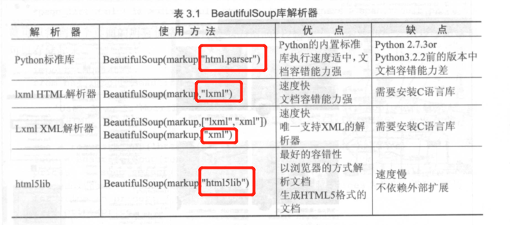
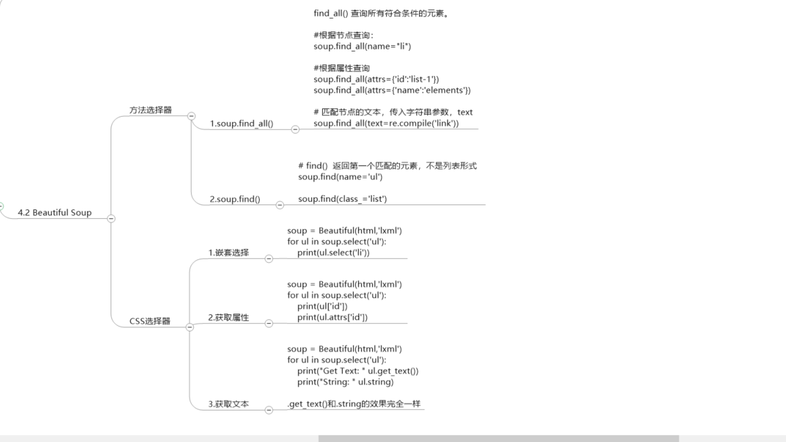

# 我的第一个爬虫程序

## requests 库
```
#!/usr/bin/env python
#-*- coding:utf8 -*-
import requests
headers = {
    'User-agent': 'Mozilla/5.0 (Windows NT 10.0; WOW64) AppleWebKit/537.36 '
                  '(KHTML, like Gecko) Chrome/68.0.3440.84 Safari/537.36'}
try:
    res = requests.get("https://www.cnblogs.com/",headers=headers)  #get方法加入请求头
    print(res.text)
except ConnectionError:
    print("拒绝连接")
```

request 介绍：
``` 
import requests  # 导入网络请求模块

#表单参数
data = {"word":"hello"}
# 发送网络请求
# response = requests.get("http://www.baidu.com/")
response = requests.post("http://httpbin.org/post",data)

print(response.status_code)
print(response.content.decode())

# # 打印状态码
# print("状态码：", response.status_code)
#
# # 打印请求地址
# print("请求地址", response.url)
#
# # 打印头部信息
# print("打印头部信息", response.headers)
# # 打印cookies信息
# print("cookie信息", response.cookies)
# # 打印文本源码
# print("打印文本源码", response.text)
#
# # 打印字节流源码
# print("打印字节码源码", response.content)


```


## BeautifulSoup 库






``` 
# BeautifuISoup 常用API

BeautifulSoup 中主要使用的对象是BeautifulSoup 实例， BeautifulS oup 常用方法如下。
。find-all(tagname) ： 根据标签名返回所有符合条件的元素列表。
。find(tagname) ： 根据标签名返回符合条件的第一个元素。
。select(selector): 通过CSS 中选择器查找符合条件的所有元素。
。get(key，default=None) ： 获取标签属性值， key 是标签属性名。


BeautifulSoup 常用属性如下。
。title ： 获得当前HTML 页面的title 属性值。
。text ：返回标签中的文本内容。
```


```
# 创建BeautifulSoup对象
soup = BeautifulSoup(html)

# 用本地的html创建对象
soup = BeautifulSoup(open('index.html'), 'lxml')            #提供本地HTML文件
```


BeautifulSoup的soup元素抓取工具
``` 
https://www.toolfk.com/tool-run-reptile
```


BeautifulSoup库官方推荐使用lxml作为解析器，因为效率更高。

```
#!/usr/bin/env python
#-*- coding:utf8 -*-
import requests
from bs4 import BeautifulSoup

headers = {
"user-agent": "Mozilla/5.0 (Windows NT 10.0; WOW64) AppleWebKit/537.36 "
              "(KHTML, like Gecko) Chrome/68.0.3440.84 Safari/537.36"}
res = requests.get("https://www.zhipin.com/c101200100-p100109/?page=2&ka=page-2", headers=headers)
soup = BeautifulSoup(res.text, "html.parser")             #对返回的结果进行解析
prices = soup.select("#main > div > div.job-list > ul > li > div > div.info-primary > h3 > a > span")
for price in prices:
    print(price.get_text())
    
    
```


用BeautifulSoup库操作解析HTML文档树
1.遍历文档树
```
Tag的.content属性可以将Tag的子节点以列表的方式输出。返回的是List

print(soup.body.contents)           #输出所有body的子节点
print(soup.body.contents[0])        #输出子节点的某一个元素


.children属性返回的不是List，是一个List生成器对象，可以通过遍历获取所有子节点
for child in soup.body.children:
    print(child)


.descendants属性获取所有子孙节点，.contents和.children属性仅包含Tag的直接子节点，
.descendants属性可以对所有Tag的子孙节点进行递归循环，和.children类似，需要遍历获取其中的内容。

for child in soup.descendants:
    print(child)
    
    
获取节点内容：
print(soup.title.string)        #输出<title>标签里面的内容
print(soup.body.string)


父节点
.parent属性用于获取父节点
p = soup.title
print(p.parent.name)            #输出父节点名Head
```


### 使用BeautifulSoup进行HTML解析
``` 
#!/usr/bin/env python
# -*- coding:utf8 -*-
# auther; 18793
# Date：2019/4/27 14:08
# filename: demo3.py
import requests
from bs4 import BeautifulSoup

respones = requests.get("http://news.baidu.com")

soup = BeautifulSoup(respones.text, features="lxml")
print(soup.find("title").text)
```

参考文献

[https://www.cnblogs.com/derek1184405959/p/8449682.html](https://www.cnblogs.com/derek1184405959/p/8449682.html)

eg
爬取小猪短租中的所有房价信息。
``` 
#!/usr/bin/env python
# -*- coding:utf8 -*-
# auther; 18793
# Date：2019/7/9 16:53
# filename: test01.py
import requests
from bs4 import BeautifulSoup

headers = {
    "User-Agent": "Mozilla/5.0 (Windows NT 10.0; Win64; x64) AppleWebKit/537.36 (KHTML, like Gecko) Chrome/75.0.3770.100 Safari/537.36"
}

res = requests.get("https://cq.xiaozhu.com/", headers=headers)
soup = BeautifulSoup(res.text, 'lxml')
# 定位元素位置并通过selector方法提取
prices = soup.select("#page_list > ul > li > div > div > span.result_price > i")


for price in prices:
    print(price.get_text())
```

