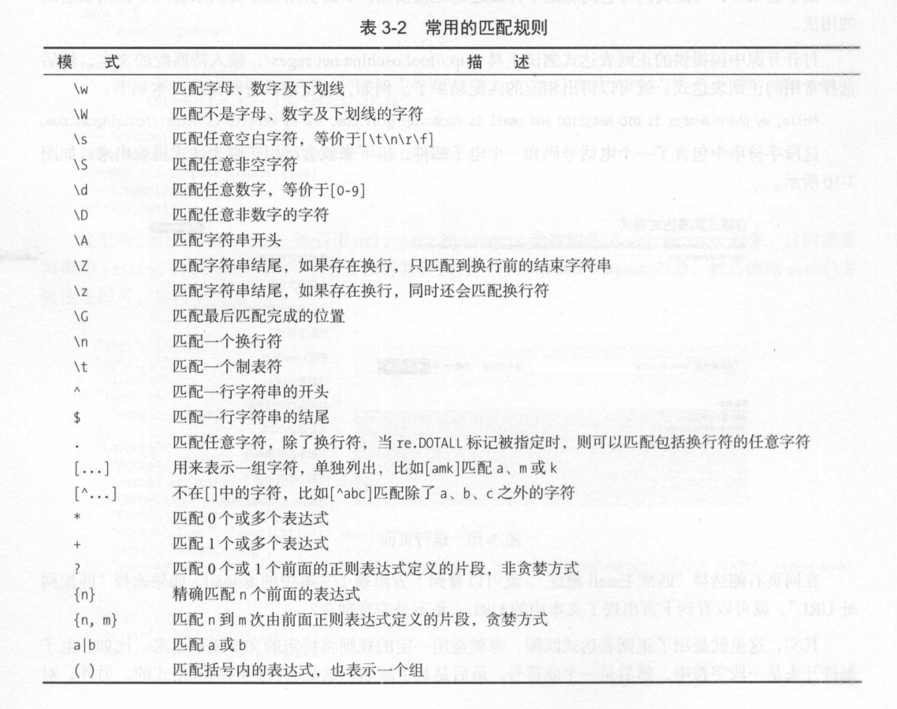

# 正则表达式


## 一般字符
```
.     #匹配任意单个字符（不包括换行符\n）
\     #转义字符
[...]  #字符集，对应字符集中的任意字符
```

## 预定义字符集
```
\d          #匹配一个数字，等价于[0-9]
\D          #匹配一个非数字，等价于[^0-9]
\s          #匹配任何空白字符，包括空格、制表符、换页符，等价于[\f\n\r\t\v]
\S          #匹配任何非空白字符，等价于[^\f\n\r\t\v]
\w          #匹配下画线的任何单词字符，等价于'[A-Za-z0-9]'
\W          #匹配任何非单词字符，等价于'[^A-Za-z0-9]'
```


## 数量词
```
*       #匹配一个字符0或无限次
+       #匹配一个字符1或无限次
？      #匹配前一个字符0或1次
{m}     #匹配前一个字符m次
{m,n}   #匹配前一个字符m至n次
```

## 边界匹配
```
^       #匹配字符串开头
$       #匹配字符串结尾
\A      #仅匹配字符串开头
\Z      #仅匹配字符串结尾

```

## 贪婪匹配和非贪婪匹配
```
import re
a = "xxxIxxxxxJSDHJJxxxlovexxxxxgjsfgshhdjhfxxxpythonxxxx"
info = re.findall("xxx(.*?)xxx",a)      #非贪婪
info1 = re.findall("xxx(.*)xxx",a)      #贪婪
print(info)
print(info1)
```

## 常用的正则表达式



`参考文献`
[https://www.jianshu.com/p/e102eea870c3](https://www.jianshu.com/p/e102eea870c3)

## 正则表达式爬虫示例

``` 
#!/usr/bin/env python
# -*- coding:utf8 -*-
# auther; 18793
# Date：2019/5/22 16:42
# filename: 正则表达式.py
import urllib.request

import os
import re

url = "http://699pic.com/zhuanti/liuyiertongjie.html"


def findallimageurl(htmlstr):
    '''
    从HTML代码中查找匹配的字符串
    :param htmlstr: url路径信息
    :return:
    '''
    pattern = r'http://\S+(?:\png|\.jpg)'
    return re.findall(pattern, htmlstr)


def getfilename(urlstr):
    '''
    根据图片链接地址截取图片名
    :param urlstr:
    :return:
    '''
    pos = urlstr.rfind('/')
    return urlstr[pos + 1:]


# 分析获取的url列表
url_list = []
req = urllib.request.Request(url)

with urllib.request.urlopen(req) as response:
    data = response.read()
    htmlstr = data.decode('gbk')

    url_list = findallimageurl(htmlstr)

for imagesrc in url_list:
    # 根据图片地址下载
    req = urllib.request.Request(imagesrc)
    with urllib.request.urlopen(req) as response:
        data = response.read()
        # 过滤掉小于10KB的图片
        if len(data) < 1024 * 100:
            continue

        # 创建download文件夹
        if not os.path.exists('download'):
            os.mkdir('download')

        # 获得图片文件名
        filename = getfilename(imagesrc)
        filename = 'download/' + filename

        # 保存图片到本地
        with open(filename, 'wb') as f:
            f.write(data)

    print("下载图片", filename)


```