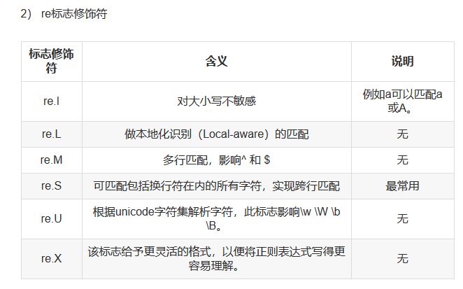

# re模块的常用方法

参考文献

https://blog.csdn.net/zwq912318834/article/details/78083673

## re.match()方法
```
##从字符串的第一个开始匹配

re.match(pattern, string, flags=0)
    1.pattern 为匹配的正则表达式
    2.string 为要匹配的字符串
    3.flags为标志位，用于控制正则表达式的匹配方式，是否区分大小写，多行匹配等
```

## re.serch()方法
``` 
##搜索整个字符串
re.search(pattern, string, flags=0)
    1.pattern 为匹配的正则表达式
    2.string 为要匹配的字符串
    3.flags为标志位，用于控制正则表达式的匹配方式，是否区分大小写，多行匹配等
```
举例
```
import re
a = "one1tow2three3"
infos = re.search("\d+",a)
print(infos.group())
```
## re.sub()方法
```
re.sub(pattern, repl, string, count=0, flags=0)
    1.pattern 为匹配的正则表达式
    2.repl为替换的字符串
    3.string要被查找替换的原始字符串
    4.count为模式匹配后替换的最大次数，默认0表示替换所有的匹配
    5.flags为标志位，用于控制正则表达式的匹配方式，是否区分大小写，多行匹配等
```

举例
```
import re
phone = '123-4567-1234'
new_phone = re.sub("\D", "", phone)     #将非数字-替换为空
print(new_phone)
```

## re.findall()方法
```
#匹配所有符合的内容，并以列表的形式返回
re.findall(pattern, string, flags=0)

```
举例
```
a = "one1tow2three3"
infos = re.findall("\d+",a)
print(infos)
```

## re模块装饰符
```
re.I    #使匹配大小写不敏感
re.L    #做本地化识别匹配
re.M    #多行匹配，影响^和$
re.S    #匹配包括换行在内的所有字符
re.U    #根据Unicode字符集解析字符，这个标志影响\w，\W，\b,\B.
re.X    #给与更灵活的格式
```



### 示例
```

#re.S    #匹配包括换行在内的所有字符
import re
a = '''<div>指数
</div>'''
word = re.findall('<div>(.*?)</div>', a ,re.S)
print(word[0].strip())
```

参考文献：
http://www.python88.cn/book/spider21/