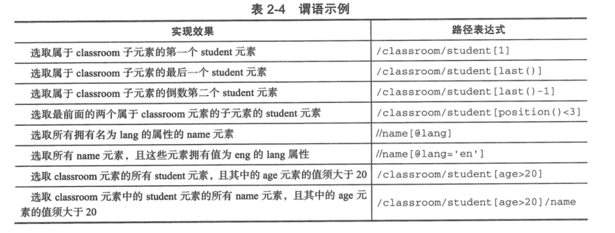
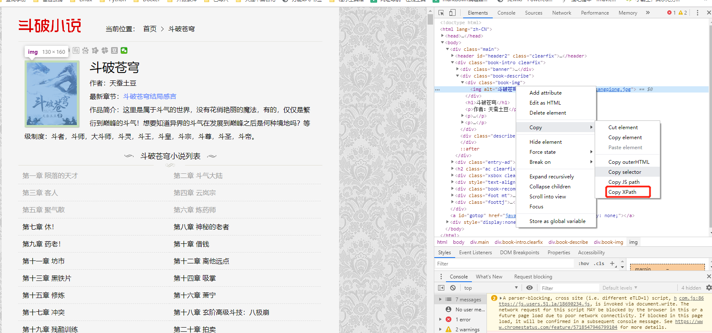

# Lxml库和Xpath语法

## Lxml库的安装
windows和Linux上安装Lxml库
```
pip install lxml
```

lxml中xpath测试网页元素抓取工具`XPathTools_jb51`,可以在网上下载用于调试程序。

或者网页版本的元素提取工具:

``` 
http://qqe2.com/tools/xpath

http://www.bejson.com/othertools/findelement/

```

* 还有一个Google插件`xpath-helper `

* Firefox插件 `XPath Checker`

参考文献：

https://blog.csdn.net/zwq912318834/article/details/78178316


## Lxml库的使用
``` 
#!/usr/bin/env python
# -*- coding:utf8 -*-
# auther; 18793
# Date：2019/7/10 21:07
# filename: 01.基础.py
from lxml import etree
import requests

'''
# 修正HTML代码
parser = etree.HTMLParser(encoding="utf-8")
html = etree.HTML("test001.html", parser=parser)
result = etree.tostring(html)
print(result)

# 读取HTML文件
parser = etree.HTMLParser(encoding="utf-8")
html = etree.parse("test001.html", parser=parser)
result = etree.tostring(html, pretty_print=True)
print(result)
'''

# 解析HTML文件

## 代理头文件
headers = {
    "User-Agent": "Mozilla/5.0 (Windows NT 10.0; Win64; x64) AppleWebKit/537.36 (KHTML, like Gecko) Chrome/75.0.3770.100 Safari/537.36"
}

url = "http://www.doupoxs.com/"
res = requests.get(url, headers=headers)
html = etree.HTML(res.text)
result = etree.tostring(html)
print(result)

```

## Xpath语法

### 1.父节点
user是name、sex、id、gold的父节点
``` 
<user>
    <name>hujianli</name>
    <sex> MAN </sex>
    <id>30</id>
    <gold>99</gold>
</user>

```

### 2.子节点
name、sex、id、glod是user的子节点
``` 
<user>
    <name>hujianli</name>
    <sex> MAN </sex>
    <id>30</id>
    <gold>99</gold>
</user>
```


### 3.同胞节点
name、sex、id、glod是同胞节点
```
<user>
    <name>hujianli</name>
    <sex> MAN </sex>
    <id>30</id>
    <gold>99</gold>
</user>
```

### 4.先辈节点
name的先辈节点是user和user-databse
``` 
<user-database>
<user>
    <name>hujianli</name>
    <sex> MAN </sex>
    <id>30</id>
    <gold>99</gold>
</user>
</user-database>
```
### 5.后代节点
user-database 的后代节点是user、name、sex、id、gold
``` 
<user-database>
<user>
    <name>hujianli</name>
    <sex> MAN </sex>
    <id>30</id>
    <gold>99</gold>
</user>
</user-database>
```


### 节点的选择


根据上面的例子举例


xpath语法中的位于用来查找某个特定的节点或者包含某个指定值的节点。谓语被嵌套在方括号中。





xpath中也可以使用通配符来选取位置的元素，常用的就是“*”通配符，它可以匹配任何元素节点。


xtpath路径在chrom中，可以右键复制得到，如下图：



例子：
``` 
<html>
    <head>
        <title>这是标题</title>
    </head>
    <body>
        <div class="cn_search_engine">
            <a href="http://www.baidu.com">百度</a>
        </div>
        <div class="other_search_engine">
            <a href="http://www.bing.com">Bing</a>
            <a href="http://www.google.com">Google</a>
        </div>
    </body>
</html>
```
``` 
"//"和"/"的区别
两者都用来表示一个节点的路径，不同节点名用“/”分开

//代表相对路径，匹配可以是任意深度的节点
/ 代表绝对路径，故对于网页来说，匹配从/html开始
```


```` 
##语句一:
dom_tree.xpath('/html/body/div/a/@href')

##语句二：
dom_tree.xpath('//div/a/@href')


获取元素属性和文字的区别
dom_tree.xpath('//div/a/@href')
#将返回所有的链接网址

dom_tree.xpath('//div/a/text()')
#将获取所有链接的名称

````


举例如下：

获取糗事百科中用户的id信息
``` 
#!/usr/bin/env python
# -*- coding:utf8 -*-
# auther; 18793
# Date：2019/7/10 21:35
# filename: 02.使用xpath获取简单元素.py
import requests
from lxml import etree

headers = {
    "User-Agent": "Mozilla/5.0 (Windows NT 10.0; Win64; x64) AppleWebKit/537.36 (KHTML, like Gecko) Chrome/75.0.3770.100 Safari/537.36"
}

url = "https://www.qiushibaike.com/text/"
res = requests.get(url, headers=headers)
parser = etree.HTMLParser(encoding="utf-8")
selector = etree.HTML(res.text, parser=parser)
id = selector.xpath("//*[@id=\"qiushi_tag_121978518\"]/div[1]/a[2]/h2/text()")  # 通过/text()可以获取标签中的文字信息
print(id)
```
输出结果：
``` 
['\n缺个老婆好多年了\n']
```

获取的结果为列表，可以通过切片获得字符串数据结构。
``` 
id = selector.xpath("//*[@id=\"qiushi_tag_121978518\"]/div[1]/a[2]/h2/text()")[0]  #
```
输出结果：
```
缺个老婆好多年了
```

批量抓取数据时，采用“先抓大后抓小，寻找循环点。”

如下：
```
#!/usr/bin/env python
# -*- coding:utf8 -*-
# auther; 18793
# Date：2019/7/10 21:54
# filename: 03.使用xpath批量爬取数据.py

import requests
from lxml import etree

headers = {
    "User-Agent": "Mozilla/5.0 (Windows NT 10.0; Win64; x64) AppleWebKit/537.36 (KHTML, like Gecko) Chrome/75.0.3770.100 Safari/537.36"
}

url = "https://www.qiushibaike.com/text/"
res = requests.get(url, headers=headers)
selector = etree.HTML(res.text)
url_infos = selector.xpath('//div[@class="article block untagged mb15 typs_hot"]')
for url_info in url_infos:
    id = url_info.xpath("div[1]/a[2]/h2/text()")[0]
    print(id)

# //*[@id="qiushi_tag_121978518"]/div[1]/a[2]/h2
# //*[@id="qiushi_tag_121978518"]
```

### 当遇到相同的字符开头的多个标签时。可以通过starts-with()获取多个标签的内容
``` 
#!/usr/bin/env python
# -*- coding:utf8 -*-
# auther; 18793
# Date：2019/7/10 22:06
# filename: test-hu.py

import requests
from lxml import etree
html1 = """
<!DOCTYPE html>
<html lang="en">
<head>
    <meta charset="UTF-8">
    <title>Title</title>
</head>
<body>
<li class="tag-1">需要的内容1</li>
<li class="tag-2">需要的内容2</li>
<li class="tag-3">需要的内容3</li>

</body>
</html>
"""
selector = etree.HTML(html1)                                                    # 直接读取html文件内容              
# selecctor = etree.HTML(open("test-hu01.html", encoding="utf-8").read())       #打开html文件进行爬取过滤
contenrs = selector.xpath('//li[starts-with(@class,"tag")]/text()')             # starts-with()可以获取类似标签的信息
for content in contenrs:
    print(content)  # starts-with()可以获取类似标签的信息

# /html/body/li[1]
```

输出内容
``` 
需要的内容1
需要的内容2
需要的内容3

```

### 属性多值匹配

``` 
#!/usr/bin/env python
#-*- coding:utf8 -*-
# auther; 18793
# Date：2019/8/20 13:50
# filename: 04.属性多值匹配.py
from lxml import etree

text = '''
<li class="li li-first"><a href="link.html"> first item</a><li>
'''

html = etree.HTML(text)
result = html.xpath('//li[contains(@class,"li")]/a/text()')
print(result)
```

输出信息如下：
``` 
[' first item']
```


### 多属性匹配
``` 
#!/usr/bin/env python
# -*- coding:utf8 -*-
# auther; 18793
# Date：2019/8/20 13:50
# filename: 04.属性多值匹配.py
from lxml import etree

text = '''
<li class="li li-first" name="item"><a href="link.html"> first item</a><li>
'''

html = etree.HTML(text)
result = html.xpath('//li[contains(@class,"li") and @name="item"]/a/text()')
print(result)

```

输出信息
``` 
[' first item']

```

### 当遇到嵌套标签的时候，可以通过string(.)完成。如下：

test-hu02.html
``` 
<!DOCTYPE html>
<html lang="en">
<head>
    <meta charset="UTF-8">
    <title>Title</title>
</head>
<body>
<div class="red">需要的内容1

    <h1>需要的内容2</h1>
</div>

</body>
</html>
```


``` 
#!/usr/bin/env python
# -*- coding:utf8 -*-
# auther; 18793
# Date：2019/7/10 22:21
# filename: test-hu02.py
import requests
from lxml import etree

selector = etree.HTML(open("test-hu02.html", encoding="utf-8").read())
content1 = selector.xpath('//div[@class="red"]')[0]

content2 = content1.xpath('string(.)')
print(content2)

```

输出内容
```
需要的内容1

    需要的内容2
```