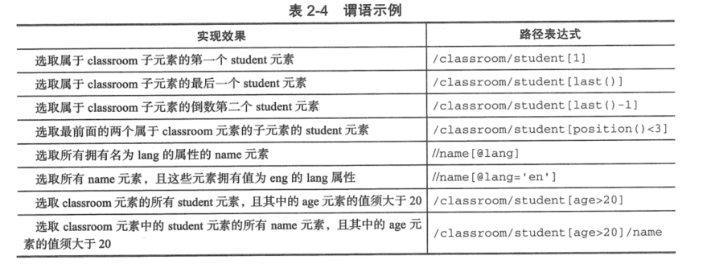
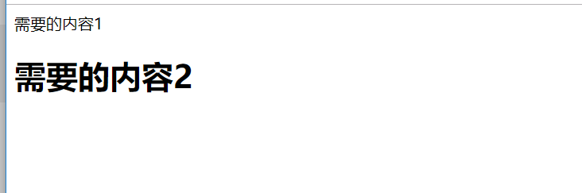
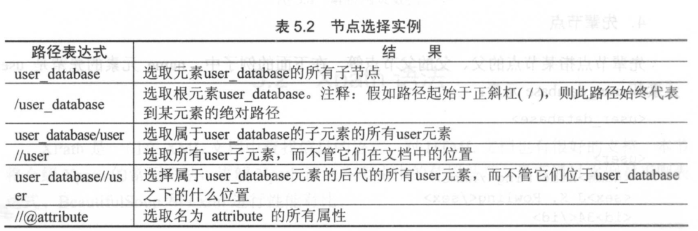
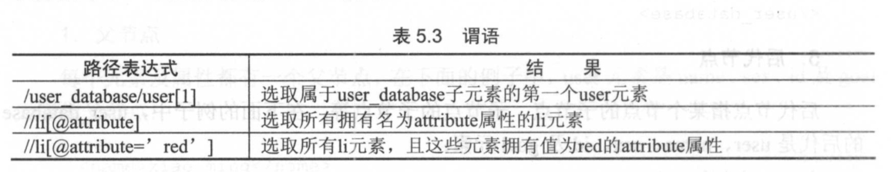
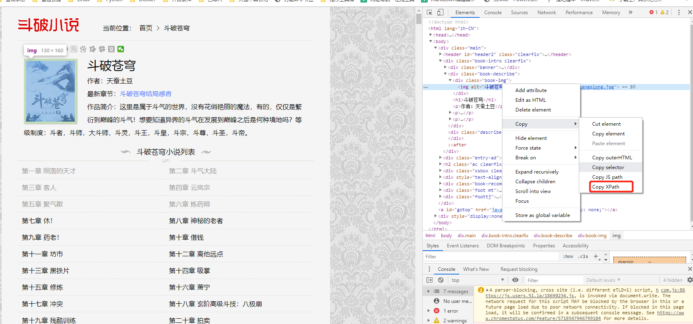

.. contents::
   :depth: 3
..

Lxml库和Xpath语法
=================

Lxml库的安装
------------

windows和Linux上安装Lxml库

::

   pip install lxml

lxml中xpath测试网页元素抓取工具\ ``XPathTools_jb51``,可以在网上下载用于调试程序。

或者网页版本的元素提取工具:

::

   http://qqe2.com/tools/xpath

   http://www.bejson.com/othertools/findelement/

-  还有一个Google插件\ ``xpath-helper``

-  Firefox插件 ``XPath Checker``

参考文献：

https://blog.csdn.net/zwq912318834/article/details/78178316

Lxml库的使用
------------

::

   #!/usr/bin/env python
   # -*- coding:utf8 -*-
   # auther; 18793
   # Date：2019/7/10 21:07
   # filename: 01.基础.py
   from lxml import etree
   import requests

   '''
   # 修正HTML代码
   parser = etree.HTMLParser(encoding="utf-8")
   html = etree.HTML("test001.html", parser=parser)
   result = etree.tostring(html)
   print(result)

   # 读取HTML文件
   parser = etree.HTMLParser(encoding="utf-8")
   html = etree.parse("test001.html", parser=parser)
   result = etree.tostring(html, pretty_print=True)
   print(result)
   '''

   # 解析HTML文件

   ## 代理头文件
   headers = {
       "User-Agent": "Mozilla/5.0 (Windows NT 10.0; Win64; x64) AppleWebKit/537.36 (KHTML, like Gecko) Chrome/75.0.3770.100 Safari/537.36"
   }

   url = "http://www.doupoxs.com/"
   res = requests.get(url, headers=headers)
   html = etree.HTML(res.text)
   result = etree.tostring(html)
   print(result)

Xpath语法
---------

1.父节点
~~~~~~~~

user是name、sex、id、gold的父节点

::

   <user>
       <name>hujianli</name>
       <sex> MAN </sex>
       <id>30</id>
       <gold>99</gold>
   </user>

2.子节点
~~~~~~~~

name、sex、id、glod是user的子节点

::

   <user>
       <name>hujianli</name>
       <sex> MAN </sex>
       <id>30</id>
       <gold>99</gold>
   </user>

3.同胞节点
~~~~~~~~~~

name、sex、id、glod是同胞节点

::

   <user>
       <name>hujianli</name>
       <sex> MAN </sex>
       <id>30</id>
       <gold>99</gold>
   </user>

4.先辈节点
~~~~~~~~~~

name的先辈节点是user和user-databse

::

   <user-database>
   <user>
       <name>hujianli</name>
       <sex> MAN </sex>
       <id>30</id>
       <gold>99</gold>
   </user>
   </user-database>

5.后代节点
~~~~~~~~~~

user-database 的后代节点是user、name、sex、id、gold

::

   <user-database>
   <user>
       <name>hujianli</name>
       <sex> MAN </sex>
       <id>30</id>
       <gold>99</gold>
   </user>
   </user-database>

节点的选择
~~~~~~~~~~

.. image:: ../../_static/xpath-jiedianchoice001.png

根据上面的例子举例 |image1|

xpath语法中的位于用来查找某个特定的节点或者包含某个指定值的节点。谓语被嵌套在方括号中。
|image2|

xpath中也可以使用通配符来选取位置的元素，常用的就是“*”通配符，它可以匹配任何元素节点。

xtpath路径在chrom中，可以右键复制得到，如下图： |image3|

例子：

::

   <html>
       <head>
           <title>这是标题</title>
       </head>
       <body>
           

               <a href="http://www.baidu.com">百度</a>
           

           

               <a href="http://www.bing.com">Bing</a>
               <a href="http://www.google.com">Google</a>
           

       </body>
   </html>

::

   "//"和"/"的区别
   两者都用来表示一个节点的路径，不同节点名用“/”分开

   //代表相对路径，匹配可以是任意深度的节点
   / 代表绝对路径，故对于网页来说，匹配从/html开始

::

   ##语句一:
   dom_tree.xpath('/html/body/div/a/@href')

   ##语句二：
   dom_tree.xpath('//div/a/@href')

   获取元素属性和文字的区别
   dom_tree.xpath('//div/a/@href')
   #将返回所有的链接网址

   dom_tree.xpath('//div/a/text()')
   #将获取所有链接的名称

举例如下：

获取糗事百科中用户的id信息

::

   #!/usr/bin/env python
   # -*- coding:utf8 -*-
   # auther; 18793
   # Date：2019/7/10 21:35
   # filename: 02.使用xpath获取简单元素.py
   import requests
   from lxml import etree

   headers = {
       "User-Agent": "Mozilla/5.0 (Windows NT 10.0; Win64; x64) AppleWebKit/537.36 (KHTML, like Gecko) Chrome/75.0.3770.100 Safari/537.36"
   }

   url = "https://www.qiushibaike.com/text/"
   res = requests.get(url, headers=headers)
   parser = etree.HTMLParser(encoding="utf-8")
   selector = etree.HTML(res.text, parser=parser)
   id = selector.xpath("//*[@id=\"qiushi_tag_121978518\"]/div[1]/a[2]/h2/text()")  # 通过/text()可以获取标签中的文字信息
   print(id)

输出结果：

::

   ['\n缺个老婆好多年了\n']

获取的结果为列表，可以通过切片获得字符串数据结构。

::

   id = selector.xpath("//*[@id=\"qiushi_tag_121978518\"]/div[1]/a[2]/h2/text()")[0]  #

输出结果：

::

   缺个老婆好多年了

批量抓取数据时，采用“先抓大后抓小，寻找循环点。”

如下：

::

   #!/usr/bin/env python
   # -*- coding:utf8 -*-
   # auther; 18793
   # Date：2019/7/10 21:54
   # filename: 03.使用xpath批量爬取数据.py

   import requests
   from lxml import etree

   headers = {
       "User-Agent": "Mozilla/5.0 (Windows NT 10.0; Win64; x64) AppleWebKit/537.36 (KHTML, like Gecko) Chrome/75.0.3770.100 Safari/537.36"
   }

   url = "https://www.qiushibaike.com/text/"
   res = requests.get(url, headers=headers)
   selector = etree.HTML(res.text)
   url_infos = selector.xpath('//div[@class="article block untagged mb15 typs_hot"]')
   for url_info in url_infos:
       id = url_info.xpath("div[1]/a[2]/h2/text()")[0]
       print(id)

   # //*[@id="qiushi_tag_121978518"]/div[1]/a[2]/h2
   # //*[@id="qiushi_tag_121978518"]

当遇到相同的字符开头的多个标签时。可以通过starts-with()获取多个标签的内容
~~~~~~~~~~~~~~~~~~~~~~~~~~~~~~~~~~~~~~~~~~~~~~~~~~~~~~~~~~~~~~~~~~~~~~~~~

::

   #!/usr/bin/env python
   # -*- coding:utf8 -*-
   # auther; 18793
   # Date：2019/7/10 22:06
   # filename: test-hu.py

   import requests
   from lxml import etree
   html1 = """
   <!DOCTYPE html>
   <html lang="en">
   <head>
       <meta charset="UTF-8">
       <title>Title</title>
   </head>
   <body>
   <li class="tag-1">需要的内容1</li>
   <li class="tag-2">需要的内容2</li>
   <li class="tag-3">需要的内容3</li>

   </body>
   </html>
   """
   selector = etree.HTML(html1)                                                    # 直接读取html文件内容              
   # selecctor = etree.HTML(open("test-hu01.html", encoding="utf-8").read())       #打开html文件进行爬取过滤
   contenrs = selector.xpath('//li[starts-with(@class,"tag")]/text()')             # starts-with()可以获取类似标签的信息
   for content in contenrs:
       print(content)  # starts-with()可以获取类似标签的信息

   # /html/body/li[1]

输出内容

::

   需要的内容1
   需要的内容2
   需要的内容3

属性多值匹配
~~~~~~~~~~~~

::

   #!/usr/bin/env python
   #-*- coding:utf8 -*-
   # auther; 18793
   # Date：2019/8/20 13:50
   # filename: 04.属性多值匹配.py
   from lxml import etree

   text = '''
   <li class="li li-first"><a href="link.html"> first item</a><li>
   '''

   html = etree.HTML(text)
   result = html.xpath('//li[contains(@class,"li")]/a/text()')
   print(result)

输出信息如下：

::

   [' first item']

多属性匹配
~~~~~~~~~~

::

   #!/usr/bin/env python
   # -*- coding:utf8 -*-
   # auther; 18793
   # Date：2019/8/20 13:50
   # filename: 04.属性多值匹配.py
   from lxml import etree

   text = '''
   <li class="li li-first" name="item"><a href="link.html"> first item</a><li>
   '''

   html = etree.HTML(text)
   result = html.xpath('//li[contains(@class,"li") and @name="item"]/a/text()')
   print(result)

输出信息

::

   [' first item']

当遇到嵌套标签的时候，可以通过string(.)完成。如下：
~~~~~~~~~~~~~~~~~~~~~~~~~~~~~~~~~~~~~~~~~~~~~~~~~~~

test-hu02.html

::

   <!DOCTYPE html>
   <html lang="en">
   <head>
       <meta charset="UTF-8">
       <title>Title</title>
   </head>
   <body>
   
需要的内容1

       <h1>需要的内容2</h1>
   

   </body>
   </html>

::

   #!/usr/bin/env python
   # -*- coding:utf8 -*-
   # auther; 18793
   # Date：2019/7/10 22:21
   # filename: test-hu02.py
   import requests
   from lxml import etree

   selector = etree.HTML(open("test-hu02.html", encoding="utf-8").read())
   content1 = selector.xpath('//div[@class="red"]')[0]

   content2 = content1.xpath('string(.)')
   print(content2)

输出内容

::

   需要的内容1

       需要的内容2

