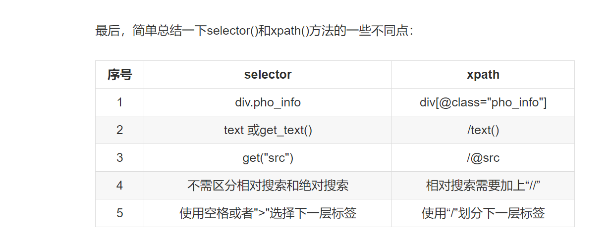

# 3种爬虫模式性能对比

## 举例1
```
#!/usr/bin/env python
# -*- coding:utf8 -*-
# auther; 18793
# Date：2019/7/12 16:01
# filename: 3种爬虫模式对比.py

# 爬取数据只做返回，不存储
import requests
import re
from bs4 import BeautifulSoup
from lxml import etree
import time

# 加入请求头
headers = {
    "User-Agent": "Mozilla/5.0 (Windows NT 10.0; Win64; x64) AppleWebKit/537.36 (KHTML, like Gecko) Chrome/75.0.3770.100 Safari/537.36"
}

urls = ["https://www.qiushibaike.com/text/page/{}".format(str(i)) for i in range(1, 5)]  # 构造url


def re_scraper(url):
    '''
    :param url:
    :return:  正则爬取的时间
    '''
    res = requests.get(url,headers=headers)
    ids = re.findall("<h2>(.*?)</h2>", res.text, re.S)
    contents = re.findall('<div class="content">.*?<span>(.*?)</span>', res.text, re.S)
    laughs = re.findall('<span class="stats-vote"><i class="number">(\d+)</i> 好笑</span>', res.text, re.S)
    comments = re.findall('<i class="number">(\d+)</i> 评论', res.text, re.S)
    for id, content, laugh, comment in zip(ids, contents, laughs, comments):
        info = {
            "id": id,
            "content": content,
            "laugh": laugh,
            "comment": comments[0]
        }
    return info


def bs_scraper(url):
    '''

    :param url: Beautifulsoup爬取时间
    :return:
    '''
    res = requests.get(url, headers=headers)
    soup = BeautifulSoup(res.text, 'lxml')
    ids = soup.select(" a > h2")
    contents = soup.select("div > span")
    laughs = soup.select("span.stats-vote > i")
    comments = soup.select("i.number")
    for id, content, laugh, comment in zip(ids, contents, laughs, comments):
        info = {
            'id': id.get_text(),
            'content': content.get_text(),
            'laugh': laugh.get_text(),
            'comment': comment.get_text()
        }
    return info


def lxml_scraper(url):
    '''
    :param url:
    :return:lxml爬虫爬取时间
    '''
    res = requests.get(url, headers=headers)
    selector = etree.HTML(res.text)
    url_infos = selector.xpath('//div[@class="article block untagged mb15 typs_hot"]')
    try:
        for url_info in url_infos:
            id = url_info.xpath("div[1]/a[2]/h2/text()")[0]
            content = url_info.xpath("a[1]/div/span/text()")[0]
            laugh = url_info.xpath("div[2]/span[1]/i/text()")[0]
            comment = url_info.xpath("div[2]/span[2]/a/i/text()")[0]

        info = {
            "id": id,
            "content": content,
            "laugh": laugh,
            "comment": comment
        }
        return info
    except IndexError:
        pass  # 异常忽略掉


if __name__ == '__main__':
    for name, scraper in [("RE_exoressions", re_scraper), ("BeautifulSoup", bs_scraper), ("Lxml", lxml_scraper)]:
        start = time.time()
        for url in urls:
            scraper(url)
        end = time.time()
        print(name, end - start)


```

### 输出结果
```
C:\Users\18793\Anaconda3\python.exe D:/GitHub/爬虫学习/3.第一个爬虫程序/3种爬虫方式的性能比较.py
RE_exoressions 3.148746967315674
BeautifulSoup 3.109945297241211
Lxml 2.79829740524292

```


## 举例2

`re、Beautifulsoup、lxml三种方式爬取酷狗音乐飙升榜`

``` 
#!/usr/bin/env python
# -*- coding:utf8 -*-
# auther; 18793
# Date：2019/7/10 23:45
# filename: 爬取酷狗音乐飙升榜.py
import requests
from bs4 import BeautifulSoup
import time
import re
from lxml import etree

"""
使用3种方式爬取酷狗音乐的飙升榜

"""

url = "https://www.kugou.com/yy/html/rank.html"


def get_html(url):
    headers = {
        "user-agent": "Mozilla/5.0 (Windows NT 10.0; Win64; x64) AppleWebKit/537.36 (KHTML, like Gecko) Chrome/75.0.3770.100 Safari/537.36"
    }
    try:
        response = requests.get(url, headers=headers)
        html = response.text
        return html
    except:
        print("request error")


def Re_serach(url):
    """
    使用re正则抓取酷狗音乐
    :param url:
    :return:
    """
    html_info = get_html(url)
    info1 = re.compile('<li class=" " title="(.*?)">')
    music_html = re.compile('<a href="(.*?)" data-active="playDwn" data-index="\d"')
    music_info_all = info1.findall(html_info, re.S)
    music_songs = music_html.findall(html_info, re.S)
    for music, music_song in zip(music_info_all, music_songs):
        info = {
            "歌曲排名:": str(music).split("data-index=\"")[1],
            "歌名": str(music).split("data-index=\"")[0],
            "播放链接：": music_song
        }
        print(info)


def Beautifulsoup_search(url):
    """
    使用Beautifulsoup抓取酷狗
    :param url:
    :return:
    """
    html_info = get_html(url)
    soup = BeautifulSoup(html_info, "lxml")
    song_ids = soup.select("#rankWrap > div.pc_temp_songlist.pc_rank_songlist_short > ul > li > a")
    # print(song_ids)
    # song_ids = soup.select("#rankWrap > div.pc_temp_songlist.pc_rank_songlist_short > ul > li > a")
    # song_id = re.findall("\"\d\"", str(song_id))
    song_names = soup.select("#rankWrap > div.pc_temp_songlist.pc_rank_songlist_short > ul > li > a")
    URL_songs = soup.select("#rankWrap > div.pc_temp_songlist.pc_rank_songlist_short > ul > li > a")

    for song_id, song_name, URL_song in zip(song_ids, song_names, URL_songs):
        data = {
            "歌曲排行": int(song_id.get("data-index")) + 1,
            "歌曲名称": song_name.get_text().strip(),
            "歌曲链接": URL_song.get("href")
        }
        print(data)


def Xapth_select(url):
    """
    :param url:
    :return:lxml爬虫爬取
    """
    
    html = get_html(url)
    selector = etree.HTML(html)
    url_infos = selector.xpath('//*[@id="rankWrap"]/div[2]')
    for urlinfo in url_infos:
        song_names = urlinfo.xpath('ul/li/a/text()')
        ids = urlinfo.xpath('ul/li/span[3][@ class="pc_temp_num"]/text()')
        ids = [str(id).strip("\t").strip("\r").strip("\n").strip() for id in ids]
        idss = [id for id in ids if id]
        song_links = urlinfo.xpath('ul/li/a/@href')

        for songnam, id, song_link in zip(song_names, idss, song_links):
            data = {
                "歌曲名称": songnam,
                "歌曲排名": int(id) - 3,
                "歌曲链接": song_link
            }
            print(data)


if __name__ == '__main__':
    # Re_serach(url)
    # Beautifulsoup_search(url)
    Xapth_select(url)


```

### 总结
- 正则  使用困难，性能快，需要安装内置re模块
- Beautifulsoup  使用简单，速度性能慢，安装简单
- Lxml     性能快、使用简单，安装相对困难

```
当网页结构简单并且想要避免额外依赖的话(不需要安装库),使用正则表达式更为合适。
当需要爬取的数据量较少时,使用较慢的BeautifulSoup 也不成问题。
当数据量大,需要追求效益时,Lxml是最好的选择。
```

