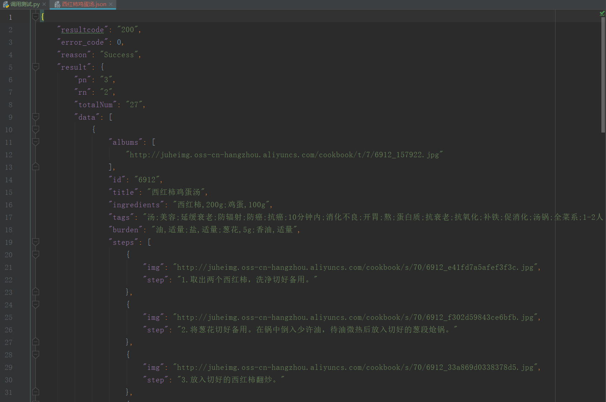
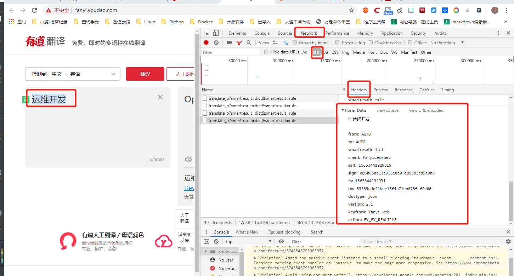

# 使用API

## POST、PUT方法
``` 
1· POST 方法就是填写表单或提交信息时所做的事情， 如登录一个网址， 使用的便是
POST方法。
2· PUT 方法在API 里有时会用到。PUT请求是用来更新一个对象或信息。对于老用
户的个人信息进行更新时就会用到PUT方法。
3· DELETE 方法用于删除一个对象， 但在公共API 中并不常见， 毕竟一个公司不会让
其他人随便地删除数据库中的信息。
```

## 解析Json数据
``` 
#!/usr/bin/env python
# -*- coding:utf8 -*-
# auther; 18793
# Date：2019/7/12 16:34
# filename: 02.解析JSON库.py
import json

jsonstring = '{"user_man":[{"name":"Perter"},{"name":"xiaohu"}],' \
             '"user_woman":[{"name":"andi"},{"name":"zhangsan"}]}'


json_data = json.loads(jsonstring)
print(json_data.get("user_man"))
print(json_data.get("user_woman"))
print(json_data.get("user_man")[0].get("name"))
print(json_data.get("user_woman")[1].get("name"))
print()
print(json_data.get("user_woman")[1]["name"])
print(json_data.get("user_man")[0]["name"])

```

输出信息：
``` 
[{'name': 'Perter'}, {'name': 'xiaohu'}]
[{'name': 'andi'}, {'name': 'zhangsan'}]
Perter
zhangsan

zhangsan
Perter
```


## 使用JSON API免费接口查询信息

http://www.bejson.com/knownjson/webInterface/

`聚合数据API入口`

https://www.juhe.cn/

```
#!/usr/bin/env python
# -*- coding:utf8 -*-
# auther; 18793
# Date：2019/7/12 21:52
# filename: 调用测试.py
import requests
import json
import pprint

shop_name = input("请输入商品名称：")
url = "http://suggest.taobao.com/sug?code=utf-8&q={}&callback=cb".format(shop_name)
res = requests.get(url)
res = res.text.replace("cb(", "").replace(")", "")
json_data = json.loads(res)
pprint.pprint(json_data)

```

输出信息
``` 

请输入商品名称：手机
{'result': [['手机壳', '4947514.056456573'],
            ['手机壳苹果x', '850054.4360219479'],
            ['手机壳苹果', '1364618.3711661247'],
            ['手机壳苹果xmax', '679602.8614586157'],
            ['手机包', '4472144.733740886'],
            ['手机壳苹果8plus', '1464863.950425368'],
            ['手机包女斜挎', '1244778.9998044153'],
            ['手机壳苹果7plus', '948602.4724484907'],
            ['手机包包 女包 新款2019', '252956.53722329382'],
            ['手机壳xr', '997560.3360825442']]}
```

## 使用聚合数据API入口查询菜谱大全
``` 
#!/usr/bin/env python
# -*- coding:utf8 -*-
# auther; 18793
# Date：2019/7/12 21:52
# filename: 调用测试.py
import requests
import json
import pprint


caipu_name = input("请输入菜谱名称：")
key = "ae17f16ecb87ff3f76e87695ae709496"
url = "http://apis.juhe.cn/cook/query?key={0}&menu={1}&rn=2&pn=3".format(key, caipu_name)
res = requests.get(url)
json_data = json.loads(res.text)

# pprint.pprint(json_data)

# 写入json数据
with open("西红柿鸡蛋汤.json", "w", encoding="utf-8") as f:
    json.dump(json_data, f, indent=4, ensure_ascii=False)

```

输出信息：


## 调用API接口查询天气
``` 
#!/usr/bin/env python
# -*- coding:utf8 -*-
# auther; 18793
# Date：2019/7/13 11:13
# filename: 03.调用api接口查询全国天气.py
import requests
import json
import pprint

key = "91536efa9a578f9b33318278dc711eb5"
city_weather = input("请输入查询的城市：")
url = "http://v.juhe.cn/weather/index?format=2&cityname={0}&key={1}".format(city_weather, key)

res = requests.get(url)
json_data = json.loads(res.text)

with open("武汉天气.json", "w", encoding="utf-8") as f:
    json.dump(json_data, f, ensure_ascii=False, indent=4)

with open("武汉天气.json", "r", encoding="utf-8") as f:
    json_info = json.load(f)
    print(json_info)

```

输出信息：


``` 
天气获取接口
https://www.apiopen.top/weatherApi?city=成都
```

```
随机推荐段子（包含文字、图片、GIF、视频）：
https://www.apiopen.top/satinApi?type=1&page=1

接口传参说明：
type=1    : 全部
type=2 : 文字
type=3 : 图片
type=4 : 视频
page=1:页码

当page=0时，会随机返回一页数据，page>=1时会返回相应页码的数据，图片包含GIF，is_gif 字段判断。
返回type备注：
type=1 : 全部
type=41 : 视频
type=10 : 图片
type=29 : 段子
type=31 : 声音

```

## 有道词典的API
``` 
#!/usr/bin/env python
#-*- coding:utf8 -*-
# auther; 18793
# Date：2019/7/13 14:07
# filename: 使用有道翻译的api.py

import requests
import json
import pprint

translate = input("请要翻译的词语：")
url = "http://fanyi.youdao.com/translate?&doctype=json&type=AUTO&i={}".format(translate)

res = requests.get(url)
json_data = json.loads(res.text)
translate_json_data = json_data["translateResult"][0][0]["tgt"]

with open("翻译.json", "w", encoding="utf-8") as f:
    json.dump(translate_json_data, f, ensure_ascii=False, indent=4)

with open("翻译.json", "r", encoding="utf-8") as f:
    json_info = json.load(f)
    print(translate_json_data)


type的类型有：

ZH_CN2EN 中文　»　英语
ZH_CN2JA 中文　»　日语
ZH_CN2KR 中文　»　韩语
ZH_CN2FR 中文　»　法语
ZH_CN2RU 中文　»　俄语
ZH_CN2SP 中文　»　西语
EN2ZH_CN 英语　»　中文
JA2ZH_CN 日语　»　中文
KR2ZH_CN 韩语　»　中文
FR2ZH_CN 法语　»　中文
RU2ZH_CN 俄语　»　中文
SP2ZH_CN 西语　»　中文
```


### 直接使用网页post访问有道云翻译

``` 
#!/usr/bin/env python
# -*- coding:utf8 -*-
# auther; 18793
# Date：2019/8/9 17:50
# filename: 06.使用有道云翻译API.py
import requests
import json


def translate_date(world=None):
    url = 'http://fanyi.youdao.com/translate'

    Form_data = {
        'i': world,
        'from': 'AUTO',
        'to': 'AUTO',
        'smartresult': 'dict',
        'client': 'fanyideskweb',
        'salt': '15653441929319',
        'sign': 'e06b85ab13b925e8a0fd85383c85e9b8',
        'ts': '1565344192931',
        'bv': '53539dde41bde18f4a71bb075fcf2e66',
        'doctype': 'json',
        'version': '2.1',
        'keyfrom': 'fanyi.web',
        'action': 'FY_BY_REALTlME'
    }

    response = requests.post(url, data=Form_data)
    content = json.loads(response.text)
    print(content['translateResult'][0][0]['tgt'])


if __name__ == '__main__':
    translate_date("运维开发")

```



### 查询身份证的API
``` 
#!/usr/bin/env python
#-*- coding:utf8 -*-
# auther; 18793
# Date：2019/7/25 14:03
# filename: ID_Card验证.py
import requests
import json
import pprint

key = "d3cbaa24a5ebc4e885da53e7b7f8f028"

id_card = "420981199407226517"
url = r'http://apis.juhe.cn/idcard/index?key={0}&cardno={1}'.format(key,id_card)

res = requests.get(url)
json_data = json.loads(res.text)
pprint.pprint(json_data)
```


### 使用Facebook API收集粉丝专页PO文
``` 
# -*- coding: utf-8 -*-
"""
使用Facebook API收集粉丝专页PO文
JSON格式
"""

import urllib.request as ur

access_token="EAACEdEose0cBAOr9JdbNwSpBGdOeKgZCuWn24wXsqr3xnZA1taleuSRJW7UnSr3qt0mxBTkgjI6t4Cna2H7sXyOA9mZAyZAGv77NkZAxmf0WrbhfZCZBIkRBZATv6AE5rTUtsEgfpdY2f2hDUc9hb0iG1OTPY8rT1Vxhg24cvPnwBUruWletfw0zDZA8ZBGOO7N7IZD"
access_id="368113116692686"

urls = "https://graph.facebook.com/v2.11/{}/posts?limit=2&access_token={}".format(access_id,access_token)

with ur.urlopen(urls) as response:
    s=response.read()

import json
r = json.loads(s)
r_data=r['data']

for i in range(len(r_data)):
    print("{0}\n{1}\n".format(r_data[i]["created_time"],r_data[i]["message"]))
```


### 爬取煎蛋网的图片下载到本地
``` 
#!/usr/bin/env python
# -*- coding:utf8 -*-
# auther; 18793
# Date：2019/7/13 13:34
# filename: 04.爬取煎蛋网图片.py
import requests
from lxml import etree

urls = ["http://jandan.net/zoo/page-{}".format(str(i)) for i in range(1, 20)]
# url = "http://jandan.net/zoo/page-1"

path = "D://GitHub/21_staduy_python/19.框架学习/爬虫学习/01.爬虫三大库/使用API/煎蛋网/"

header = {
    "User-Agent": "Mozilla/5.0 (Windows NT 10.0; Win64; x64) AppleWebKit/537.36 (KHTML, like Gecko) Chrome/75.0.3770.100 Safari/537.36"
}


def get_photo(url):
    html = requests.get(url)
    selector = etree.HTML(html.text)
    photo_urls = selector.xpath('//*[@id]/div/div/div[2]/p/a/@href')
    for photo_url in photo_urls:
        # print(photo_url)
        data = requests.get("http:" + photo_url, headers=header)
        with open(path + photo_url[-10:], "wb") as f:
            f.write(data.content)  # 把图片内容写入文件


if __name__ == '__main__':
    for url in urls:
        get_photo(url)

```

## 利用翻译API来爬取PEXELS图片
``` 
#!/usr/bin/env python
# -*- coding:utf8 -*-
# auther; 18793
# Date：2019/7/13 11:25
# filename: 爬取PEXELS图片.py

"""
爬取PEXELS网站上的图片,该网站提提供海量的图片素材，图片质量很高，
https://www.pexels.com/


通过收到输入关键字，发现网页变化
https://www.pexels.com/search/book/
https://www.pexels.com/search/office/
https://www.pexels.com/search/beautiful%20girl/
https://www.pexels.com/search/girl/

可以通过API进行中文转换英文，然后构造URL
爬取图片
"""
# 导入模块
from bs4 import BeautifulSoup
import requests
import json

headers = {
    "accept": "text/html,application/xhtml+xml,application/xml;q=0.9,image/webp,image/apng,*/*;q=0.8,application/signed-exchange;v=b3",
    "user-agent": "Mozilla/5.0 (Windows NT 10.0; Win64; x64) AppleWebKit/537.36 (KHTML, like Gecko) Chrome/75.0.3770.100 Safari/537.36"
}

url_path = "https://www.pexels.com/search/"
word = input("输入你要下载的图片：")
url = "http://fanyi.youdao.com/translate?&doctype=json&type=AUTO&i={}".format(word)

res = requests.get(url)
json_data = json.loads(res.text)
translate_json_data = json_data["translateResult"][0][0]["tgt"]

url = url_path + translate_json_data + "/"  # 通过API获取英文并构造URL

# url = "https://www.pexels.com/search/book/"
wb_data = requests.get(url, headers=headers)
soup = BeautifulSoup(wb_data.text, 'lxml')
imags = soup.select("article > a > img")
list = []
for img in imags:
    photo = img.get("src")
    list.append(photo)

path = "D:/GitHub/21_staduy_python/19.框架学习\爬虫学习/01.爬虫三大库/使用API/Photo_example/"


for item in list:
    data = requests.get(item, headers=headers)
    fp = open(path + item.split("?")[0][-10:], "wb")
    fp.write(data.content)      #写入图片内容
    fp.close()                  #关闭文件
```

运行程序，输入中文搜索词，在本地的Photo_example文件中便会下载相应的图片。如下图所示：


## 使用爬取糗事百科用户地址并转为经纬度分析用户数据
`个人BDP是一款在线的数据可视化工具`

``` 
1.个人BDP
① 登陆个人BDP，网址为：https://me.bdp.cn/home.html
```


``` 
#!/usr/bin/env python
# -*- coding:utf8 -*-
# auther; 18793
# Date：2019/7/13 23:44
# filename: 05.爬取糗事百科热门板块的用户信息.py
import requests
from lxml import etree
import csv
import json

"""
1.抓取糗事百科网的URL构造。
2.先爬取详细页的网站链接，进而爬取数据。
3.通过百度地图API进行用户位置的经纬度转换。
4.运用csv库，把爬取的信息存储在本地的CSV文件中。
"""

fp = open("D:/GitHub/21_staduy_python/19.框架学习/爬虫学习/01.爬虫三大库/使用API/map.csv", "wt", newline="\n", encoding='utf-8-sig')
writer = csv.writer(fp)
writer.writerow(("address", "longitude", "latitude"))  # 写入header数据

headers = {
    "User-Agent": "Mozilla/5.0 (Windows NT 10.0; Win64; x64) AppleWebKit/537.36 (KHTML, like Gecko) Chrome/75.0.3770.100 Safari/537.36"
}


def get_user_url(url):
    """
    获取进入用户详细页URL的函数
    :param url:
    :return:
    """
    url_part = "https://www.qiushibaike.com"
    res = requests.get(url, headers=headers)
    selector = etree.HTML(res.text)
    url_infos = selector.xpath('//li[starts-with(@id,"qiushi_tag")]')
    for url_info in url_infos:
        user_part_urls = url_info.xpath('div/div/a/@href')
        if len(user_part_urls) == 1:  # 判断用户是否有详细信息
            user_part_url = user_part_urls[0]
            user_part_url = url_part + user_part_url
            get_user_address(user_part_url)
            # print(user_part_url)
        else:
            pass  # 如无，则pass掉


def get_user_address(url):
    """
    获取用户地址信息
    :param url:
    :return:
    """
    res = requests.get(url, headers=headers)
    selector = etree.HTML(res.text)
    if selector.xpath('//div[@class="user-main clearfix"]/div[3]/div[2]/ul/li[5]/text()'):
        address_info = selector.xpath('//div[@class="user-main clearfix"]/div[3]/div[2]/ul/li[5]/text()')
        address_info = address_info[0].split('·')[0]
        get_geo(address_info)
        # print(address_info)
    else:
        pass


def get_geo(address):
    """
    定义获取用户地址的经纬度
    :param address:
    :return:
    """
    key = "svZI4iaMvmTqTaKEljF9oPyAkNShZzLV"
    api_url = "http://api.map.baidu.com/geocoding/v3/?address={0}&output=json&ak={1}&callback=showLocation".format(
        address, key)
    res = requests.get(api_url)
    res = res.text.strip("showLocation&&showLocation(").strip(")")
    json_date = json.loads(res)
    try:
        lng = json_date["result"]['location']['lng']
        lat = json_date["result"]['location']['lat']
        address = address
        writer.writerow((address, lng, lat))
        # print((address, lng, lat))

    except Exception as e:
        pass


if __name__ == '__main__':
    urls = ["https://www.qiushibaike.com/8hr/page/{}".format(str(i)) for i in range(1, 36)]
    for url in urls:
        get_user_url(url)

    # url = "https://www.qiushibaike.com/8hr/page/1"
    # get_user_url(url)

    # url = "https://www.qiushibaike.com/users/38730746"
    # get_user_address(url)

    # url = "https://www.qiushibaike.com/8hr/page/1"
    # get_user_url(url)
    # url = "https://www.qiushibaike.com/users/31617169/"
    # get_user_address(url)
    # get_geo("上海")
    # get_geo("武汉")
    # get_geo("北京")
    # get_geo("宜昌")

```


