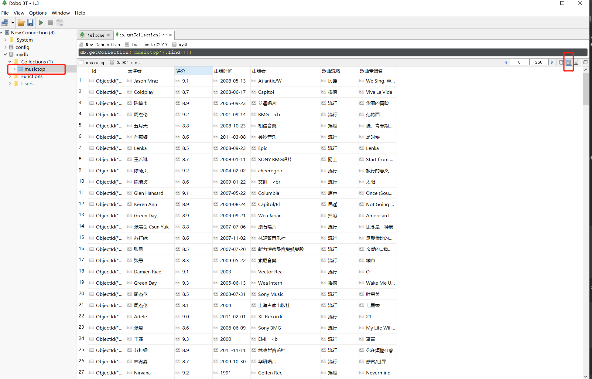

# 数据的存储

## 数据库：Redis篇
[https://www.jianshu.com/p/9ed958c8c2ea](https://www.jianshu.com/p/9ed958c8c2ea)


## 数据库：MongoDB篇
[https://www.jianshu.com/p/84c0193da6d8](https://www.jianshu.com/p/84c0193da6d8)


## 数据库：MySQL篇
[https://www.jianshu.com/p/809333028eca](https://www.jianshu.com/p/809333028eca)

## 数据库：SQLite篇
[https://www.jianshu.com/p/164538ea3d90](https://www.jianshu.com/p/164538ea3d90)

## 爬取豆瓣音乐Top250排行的数据存储到MongoDB
```
#!/usr/bin/env python
# -*- coding:utf8 -*-
# auther; 18793
# Date：2019/7/14 13:27
# filename: 爬取豆瓣歌曲top250存入mongoDB数据库.py
"""
手动浏览网页数据如下：
https://music.douban.com/top250
https://music.douban.com/top250?start=25
https://music.douban.com/top250?start=50
https://music.douban.com/top250?start=75

https://music.douban.com/top250?start=0也能正常浏览，因此只需要更改start=后面的数字即可。
以此来构造出前10页的网址。

本次爬取在详细页面中进行，先爬取详细页面网址链接，再爬取数据
需要爬取的信息有：歌曲专辑名、表演者、流派、发行时间、出版者和评分
把爬取的数据存储到MongoDB数据库中
"""

import requests
from lxml import etree
import pymongo
import re
import time
"""
导入requests库用于请求网页
Lxml库和re库用于解析抓取网页数据
Pymongo用于对MongoDB数据库的操作
time库的sleep()方法可以暂停程序，缓解写入MongoDB数据频率
"""


clinet = pymongo.MongoClient('localhost', 27017)
mydb = clinet['mydb']
musictop = mydb['musictop']  # 连接数据库及创建数据库、数据集合
"""
创建MongoDB数据库和集合
"""


headers = {
    "User-Agent": "Mozilla/5.0 (Windows NT 10.0; Win64; x64) AppleWebKit/537.36 (KHTML, like Gecko) Chrome/75.0.3770.100 Safari/537.36"
}
"""
伪装浏览器代理，便于爬虫的稳定性
"""


def get_url_music(url):
    """
    获取详细页url信息，通过Xpath语法提取标签中的href信息，最后调用get_music_info()函数。
    :param url:
    :return:
    """
    html = requests.get(url, headers=headers)
    selector = etree.HTML(html.text)
    music_hrefs = selector.xpath('//div[@class="pl2"]/a[1]/@href')
    for music_link in music_hrefs:
        # print(music_link)
        get_music_info(music_link)


def get_music_info(url):
    """
    爬取歌曲专辑名、表演者、流派、发行时间、出版者和评分
    :param url:
    :return:
    """
    html = requests.get(url, headers=headers)
    selector = etree.HTML(html.text)
    name = selector.xpath('//*[@id="wrapper"]/h1/span/text()')[0]  # 歌曲专辑名
    # author = selector.xpath('//*[@id="info"]/span[1]/span/a/text()')    #表演者
    author = re.findall(r'表演者:.*?>(.*?)</a>', html.text, re.S)[0].strip()
    styles = re.findall(r'<span class="pl">流派:</span>&nbsp;(.*?)<br>', html.text, re.S)
    # print(styles[0][:6].strip())
    if len(styles) == 0:
        style = "未知"
    else:
        style = styles[0][:6].strip()  # 歌曲流派
    time = re.findall(r"发行时间:</span>&nbsp;(.*?)<br>", html.text, re.S)[0][:10].strip("<").strip()   # 发行时间
    chubanzhe = re.findall("出版者:</span>&nbsp;(.*?)<br>", html.text, re.S)
    # print(chubanzhe[0][:8])
    if len(chubanzhe) == 0:
        chubanzhe = "未知"
    else:
        chubanzhe = chubanzhe[0][:10].strip("<").strip()  # 出版者

    score_pinfen = selector.xpath('//*[@id="interest_sectl"]/div/div[2]/strong/text()')[0]  # 评分
    # print(name, author, style, time, chubanzhe, score_pinfen)

    data = {
        "歌曲专辑名": name,
        "表演者": author,
        "歌曲流派": style,
        "出版时间": time,
        "出版者": chubanzhe,
        "评分": score_pinfen
    }
    # print(data)
    musictop.insert_one(data)  # 插入数据


if __name__ == '__main__':
    urls = ["https://music.douban.com/top250?start={}".format(str(i)) for i in range(0, 250, 25)]
    """
    使用列表推导式构造10个URL，依次调用get_url_music()函数。暂停程序1秒写入，防止频率过快导致爬虫失败。
    """
    for url in urls:
        get_url_music(url)
        time.sleep(1)

    # url = "https://music.douban.com/subject/3329183/"
    # get_music_info(url)


```
windows上面安装MongoDB软件包


`mongodb-win32-x86_64-2008plus-ssl-4.0.10.zip`


启动mongoDB数据库

``` 
mongod --dbpath F:\各类数据库软件\mongoDB安装包\mongodb-win32-x86_64-2008plus-ssl-4.0.10\data\db
```

使用mongoDB可视化连接工具

 `robo3t-1.3.1-windows-x86_64-7419c406.zip`
 
爬取的结果如下：



## 爬取豆瓣电影存入Mysql数据库
``` 
#!/usr/bin/env python
# -*- coding:utf8 -*-
# auther; 18793
# Date：2019/7/14 17:38
# filename: 爬取豆瓣电影存入Mysql数据库.py

import requests
import time
from bs4 import BeautifulSoup
from lxml import etree
import re
import pymysql

"""
手动浏览豆瓣电影的网页结构如下
https://movie.douban.com/review/best/?start=0
https://movie.douban.com/review/best/?start=20
https://movie.douban.com/review/best/?start=40
https://movie.douban.com/review/best/?start=60
"""

conn = pymysql.connect(host="localhost", user="root", passwd="admin#123", db="sqlyog",
                       port=3306, charset="utf8")
cursor = conn.cursor()  # 连接数据库及光标

headers = {
    "User-Agent": "Mozilla/5.0 (Windows NT 10.0; Win64; x64) AppleWebKit/537.36 (KHTML, like Gecko) Chrome/75.0.3770.100 Safari/537.36"
}


def get_movie_url(url):
    """
    定义获取URL详细页的函数
    :param url:
    :return:
    """
    html = requests.get(url, headers=headers)
    selector = etree.HTML(html.text)
    movie_hrefs = selector.xpath('//div[@class="main review-item"]/a/@href')
    for movie_href in movie_hrefs:
        # print(movie_href)
        get_movie_info(movie_href)  # 调用获取详细页的函数


def get_movie_info(url):
    """
    获取详细页信息的函数
    :param url:
    :return:
    """
    html = requests.get(url, headers=headers)
    selector = etree.HTML(html.text)
    
    # 这里通过try来处理，防止报错就停止爬取
    try:
        name = selector.xpath('//*[@id="content"]/h1/span[1]/text()')[0]
        daoyan = selector.xpath('//*[@id="info"]/span[1]/span[2]//a/text()')
        daoyan = "/".join(daoyan)
        zhuyans = selector.xpath('//*[@id="info"]/span[3]/span[2]')[0]
        zhuyan = zhuyans.xpath('string(.)')
        style = re.findall(r'<span property="v:genre">(.*?)</span>', html.text, re.S)
        style = "/".join(style)
        country = re.findall(r'<span class="pl">制片国家/地区:</span> (.*?)<br/>', html.text, re.S)[0]
        release_time = re.findall(r'<span property="v:initialReleaseDate" content="(.*?)">(.*?)</span>', html.text,
                                  re.S)[0][0]
        time = re.findall(r'片长:</span>(.*?)>(.*?)</span>', html.text, re.S)[0][1]
        score = selector.xpath('//*[@id="interest_sectl"]/div[1]/div[2]/strong/text()')[0]

        # print(str(name), str(daoyan), str(zhuyan), str(style)), \
        # str(country), str(release_time), str(time), str(score)

        # 获取信息插入数据库
        cursor.execute("insert into doubanmovie (name, director, actor, style, country, release_time, time, score) "
                       "values (%s,%s,%s,%s,%s,%s,%s,%s)",
                       (str(name), str(daoyan), str(zhuyan), str(style),
                        str(country), str(release_time), str(time), str(score)))


    except:
        pass


if __name__ == '__main__':
    # url = "https://movie.douban.com/review/best/?start=0"
    # get_movie_url(url)

    # url = "https://movie.douban.com/subject/4739952/"
    # get_movie_info(url)
    urls = ["https://movie.douban.com/review/best/?start={}".format(str(i)) for i in range(0, 200, 20)]
    for url in urls:
        get_movie_url(url)
        time.sleep(1)
    conn.commit()
    cursor.close()
    conn.close()
```
爬取到的信息如下：

