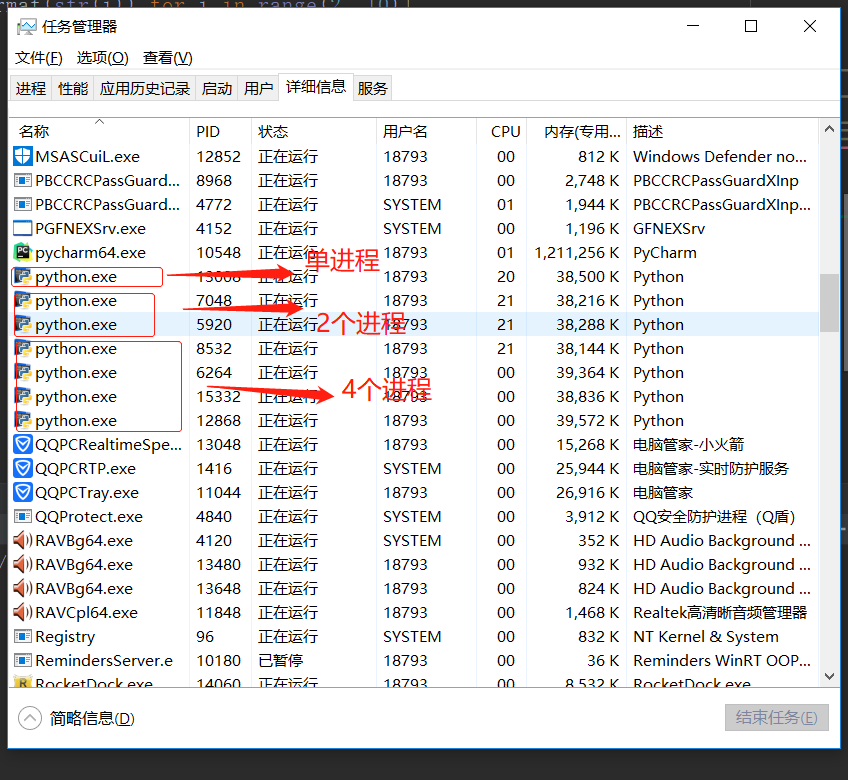
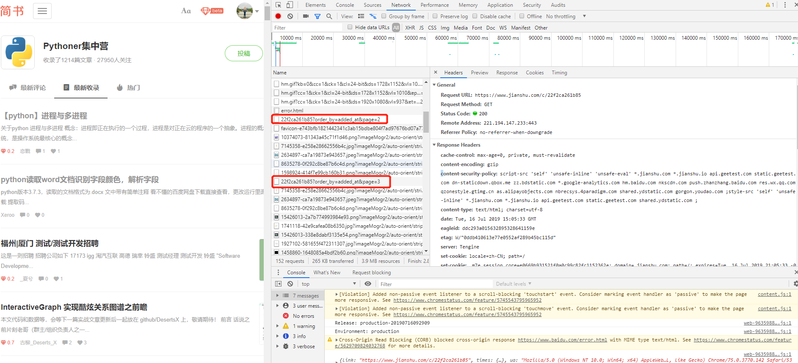
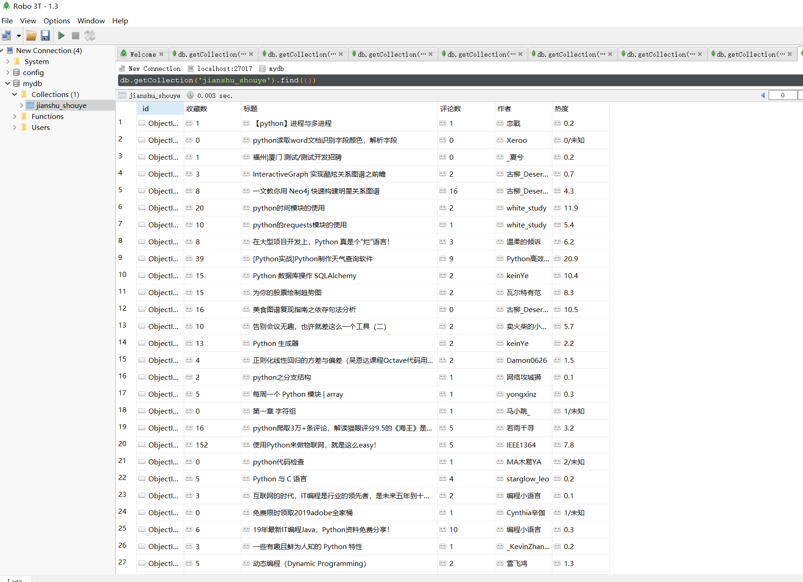
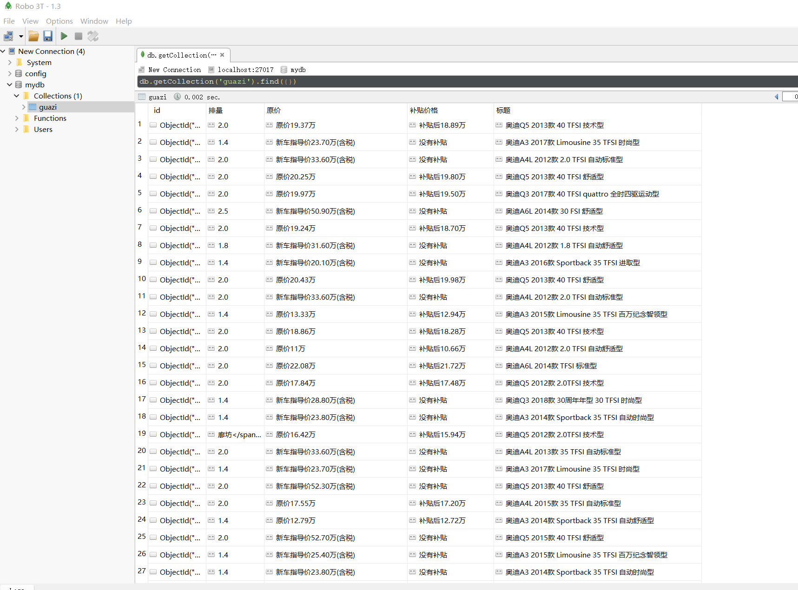
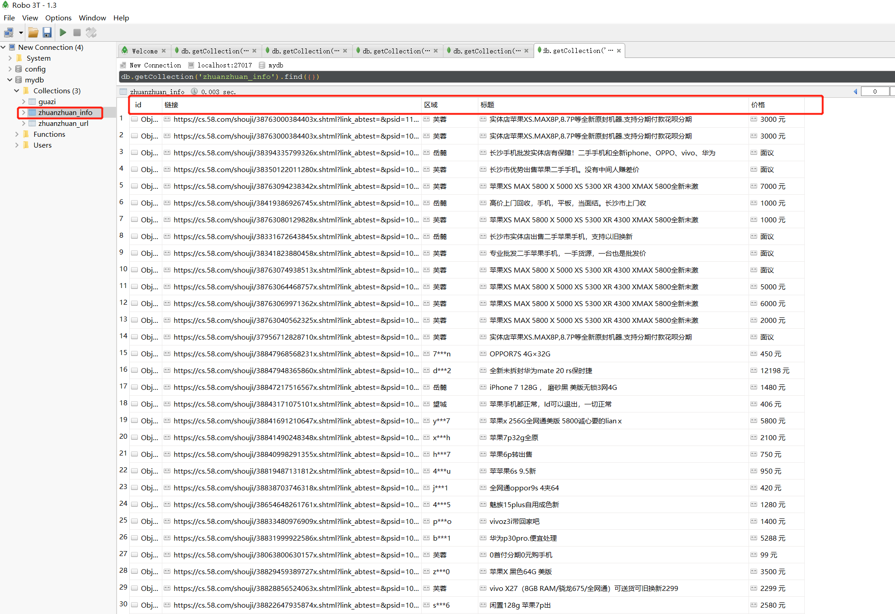

# 多进程爬虫
## 多进程讲解
``` 
#!/usr/bin/env python
# -*- coding:utf8 -*-
# auther; 18793
# Date：2019/7/17 10:50
# filename: 多进程01.py
from multiprocessing import Process
import os


def run_task(name):
    print("Child process {} 【{}】 Running ....".format(name, os.getpid()))


if __name__ == '__main__':
    print("Parent process 【{}】".format(os.getpid()))
    for i in range(5):
        p = Process(target=run_task, args=(i,))
        print("Process will be Start.....")
        p.start()
    p.join()        #等待子进程结束
    print("Process end.")
```

输出信息:
``` 
Parent process 【232】
Process will be Start.....
Process will be Start.....
Process will be Start.....
Process will be Start.....
Process will be Start.....
Child process 0 【16256】 Running ....
Child process 1 【3984】 Running ....
Child process 2 【3192】 Running ....
Child process 3 【5356】 Running ....
Child process 4 【7036】 Running ....
Process end.
```

## 多进程中的进程池
``` 
#!/usr/bin/env python
# -*- coding:utf8 -*-
# auther; 18793
# Date：2019/7/17 10:41
# filename: 多进程，进程池的使用.py
from multiprocessing import Pool
import os, time, random


def run_task(name):
    print("Task {0} (pid={1}) is running ....".format(name, os.getpid()))
    time.sleep(random.random() * 3)
    print("Task {} end.".format(name))


if __name__ == '__main__':
    print("Current process {}".format(os.getpid()))
    p = Pool(processes=3)
    for i in range(5):
        p.apply_async(run_task, args=(i,))
    print("Waiting for all subprocess done....")
    p.close()
    p.join()
    print("All subprocess done.!!")

```

`Pool对象调用join（）方法会等待所有子进程执行完毕，调用join（）之前必须先调用close（），调用close（）之后就不能继续添加新的Process了。`


输出信息如下：
``` 
Current process 5344
Waiting for all subprocess done....
Task 0 (pid=6432) is running ....
Task 1 (pid=3932) is running ....
Task 2 (pid=2588) is running ....
Task 0 end.
Task 3 (pid=6432) is running ....
Task 2 end.
Task 4 (pid=2588) is running ....
Task 1 end.
Task 4 end.
Task 3 end.
All subprocess done.!!
```


## 使用队列实现多进程中相互通信
``` 
#!/usr/bin/env python
# -*- coding:utf8 -*-
# auther; 18793
# Date：2019/7/27 10:17
# filename: 使用队列实现进程间通信.py
from multiprocessing import Process, Queue
import os
import time
import random


def proce_write(q, urls):
    """
    写数据执行的代码
    :param q:
    :param urls:
    :return:
    """
    print("Process【{}】 is writing.....".format(os.getpid()))
    for url in urls:
        q.put(url)
        print("Put 【{}】 to queue.....".format(url))
        time.sleep(random.random())


def proce_read(q):
    """
    读数据的代码
    :param q:
    :return:
    """
    print("Process【{}】 is reading.....".format(os.getpid()))
    while True:
        url = q.get(True)
        print("Get 【{}】 from queue..".format(url))


if __name__ == '__main__':
    # 父进程创建Queue，并传给各个子进程
    q = Queue()
    proce_write1 = Process(target=proce_write, args=(q, ["url1", "url2", "url3"]))
    proce_write2 = Process(target=proce_write, args=(q, ["url4", "url5", "url6"]))
    proce_reader = Process(target=proce_read, args=(q,))

    # 启动子进程proc_writer,写入
    proce_write1.start()
    proce_write2.start()

    # 启动子进程proce_reader 读取
    proce_reader.start()

    # 等待proce_writer结束
    proce_write1.join()
    proce_write2.join()

    # proce_reader进程是死循环，无法等待其结束，需要强制进行终止
    proce_reader.terminate()

```
输出信息
``` 
Process【2640】 is writing.....
Put 【url1】 to queue.....
Process【7104】 is writing.....
Put 【url4】 to queue.....
Process【5700】 is reading.....
Get 【url1】 from queue..
Get 【url4】 from queue..
Put 【url2】 to queue.....
Get 【url2】 from queue..
Get 【url3】 from queue..
Put 【url3】 to queue.....
Put 【url5】 to queue.....
Get 【url5】 from queue..
Put 【url6】 to queue.....
Get 【url6】 from queue..
```

## 线程同步
```
# 互斥锁的使用

#创建锁
mutex = threading.Lock()

#锁定
mutex.acquire([blocking])

#释放锁
mutex.release()

```

``` 
#!/usr/bin/env python
# -*- coding:utf8 -*-
# auther; 18793
# Date：2019/7/27 11:13
# filename: 线程同步.py

import threading

mylock = threading.RLock()
num = 0


class myThread(threading.Thread):
    def __init__(self, name):
        threading.Thread.__init__(self, name=name)

    def run(self):
        global num
        while True:
            mylock.acquire()
            print('%s locked, Number: %d' % (threading.current_thread().name, num))
            if num >= 4:
                #当num大于等于4时，释放锁。其他子线程就能执行了
                mylock.release()
                print('%s released, Number: %d' % (threading.current_thread().name, num))
                break
            num += 1
            print('%s released, Number: %d' % (threading.current_thread().name, num))
            mylock.release()


if __name__ == '__main__':
    thread1 = myThread('Thread_1')
    thread2 = myThread('Thread_2')
    thread1.start()
    thread2.start()

```
输出信息
``` 
Thread_1 locked, Number: 0
Thread_1 released, Number: 1
Thread_1 locked, Number: 1
Thread_1 released, Number: 2
Thread_1 locked, Number: 2
Thread_1 released, Number: 3
Thread_1 locked, Number: 3
Thread_1 released, Number: 4
Thread_1 locked, Number: 4
Thread_1 released, Number: 4
Thread_2 locked, Number: 4
Thread_2 released, Number: 4
```


## 多线程爬取示例
``` 
"""
python进行多进程爬虫使用了multiprocessing库.使用方法的代码如下：

from multiprocessing import Pool
pool = Pool(processes=4)
pool.map(func, iterable[,chunksize])

1.导入multiprocessing库的Pool模块
2.创建进程池，processes参数为设置进程的个数
3.利用map()函数运行进程，func参数为需运行的函数，iterable为迭代参数，可为多个URL列表进行迭代。
"""
```

``` 
#!/usr/bin/env python
# -*- coding:utf8 -*-
# auther; 18793
# Date：2019/7/15 22:11
# filename: 01.多进程使用方法.py

import requests
import re
import time
from multiprocessing import Pool  # 导入多进程模块

headers = {
    "User-Agent": "Mozilla/5.0 (Windows NT 10.0; WOW64; rv:67.0) Gecko/20100101 Firefox/67.0"
}


def judgment(class_name):
    if class_name == "womenIcon":
        return "女"
    else:
        return "男"


def get_info(url):
    res = requests.get(url, headers=headers)
    ids = re.findall("<h2>(.*?)</h2>", res.text, re.S)
    levels = re.findall('<div class="articleGender \D+Icon">(.*?)</div>', res.text, re.S)
    sexs = re.findall('<div class="articleGender (.*?)">', res.text, re.S)
    contents = re.findall('<div class="content">.*?<span>(.*?)</span>', res.text, re.S)
    laughs = re.findall('<span class="stats-vote"><i class="number">(\d+)</i> 好笑</span>', res.text, re.S)
    comments = re.findall('<i class="number">(\d+)</i> 评论', res.text, re.S)
    for id, level, sex, content, laugh, comment in zip(ids, levels, sexs, contents, laughs, comments):
        info = {
            "id": id,
            "level": level,
            "sex": judgment(sex),  # 调用judgment_sex()函数
            "content": content,
            "laugh": laugh,
            "comment": comments[0]
        }
        return info


if __name__ == '__main__':
    urls = ["https://www.qiushibaike.com/text/page/{}".format(str(i)) for i in range(2, 10)]
    start_1 = time.time()
    for url in urls:
        # 单进程
        get_info(url)
    end_1 = time.time()
    print("串行爬虫，单进程:", end_1 - start_1)

    # 2个进程
    start_2 = time.time()
    pool = Pool(processes=2)
    pool.map(get_info, urls)
    end_2 = time.time()
    print("两个进程爬取：", end_2 - start_2)

    # 4个进程
    start_3 = time.time()
    pool = Pool(processes=4)
    pool.map(get_info, urls)
    end_3 = time.time()
    print("两个进程爬取：", end_3 - start_3)


```
`多进程爬虫使用2个进程和4个进程爬取，记录开始时间，循环爬取数据，记录结束时间，最后打印出所需时间`


输出信息如下：
``` 
串行爬虫，单进程: 2.393002510070801
两个进程爬取： 2.2469072341918945
两个进程爬取： 1.9653539657592773
```




## 爬取简书网热评文章

``` 
#!/usr/bin/env python
# -*- coding:utf8 -*-
# auther; 18793
# Date：2019/7/16 9:45
# filename: 02.爬取简书网热评文章.py

"""
【爬虫】Xpath高级用法

手动浏览翻页界面如下
https://www.jianshu.com/c/22f2ca261b85?order_by=added_at&page=1
https://www.jianshu.com/c/22f2ca261b85?order_by=added_at&page=12
https://www.jianshu.com/c/22f2ca261b85?order_by=added_at&page=13
https://www.jianshu.com/c/22f2ca261b85?order_by=added_at&page=14
https://www.jianshu.com/c/22f2ca261b85?order_by=added_at&page=15

使用requests和lxml三方库和多进程爬虫方法，
"""

import requests
from lxml import etree
import re
import pymongo
import time
from multiprocessing import Pool  # 导入库文件

client = pymongo.MongoClient('localhost', 27017)  # 连接数据库
mydb = client['mydb']
jianshu_shouye = mydb['jianshu_shouye']  ## 连接数据库及创建数据库、数据集合
# jianshu_shouye.insert_one({'收藏数': '1', '评论数': '1', '作者': '恋戰', '标题': '【python】进程与多进程', '热度': '0.2'})

headers = {
    "user-agent": "Mozilla/5.0 (Windows NT 10.0; Win64; x64) AppleWebKit/537.36 (KHTML, like Gecko) Chrome/75.0.3770.142 Safari/537.36"
}


def get_jianshu_info(url):
    html = requests.get(url, headers=headers)
    selector = etree.HTML(html.text)
    infos = selector.xpath('//ul[@class="note-list"]/li')  # 获取大标签，以此进行循环

    for info in infos:
        try:
            author = info.xpath('div/div/a[1]/text()')[0]
            tittles = info.xpath('div/a/text()')[0]
            redus = info.xpath('div/div/span[1]/text()')
            if len(redus) == 1:
                redu = str(redus).strip().replace('[', '').replace(']', '').strip("'").strip() + "/未知"
            else:
                redu = str(redus[1]).strip()
            pinglun = info.xpath('div/div/a[2]/text()')[1].strip()
            shoucangs = info.xpath('div/div/span[2]/text()')
            if len(shoucangs) == 0:
                shoucang = str(0)
            else:
                shoucang = str(shoucangs).replace('[', '').replace(']', '').strip("'").strip()

            data = {
                "作者": author,
                "标题": tittles,
                "热度": redu,
                "评论数": pinglun,
                "收藏数": shoucang
            }
            # print(data)
            jianshu_shouye.insert_one(data)  # 依次写入mongodb数据库

        except:
            pass


if __name__ == '__main__':
    # urls = "https://www.jianshu.com/c/22f2ca261b85"
    # get_jianshu_info(urls)
    urls = ["https://www.jianshu.com/c/22f2ca261b85?order_by=added_at&page={}".format(str(i)) for i in range(1, 2000)]
    # for url in urls:              #单线程
    #     get_jianshu_info(url)

    pool = Pool(processes=4)  # 创建4个进程池，多线程
    pool.map(get_jianshu_info, urls)
    

#或者另外一种方式
#   pool = Pool(4)  # 创建4个进程池，多线程
#   for url in urls:
#       pool.apply_async(get_jianshu_info, args=(url,))
#   pool.close()
#   pool.join()

```

`现在在多线程上出现点问题待解决，单线程爬取没有问题，多线程需要改进`

输出结果如下：



## 抓取瓜子二手车简单示例
``` 
#!/usr/bin/env python
# -*- coding:utf8 -*-
# auther; 18793
# Date：2019/7/18 12:08
# filename: 多进程抓取瓜子二手车.py
"""

手动浏览瓜子二手车的信息如下：
https://www.guazi.com/bj/audi/o1/#bread
https://www.guazi.com/bj/audi/o2/#bread
https://www.guazi.com/bj/audi/o3/#bread

# 翻页：
urls = ["https://www.guazi.com/bj/audi/o{}/#bread".format(str(i)) for i in range(1, 50)]
"""
import re
import requests
import time
from multiprocessing import Pool
from lxml import etree
import pymongo

client = pymongo.MongoClient('localhost', 27017)  # 连接数据库
mydb = client['mydb']
guazi_2car = mydb['guazi']  ## 连接数据库及创建数据库、数据集合

headers = {
    "Accept": "text/html,application/xhtml+xml,application/xml;q=0.9,image/webp,image/apng,*/*;q=0.8,application/signed-exchange;v=b3",
    "Accept-Encoding": "gzip, deflate, br",
    "Accept-Language": "zh-CN,zh;q=0.9,en;q=0.8",
    "Cache-Control": "max-age=0",
    "Connection": "keep-alive",
    "Cookie": "uuid=90ed9f44-b20d-4ed8-a8e5-2fe9a107c527; antipas=69151747kC695T498278y598l82; user_city_id=12; ganji_uuid=1086212832684246083191; sessionid=cddd6039-f178-417d-ef82-3fc603fe1904; lg=1; cainfo=%7B%22ca_s%22%3A%22pz_baidu%22%2C%22ca_n%22%3A%22tbmkbturl%22%2C%22ca_medium%22%3A%22-%22%2C%22ca_term%22%3A%22-%22%2C%22ca_content%22%3A%22%22%2C%22ca_campaign%22%3A%22%22%2C%22ca_kw%22%3A%22-%22%2C%22keyword%22%3A%22-%22%2C%22ca_keywordid%22%3A%22-%22%2C%22scode%22%3A%2210103000312%22%2C%22ca_transid%22%3A%22%22%2C%22platform%22%3A%221%22%2C%22version%22%3A1%2C%22ca_i%22%3A%22-%22%2C%22ca_b%22%3A%22-%22%2C%22ca_a%22%3A%22-%22%2C%22display_finance_flag%22%3A%22-%22%2C%22client_ab%22%3A%22-%22%2C%22guid%22%3A%2290ed9f44-b20d-4ed8-a8e5-2fe9a107c527%22%2C%22sessionid%22%3A%22cddd6039-f178-417d-ef82-3fc603fe1904%22%7D; _gl_tracker=%7B%22ca_source%22%3A%22-%22%2C%22ca_name%22%3A%22-%22%2C%22ca_kw%22%3A%22-%22%2C%22ca_id%22%3A%22-%22%2C%22ca_s%22%3A%22self%22%2C%22ca_n%22%3A%22-%22%2C%22ca_i%22%3A%22-%22%2C%22sid%22%3A43620202225%7D; cityDomain=bj; preTime=%7B%22last%22%3A1563424468%2C%22this%22%3A1563422804%2C%22pre%22%3A1563422804%7D",
    "Host": "www.guazi.com",
    "Referer": "https://www.guazi.com/bj/buy/",
    "Upgrade-Insecure-Requests": "1",
    "User-Agent": "Mozilla/5.0 (Windows NT 10.0; Win64; x64) AppleWebKit/537.36 (KHTML, like Gecko) Chrome/75.0.3770.142 Safari/537.36"
}

guazi_url = "https://www.guazi.com"


def get_link_url(url):
    html = requests.get(url, headers=headers)
    selector = etree.HTML(html.text)
    infos = selector.xpath('//ul[@class="carlist clearfix js-top"]/li')
    for info in infos:
        href = info.xpath('a/@href')[0]
        href = guazi_url + str(href)
        # print(href)
        get_info_car(href)


def get_info_car(url):
    """
    抓取标题、
    上牌时间、 里程表信息、排量、变速箱、价格、原价
    :param url:
    :return:
    """
    html = requests.get(url, headers=headers)
    selettor = etree.HTML(html.text)
    try:
        tettile = re.findall(r'<h2 class="titlebox">(.*?)<span class="labels baomai">(.*?)</span>', html.text, re.S)[0][
            0].strip()
        pailiang = re.findall(r'<li class="three"><span>(.*?)</span>排量</li>', html.text, re.S)[0]
        btjs = re.findall(
            r'<span class="pricestype"><span class="f14">(.*?)</span>(.*?)<span class="f14">(.*?)</span></span>',
            html.text,
            re.S)
        if len(btjs) == 0:
            btj = "没有补贴"
        else:
            a, b, c = btjs[0]
            btj = a + str(b).strip() + c
        yuanjia = re.findall(r'<span class="newcarprice">(.*?)</span>', html.text, re.S)[0].strip()

        data = {
            "标题": tettile,
            "排量": pailiang,
            "补贴价格": btj,
            "原价": yuanjia
        }
        # print(data)
        guazi_2car.insert_one(data)

    except:
        pass


if __name__ == '__main__':
    urls = ["https://www.guazi.com/bj/audi/o{}/#bread".format(str(i)) for i in range(1, 50)]
    pool = Pool(4)  # 创建4个进程池，多线程
    for url in urls:
        pool.apply_async(get_link_url, args=(url,))
    pool.close()
    pool.join()


# pool.map(get_link_url, urls)

# urls = "https://www.guazi.com/bj/audi/o3/#bread"
# get_link_url(urls)

# url = "https://www.guazi.com/bj/37f5a6414ab7d2dex.htm#fr_page=list&fr_pos=city&fr_no=1"
# get_info_car(url)

```




## 多进程实战 - 转转网二手市场商品信息
``` 
爬取地址：https://wh.58.com/sale.shtml
爬取信息：标题，价格，区域，浏览量，想买数，宝贝描述内容，宝贝留言数
爬取方式：进入分类的详细页面，使用lxml解析。
存储方式：MongoDB存储 & MySQL存储


进入分类页面，以二手手机为例。分类链接为http://gz.58.com//shouji/，
点击多页后发现该类别的个人分类规律为：http://gz.58.com//shouji/0/pn{}/，其中{}放置数字即可实现翻页。
```

``` 
详细页面爬取信息为：标题，浏览量，想买数，价格，区域，宝贝描述内容，宝贝留言数。
```


`在计算机中新建一个文件夹，然后新建三个py文件：`

`class_urls.py : 获取各商品类别的URL`

`page_spider.py：获取详细页面URL，获取页面信息`

`main.py：主程序`


`class_urls.py`
``` 
#!/usr/bin/env python
#-*- coding:utf8 -*-
# auther; 18793
# Date：2019/7/18 17:31
# filename: class_urls.py
'''
爬取地址：https://wh.58.com/sale.shtml
爬取信息：标题，价格，区域，浏览量，想买数，宝贝描述内容，宝贝留言数
爬取方式：进入分类的详细页面，使用lxml解析。
存储方式：MongoDB存储 & MySQL存储


进入分类页面，以二手手机为例。分类链接为http://gz.58.com//shouji/，
点击多页后发现该类别的个人分类规律为：http://gz.58.com//shouji/0/pn{}/，其中{}放置数字即可实现翻页。


'''

import requests
from lxml import etree

start_url = "http://cs.58.com/sale.shtml"
base_url = "http://cs.58.com"

r = requests.get(start_url)
html = etree.HTML(r.text)
infos = html.xpath('//li[@class="ym-tab"]')
for info in infos:
    urls = info.xpath('span/a/@href')        ##简单二级目录
    #urls = info.xpath('ul/li/span/a/@href') ##复杂二级目录
    for url in urls:
        class_url = base_url + url
        print(class_url)


class_urls1 = '''
http://cs.58.com/shouji/
http://cs.58.com/tongxunyw/
http://cs.58.com/danche/
http://cs.58.com/diandongche/
http://cs.58.com/diannao/
http://cs.58.com/shuma/
http://cs.58.com/jiadian/
http://cs.58.com/ershoujiaju/
http://cs.58.com/yingyou/
http://cs.58.com/fushi/
http://cs.58.com/meirong/
http://cs.58.com/yishu/
http://cs.58.com/tushu/
http://cs.58.com/wenti/
http://cs.58.com/kaquan/
http://cs.58.com/shebei.shtml
http://cs.58.com/chengren/
'''

```


`page_spider.py`
``` 
#!/usr/bin/env python
# -*- coding:utf8 -*-
# auther; 18793
# Date：2019/7/18 17:33
# filename: page_spider.py
import requests
from bs4 import BeautifulSoup
import time
import pymongo
import re

# 连接mongodb
client = pymongo.MongoClient('localhost', 27017)
mydb = client['mydb']
zhuanzhuan_url = mydb['zhuanzhuan_url']
zhuanzhuan_info = mydb['zhuanzhuan_info']

headers = {
    'user-agent': 'Mozilla/5.0 (Windows NT 10.0; WOW64) AppleWebKit/537.36 (KHTML, like Gecko) Chrome/65.0.3294.6 Safari/537.36'}


def get_page(url, page):
    url1 = url
    try:
        detail_url = '{}0/pn{}/'.format(url, page)
        # print(detail_url)
        r = requests.get(detail_url, headers=headers)
        # print(r.text)
        soup = BeautifulSoup(r.text, "lxml")
        infos = soup.select("tr")
        # url_list = []       #单进程时使用
        for info in infos:
            detail_url = info.select("a.t")[0].get("href")
            # print(detail_url)
            if str(detail_url).endswith("slot=-1"):
                #url_list.append(detail_url)        #单进程时使用
                zhuanzhuan_url.insert_one({'详细页面链接': detail_url})
                # print({'详细页面链接': detail_url})
            else:
                page
        # return url_list   #单进程时使用
    except requests.exceptions.ConnectionError:
        pass


def get_info(url):
    try:
        r = requests.get(url, headers=headers)
        soup = BeautifulSoup(r.text, "lxml")
        title = soup.select("#basicinfo > div.detail-title > h1")[0].text.strip()
        price = soup.select(
            "#basicinfo > div.infocard__container.haveswitch > div:nth-of-type(1) > div.infocard__container__item__main > span")[
            0].text.strip()
        area = soup.select(
            "#basicinfo > div.infocard__container.haveswitch > div:nth-of-type(3) > div.infocard__container__item__main > a")[
            0].text.strip()
        info = {'标题': title,
                '价格': price,
                '区域': area,
                '链接': url
                }
        zhuanzhuan_info.insert_one(info)
        # print(info)
        time.sleep(2)
    except IndexError:
        pass


if __name__ == '__main__':
    pass
    # url = "http://cs.58.com/shouji/"
    # get_page(url, 1)

    # url = 'https://cs.58.com/shouji/38763000384403x.shtml?link_abtest=&psid=176927105204931508910465081&entinfo=38763000384403_j&slot=-1'
    # get_info(url)

```

`main_one_Process.py`
``` 
#!/usr/bin/env python
# -*- coding:utf8 -*-
# auther; 18793
# Date：2019/7/18 17:34
# filename: main_one_Process.py

from class_urls import class_urls1
from page_spider import get_page, get_info

url_list = class_urls1.split()


for url in url_list:
    print(url)
    for page in range(1, 101):
        detail_url_list = get_page(url, page)
        for detail_url in detail_url_list:
            get_info(detail_url)

```

`main_many_Process.py`
``` 
#!/usr/bin/env python
# -*- coding:utf8 -*-
# auther; 18793
# Date：2019/7/18 17:35
# filename: main_many_Process.py
# 多进程
from multiprocessing import Pool
from class_urls import class_urls1
from page_spider import get_page, get_info
from page_spider import zhuanzhuan_url, zhuanzhuan_info


def get_links_from(url):
    for page in range(1, 101):
        get_page(url, page)


zz_urls = [item['详细页面链接'] for item in zhuanzhuan_url.find()]  # 获取数据库中的详细页面链接
zz_urls_2 = [item['链接'] for item in zhuanzhuan_info.find()]  # 数据表zhuanzhuan_info不存在时返回0
rest_urls = set(zz_urls) - set(zz_urls_2)  # 使用集合来过滤重复链接，支持断点续传

if __name__ == '__main__':
    url_list = class_urls1.split()  # 将字符串转变成列表
    ##    pool = Pool(processes=4)      #创建进程池
    ##    pool.map(get_links_from, url_list)  #调用进程池

    pool = Pool(processes=4)  # 创建进程池
    pool.map(get_info, rest_urls)  # 调用进程池

```


单进程执行如下：




`多进程执行一样。去掉注释`


`①先获取详细页面链接存入Mongodb数据库`
`②获取转转信息（支持断点续传）`


