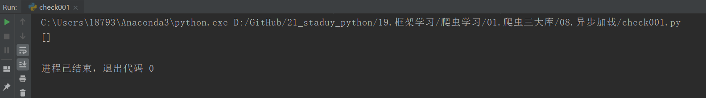

# 异步加载
```
异步加载技术是一种创建交互式网页应用的网页开发技术，异步JaaScript和XML。
使用这个技术，可以在不重新加载整个网页的情况下，对网页的某部分进行更新。
```

``` 
判断网页是否采用异步加载技术实现下滑分页：
① 通过下滑浏览网页，如果发现网页没有分页信息，而是一直浏览下去，但网址一直没变化。此时可认为网站采用了异步加载技术。
② 通过查看加载的数据是否在网页源代码中出现来进行判断。如果新加载的数据在网页源代码中没有查找到，可以认为采用了异步加载技术。

```

通过Chrome浏览器的“检查”功能，查找对应的位置，编写以下爬虫代码发现爬取不到收录信息，如下
``` 
#!/usr/bin/env python
#-*- coding:utf8 -*-
# auther; 18793
# Date：2019/7/19 9:50
# filename: check001.py
import requests
from lxml import etree

url = "https://www.jianshu.com/p/befe5db4051e"

html = requests.get(url)
selector = etree.HTML(html.text)
infos = selector.xpath('//a[@class="item"]')
print(infos)
```



### 逆向工程
```
想要抓取这些通过异步加载方法的网页数据，需要了解网页是如何加载这些数据的，该过程叫做逆向工程。
Chrome浏览器的Network选项卡可以查看网页加载过程中的索引文件信息，通过对这些文件的查看和筛选，找出需抓取数据的加载文件，
以此来设计爬虫代码。
```
逆向工程俗称`抓包`。我们以Pexels(https://www.pexels.com/search/book/)网站为例，开始进行抓包。

``` 
目标网址：https://www.pexels.com/
①打开网页，使用F12或右键点击“检查”功能进入开发者工具选项。选择Network选项卡。
②由于大多数分页文件位于XHR中，选中XHR选项，并通过鼠标下滑浏览网页，会发现Network选项卡中加载了一些文件信息。（XHR为可扩展超文本传输请求）
③打开第一个加载文件，可以看到请求的URL：
④尝试将URL的部分字符串缩短，可发现使用下述网址即可正常打开网页：
https://www.pexels.com/search/book/?page=2    
https://www.pexels.com/search/book/?page=3   
https://www.pexels.com/search/book/?page=4
https://www.pexels.com/search/book/?page=5
```


通过浏览网页发现如下
``` 

https://www.pexels.com/search/book/?page=2    
https://www.pexels.com/search/book/?page=3   


```

编写抓取代码；
``` 
#!/usr/bin/env python
# -*- coding:utf8 -*-
# auther; 18793
# Date：2019/7/19 16:09
# filename: 01.爬取pexels图片.py
import requests
from bs4 import BeautifulSoup
import time
import os
from multiprocessing import Pool

Dir_name = "Poxels/"


def chek_dir(dir):
    if not os.path.exists(dir):
        os.mkdir(dir)


def get_images(url):
    headers = {
        "apiKey": "883991539",
        "ui": "121105726",
        "anonymousId": "w4ur7qzdnxb",
        "type": "page",
        "userAgent": "Mozilla/5.0(Windows NT 10.0;Win64;x64) AppleWebKit/537.36(KHTML, like Gecko) Chrome/75.0.3770.142Safari/537.36"
    }

    html = requests.get(url, headers=headers)
    soup = BeautifulSoup(html.text, "lxml")
    images = soup.select(
        'article > a.js-photo-link.photo-item__link > img')
    # print(images)
    download_list = []
    for image in images:
        ims = image.get('data-big-src')
        download_list.append(ims)

    for item in download_list:
        res = requests.get(item, headers=headers)
        file_name = item.split("?")[0].split('/')[-1]
        # print(file_name)
        if Dir_name.endswith("/"):
            image_name = Dir_name + file_name
        else:
            image_name = Dir_name + "/" + file_name

        with open(image_name, "wb") as f:
            f.write(res.content)
            print("下载{}图片完成。".format(file_name))


if __name__ == '__main__':
    chek_dir(Dir_name)
    # url = 'https://www.pexels.com/search/book'
    urls = ['https://www.pexels.com/search/book/?page={}'.format(str(i)) for i in range(2, 21)]
    # for url in urls:
    #     get_images(url)       #单进程爬取

    pool = Pool(processes=4)
    pool.map(get_images, urls)      #多进程爬取

```
这样就通过抓包实现了对下滑分页的网址进行了数据抓取。
爬取图片结果为：


## 综合案例1 爬取简书网用户动态信息

``` 
import requests
from bs4 import BeautifulSoup

headers = {
    'user-agent': 'Mozilla/5.0 (Windows NT 10.0; WOW64) AppleWebKit/537.36 (KHTML, like Gecko) Chrome/65.0.3294.6 Safari/537.36'}


##获取data_type和datetime信息。
def get_info(url):
    r = requests.get(url, headers=headers)
    soup = BeautifulSoup(r.text, "lxml")
    infos = soup.select("ul.note-list li")
    for info in infos:
        data_type = info.select("div.author span")[0].get("data-type")
        datetime = info.select("div.author span")[0].get("data-datetime")
        print(data_type, datetime)

    ##获取max_id信息


def get_id(url):
    r = requests.get(url, headers=headers)
    soup = BeautifulSoup(r.text, "lxml")
    max_id = soup.select("ul.note-list li")[-1].get("id").split("-")[1]
    return int(max_id)


if __name__ == "__main__":
    start_url = "https://www.jianshu.com/users/9104ebf5e177/timeline"
    get_info(start_url)
    max_id = get_id(start_url) + 1

    # 利用循环代替递归函数。
    for page in range(2, 11):
        next_url = "https://www.jianshu.com/users/9104ebf5e177/timeline?max_id={}&page={}".format(max_id, page)
        get_info(next_url)
        max_id = get_id(next_url) + 1
```

输出信息：
``` 
share_note 2019-07-19T17:08:26+08:00
share_note 2019-07-11T12:33:31+08:00
share_note 2019-07-08T20:07:54+08:00
like_note 2019-07-06T20:13:55+08:00
like_note 2019-07-06T19:56:36+08:00
like_note 2019-07-02T10:31:25+08:00
like_note 2019-06-30T10:41:04+08:00
like_note 2019-06-28T18:45:41+08:0
```
