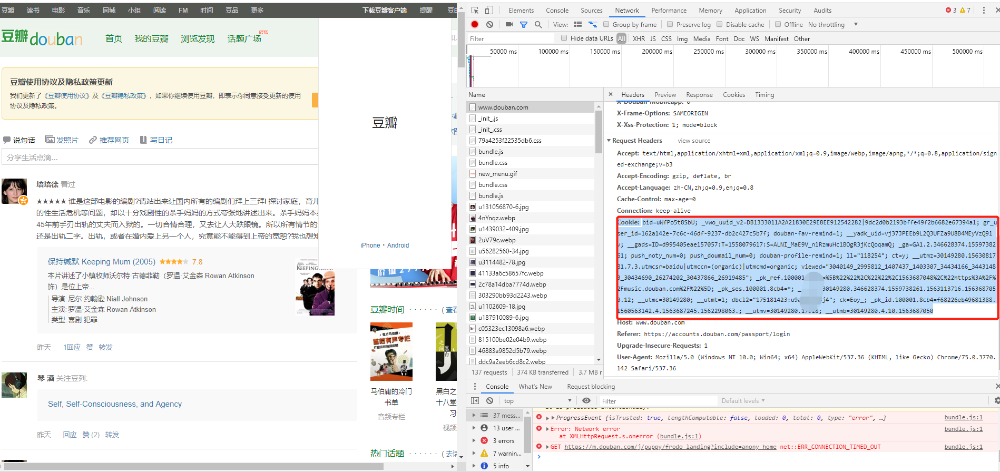

.. contents::
   :depth: 3
..

表单交互与模拟登陆
==================

模拟通过Cookie登录豆瓣
----------------------

1.表单交互：使用Requests库的POST使用方法，通过观察表单的网页源代码进行表单的提交，最后通过抓包获取表单提交的字段，进行表单交互

::

   1）POST方法
   2）查看网页源代码提交表单
   3）逆向工程提交表单

2.模拟登陆：Cookie是网站为了辨别用户身份，进行session跟踪而存储在用户本地终端上的数据。
模拟登陆是利用查找到的Cookie信息进行模拟登陆。

以豆瓣网为例，步骤如下：

::

   ①：进入豆瓣网，打开Chrome的开发工具，选择Network选项
   ②：手工输入账户和密码进行登录，此时会发现Network中加载了很多文件。
   ③：选择www.douban.com,直接可以看到Cookie信息。(注：不要泄露了自己的Cookie信息)

④ 在请求头上加入Cookie信息即可完成豆瓣网的模拟登录。

格式为：

::

   #!/usr/bin/env python
   # -*- coding:utf8 -*-
   # auther; 18793
   # Date：2019/7/21 13:29
   # filename: 01.post方法.py
   import requests

   url = "https://accounts.douban.com"

   headers = {
       'Cookie': 'bid=uWfPo5t8SbU; _vwo_uuid_v2=DB1333011A2A21830E29E8EE912542282|9dc2d0b2193bffe49f2b6682e67394a1; gr_user_id=162a142e-7c6c-46df-9237-db2c427c5b7f; douban-fav-remind=1; __yadk_uid=vj37JPEEb9L2Q3UFZa9U8B4MEyVzQ91v; __gads=ID=d995405eae157057:T=1558079617:S=ALNI_MaE9V_n1RzmuHc1BOgR3jKcQoqamQ; _ga=GA1.2.346628374.1559738261; push_noty_num=0; push_doumail_num=0; douban-profile-remind=1; ll="118254"; ct=y; __utmz=30149280.1563081781.7.3.utmcsr=baidu|utmccn=(organic)|utmcmd=organic; viewed="3040149_2995812_1407437_1403307_34434166_34431483_30434690_26274202_30437866_26919485"; _pk_ref.100001.8cb4=%5B%22%22%2C%22%22%2C1563687048%2C%22https%3A%2F%2Fmusic.douban.com%2F%22%5D; _pk_ses.100001.8cb4=*; __utma=30149280.346628374.1559738261.1563113716.1563687050.12; __utmc=30149280; __utmt=1; dbcl2="175181423:u9apU0YA3j4"; ck=Eoy_; _pk_id.100001.8cb4=f68226eb49681388.1560563142.4.1563687245.1562298063.; __utmv=30149280.17518; __utmb=30149280.4.10.1563687050'
   }

   r = requests.get(url, headers=headers)
   print(r.text)

⑤ 查看运行结果，是否出现了账号信息，登录成功后的界面如下：

::

   <table style="clear:both" width="100%" align="center" cellpadding="5">
       <tr>
           <td class="m" valign="top" align="right">名　号: </td>
           <td valign="top">
   <input name="pf_name" type="text" size="15" maxlength="15" value="阳光小健"/>
    名号30天内只能修改一次。 
           </td>
       </tr>

爬取拉勾网招聘信息
------------------

::

   爬取网址：https://www.lagou.com/
   爬取信息：工作岗位等信息
   爬取方式：json数据
   存储方式：MongoDB

   拉勾网采用了异步加载技术和提交表单，可通过逆向工程爬取招聘信息，并存储在MongoDB数据库中。

``①拉勾网上关于Python的招聘信息如下：``

``②通过“查看网页源代码”，可以看出网页元素不在网页源代码中，说明网页采用了Ajax技术。``
|image1|

::

   ③此时可打开Chrome的开发者工具，选择Network选项卡，选中XHR项，就可以看到加载招聘信息的文件。
   在Headers中可以看到请求的网址，在Response中可以看到返回的信息，信息为Json格式。
   Json数据需要登录后才能访问，若未登录，看不到相关信息。`

``通过观察json结构，可以很简单地获取相关信息：``

::

   #!/usr/bin/env python
   # -*- coding:utf8 -*-
   # auther; 18793
   # Date：2019/7/21 14:15
   # filename: 爬取拉勾网招聘信息.py

   import requests

   url = "https://www.lagou.com/jobs/positionAjax.json"
   headers = {
       "Accept": "application/json, text/javascript, */*; q=0.01",
       "Accept-Encoding": "gzip, deflate, br",
       "Accept-Language": "zh-CN,zh;q=0.9,en;q=0.8",
       "Connection": "keep-alive",
       "Content-Length": "60",
       "Content-Type": "application/x-www-form-urlencoded; charset=UTF-8",
       "Cookie": "_ga=GA1.2.760934632.1563690195; user_trace_token=20190721142316-0640a8f3-ab80-11e9-8134-525400f775ce; LGUID=20190721142316-0640adda-ab80-11e9-8134-525400f775ce; LG_LOGIN_USER_ID=6b3e4172f09036f2f21edff02b5274af2005ef31da845d8d; LG_HAS_LOGIN=1; showExpriedIndex=1; showExpriedCompanyHome=1; showExpriedMyPublish=1; hasDeliver=0; gate_login_token=9f4559e6c4e9a902c11f6db340e136389a3b8df683d3d842; index_location_city=%E6%AD%A6%E6%B1%89; privacyPolicyPopup=false; JSESSIONID=ABAAABAAAGFABEF1791E42B0D54866505A3B936D2CB547D; _putrc=E546D5B1E11B0E7D; _gid=GA1.2.942116216.1563780399; Hm_lvt_4233e74dff0ae5bd0a3d81c6ccf756e6=1563690197,1563690958,1563780399; LGSID=20190722152641-0cb98ce8-ac52-11e9-816c-525400f775ce; PRE_UTM=; PRE_HOST=www.baidu.com; PRE_SITE=https%3A%2F%2Fwww.baidu.com%2Flink%3Furl%3DKkhO3fhDORmRF8L24vkjnYo1N45sTl-LVfy-uecxcFS%26wd%3D%26eqid%3Dc768fed00003ae4d000000025d35652b; PRE_LAND=https%3A%2F%2Fwww.lagou.com%2F; login=true; unick=%E8%83%A1%E5%81%A5%E5%8A%9B; TG-TRACK-CODE=index_navigation; _gat=1; X_MIDDLE_TOKEN=7a58ba57a7d23b616885dc2488d9b344; X_HTTP_TOKEN=18b65e7c6a91257011618736518a9d5b613f34c0bd; Hm_lpvt_4233e74dff0ae5bd0a3d81c6ccf756e6=1563781609; LGRID=20190722154652-de6d9969-ac54-11e9-8170-525400f775ce; SEARCH_ID=5f25e6592f7a44f187ee04aebc15f976",
       "Host": "www.lagou.com",
       "Origin": "https://www.lagou.com",
       "Referer": "https://www.lagou.com/jobs/list_linux%E8%BF%90%E7%BB%B4%E5%BC%80%E5%8F%91?city=%E6%AD%A6%E6%B1%89&cl=false&fromSearch=true&labelWords=&suginput=",
       "User-Agent": "Mozilla/5.0 (Windows NT 10.0; Win64; x64) AppleWebKit/537.36 (KHTML, like Gecko) Chrome/75.0.3770.142 Safari/537.36",
       "X-Anit-Forge-Code": "0",
   }

   params = {
       "first": "true",
       "pn": "1",
       "kd": "linux运维开发"
   }
   r = requests.post(url, data=params, headers=headers)
   # print(r.status_code)
   # print(r.text)

   import json

   json_data = json.loads(r.text)
   # print(json.dumps(json_data, indent=4, sort_keys=False, ensure_ascii=False))  ##结构化json数据
   # ok = json_data["success"]          ##测试是否获取了正确的json数据。若正确，返回True
   # print(ok)

   totalcount = json_data["content"]['positionResult']['totalCount']
   totalpage = int(totalcount / 15)

   pagenum = totalpage if totalpage < 30 else 30  # 通过计算得到需要获取的页数，用于改变pn值。

   results = json_data['content']['positionResult']['result']
   for result in results:
       companyId = result['companyId']
       position_name = result['positionName']
       workyear = result['workYear']
       jobNature = result['jobNature']
       financeStage = result['financeStage']
       industryField = result['industryField']
       city = result['city']
       salary = result['salary']
       positionId = result['positionId']
       positionAdvantage = result['positionAdvantage']
       companyShortName = result['companyShortName']
       district = result['district']
       createTime = result['createTime']
       companyFullName = result['companyFullName']
       print(companyFullName, companyShortName, companyId, position_name, salary)

.. image:: ../../_static/pacong_lagou0001.png

多页面，存放进MongoDB的代码：

::

   #!/usr/bin/env python
   # -*- coding:utf8 -*-
   # auther; 18793
   # Date：2019/7/21 14:15
   # filename: 03.爬取拉勾网招聘信息.py
   import requests
   import json
   import pymongo
   import time

   lagouzhaopin_info = pymongo.MongoClient().mydb.lagouzhaopin_info  # 一句话即可连接到mongodb中

   headers = {
       "Accept": "application/json, text/javascript, */*; q=0.01",
       "Accept-Encoding": "gzip, deflate, br",
       "Accept-Language": "zh-CN,zh;q=0.9,en;q=0.8",
       "Connection": "keep-alive",
       "Content-Length": "60",
       "Content-Type": "application/x-www-form-urlencoded; charset=UTF-8",
       "Cookie": "_ga=GA1.2.760934632.1563690195; user_trace_token=20190721142316-0640a8f3-ab80-11e9-8134-525400f775ce; LGUID=20190721142316-0640adda-ab80-11e9-8134-525400f775ce; LG_LOGIN_USER_ID=6b3e4172f09036f2f21edff02b5274af2005ef31da845d8d; LG_HAS_LOGIN=1; showExpriedIndex=1; showExpriedCompanyHome=1; showExpriedMyPublish=1; hasDeliver=0; gate_login_token=9f4559e6c4e9a902c11f6db340e136389a3b8df683d3d842; index_location_city=%E6%AD%A6%E6%B1%89; privacyPolicyPopup=false; JSESSIONID=ABAAABAAAGFABEF1791E42B0D54866505A3B936D2CB547D; _putrc=E546D5B1E11B0E7D; _gid=GA1.2.942116216.1563780399; Hm_lvt_4233e74dff0ae5bd0a3d81c6ccf756e6=1563690197,1563690958,1563780399; LGSID=20190722152641-0cb98ce8-ac52-11e9-816c-525400f775ce; PRE_UTM=; PRE_HOST=www.baidu.com; PRE_SITE=https%3A%2F%2Fwww.baidu.com%2Flink%3Furl%3DKkhO3fhDORmRF8L24vkjnYo1N45sTl-LVfy-uecxcFS%26wd%3D%26eqid%3Dc768fed00003ae4d000000025d35652b; PRE_LAND=https%3A%2F%2Fwww.lagou.com%2F; login=true; unick=%E8%83%A1%E5%81%A5%E5%8A%9B; TG-TRACK-CODE=index_navigation; _gat=1; X_MIDDLE_TOKEN=7a58ba57a7d23b616885dc2488d9b344; X_HTTP_TOKEN=18b65e7c6a91257011618736518a9d5b613f34c0bd; Hm_lpvt_4233e74dff0ae5bd0a3d81c6ccf756e6=1563781609; LGRID=20190722154652-de6d9969-ac54-11e9-8170-525400f775ce; SEARCH_ID=5f25e6592f7a44f187ee04aebc15f976",
       "Host": "www.lagou.com",
       "Origin": "https://www.lagou.com",
       "Referer": "https://www.lagou.com/jobs/list_linux%E8%BF%90%E7%BB%B4%E5%BC%80%E5%8F%91?city=%E6%AD%A6%E6%B1%89&cl=false&fromSearch=true&labelWords=&suginput=",
       "User-Agent": "Mozilla/5.0 (Windows NT 10.0; Win64; x64) AppleWebKit/537.36 (KHTML, like Gecko) Chrome/75.0.3770.142 Safari/537.36",
       "X-Anit-Forge-Code": "0",
   }

   def get_page(url):
       params = {'first': 'true', 'pn': '1', 'kd': 'python'}
       r = requests.post(url, data=params, headers=headers)
       json_data = json.loads(r.text)
       totalcount = json_data['content']['positionResult']['totalCount']  # 获取招聘总数量
       totalpage = int(totalcount / 15)  # 获取总页数
       pagenum = totalpage if totalpage < 30 else 30  # 通过计算得到需要获取的页数，用于改变pn值。
       return pagenum

   def get_info(url, params):
       r = requests.post(url, data=params, headers=headers)
       json_data = json.loads(r.text)
       results = json_data['content']['positionResult']['result']
       for result in results:
           companyId = result['companyId']
           position_name = result['positionName']
           workyear = result['workYear']
           jobNature = result['jobNature']
           financeStage = result['financeStage']
           industryField = result['industryField']
           city = result['city']
           salary = result['salary']
           positionId = result['positionId']
           positionAdvantage = result['positionAdvantage']
           companyShortName = result['companyShortName']
           district = result['district']
           createTime = result['createTime']
           companyFullName = result['companyFullName']

           info = {'公司全名': companyFullName,
                   '公司简称': companyShortName,
                   '城市': city,
                   '地区': district,
                   '职位': position_name,
                   '工作年限': workyear,
                   '职业性质': jobNature,
                   '职业分类': industryField,
                   '工资': salary,
                   '公司优势': positionAdvantage}
           print(info)
           # lagouzhaopin_info.insert_one(info)

   if __name__ == '__main__':
       url = "https://www.lagou.com/jobs/positionAjax.json"
       params = {
           "first": "true",
           "pn": "1",
           "kd": "linux运维开发"
       }
       pagenum = get_page(url)
       for pn in range(1, pagenum + 1):
           get_info(url, params)
           time.sleep(2)  # 记得设置睡眠时间，否则运行可能会报错。

词云制作
--------

::

   词云：对文本中出现频率较高的关键词进行视觉上的突出，形成关键词图片，从而过滤掉大量的文本信息，使读者对文本的主要内容有大概的了解。
   制作方法有两种：
   1.个人BDP
   ① 登陆个人BDP，网址为：https://me.bdp.cn/home.html

.. image:: ../../_static/ciyun-shangchuan00001.png

.. image:: ../../_static/ciyun00001.png

::

   ⑤点击界面左上方的“←”返回“仪表盘”，即可找到已经完成的词云，可将其导出为图片，图片格式为png，如下图所示。

模拟登陆实战 - 爬取微博信息
---------------------------

::

   爬取网址：http://m.weibo.cn→搜索→微博热搜榜
   爬取信息：热搜榜内容
   爬取方式：json数据
   存储方式：txt文件，结果用词云来展现。

::

   #!/usr/bin/env python
   # -*- coding:utf8 -*-
   # auther; 18793
   # Date：2019/7/23 14:49
   # filename: 04.模拟登陆实战 - 爬取微博信息.py
   import requests
   import json

   url = "https://m.weibo.cn/api/container/getIndex?containerid=106003type%3D25%26t%3D3%26disable_hot%3D1%26filter_type%3Drealtimehot&title=%E5%BE%AE%E5%8D%9A%E7%83%AD%E6%90%9C&extparam=filter_type%3Drealtimehot%26mi_cid%3D100103%26pos%3D0_0%26c_type%3D30%26display_time%3D1563868912&luicode=10000011&lfid=231583"
   headers = {
       "user-agent": "Mozilla/5.0 (Windows NT 10.0; Win64; x64) AppleWebKit/537.36 (KHTML, like Gecko) Chrome/75.0.3770.142 Safari/537.36",
       "cookie": "_T_WM=58715283899; WEIBOCN_FROM=1110006030; ALF=1566456408; MLOGIN=1; SCF=AhBeVPx74kSl5qF6iY4voqvEHfFIQnvmhzl4WihTqODrKh2_bM9sx1tB7_pSJziQqFxzTkvYpPibbSO3Ai3tFfQ.; SUB=_2A25wMt0JDeRhGeNI6lQV-CvLzDqIHXVT3ONBrDV6PUJbktANLWelkW1NSIopRGQYg7Z67DMZ4I7Fb9wbAQ86cGz_; SUBP=0033WrSXqPxfM725Ws9jqgMF55529P9D9WWrrugNpckdSZHXoaF_iBBy5JpX5K-hUgL.Fo-ceKqX1h-NS0q2dJLoI0YLxK-LBo5L12qLxKqLBo-LBoMLxKML1-zL1KMLxKML1-2L1hBLxK-L12qLBKeLxK.LBKeL12-LxKML1K5LBoBt; SUHB=0pHxAFsEBBWmE9; SSOLoginState=1563864409; XSRF-TOKEN=8a0666; M_WEIBOCN_PARAMS=luicode%3D10000011%26lfid%3D231583%26fid%3D106003type%253D25%2526t%253D3%2526disable_hot%253D1%2526filter_type%253Drealtimehot%26uicode%3D10000011"
   }

   r = requests.get(url, headers=headers)
   json_data = json.loads(r.text)
   # print(json.dumps(json_data, indent=4, sort_keys=False, ensure_ascii=False))  ##结构化json数据

   hot_groups = json_data['data']['cards'][0]["card_group"]
   realtime_groups = json_data['data']['cards'][1]['card_group']

   # print(json.dumps(realtime_groups, indent=4, sort_keys=False, ensure_ascii=False))

   with open("weibo.txt", "w", encoding="utf-8") as f:
       for hot_group in hot_groups:
           text1 = hot_group["desc"]
           f.write(text1 + "\n")

       for relaltime_group in realtime_groups:
           text2 = relaltime_group["desc"]
           f.write(text2 + "\n")

``打印的部分结果为：``

.. |image1| image:: ../../_static/lagou-pacong0002.png
