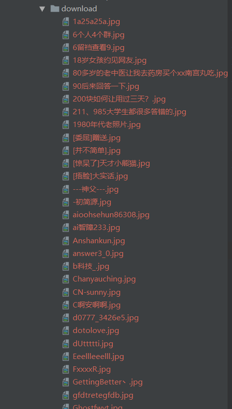

# 手写python爬虫


## 图片爬虫实战
``` 
#!/usr/bin/env python
# -*- coding:utf8 -*-
# auther; 18793
# Date：2019/8/11 21:40
# filename: 01.图片爬虫实战.py
import re
import requests
import os
import urllib.request

"""
https://www.qiushibaike.com/pic/page/1/?s=5218576
https://www.qiushibaike.com/pic/page/2/?s=5218576
https://www.qiushibaike.com/pic/page/3/?s=5218576
https://www.qiushibaike.com/pic/page/4/?s=5218576
"""

urls = ["https://www.qiushibaike.com/pic/page/{}/?s=5218576".format(str(i)) for i in range(1, 31)]

headers = {
    'User-Agent': 'Mozilla/5.0 (Windows NT 10.0; Win64; x64) AppleWebKit/537.36 (KHTML, like Gecko) Chrome/76.0.3809.100 Safari/537.36'
}

URL_flag = "https:"


def get_html(url):
    try:
        response = requests.get(url, headers=headers)
        html = response.text
        return html
    except:
        print("request error")


def craw(url):
    html = get_html(url)
    Photo_info = re.findall('', html, re.S)
    for png in Photo_info:
        if str(png[1]).endswith('/'):
            photo_name = str(png[1]).strip('/').strip('"').strip().strip('"')
            photo_file_name = file_name + "/" + photo_name + ".jpg"
            photo_url = URL_flag + str(png[0]).strip('"')
            data = requests.get(photo_url)
            with open(photo_file_name, 'wb') as f:
                f.write(data.content)
                print("下载 {} 完成......".format(photo_file_name))

            # 或者使用如下方式进行下载
            # urllib.request.urlretrieve(photo_url, filename=photo_file_name)


if __name__ == '__main__':

    file_name = "download"
    if not os.path.exists(file_name):
        os.mkdir(file_name)

    for url in urls:
        craw(url)

```

输出效果
``` 
下载 download/调皮的小汪汪.jpg 完成......
下载 download/我妈看我驼背.jpg 完成......
下载 download/短视的人.jpg 完成......
下载 download/每个月就这么多钱.jpg 完成......
下载 download/漫画奶茶.jpg 完成......
下载 download/两者都做到才是人物.jpg 完成......
```



## 链接爬虫实战
``` 
#!/usr/bin/env python
# -*- coding:utf8 -*-
# auther; 18793
# Date：2019/8/12 12:57
# filename: 02.链接爬虫实战.py
import requests
import re
import urllib
import string
from bs4 import BeautifulSoup

headers = {
    'User-Agent': 'Mozilla/5.0 (Windows NT 10.0; Win64; x64) AppleWebKit/537.36 (KHTML, like Gecko) Chrome/76.0.3809.100 Safari/537.36'
}


def get_html(url):
    try:
        html = requests.get(url, headers=headers)
        return html.text
    except:
        print("request error")


def get_link(url):
    html = get_html(url)
    soup = BeautifulSoup(html, 'lxml')
    infos = soup.select('#feedlist_id  li  div  div.title  h2  a')
    for link in infos:
        # print(link.get_text().strip())
        title = link.get_text().strip()
        links = link.get("href").strip()
        data = {
            "标题": title,
            "链接": links
        }
        print(data)


if __name__ == '__main__':
    url = 'https://blog.csdn.net/nav/python'
    get_link(url)

```

输出信息
``` 
{'链接': 'https://blog.csdn.net/linyuancsdn/article/details/96473067', '标题': '前端单词2 CSS'}
{'链接': 'https://blog.csdn.net/weixin_45427920/article/details/96480141', '标题': '人工智能技术拐点来临 未来将如何发展'}
{'链接': 'https://blog.csdn.net/OUNENGZK/article/details/96865683', '标题': '科学家：在你做出决定之前，人工智能就先做出决定'}
{'链接': 'https://blog.csdn.net/hero5_1/article/details/96017957', '标题': '前端构建工具 gulpjs 的介绍'}
{'链接': 'https://blog.csdn.net/weixin_38324954/article/details/96275233', '标题': '人工智能、机器学习、深度学习'}
{'链接': 'https://blog.csdn.net/CSDN___Jack/article/details/97135756', '标题': '编程语言大视界丨未来三年，那种编程语言最流行？程序员学哪种编程语言最好？'}
{'链接': 'https://blog.csdn.net/qq_36434637/article/details/97003045', '标题': '前端学习笔记-html-链接标签'}
{'链接': 'https://blog.csdn.net/weixin_42832780/article/details/96775984', '标题': '直接作用于治疗环节的可穿戴设备都长什么样'}
{'链接': 'https://blog.csdn.net/weixin_45427920/article/details/96480815', '标题': '人工智能未来发展论文'}
{'链接': 'https://blog.csdn.net/lsj960922/article/details/96137534', '标题': '人工智能 | 智能语音交互技术与应用'}
{'链接': 'https://blog.csdn.net/weixin_45156610/article/details/95021340', '标题': '前端-jQuery基础入门（上）'}
{'链接': 'https://blog.csdn.net/qq_34822461/article/details/96838555', '标题': '一门编程语言的通用知识点'}
{'链接': 'https://blog.csdn.net/FaGuangFZJ/article/details/96478902', '标题': '既要发展也要管制，人工智能是带着枷锁的舞者'}
{'链接': 'https://blog.csdn.net/weixin_44292902/article/details/85273527', '标题': '大数据人工智能培训讲师老师：叶梓简介 人工智能讲师ai讲师大数据讲师人工智能老师'}
{'链接': 'https://blog.csdn.net/CSDN___Jack/article/details/97170312', '标题': '选择编程语言，重点是看你想做什么开发，而不是乱选编程语言！'}
{'链接': 'https://blog.csdn.net/yjw123456/article/details/95936382', '标题': '人工智能数学基础之高等数学(持续更新)'}
{'链接': 'https://blog.csdn.net/O_OMr_Lee/article/details/96858024', '标题': '人工智能未来的健康发展'}
{'链接': 'https://blog.csdn.net/weixin_43790264/article/details/96282271', '标题': '前端学习所得（html+css+jsp）'}
{'链接': 'https://blog.csdn.net/qq_40061206/article/details/95356427', '标题': 'HTML：一种标记语言而不是编程语言（11.0）'}
{'链接': 'https://blog.csdn.net/weixin_45156610/article/details/95014452', '标题': '前端-正则表达式(扩展)'}
{'链接': 'https://blog.csdn.net/qq_38363903/article/details/96739344', '标题': '前端实现直播弹幕'}
```