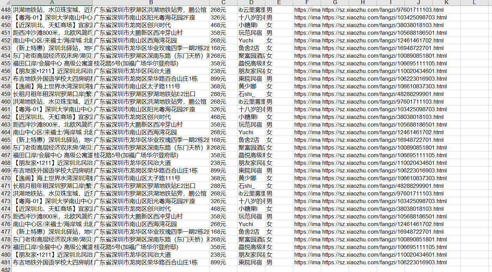
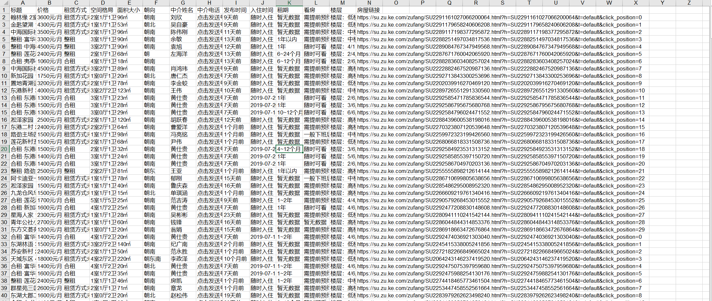

# 使用BeautifulSoup爬取租房信息

## 爬取武汉蔡甸地区短租房信息
``` 
#!/usr/bin/env python
# -*- coding:utf8 -*-
# auther; 18793
# Date：2019/7/9 17:43
# filename: 爬取武汉蔡甸地区短租信息.py
import requests
from bs4 import BeautifulSoup
import re
import xlwt

headers = {

    "User-Agent": "Mozilla/5.0 (Windows NT 10.0; Win64; x64) AppleWebKit/537.36 (KHTML, like Gecko) Chrome/75.0.3770.100 Safari/537.36"
}

info_list_excel = []  # 放置信息的列表，转为列表为放入Excel中


def GetHous_price(url):
    """
    :param url:
    :return: 区域、小区名称、房屋面积、几室几厅、价格
    """

    res = requests.get(url, headers=headers)
    soup = BeautifulSoup(res.text, 'lxml')
    regions = soup.select(
        "#content > div.content__article > div.content__list > div > div > p.content__list--item--des > a:nth-of-type(2)")
    xiaoqu_names = soup.select(
        "#content > div.content__article > div.content__list > div > div > p.content__list--item--des > a:nth-of-type(3)")
    House_area = soup.select(
        "#content > div.content__article > div.content__list > div > div > p.content__list--item--des ")
    House_area = re.findall(".*㎡", str(House_area))
    areas = [area.strip() for area in House_area]
    pattern = soup.select(
        "#content > div.content__article > div.content__list > div > div > p.content__list--item--des")
    pattern = re.findall("\d室\d厅\d卫", str(pattern))
    pattern_infos = [pattern_info.strip() for pattern_info in pattern]
    prices = soup.select("#content > div.content__article > div.content__list > div > div > span > em")
    for i in range(len(pattern_infos)):
        for region, xiaoqu_name, area, pattern_info, price in zip(regions, xiaoqu_names, areas, pattern_infos, prices):
            # info = {
            #     "蔡甸区域": region.get_text(),
            #     "小区名称": xiaoqu_name.get_text(),
            #     "房屋面积": area,
            #     "格局": pattern_info,
            #     "租房价格": price.get_text() + "元"
            # }
            info = [
                region.get_text(), xiaoqu_name.get_text(), area, pattern_info, price.get_text() + "元"

            ]
            info_list_excel.append(info)


# url = "https://wh.zu.ke.com/zufang/caidian/pg2l1/?unique_id=77cc42a7-b824-4808-b574-aee7ced97554zufangcaidianpg2l11562666447973"
urls = [
    "https://wh.zu.ke.com/zufang/caidian/pg{}l1/?unique_id=77cc42a7-b824-4808-b574-aee7ced97554zufangcaidianpg2l11562666146987#contentList".format(
        str(i)) for i in range(2, 12)]
#
for url in urls:
    GetHous_price(url)
# content > div.content__article > div.content__list > div:nth-child(1) > div > p.content__list--item--des > a:nth-child(2)
# #content > div.content__article > div.content__list > div:nth-child(1) > div > p.content__list--item--des > a:nth-child(3)

# GetHous_price(url)
# print(len(info_list))
# for House_list in info_list_excel:
#     print(House_list)

header = ["蔡甸区域", "小区名称", "房屋面积", "格局", "租房价格"]
book = xlwt.Workbook(encoding="utf-8")
sheet = book.add_sheet("Sheet1")
for h in range(len(header)):
    sheet.write(0, h, header[h])
i = 1
for list in info_list_excel:
    j = 0
    for data in list:
        sheet.write(i, j, data)
        j += 1
    i += 1

book.save("zufang.xls")

```

爬取后的数据如下：


## 爬取深圳地区小猪租房信息
``` 
#!/usr/bin/env python
# -*- coding:utf8 -*-
# auther; 18793
# Date：2019/7/10 9:19
# filename: 02.爬取深圳小猪租房信息.py
import requests
from bs4 import BeautifulSoup
import time
import re
import xlwt

info_list = []  # 所有房源信息列表

urls = ["https://sz.xiaozhu.com/search-duanzufang-p{}-0/".format(str(i)) for i in range(2, 31)]

headers = {
    "User-Agent": "Mozilla/5.0 (Windows NT 10.0; Win64; x64) AppleWebKit/537.36 (KHTML, like Gecko) Chrome/75.0.3770.100 Safari/537.36"
}


def check_sex(class_name):
    if class_name == ["member_ico1"]:
        return "女"
    else:
        return "男"


def get_link(url):
    wb_data = requests.get(url, headers)
    soup = BeautifulSoup(wb_data.text, "lxml")
    links = soup.select("#page_list > ul > li > a")
    for link in links:
        href = link.get("href")
        get_info(href)


def get_info(url):
    """
    爬取信息如下：

    标题
    地址
    价格
    房东性别
    房东图片
    房东姓名
    房源链接地址
    :param url:
    :return:
    """
    wb_data = requests.get(url, headers=headers)
    soup = BeautifulSoup(wb_data.text, "lxml")
    tittles = soup.select("div.wrap.clearfix.con_bg > div > div.pho_info > h4 > em")
    address_shenzhen = soup.select("div.wrap.clearfix.con_bg > div > div.pho_info > p > span")
    price_sz = soup.select("#pricePart > div.day_l > span")
    landlord_sex = soup.select("#floatRightBox > div.js_box.clearfix > div.member_pic > div")
    landlord_images = soup.select("#floatRightBox > div.js_box.clearfix > div.member_pic > a > img")
    landlord_names = soup.select("#floatRightBox > div.js_box.clearfix > div.w_240 > h6 > a")
    link_address = url

    for tittle, address, price, landlord_sx, landlord_image, landlord_name in zip(tittles, address_shenzhen,
                                                                                  price_sz, landlord_sex,
                                                                                  landlord_images,
                                                                                  landlord_names):
        # data = {
        #
        #     "标题": tittle.get_text().strip(),
        #     "地址": address.get_text().strip(),
        #     "价格": price.get_text().strip(),
        #     "房东姓名": landlord_name.get_text(),
        #     "房东性别": check_sex(landlord_sx.get("class")),
        #     "房东图片": landlord_image.get("src"),
        #     "房源链接地址": link_address
        # }
        # print(data)
        landlord_info = [
            tittle.get_text().strip(), address.get_text().strip(), price.get_text().strip() + "元", landlord_name.get_text(),
            check_sex(landlord_sx.get("class")), landlord_image.get("src"), link_address
        ]
        info_list.append(landlord_info)


def save_excel(info_list, name="小猪租房信息.xls"):
    header = ["标题", "地址", "价格", "房东姓名", "房东性别", "房东图片", "房源链接"]
    book = xlwt.Workbook(encoding="utf-8")
    sheet = book.add_sheet("Sheet1")
    for h in range(len(header)):
        sheet.write(0, h, header[h])
    i = 1
    for list in info_list:
        j = 0
        for data in list:
            sheet.write(i, j, data)
            j += 1
        i += 1

    book.save(name)


if __name__ == '__main__':
    for url in urls:
        get_link(url)
        time.sleep(2)

    save_excel(info_list)


    # 单页测试
    # url = "https://sz.xiaozhu.com/search-duanzufang-p2-0/"
    # get_link(url)
    # print(info_list)

```



`参考文献：`

[https://www.jianshu.com/p/e3fc4575eef2](https://www.jianshu.com/p/e3fc4575eef2)


## 爬取苏州贝壳工业园区租房信息
``` 
#!/usr/bin/env python
# -*- coding:utf8 -*-
# auther; 18793
# Date：2019/7/10 16:32
# filename: 03.爬取苏州工业园租房信息.py
import requests
import re
from bs4 import BeautifulSoup
import time
import xlwt

info_list = []  # 所有房源信息列表

header_link = "https://su.zu.ke.com"

urls = ["https://su.zu.ke.com/zufang/gongyeyuan/pg{}/?unique_id=77cc42a7-b824-4808-b574-aee7ced97554zufanggongyeyuanpg41562747636616#contentList".format(str(i)) for i in range(2,21)]

headers = {
    "User-Agent": "Mozilla/5.0 (Windows NT 10.0; Win64; x64) AppleWebKit/537.36 (KHTML, like Gecko) Chrome/75.0.3770.100 Safari/537.36"
}


def get_link(url):
    wb_data = requests.get(url, headers)
    soup = BeautifulSoup(wb_data.text, "lxml")
    links = soup.select(
        "#content > div.content__article > div.content__list > div > div > p.content__list--item--title.twoline > a")
    for link in links:
        href = header_link + link.get("href")
        get_info(href)


def get_info(url):
    """
    爬取信息如下：

    "标题":
    "价格":
    "租赁方式
    "空间格局
    "面积大小
    "朝向":
    "中介姓名
    "中介电话
    "发布时间
    "入住时间
    "租期":
    "看房":
    "楼层":
    "房屋链接
    :param url:
    :return:
    """
    wb_data = requests.get(url, headers=headers)
    soup = BeautifulSoup(wb_data.text, "lxml")
    tittles = soup.select("body > div.wrapper > div > div.content.clear.w1150 > p")
    hourse_date1 = soup.select("body > div.wrapper > div > div.content.clear.w1150 > div.content__subtitle")
    hourse_prices = soup.select("#aside > p.content__aside--title > span")
    hourse_sizes = soup.select("#aside > ul > p")
    jieshaorens = soup.select("#aside > ul > li > div.content__aside__list--title.oneline > span")
    jsr_phones = soup.select("#aside > ul > li > div.phone__hover--wrapper > p.phone__hover")
    base_infos = soup.select(
        "body > div.wrapper > div > div.content.clear.w1150 > div.content__article.fl > div.content__article__info > ul")

    hourse_link = url

    for tittle, hourse_price, hourse_size, jieshaoren, jsr_phone, base_info in zip(tittles, hourse_prices, hourse_sizes,
                                                                                   jieshaorens,
                                                                                   jsr_phones, base_infos):
        # data = {
        #
        #     "标题": tittle.get_text().strip(),
        #     "价格": hourse_price.get_text().strip() + "元/月",
        #     "租赁方式": hourse_size.get_text().split()[0],
        #     "空间格局": hourse_size.get_text().split()[1],
        #     "面积大小": hourse_size.get_text().split()[2],
        #     "朝向": hourse_size.get_text().split()[3],
        #     "中介姓名": jieshaoren.get("title"),
        #     "中介电话": jsr_phone.get_text(),
        #     "发布时间": base_info.get_text().split()[1][3:],
        #     "入住时间": base_info.get_text().split()[2][3:],
        #     "租期": base_info.get_text().split()[3][3:],
        #     "看房": base_info.get_text().split()[4][3:],
        #     "楼层": base_info.get_text().split()[5],
        #     "房屋链接": hourse_link
        #
        # }
        # print(data)
        landlord_info = [
            tittle.get_text().strip(), hourse_price.get_text().strip() + "元/月",
            hourse_size.get_text().split()[0],
            hourse_size.get_text().split()[1], hourse_size.get_text().split()[2], hourse_size.get_text().split()[3],
            jieshaoren.get("title"), jsr_phone.get_text(), base_info.get_text().split()[1][3:],
            base_info.get_text().split()[2][3:],
            base_info.get_text().split()[3][3:], base_info.get_text().split()[4][3:], base_info.get_text().split()[5],
            hourse_link
        ]
        info_list.append(landlord_info)


def save_excel(info_list, name="苏州贝壳租房信息.xls"):
    header = ["标题", "价格", "租赁方式", "空间格局", "面积大小", "朝向", "中介姓名", "中介电话", "发布时间", "入住时间", "租期", "看房", "楼层", "房屋链接"]
    book = xlwt.Workbook(encoding="utf-8")
    sheet = book.add_sheet("Sheet1")
    for h in range(len(header)):
        sheet.write(0, h, header[h])
    i = 1
    for list in info_list:
        j = 0
        for data in list:
            sheet.write(i, j, data)
            j += 1
        i += 1

    book.save(name)


if __name__ == '__main__':
    for url in urls:
        get_link(url)
        time.sleep(2)

    save_excel(info_list)

    ## 详细页测试
    # url = "https://su.zu.ke.com/zufang/SU2290567151528460288.html?h=SU2290567151528460288&t=default&click_position=0&nav=0&fb_expo_id=201348460213497861&unique_id=77cc42a7-b824-4808-b574-aee7ced97554zufanggongyeyuan1562741214114"
    # get_info(url)

    ## 单页测试
    # url = "https://su.zu.ke.com/zufang/gongyeyuan/pg4/?unique_id=77cc42a7-b824-4808-b574-aee7ced97554zufanggongyeyuanpg41562747698672"
    # get_link(url)

```


