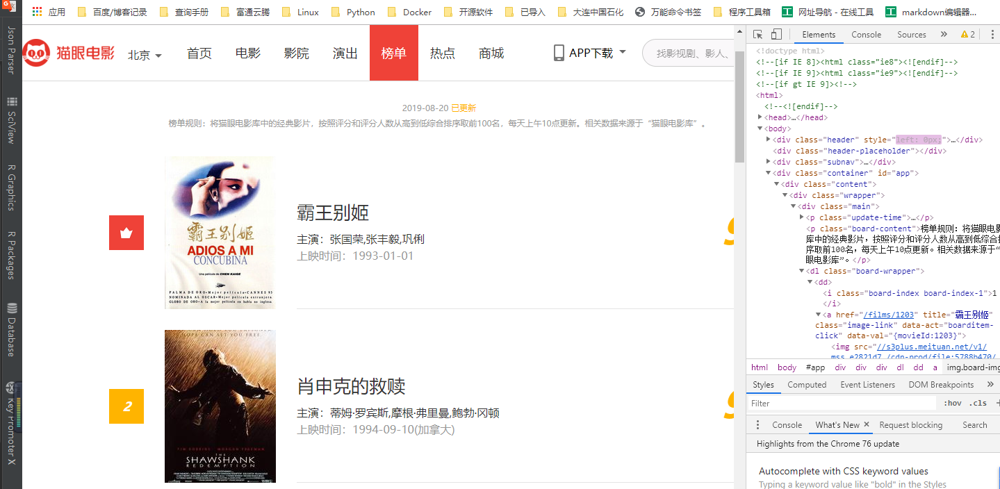
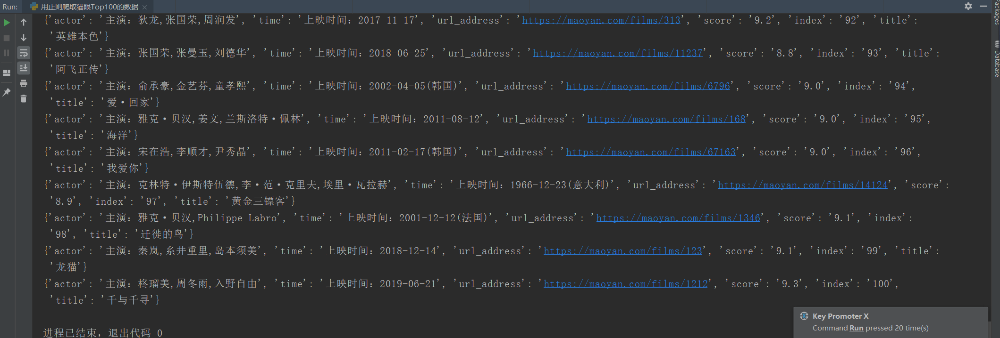

# 案例：爬取猫眼电影TOP100排行



``` 
#!/usr/bin/env python
# -*- coding:utf8 -*-
# auther; 18793
# Date：2019/8/20 11:12
# filename: 用正则爬取猫眼Top100的数据.py

"""
https://maoyan.com/board/4?offset=0
https://maoyan.com/board/4?offset=10
https://maoyan.com/board/4?offset=20
https://maoyan.com/board/4?offset=30

"""


import requests
import re
import json
import time

url_header = "https://maoyan.com"


def get_one_page(url):
    """
    获取源码
    :param url:
    :return:
    """
    try:
        headers = {
            "User-Agent": "Mozilla/5.0 (Windows NT 10.0; Win64; x64) AppleWebKit/537.36 (KHTML, like Gecko) Chrome/76.0.3809.100 Safari/537.36"
        }
        response = requests.get(url, headers=headers)
        if response.status_code == 200:
            return response.text
        return None
    except Exception:
        return None


def Re_regex(html):
    """
    进行数据摘取
    :param html:
    :return:
    """
    pattern = re.compile(
        r'<dd>.*?board-index-\d+">(.*?)</i>.*?<p class="name"><a href=(.*?) title=.*?>(.*?)</a>.*?</p>.*?<p class="star">(.*?)</p>.*?<p class="releasetime">(.*?)</p>.*?</div>.*?<p class="score"><i class="integer">(.*?)</i><i class="fraction">(.*?)</i></p>.*?</dd>',
        re.S)
    move_infos = re.findall(pattern, html)

    for info in move_infos:
        yield {
            'index': info[0],
            'url_address': url_header + info[1].strip('"'),
            'title': info[2],
            'actor': info[3].strip(),
            'time': info[4],
            'score': info[5] + info[6]
        }
        # print(data)


def write_to_file(connent):
    """
    写入文本
    :param connent:
    :return:
    """
    with open('result.txt', 'a', encoding='utf-8') as f:
        # print(type(json.dumps(connent)))
        f.write(json.dumps(connent, ensure_ascii=False) + '\n')


def main():
    urls = ["https://maoyan.com/board/4?offset={}".format(str(i)) for i in range(0, 100, 10)]
    for url in urls:
        html = get_one_page(url)
        for item in Re_regex(html):
            print(item)
            write_to_file(item)
            time.sleep(0.2)


if __name__ == '__main__':
    main()


```

