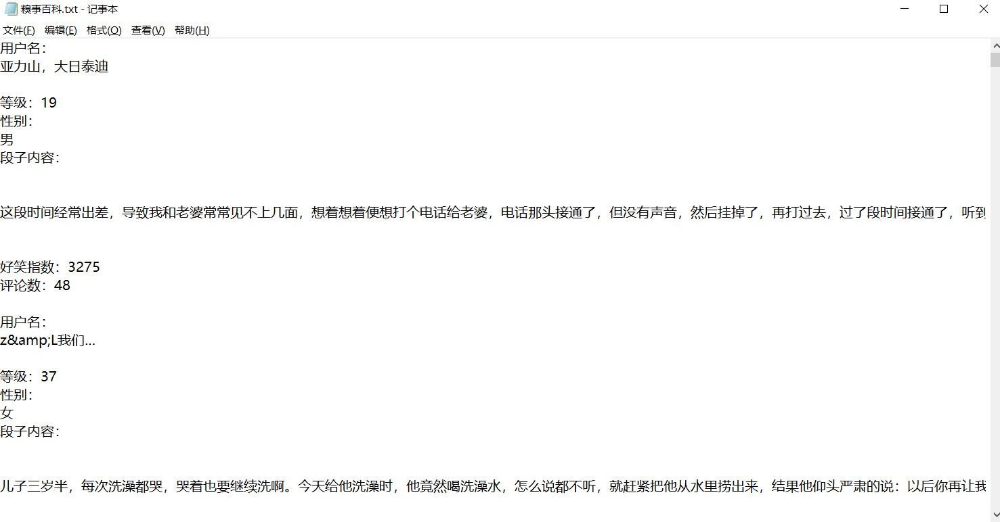

# 爬取糗事百科内容

```
#!/usr/bin/env python
# -*- coding:utf8 -*-
# auther; 18793
# Date：2019/7/10 20:49
# filename: 02.爬取糗事百科内容.py

import requests
import re
import time

headers = {
    "User-Agent": "Mozilla/5.0 (Windows NT 10.0; WOW64; rv:67.0) Gecko/20100101 Firefox/67.0"
}
info_lists = []  # 初始化列表，用于装入爬虫信息


def judgment(class_name):
    if class_name == "womenIcon":
        return "女"
    else:
        return "男"


def get_info(url):
    res = requests.get(url, headers=headers)
    ids = re.findall("<h2>(.*?)</h2>", res.text, re.S)
    levels = re.findall('<div class="articleGender \D+Icon">(.*?)</div>', res.text, re.S)
    sexs = re.findall('<div class="articleGender (.*?)">', res.text, re.S)
    contents = re.findall('<div class="content">.*?<span>(.*?)</span>', res.text, re.S)
    laughs = re.findall('<span class="stats-vote"><i class="number">(\d+)</i> 好笑</span>', res.text, re.S)
    comments = re.findall('<i class="number">(\d+)</i> 评论', res.text, re.S)
    for id, level, sex, content, laugh, comment in zip(ids, levels, sexs, contents, laughs, comments):
        info = {
            "id": id,
            "level": level,
            "sex": judgment(sex),  # 调用judgment_sex()函数
            "content": content,
            "laugh": laugh,
            "comment": comments[0]
        }
        info_lists.append(info)  # 获取数据，加入到列表中


if __name__ == '__main__':
    urls = ["https://www.qiushibaike.com/text/page/{}".format(str(i)) for i in range(2, 10)]
    for url in urls:
        get_info(url)
        time.sleep(0.5)
for info_list in info_lists:  # 遍历列表,创建 TXT文件
    f = open("糗事百科.txt", "a+")
    try:
        f.write('用户名：' + info_list['id'] + '\n')
        f.write('等级：' + info_list['level'] + '\n')
        f.write('性别：' + '\n' + info_list['sex'] + '\n')
        f.write("段子内容：" + info_list['content'] + '\n')
        f.write("好笑指数：" + info_list['laugh'] + '\n')
        f.write("评论数：" + info_list['comment'] + '\n\n')
        f.close()
    except UnicodeEncodeError:
        pass

```

