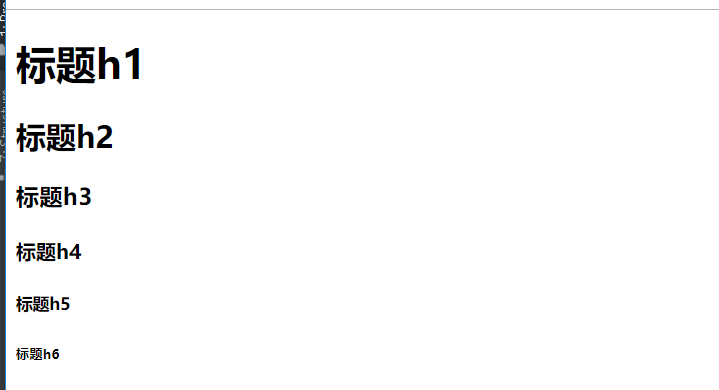
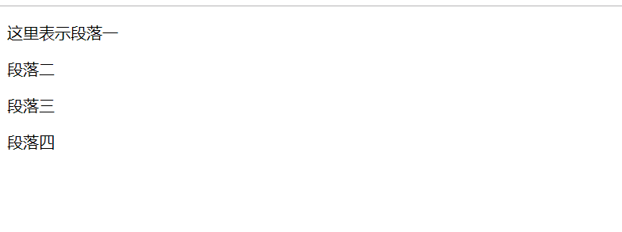
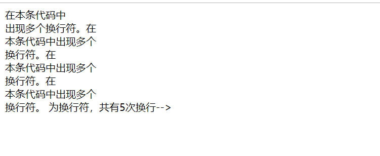
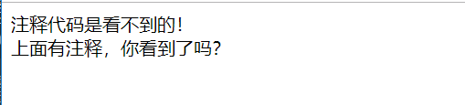
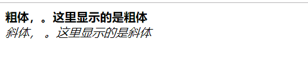
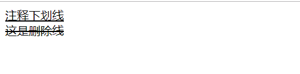
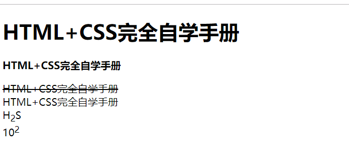

# 常用HTML标记和格式

在网站建设中，HTML用于搭建页面结构，CSS3用于设置页面样式，而JavaScript则用于为页面添加动态效果。


## 6中不同的标题
``` 
<!DOCTYPE html>
<html lang="en">
<head>
    <meta charset="UTF-8">
    <title>标题标记</title>
</head>
<body>
<! --下面是标题标记对-->
<h1>标题h1</h1>
<h2>标题h2</h2>
<h3>标题h3</h3>
<h4>标题h4</h4>
<h5>标题h5</h5>
<h6>标题h6</h6>
</body>
</html>
```



## 多段落表示
``` 
<!DOCTYPE html>
<html lang="en">
<head>
    <meta charset="UTF-8">
    <title>段落</title>
</head>
<body>
<! --这是注释，不会在网页中显示，下面表示有4个段落-->
<p>这里表示段落一</p> <! --段落的标记对-->
<p>段落二
<p>段落三
<p>段落四

</body>
</html>
```


## 一行文字多个换行符
``` 
<!DOCTYPE html>
<html lang="en">
<head>
    <meta charset="UTF-8">
    <title>换行</title>
</head>
<body>
<! --注释，在一行不换行的文本中，多次出现换行符-->
在本条代码中<br> 出现多个换行符。在<br>本条代码中出现多个<br>换行符。在<br>本条代码中出现多个<br>换行符。在<br>本条代码中出现多个<br>换行符。
<! --<br>为换行符，共有5次换行-->
</body>
</html>
```


## 注释
```
<!DOCTYPE html>
<html lang="en">
<head>
    <meta charset="UTF-8">
    <title>注释</title>
</head>
<body>
注释代码是看不到的！
<! --注释标记，这里是多行注释
这里放注释
第二行注释
第三行注释
-->
<br>
上面有注释，你看到了吗？

</body>
</html> 

```


## 粗体和斜体的表示
``` 
<!DOCTYPE html>
<html lang="en">
<head>
    <meta charset="UTF-8">
    <title>粗体与斜体</title>
</head>
<body>
<! --下面表示粗体的用法-->
<b>粗体，。这里显示的是粗体</b> <! --粗体标记对-->
<br>
<! --下面表示斜体用法-->
<i>斜体， 。这里显示的是斜体</i> <! --斜体标记对-->
</body>
</html>
```


## 下划线和删除线
``` 
<!DOCTYPE html>
<html lang="en">
<head>
    <meta charset="UTF-8">
    <title>下划线和删除线</title>
</head>
<body>
<! --下面代码表示下划线-->
<u>注释下划线</u> <! --下划线标记对-->
<br> <! --换行符-->
<! --下面代码表示删除线-->
<s>这是删除线</s> <! --删除线标记对-->
</body>
</html>
```

## 上标和下标
``` 
<!DOCTYPE html>
<html lang="en">
<head>
    <meta charset="UTF-8">
    <title>上标与下标</title>
</head>
<body>
<! --下面表示下标用法-->
这是下标<sub>下标</sub>下标<! --下标标识符>
<br>
<! --下面表示上标用法-->
上市上标<sup>上标</sup><! --上标标识符>
<br>
<! --用上标表示水的化学表达式-->
H<sub>2</sub>O <! --下标标识符>
<br>
<! --用上标表示10的3次方>
10<sup>3</sup> <! --上标标识符>

</body>
</html>
```

## HTML标记和格式实例手把手
``` 
<!DOCTYPE html>
<html lang="en">
<head>
    <meta charset="UTF-8">
    <title>HTML标记和格式实例手把手</title>
</head>
<body>
<! --下面这行表示h1-->
<h1>HTML+CSS完全自学手册</h1> <! --主题内容标题标记对-->
<p>
<! --下面表示用粗体-->
<b>HTML+CSS完全自学手册</b>
<p>
<! --下面表示用删除线-->
<s>HTML+CSS完全自学手册</s>
<br>

<! --下面一行知识被包围在段落中-->
HTML+CSS完全自学手册
<br>
<! --下面一行表示水的化学元素-->
H<sub>2</sub>S<! --下标标识符的标记对-->
<br>

<! --下面一行表示10的2次方-->
10<sup>2</sup><! --上标标识符的标记对-->

</body>
</html>
```



总结
``` 
＜p＞＜！--p为段落开始符--＞
＜h3＞＜！--主体标示符--＞ 
＜b＞＜！--加粗标示符--＞ 
＜i＞＜！--斜体标示符--＞  
  ＜！--空格标示符--＞
 
 
＜sup＞＜！--sup为上标开始符--＞＜/sup＞ 
＜sup＞＜u＞＜！--u为下划线开始符--＞＜/sup＞
```
