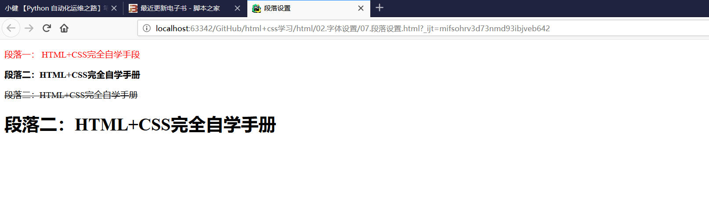

# 字体设置

## 标题字体设置
``` 
<!DOCTYPE html>
<html lang="en">
<head>
    <meta charset="UTF-8">
    <title>标题字体大小</title>
</head>
<body>
<! --注释，以下表述不同的文本字体的大小-->
<! --下一行表示文本字体为1-->
<font size="1">HTML+CSS完全自学手册</font>
<br><!-- 换行-->

<! --下一行表示文本字体为2-->
<font size="2">HTML+CSS完全自学手册</font>
<br>
<font size="3">HTML+CSS完全自学手册</font>
<br>
<font size="4">HTML+CSS完全自学手册</font>
<br>
<font size="5">HTML+CSS完全自学手册</font>
<br>

<! --下一行表示文本字体为7-->
<font size="7">HTML+CSS完全自学手册</font>


</body>
</html>
```


## 设置字体颜色
``` 
<!DOCTYPE html>
<html lang="en">
<head>
    <meta charset="UTF-8">
    <title>字体颜色</title>
</head>
<body>
<! --下一行表示文本颜色为红色-->
<font color="red">html+CSS完全自学手册</font>
<br>
<! --下一行表示文本颜色为#ccccc-->
<font color="#cccccc">html+CSS完全自学手册</font>

<! --下一行表示文本颜色为蓝色-->
<font color="blue">html+CSS完全自学手册</font>
<br>

<! --下一行表示文本颜色为绿色-->
<font color="#006400">html+CSS完全自学手册</font>
<br>
</body>
</html>
```


## 标题字体设置
``` 
<!DOCTYPE html>
<html lang="en">
<head>
    <meta charset="UTF-8">
    <title>标题字体设置</title>
</head>
<body>
<! --下面的行表示在标题中，设置文本字体样式-->
<! --下一行表示对h1标题设置红色字体-->
<h1><font color="red">html+css完全自学手册--h1</font> </h1>

<! --下一行表示对h2标题设置删除线-->
<h2><s>html+css完全自学手册--h1</s> </h2>

<! --下一行表示对h3标题设置粗体-->
<h3><b>html+css完全自学手册--h1</b> </h3>

<! --下一行表示对h4标题设置斜体-->
<h4><i>html+css完全自学手册--h1</i> </h4>

<! --下一行表示对h5标题设置下划线-->
<h5><u>html+css完全自学手册--h1</u> </h5>

<! --下一行表示对h6标题设置字体大小和颜色-->
<h7><font size="3"color="blue">html+css完全自学手册--h1</font> </h7>
</body>
</html>
```


## 物理字体
``` 
<!DOCTYPE html>
<html lang="en">
<head>
    <meta charset="UTF-8">
    <title>物理字体</title>
</head>
<body>
<! --下面表示物理字体用法-->
<b>文字--粗体</b>
<br>
<i>文字--斜体</i>
<br>
<u>文字--下划线</u>
<br>
<sub>文字--上标</sub>
<br>
<sup>文字--下标</sup>
<br>
<s>文字-删除线</s>
<br>
<strike>文字--删除线</strike>
<br>
</body>
</html>
```


## 不换行
``` 
<!DOCTYPE html>
<html lang="en">
<head>
    <meta charset="UTF-8">
    <title>不换行</title>
</head>
<body>
<! --下面一行表示不换行符-->
<nobr>
    HTML+CSS完全自学手册HTML+CSS完全自学手册
    HTML+CSS完全自学手册HTML+CSS完全自学手册
    HTML+CSS完全自学手册HTML+CSS完全自学手册
    HTML+CSS完全自学手册HTML+CSS完全自学手册
</nobr>

</body>
</html>
```


## 文字对齐
``` 
<!DOCTYPE html>
<html lang="en">
<head>
    <meta charset="UTF-8">
    <title>文字对齐</title>
</head>
<body>
<! --下面一行表示段落-->
<p align="right"> HTML+CSS完全自学手册</p>
<center> HTML+CSS完全自学手册----居中</center>

</body>
</html>
```


## 段落设置
``` 
<!DOCTYPE html>
<html lang="en">
<head>
    <meta charset="UTF-8">
    <title>段落设置</title>
</head>
<body>
<! --下面一行表示给不同段落设置不同的样式-->
<p><font color="red">段落一： HTML+CSS完全自学手段</font> </p>
<p><b>段落二：HTML+CSS完全自学手册</b></p>
<p><s>段落二：HTML+CSS完全自学手册</s></p>
<p><h1>段落二：HTML+CSS完全自学手册</h1></p>
</body>
</html>
```



