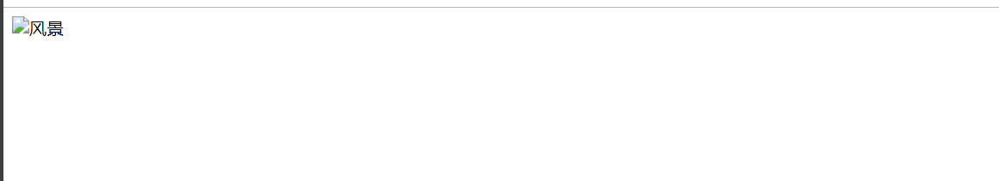

# 图像

## 在网页中插入图像
``` 
<!DOCTYPE html>
<html lang="en">
<head>
    <meta charset="UTF-8">
    <title>插入图像</title>
</head>
<body>
<! --以下是插入图像-->

</body>
</html>
```


## 图像无法显示时的提示信息
``` 
<!DOCTYPE html>
<html lang="en">
<head>
    <meta charset="UTF-8">
    <title>alt用法</title>
</head>
<body>
<! --下面一行表示在图像标记中设置alt-->


</body>
</html>
```


控制图像的大小
``` 
<!DOCTYPE html>
<html lang="en">
<head>
    <meta charset="UTF-8">
    <title>控制图像的大小</title>
</head>
<body>
<! --下面是控制图像的宽度和高度-->


</body>
</html>
```
图像top对齐
``` 
<!DOCTYPE html>
<html lang="en">
<head>
    <meta charset="UTF-8">
    <title>图像top对齐</title>
</head>
<body>
图像与文本top对齐
<br>


</body>
</html>

```


图像与文本顶部对齐、居中对齐、底部对齐
``` 
<!DOCTYPE html>
<html lang="en">
<head>
    <meta charset="UTF-8">
    <title>图像top对齐</title>
</head>
<body>
图像与文本top对齐
<br>


<br>
图像与文本居中对齐
<br>

<br>
图像在底部显示
<br>


</body>
</html>


设置图像边框
```
<!DOCTYPE html>
<html lang="en">
<head>
    <meta charset="UTF-8">
    <title>设置图像边框</title>
</head>
<body>

<!DOCTYPE html>
<html lang="en">
<head>
    <meta charset="UTF-8">
    <title>图片超链接</title>
</head>
<body>
<a href="http：//www.baidu.com">
</body>
</html>


