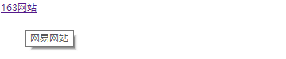

.. contents::
   :depth: 3
..

文字链接
========

.. _文字链接-1:

文字链接
--------

::

   <!DOCTYPE html>
   <html lang="en">
   <head>
       <meta charset="UTF-8">
       <title>文字链接</title>
   </head>
   <body>
   <a href="http://www.163.com">163网站</a>

   </body>
   </html>

文字链接打开方式
----------------

::

   <!DOCTYPE html>
   <html lang="en">
   <head>
       <meta charset="UTF-8">
       <title>文件链接打开方式</title>
   </head>
   <body>
   <a href="http://www.163.com" target="_blank">163网站--新浏览器打开</a>
    
   <a href="http://www.163.com" target="_parent">163网站--父窗口中打开</a>
    
   <a href="http://www.163.com" target="_self">163网站--同一框架或窗口中打开</a>
    
   </body>
   </html>

title的用法
-----------

::

   <!DOCTYPE html>
   <html lang="en">
   <head>
       <meta charset="UTF-8">
       <title>文字链接title的用法</title>
   </head>
   <body>
   <a href="http://www.163.com" title="网易网站">163网站</a>

   </body>
   </html>

