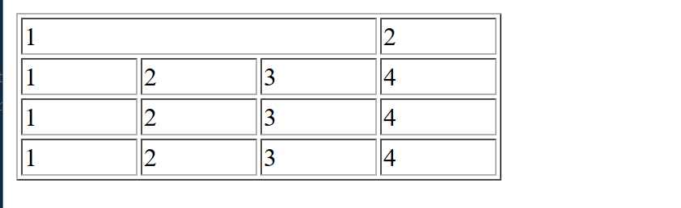
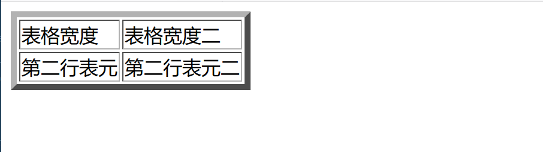

.. contents::
   :depth: 3
..

表格的基本用法
==============

表格的基本语法
==============

::

   <!DOCTYPE html>
   <html lang="en">
   <head>
       <meta charset="UTF-8">
       <title>表格的基本用法</title>
   </head>
   <body>
   <! --设置表格和边框-->
   <table border="1">
       <! --设置表格中的表头-->
       <tr>
           <! --设置表格中的表项-->
           <th>表头一</th>
           <th>表头二</th>
       </tr>
       <tr>
           <td>表元二</td>
           <td>表元二</td>
       </tr>
   </table>

   </body>
   </html>

跨多行表元
==========

::

   <!DOCTYPE html>
   <html lang="en">
   <head>
       <meta charset="UTF-8">
       <title>跨多行表元</title>
   </head>
   <body>
   <! --设置表格-->
   <table border="1" width="300">
       <tr>
           <td rowspan="3">1</td>
           <td>2</td>
           <td>3</td>
           <td>4</td>
       </tr>
       <tr>
           <td>2</td>
           <td>3</td>
           <td>4</td>
       </tr>
       <tr>
           <td>2</td>
           <td>3</td>
           <td>4</td>
       </tr>
       <tr>
           <td>1</td>
           <td>2</td>
           <td>3</td>
           <td>4</td>
       </tr>
   </table>

   </body>
   </html>

.. image:: ../../../_static/html-kuaduohangbiaoyuan.png

跨多列表元
==========

::

   <!DOCTYPE html>
   <html lang="en">
   <head>
       <meta charset="UTF-8">
       <title>跨多行表元</title>
   </head>
   <body>
   <! --设置表格-->
   <table border="1" width="300">
       <tr>
           <td colspan="3">1</td>
           <td>2</td>
       </tr>
       <tr>
           <td>1</td>
           <td>2</td>
           <td>3</td>
           <td>4</td>
       </tr>
       <tr>
           <td>1</td>
           <td>2</td>
           <td>3</td>
           <td>4</td>
       </tr>
       <tr>
           <td>1</td>
           <td>2</td>
           <td>3</td>
           <td>4</td>
       </tr>
   </table>

   </body>
   </html>

表格边框宽度
============

::

   <!DOCTYPE html>
   <html lang="en">
   <head>
       <meta charset="UTF-8">
       <title>表格边框宽度</title>
   </head>
   <body>
   <table border="5">
       <tr>
           <td>表格宽度</td>
           <td>表格宽度二</td>
       </tr>
       <tr>
           <td>第二行表元</td>
           <td>第二行表元二</td>
       </tr>

   </table>

   </body>
   </html>

表格内文字对齐
==============

::

   <!DOCTYPE html>
   <html lang="en">
   <head>
       <meta charset="UTF-8">
       <title>表格文字对齐</title>
   </head>
   <body>
   <table border="1" width="300">
       <tr align="center">
           <td>1</td>
           <td>2</td>
           <td>3</td>
           <td>4</td>
       </tr>
       <tr align="right">
           <td>1</td>
           <td>2</td>
           <td>3</td>
           <td>4</td>
       </tr>
       <tr>
           <td>1</td>
           <td>2</td>
           <td>3</td>
           <td>4</td>
       </tr>
   </table>

   </body>
   </html>

表格在网页的右边
================

::

   <!DOCTYPE html>
   <html lang="en">
   <head>
       <meta charset="UTF-8">
       <title>表格在网页右边</title>
   </head>
   <body>
   <table align="right" border="1" width="300">
       <tr>
           <td>1</td>
           <td>2</td>
           <td>3</td>
           <td>4</td>
       </tr>
       <tr>
           <td>1</td>
           <td>2</td>
           <td>3</td>
           <td>4</td>
       </tr>
       <tr>
           <td>1</td>
           <td>2</td>
           <td>3</td>
           <td>4</td>
       </tr>
   </table>

   </body>
   </html>

实例手把手01
============

::

   <!DOCTYPE html>
   <html lang="en">
   <head>
       <meta charset="UTF-8">
       <title>表格实例手把手1</title>
   </head>
   <body>
   <table border="1">
       <tr>
           <th>星期一</th>
           <th>星期二</th>
           <th>星期三</th>
           <th>星期四</th>
           <th>星期五</th>
       </tr>
       <tr>
           <td>HTML基础</td>
           <td>计算机图形学</td>
           <td>Python入门到精通</td>
           <td>Java门到精通</td>
           <td>Linux门到精通</td>
       </tr>

         <tr>
           <td>C语言</td>
           <td>计算机导论</td>
           <td>C语言程序设计</td>
           <td>法律基础</td>
           <td>shell脚本</td>
       </tr>
         <tr>
           <td>HTML基础</td>
           <td>计算机图形学</td>
           <td>Python入门到精通</td>
           <td>Java门到精通</td>
           <td>Linux门到精通</td>
       </tr>
   </table>

   </body>
   </html>

实例手把手2
===========

::

   <!DOCTYPE html>
   <html lang="en">
   <head>
       <meta charset="UTF-8">
       <title>表格实例手把手1</title>
   </head>
   <body>
   <table border="1">
       <tr>
           <th>星期一</th>
           <th>星期二</th>
           <th>星期三</th>
           <th>星期四</th>
           <th>星期五</th>
       </tr>
       <tr>
           <td>HTML基础</td>
           <td>计算机图形学</td>
           <td rowspan="2">Python入门到精通</td>
           <td>Java门到精通</td>
           <td>Linux门到精通</td>
       </tr>

         <tr>
           <td>C语言</td>
           <td>计算机导论</td>
           <td colspan="2">C语言程序设计</td>

       </tr>
         <tr>
           <td>HTML基础</td>
           <td>计算机图形学</td>
           <td>Python入门到精通</td>
           <td>Java门到精通</td>
           <td>Linux门到精通</td>
       </tr>
   </table>

   </body>
   </html>

.. image:: ../../../_static/html-shilishoubashou0002.png
