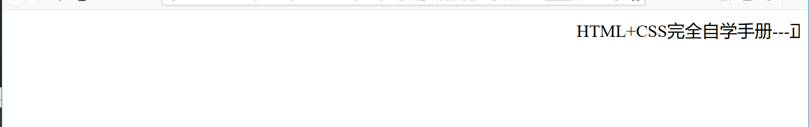
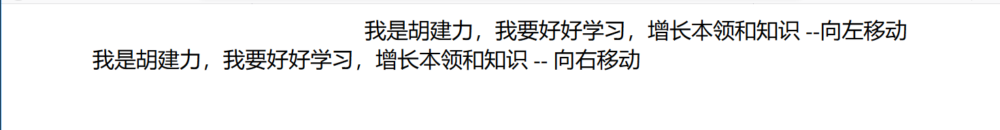
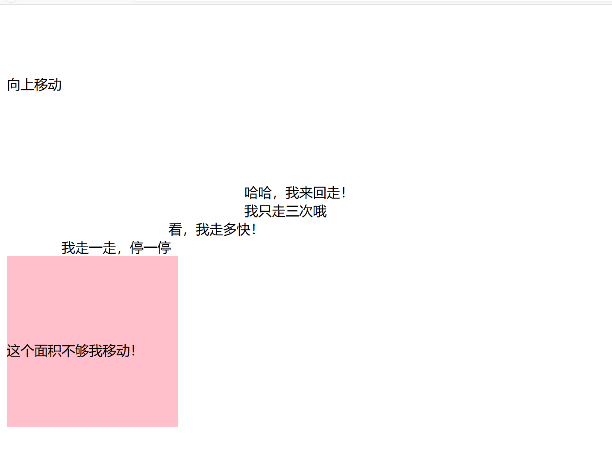

# 移动字体和图片

## 移动的基本语法
``` 
<!DOCTYPE html>
<html lang="en">
<head>
    <meta charset="UTF-8">
    <title>移动的基本语法</title>
</head>
<body>
 <! --移动标签对，里面的文本将会移动>
<marquee>
    HTML+CSS完全自学手册---正在移动
</marquee>

</body>
</html>
```


## 移动的方向
``` 
<!DOCTYPE html>
<html lang="en">
<head>
    <meta charset="UTF-8">
    <title>文字的移动方向</title>
</head>
<body>
<! --当不设置direction值时，那边说默认向左-->
<marquee>
    我是胡建力，我要好好学习，增长本领和知识 --向左移动
</marquee>

<! --设置direction值为右-->
<marquee direction="right">
    我是胡建力，我要好好学习，增长本领和知识 -- 向右移动
</marquee>
</body>
</html>
```


## 图片的移动
``` 
<!DOCTYPE html>
<html lang="en">
<head>
    <meta charset="UTF-8">
    <title>图片的移动</title>
</head>
<body>
<! --设置移动区域大小-->
<marquee width="400px" height="200px" bgcolor="#666666">
    图片的大小在marquee中移动
</marquee>

</body>
</html>
```

## 设置对象移动
``` 
<!DOCTYPE html>
<html lang="en">
<head>
    <meta charset="UTF-8">
    <title>设置对象移动</title>
</head>
<body>
<! --设置不同对象的移动-->
<marquee direction="up">向上移动</marquee>
<marquee direction="left behavior=alternate">哈哈，我来回走！</marquee>
<marquee loop="3">我只走三次哦</marquee>
<marquee scrollamount="25">看，我走多快！</marquee>
<marquee scrollamount="1000">我走一走，停一停</marquee>
<marquee width="200" height="200" bgcolor="pink" direction=down>这个面积不够我移动！</marquee>
</body>
</html>
```

