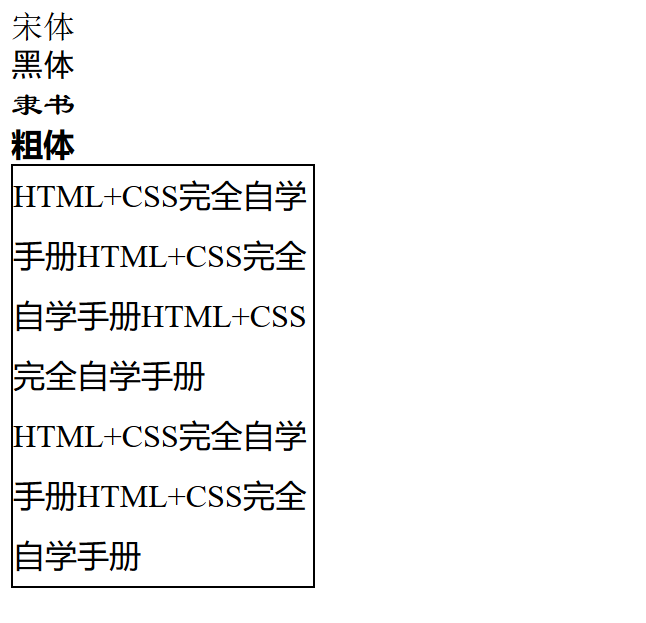

# 如何用DIV布局
``` 
<!DOCTYPE html>
<html lang="en">
<head>
    <meta charset="UTF-8">
    <title>如何使用DIV布局</title>
</head>
<style type="text/css">
    #header{
        width: 778px;
        margin: auto;
        border: 1px solid#bbbbbb;
    }
    #logo{
        width: 180px;
        height: 00px;
        float: left;
        border: 1px solid#cccccc;
    }
    .ad468{
        width: 468px;
        height: 60px;
        float: left;
        margin: 20px 0px 0px 100px;
        border: 1px solid#cccccc;
    }
    #banner{
        width: 778px;
        height: 30px;
        margin: 5px 0px;
        text-align: center;
        border: 1px solid#cccccc;
    }
    #content{
        width: 778px;
        height: auto;
        border: 1px solid#cccccc;
    }
    #newsad{
        width: 260px;
        height: 260px;
        margin: 5px;
        float: right;
        border: 1px solid#cccccc;
    }
    #news{
        width: 480px;
        height: 260px;
        margin: 5px;
        border: 1px solid#cccccc;
    }
    #bottom{
        width: 778px;
        margin: auto;
        height: 80px;
        margin-top: 10px;
        border: 1px solid#cccccc;
    }
</style>


<body>
<div id="header">
    <div id="logo">log---网站图标</div>
    <div class="ad468">468像素广告</div>
</div>
<div id="banner">导航条</div>
<div id="content">
    <div id="newsad">新闻右边的广告</div>
    <div id="news">新闻内容</div>
</div>
<div id="bottom">网页底部</div>
</body>
</html>
```

## DIV+CSS组合显示字体大小
``` 
<!DOCTYPE html>
<html lang="en">
<head>
    <meta charset="UTF-8">
    <title>字体大小</title>
</head>
<style type="text/css">
    #xxsmall{
        font-size: xx-small;
    }

    #xsmall{
        font-size: x-small;
    }
    #small{
        font-size: small;
    }

    #large{
        font-size: large;
    }
    #xlarge{
        font-size: x-large;
    }
    #xxlarge{
        font-size: xx-large;
    }
</style>
<body>
<p id="xxsmall">HTML+CSS学习手册1</p>
<p id="xsmall">HTML+CSS学习手册2</p>
<p id="small">HTML+CSS学习手册3</p>
<p id="large">HTML+CSS学习手册4</p>
<p id="xlarge">HTML+CSS学习手册5</p>
<p id="xxlarge">HTML+CSS学习手册6</p>

</body>
</html>
```


## div+css 字体风格
``` 
<!DOCTYPE html>
<html lang="en">
<head>
    <meta charset="UTF-8">
    <title>字体类型</title>
</head>
<style type="text/css">
    #fontclass1{
        font-family: "宋体";
    }
    #fontclass2{
        font-family: "微软雅黑";
    }
    #fontclass3{
        font-family: "微软雅黑 Light";
    }
    #fontclass4 {
        font-family: 华文隶书;
    }


</style>
<body>
<div id="fontclass1">HTML+CSS学习手册1-宋体</div>
<div id="fontclass2">HTML+CSS学习手册2-微软雅黑</div>
<div id="fontclass3">HTML+CSS学习手册3-微软雅黑 Light</div>
<div id="fontclass4">HTML+CSS学习手册4-华文隶书</div>


</body>
</html>
```


## div+css设置行距
``` 
<!DOCTYPE html>
<html lang="en">
<head>
    <meta charset="UTF-8">
    <title>设置行距</title>
</head>
<style type="text/css">
    #font5{
        width: 230px;
        border: 1px solid#000000;
        line-height: 30px;
    }
</style>
<body>

<div id="font5"> HTML+CSS 完全自学手册HTML+CSS 完全自学手册HTML+CSS 完全自学手册HTML+CSS 完全自学手册</div>

</body>
</html>
```


## div+css 动手实验
``` 
<!DOCTYPE html>
<html lang="en">
<head>
    <meta charset="UTF-8">
    <title>字体实例手把手01</title>
</head>
<style type="text/css">
    #font1{
        font-family: "宋体";
    }

    #font2{
        font-family: "黑体";
    }

    #font3{
        font-family: "隶书";
    }

    #font4{
        /* 设置字体为粗体 */
        font-weight: bolder;
    }

    #font5{
        width: 150px;
        border: 1px solid#000000;
        line-height: 30px;
        word-spacing: 10px;
        letter-spacing: 5px;
    }
</style>
<body>
<div id="font1">宋体</div>
<div id="font2">黑体</div>
<div id="font3">隶书</div>
<div id="font4">粗体</div>
<div id="font5">HTML+CSS完全自学手册HTML+CSS完全自学手册HTML+CSS完全自学手册
HTML+CSS完全自学手册HTML+CSS完全自学手册
</div>
</body>
</html>
```



## 文本大小写属性转换
``` 
<!DOCTYPE html>
<html lang="en">
<head>
    <meta charset="UTF-8">
    <title>text-transform属性</title>
</head>
<style type="text/css">
    .mydiv{
        width: auto;
        margin: 5px;
        padding: 5px;
        border: 1px solid#000000;
    }
    /* 设置文本修饰 */
    #tran1{
        text-transform: none;

    }
    #tran2{
        /* 转为大写 */
        text-transform: capitalize;
    }
    #tran3{
        /* 转为首字母大写 */
        text-transform: uppercase;
    }
    #tran4{
        /* 转为小写 */
        text-transform: lowercase;
    }
</style>
<body>
<div class="mydiv">
    输入小写的:html+css<br>
    <input type="text" id="tran1">
    值为none：无转换发送。
</div>
<div class="mydiv">
    输入小写的:html+css<br>
    <input type="text" id="tran2">
    值为capitalize:每个词的首字母大写，只有为小写输入状态转换才发生。
</div>
<div class="mydiv">
    输入小写的:html+css<br>
    <input type="text" id="tran3">
    uppercase:转换成大写
</div>

<div class="mydiv">
    输入大写的:html+css<br>
    <input type="text" id="tran4">
    lowercase:转换成小写
</div>


</body>
</html>
```
