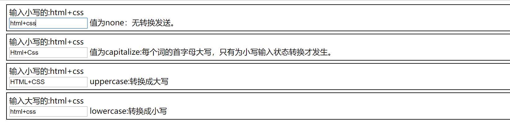

.. contents::
   :depth: 3
..

如何用DIV布局
=============

::

   <!DOCTYPE html>
   <html lang="en">
   <head>
       <meta charset="UTF-8">
       <title>如何使用DIV布局</title>
   </head>
   

   <body>
   

       
log---网站图标

       
468像素广告

   

   
导航条

   

       
新闻右边的广告

       
新闻内容

   

   
网页底部

   </body>
   </html>

DIV+CSS组合显示字体大小
-----------------------

::

   <!DOCTYPE html>
   <html lang="en">
   <head>
       <meta charset="UTF-8">
       <title>字体大小</title>
   </head>
   
   <body>
   
HTML+CSS学习手册1

   
HTML+CSS学习手册2

   
HTML+CSS学习手册3

   
HTML+CSS学习手册4

   
HTML+CSS学习手册5

   
HTML+CSS学习手册6

   </body>
   </html>

div+css 字体风格
----------------

::

   <!DOCTYPE html>
   <html lang="en">
   <head>
       <meta charset="UTF-8">
       <title>字体类型</title>
   </head>
   
   <body>
   
HTML+CSS学习手册1-宋体

   
HTML+CSS学习手册2-微软雅黑

   
HTML+CSS学习手册3-微软雅黑 Light

   
HTML+CSS学习手册4-华文隶书

   </body>
   </html>

.. image:: ../../../_static/css00002.png

div+css设置行距
---------------

::

   <!DOCTYPE html>
   <html lang="en">
   <head>
       <meta charset="UTF-8">
       <title>设置行距</title>
   </head>
   
   <body>

   
 HTML+CSS 完全自学手册HTML+CSS 完全自学手册HTML+CSS 完全自学手册HTML+CSS 完全自学手册

   </body>
   </html>

div+css 动手实验
----------------

::

   <!DOCTYPE html>
   <html lang="en">
   <head>
       <meta charset="UTF-8">
       <title>字体实例手把手01</title>
   </head>
   
   <body>
   
宋体

   
黑体

   
隶书

   
粗体

   
HTML+CSS完全自学手册HTML+CSS完全自学手册HTML+CSS完全自学手册
   HTML+CSS完全自学手册HTML+CSS完全自学手册
   

   </body>
   </html>

.. image:: ../../../_static/html+css000003.png

文本大小写属性转换
------------------

::

   <!DOCTYPE html>
   <html lang="en">
   <head>
       <meta charset="UTF-8">
       <title>text-transform属性</title>
   </head>
   
   <body>
   

       输入小写的:html+css 
       <input type="text" id="tran1">
       值为none：无转换发送。
   

   

       输入小写的:html+css 
       <input type="text" id="tran2">
       值为capitalize:每个词的首字母大写，只有为小写输入状态转换才发生。
   

   

       输入小写的:html+css 
       <input type="text" id="tran3">
       uppercase:转换成大写
   

   

       输入大写的:html+css 
       <input type="text" id="tran4">
       lowercase:转换成小写
   

   </body>
   </html>

