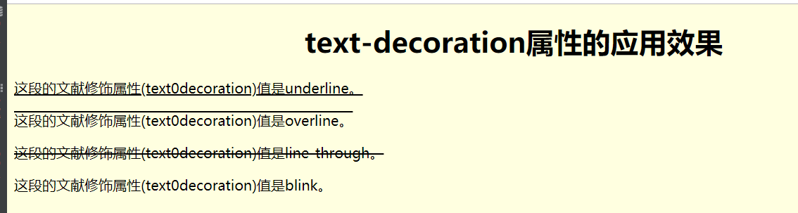
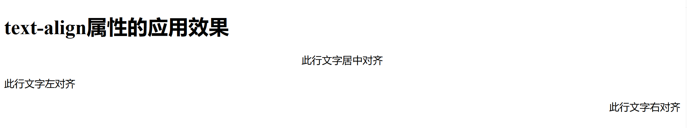
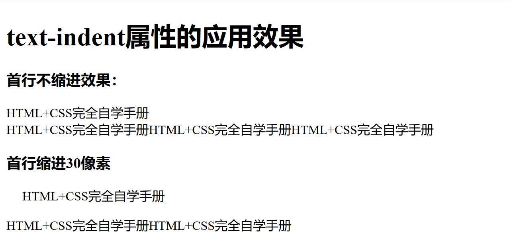

.. contents::
   :depth: 3
..

文本设置
========

文本修饰属性
------------

::

   <!DOCTYPE html>
   <html lang="en">
   <head>
       <meta charset="UTF-8">
       <title>文本修饰属性</title>
   </head>
   
   <body bgcolor="#ffffe0">
   

       <h1>text-decoration属性的应用效果</h1>
   

   
这段的文献修饰属性(text0decoration)值是underline。

   
这段的文献修饰属性(text0decoration)值是overline。

   
这段的文献修饰属性(text0decoration)值是line-through。

   
这段的文献修饰属性(text0decoration)值是blink。

   </body>
   </html>

文字属性，对齐
--------------

::

   <!DOCTYPE html>
   <html lang="en">
   <head>
       <meta charset="UTF-8">
       <title>text-align属性</title>
   </head>
   
   <body>
   <h1>text-align属性的应用效果</h1>
   
此行文字居中对齐

   
此行文字左对齐

   
此行文字右对齐

   </body>
   </html>

文本首行缩进
------------

::

   <!DOCTYPE html>
   <html lang="en">
   <head>
       <meta charset="UTF-8">
       <title>首行缩进</title>
       
   </head>
   <body>
   <h1>text-indent属性的应用效果</h1>
   <h3>首行不缩进效果：</h3>
   
HTML+CSS完全自学手册 
   HTML+CSS完全自学手册HTML+CSS完全自学手册HTML+CSS完全自学手册
   <h3>首行缩进30像素</h3>
   
HTML+CSS完全自学手册

   HTML+CSS完全自学手册HTML+CSS完全自学手册
   </body>
   </html>

