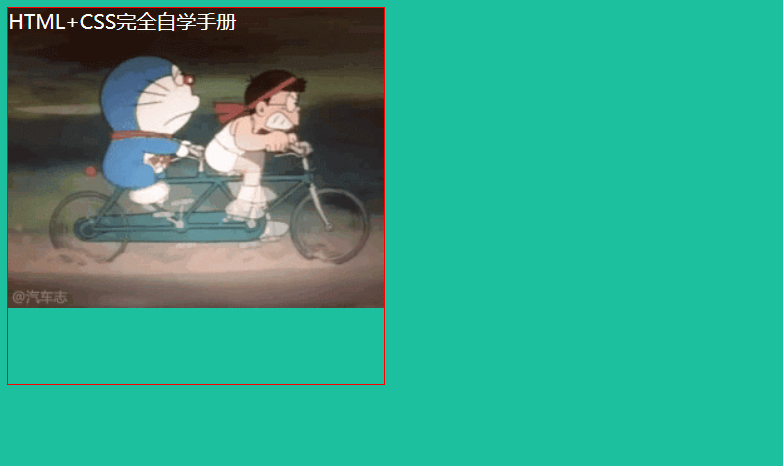
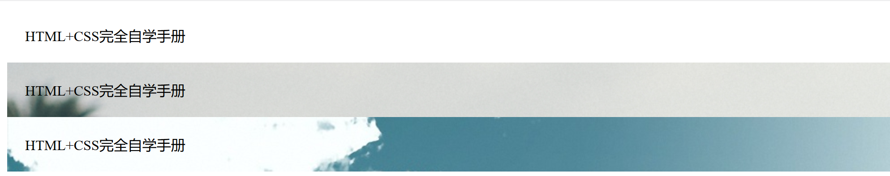

# 背景设置
``` 
<!DOCTYPE html>
<html lang="en">
<head>
    <meta charset="UTF-8">
    <title>背景的语法</title>
    <style type="text/css">

        body{
            background: #1cc09f;
        }
        #box{
            /* 设置宽度和高度 */
            width: 300px;
            height: 300px;
            /* 设置边框*/
            border:1px solid red;
            /* 设置字体颜色 */
            color: #ffffff;
            /* 设置背景颜色，引入photo.gif为背景，重复X抽*/
            background: url("Am.gif") repeat-x;
        }


    </style>
</head>
<body>
<! --设置层-->
<div id="box">
    HTML+CSS完全自学手册
</div>
</body>
</html>
```



## 设置背景图片
``` 
<!DOCTYPE html>
<html lang="en">
<head>
    <meta charset="UTF-8">
    <title>设置背景图像</title>
</head>
<style type="text/css">
    #id1{
        /* 内补丁为20像素，没有背景图片*/
        padding: 20px;
        background-image: none;
    }
    #id2{
        /* 内补丁为20像素，背景图片1*/
        padding: 20px;
        background-image: url("96440.jpg");
    }

    #id3{
        /* 内补丁为20像素，背景图片2*/
        padding: 20px;
        background-image: url("84631.jpg");
    }
</style>
<body>
<! -层设置-->
<div id="id1">
    HTML+CSS完全自学手册
</div>

<div id="id2">
    HTML+CSS完全自学手册
</div>

<div id="id3">
    HTML+CSS完全自学手册
</div>

</body>
</html>
```


