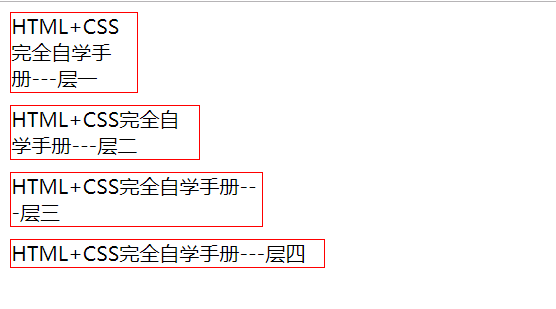

.. contents::
   :depth: 3
..

尺寸设置
========

::

   <!DOCTYPE html>
   <html lang="en">
   <head>
       <meta charset="UTF-8">
       <title>尺寸实例手把手</title>
       
   </head>
   <body>
   

       HTML+CSS完全自学手册---层一
   

   

       HTML+CSS完全自学手册---层二
   

   

       HTML+CSS完全自学手册---层三
   

   

       HTML+CSS完全自学手册---层四
   

   </body>
   </html>

