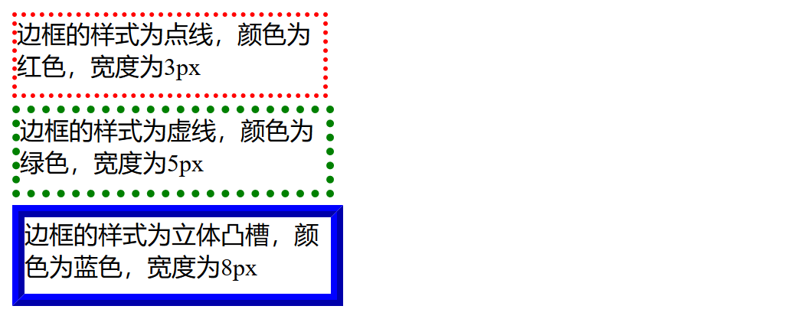
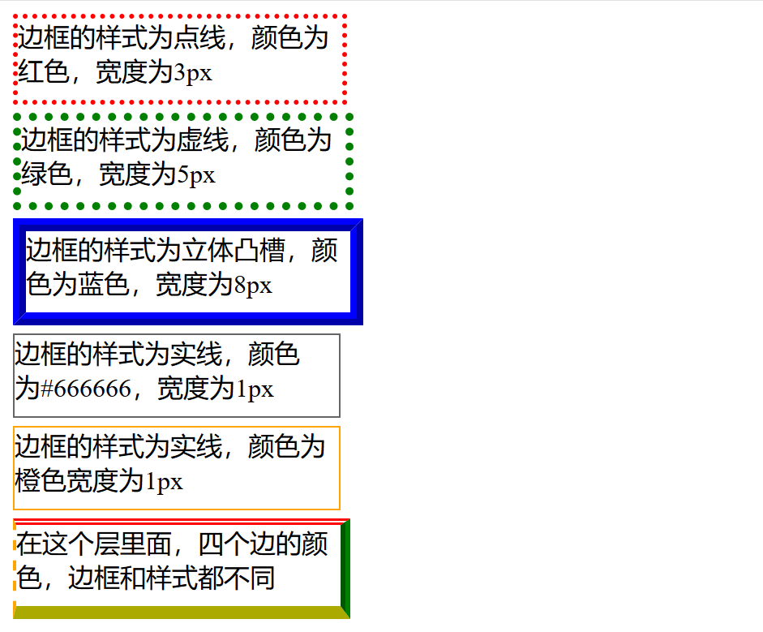
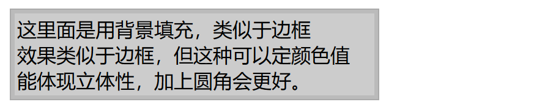

# 边框样式

## 设置边框线条和颜色
``` 
<!DOCTYPE html>
<html lang="en">
<head>
    <meta charset="UTF-8">
    <title>边框实例手把手</title>
    <style type="text/css">
        div{
            width: 200px;
            height: 50px;
            margin-top: 5px;
        }

        #b1{
            /* 设置边框为3像素红色点线 */
            border: 3px dotted red;

        }

        #b2{
            /* 设置边框为5像素绿色虚线 */
            border: 5px dotted green;

        }
        #b3{
            /* 设置边框为8像素蓝色立体凸槽 */
            border: 8px ridge blue;

        }
    </style>
</head>
<body>
<div id="b1">边框的样式为点线，颜色为红色，宽度为3px</div>
<div id="b2">边框的样式为虚线，颜色为绿色，宽度为5px</div>
<div id="b3">边框的样式为立体凸槽，颜色为蓝色，宽度为8px</div>


</body>
</html>
```


## 边框颜色和属性
``` 
<!DOCTYPE html>
<html lang="en">
<head>
    <meta charset="UTF-8">
    <title>边框实例手把手</title>
    <style type="text/css">
        div{
            width: 200px;
            height: 50px;
            margin-top: 5px;
        }

        #b1{
            /* 设置边框为3像素红色点线 */
            border: 3px dotted red;

        }

        #b2{
            /* 设置边框为5像素绿色虚线 */
            border: 5px dotted green;

        }
        #b3{
            /* 设置边框为8像素蓝色立体凸槽 */
            border: 8px ridge blue;

        }
        #b4{
            /* 设置边框为8像素蓝色立体凸槽 */
            border: 1px solid#666666;

        }
        #b5{
            border: 1px solid orange;
        }
        #b6{
            border-top: 4px double red;
            border-right: 6px groove green;
            border-bottom: 8px outset yellow;
            border-left: 2px dashed orange;
        }
    </style>
</head>
<body>
<div id="b1">边框的样式为点线，颜色为红色，宽度为3px</div>
<div id="b2">边框的样式为虚线，颜色为绿色，宽度为5px</div>
<div id="b3">边框的样式为立体凸槽，颜色为蓝色，宽度为8px</div>
<div id="b4">边框的样式为实线，颜色为#666666，宽度为1px</div>
<div id="b5">边框的样式为实线，颜色为橙色宽度为1px</div>
<div id="b6">在这个层里面，四个边的颜色，边框和样式都不同</div>


</body>
</html>
```


## 边框背景填充
``` 
<!DOCTYPE html>
<html lang="en">
<head>
    <meta charset="UTF-8">
    <title>多层边框</title>
    <style type="text/css">
        #myborder{
            width: 300px;
            background: #bbbbbb;
            border: 1px solid#aaaaaa;
        }
        #mybog{
            margin: 3px;
            padding: 2px;
            background: #cccccc;
        }

    </style>
</head>
<body>
<div id="myborder">
<div id="mybog">
    这里面是用背景填充，类似于边框<br>
    效果类似于边框，但这种可以定颜色值<br>
    能体现立体性，加上圆角会更好。
    </div>
</div>

</body>
</html>
```

