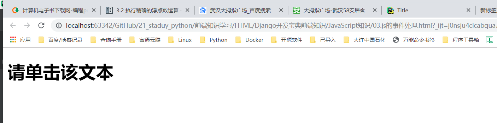
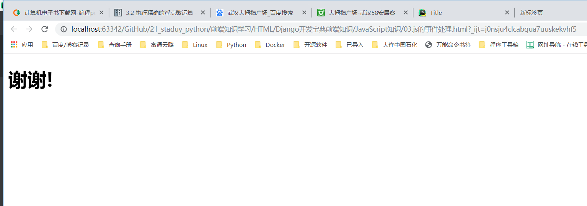

# JavaScript HTML DOM事件
``` 
<!DOCTYPE html>
<html lang="en">
<head>
    <meta charset="UTF-8">
    <title>Title</title>
    <script>
        function changetext(id) {
            id.innerHTML = "谢谢!";
        }
    </script>
</head>

<body>

<h1 onclick="changetext(this)"> 请单击该文本 </h1>
</body>
</html>
```






eg 

``` 
<!DOCTYPE html>
<html>
<head> 
<meta charset="utf-8"> 
<title>W3Cschool教程(w3cschool.cn)</title> 
</head>
<body>

<p>点击按钮执行 <em>displayDate()</em> 函数.</p>
<button onclick="displayDate()">点我</button>

<script>
function displayDate()
{
	document.getElementById("demo").innerHTML=Date();
}
</script>
<p id="demo"></p>

</body>
</html>
```

eg

元素删除
``` 
<!DOCTYPE html>
<html>
<head>
<meta charset="utf-8">
<title>W3Cschool教程(w3cschool.cn)</title>
</head>
<body>

<div id="div1">
	<p id="p1">这是一个段落。</p>
	<p id="p2">这是另一个段落。</p>
</div>
<script>
var parent=document.getElementById("div1");
var child=document.getElementById("p1");
// 找到结点p1,然后将节点p1删除
parent.removeChild(child);
</script>

</body>
</html>
```

元素追加
``` 
<!DOCTYPE html>
<html>
<head>
<meta charset="utf-8">
<title>W3Cschool教程(w3cschool.cn)</title>
</head>
<body>

<div id="div1">
<p id="p1">这是一个段落。</p>
<p id="p2">这是另一个段落。</p>
</div>
<script>
var para=document.createElement("p");
var node=document.createTextNode("这是一个新段落。");
para.appendChild(node);
var element=document.getElementById("div1");
element.appendChild(para);
</script>

</body>
</html>
```
