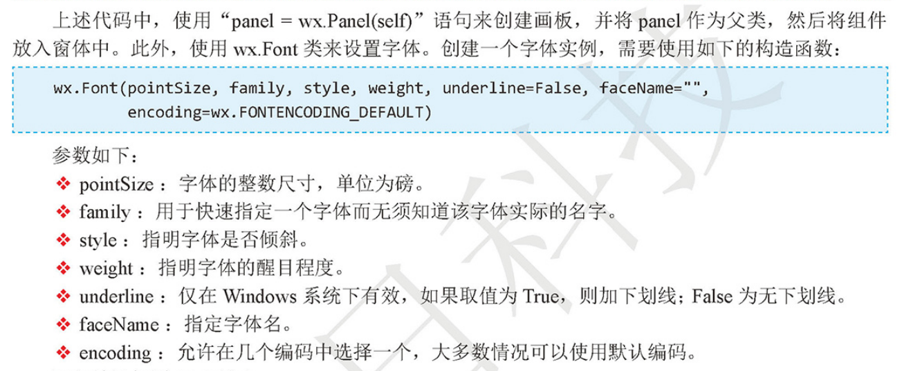

# wxPython框架的使用
## 1 安装wxPython

wxPython 是个成熟而且特性丰富的跨平台GUI工具包。
由Robin Dunn 和Ham Pasanen 开发 

`官方网站： http://wxpython.org/`

wxPython 的安装非常简单， 

使用pip 工具安装只需要一行命令：
    
    #国外pip源，经常会出现超时的现象，-U更新模块
    pip install -U wxPython
    
    # 使用国内豆瓣pip源
    pip install -i https://pypi.doubanio.com/simple/ --trusted-host pypi.doutsnio.com wxpython
    
    
## 创建一个wx.App子类
``` 
#!/usr/bin/env python
#-*- coding:utf8 -*-
# auther; 18793
# Date：2019/4/16 13:22
# filename: 01.创建一个wx.app子类.py
import wx

class App(wx.App):
    ''' 创建wx.App的子类App'''

    def OnInit(self):
        '''初始化方法'''
        frame = wx.Frame(parent=None,title="Hello wypython")    #创建窗口
        frame.Show()    #显示窗口
        return True

if __name__ == '__main__':
    app = App()         #实例化App类
    app.MainLoop()      #调用App类中的MainLoop()主循环方法
```

## 直接使用wx.App类
``` 
#!/usr/bin/env python
#-*- coding:utf8 -*-
# auther; 18793
# Date：2019/4/16 13:28
# filename: 02.直接使用wx.App的方式.py
import wx
app = wx.App()      #实例化wx类
frame = wx.Frame(None,title="Hello wxPython")       #初始化wx.App类
frame.Show()                #显示窗口
app.MainLoop()              #调用wx.App类的MailLoop()主循环方法
```

## 使用wx.Frame框架

``` 
#!/usr/bin/env python
# -*- coding:utf8 -*-
# auther; 18793
# Date：2019/4/16 13:32
# -*- coding:utf-8 -*-
import wx  # 导入wxPython


class MyFrame(wx.Frame):
    def __init__(self, parent, id):
        wx.Frame.__init__(self,parent,id, title="创建Frame",pos=(100, 100), size=(300, 300))


if __name__ == '__main__':
    app = wx.App()  # 初始化应用
    frame = MyFrame(parent=None, id=-1)  # 实例MyFrame类，并传递参数
    frame.Show()  # 显示窗口
    app.MainLoop()  # 调用MainLoop()主循环方法

```

## 常用控件
### wx.StaticText类

``` 
#!/usr/bin/env python
# -*- coding:utf8 -*-
# auther; 18793
# Date：2019/4/16 13:56
# filename: 文字框输出.py

import wx  # 导入wxPython


class MyFrame(wx.Frame):
    def __init__(self, parent, id):
        wx.Frame.__init__(self, parent, id, title="创建StaticText 文本", pos=(100, 100), size=(600, 400))
        #创建画板
        panel = wx.Panel(self)
        # 创建标题，并设置字体
        title = wx.StaticText(panel, label="Python之阐---by Tim Peters", pos=(100, 20))
        font = wx.Font(16, wx.DEFAULT, wx.FONTSTYLE_NORMAL,wx.NORMAL)
        title.SetFont(font)
        #创建文本
        wx.StaticText(panel, label="Beautiful is better than ugly.", pos=(50, 50))
        wx.StaticText(panel, label="Explicit is better than implicit.", pos=(50, 70))
        wx.StaticText(panel, label="Simple is better than complex.", pos=(50, 90))


if __name__ == '__main__':
    app = wx.App()  # 初始化应用
    frame = MyFrame(parent=None, id=-1)  # 实例MyFrame类，并传递参数
    frame.Show()  # 显示窗口
    app.MainLoop()  # 调用MainLoop()主循环方法

```


## 使用wx.TextCtrl实现登录界面
``` 
#!/usr/bin/env python
# -*- coding:utf8 -*-
# auther; 18793
# Date：2019/4/16 14:30
# filename: 使用wx.TextCtrl实现登录界面.py

import wx  # 导入wxPython


class MyFrame(wx.Frame):
    def __init__(self, parent, id):
        wx.Frame.__init__(self, parent, id, title="创建TextCtrl", pos=(100, 100), size=(400, 300))
        # 创建面板
        panel = wx.Panel(self)

        # 创建文本和输入框
        self.title = wx.StaticText(panel, label="请输入用户名和密码 ", pos=(140, 20))
        self.label_user = wx.StaticText(panel, label="用户名: ", pos=(50, 50))
        self.text_user = wx.TextCtrl(panel, pos=(100, 50), size=(235, 25), style=wx.TE_LEFT)
        self.label_pwd = wx.StaticText(panel, pos=(50, 90), label="密码: ")
        self.text_password = wx.TextCtrl(panel, pos=(100, 90), size=(235, 25), style=wx.TE_PASSWORD)


if __name__ == '__main__':
    app = wx.App()  # 初始化应用
    frame = MyFrame(parent=None, id=-1)  # 实例MyFrame类，并传递参数
    frame.Show()  # 显示窗口
    app.MainLoop()  # 调用MainLoop()主循环方法

```

## Button按钮类


``` 
#!/usr/bin/env python
# -*- coding:utf8 -*-
# auther; 18793
# Date：2019/4/16 14:30
# filename: 

import wx  # 导入wxPython


class MyFrame(wx.Frame):
    def __init__(self, parent, id):
        wx.Frame.__init__(self, parent, id, title="创建TextCtrl", pos=(100, 100), size=(400, 300))
        # 创建面板
        panel = wx.Panel(self)

        # 创建文本和输入框
        self.title = wx.StaticText(panel, label="请输入用户名和密码 ", pos=(140, 20))
        self.label_user = wx.StaticText(panel, label="用户名: ", pos=(50, 50))
        self.text_user = wx.TextCtrl(panel, pos=(100, 50), size=(235, 25), style=wx.TE_LEFT)
        self.label_pwd = wx.StaticText(panel, pos=(50, 90), label="密码: ")
        self.text_password = wx.TextCtrl(panel, pos=(100, 90), size=(235, 25), style=wx.TE_PASSWORD)

        # 创建"确定"和"取消"按钮
        self.bt_confiirm = wx.Button(panel, label="确定", pos=(105, 130))
        self.bt_confiirm = wx.Button(panel, label="取消", pos=(195, 130))


if __name__ == '__main__':
    app = wx.App()  # 初始化应用
    frame = MyFrame(parent=None, id=-1)  # 实例MyFrame类，并传递参数
    frame.Show()  # 显示窗口
    app.MainLoop()  # 调用MainLoop()主循环方法

```

## BoxSizer布局 + 事件绑定
* 实现一个简单的登录界面框

``` 
# -*- coding:utf-8 -*-
import wx

class MyFrame(wx.Frame):
    def __init__(self, parent, id):
        wx.Frame.__init__(self, parent, id, '用户登录', size=(400, 300))
        # 创建面板
        panel = wx.Panel(self)

        # 创建“确定”和“取消”按钮,并绑定事件
        self.bt_confirm = wx.Button(panel, label='确定')
        self.bt_confirm.Bind(wx.EVT_BUTTON, self.OnclickSubmit)
        self.bt_cancel = wx.Button(panel, label='取消')
        self.bt_cancel.Bind(wx.EVT_BUTTON, self.OnclickCancel)
        # 创建文本，左对齐
        self.title = wx.StaticText(panel, label="请输入用户名和密码")
        self.label_user = wx.StaticText(panel, label="用户名:")
        self.text_user = wx.TextCtrl(panel, style=wx.TE_LEFT)
        self.label_pwd = wx.StaticText(panel, label="密   码:")
        self.text_password = wx.TextCtrl(panel, style=wx.TE_PASSWORD)
        # 添加容器，容器中控件横向排列
        hsizer_user = wx.BoxSizer(wx.HORIZONTAL)
        hsizer_user.Add(self.label_user, proportion=0, flag=wx.ALL, border=5)
        hsizer_user.Add(self.text_user, proportion=1, flag=wx.ALL, border=5)
        hsizer_pwd = wx.BoxSizer(wx.HORIZONTAL)
        hsizer_pwd.Add(self.label_pwd, proportion=0, flag=wx.ALL, border=5)
        hsizer_pwd.Add(self.text_password, proportion=1, flag=wx.ALL, border=5)
        hsizer_button = wx.BoxSizer(wx.HORIZONTAL)
        hsizer_button.Add(self.bt_confirm, proportion=0, flag=wx.ALIGN_CENTER, border=5)
        hsizer_button.Add(self.bt_cancel, proportion=0, flag=wx.ALIGN_CENTER, border=5)
        # 添加容器，容器中控件纵向排列
        vsizer_all = wx.BoxSizer(wx.VERTICAL)
        vsizer_all.Add(self.title, proportion=0, flag=wx.BOTTOM | wx.TOP | wx.ALIGN_CENTER,
                        border=15)
        vsizer_all.Add(hsizer_user, proportion=0, flag=wx.EXPAND | wx.LEFT | wx.RIGHT, border=45)
        vsizer_all.Add(hsizer_pwd, proportion=0, flag=wx.EXPAND | wx.LEFT | wx.RIGHT, border=45)
        vsizer_all.Add(hsizer_button, proportion=0, flag=wx.ALIGN_CENTER | wx.TOP, border=15)
        panel.SetSizer(vsizer_all)
    def OnclickSubmit(self,event):
        """ 单击确定按钮，执行方法 """
        message = ""
        username = self.text_user.GetValue()     # 获取输入的用户名
        password = self.text_password.GetValue() # 获取输入的密码
        if username == "" or password == "" :    # 判断用户名或密码是否为空
            message = '用户名或密码不能为空'
        elif username =='mr' and password =='mrsoft': # 用户名和密码正确
            message = '登录成功'
        else:
            message = '用户名和密码不匹配'            # 用户名或密码错误
        wx.MessageBox(message)                        # 弹出提示框

    def OnclickCancel(self,event):
        """ 单击取消按钮，执行方法 """
        self.text_user.SetValue("")     # 清空输入的用户名
        self.text_password.SetValue("") # 清空输入的密码


if __name__ == '__main__':
    app = wx.App()                      # 初始化
    frame = MyFrame(parent=None,id=-1)  # 实例化MyFrame类，并传递参数
    frame.Show()                        # 显示窗口
    app.MainLoop()                      # 调用主循环方法

```

