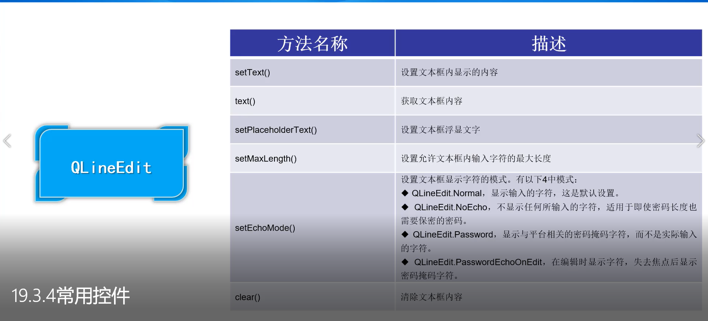
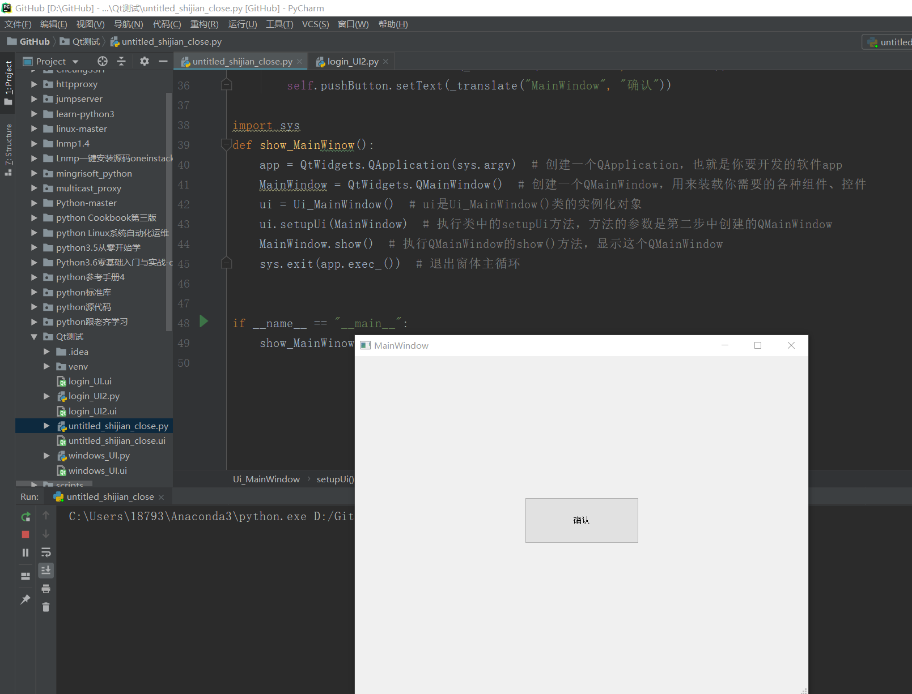

# Qt框架初探

## 安装PyQt
Qt 是python 开发窗体的工具之一， 它不仅与python 有着良好的兼容性， 还可以通过可视化拖
拽的方式进行窗体的创建， 提高开发人员的开发效率， 因此受到开发人员的喜爱。Qt 工具分别支持
Windows 、Linux 、Mac OS X 三种操作系统， 读者在https://wmv.qt.io/download 官方网站中下载对应的
系统版本即可。

Qt 工具安装完成以后， 还需要在Python 中安装巧， Q 巧模块。PyQt5 模块有两种安装方式， 一种是直接在PyQt5 的官方网站(https://wmv.nverbankcomputmg.com ） 中下载最新的源码进行编译安装，
另一种是使用pip install 的方式进行在线安装， 使用pip install pyqt5 的安装方式

    pip install pyqt5 
    
    
## 使用第三方开发工具
安装PyQt5-5.6-gpl-Py3.5-Qt5.6.0-x64-2.exe工具

[参考配置Qt工具和配置ui转换py工具](https://www.jianshu.com/p/2929934de96c)

[参考配置Qt工具和配置ui转换py工具2](https://blog.csdn.net/a359680405/article/details/45074761)

* 设置pychrm的开发环境，外部工具


``` 
1 ， 快速启动qt 设计工具(Designer）
（ 1 ） 工具名称（Qt Designer ）
（ 2 ） Designer安装路径需要指定.exe文件
（ 3 ） 指定顶目文件目录($ProjectFileDir$)

2 ． 快速将ui文件转换为py文件
（ 1 〕工具名称(PyUIC）
（ 2 ） Python安装路径需要指定.exe文件
（ 3 ） 壇写转换文件的代码(-m PyQt5.uic.pyuic $FileName$ -o $FileNameWithoutExtension$.py)
（ 4 ） 指定文件目录($FiIeDir$)

3 ． 快速转换资源文件
（ 1 〕工具名称(qrcTopy)
（ 2 〕壇与pyrcc5 安装路径需要指定.exe文件
（ 3 ） 壇写转换文件的代码($FileName$ -o $FileNameWithoutExtension$_rc.py)
（ 4 ） 壇写文件目录($FiIeDir$)

```

* 使用Qt Designer工具生成的py文件运行不会生成GUI界面，必须使用如下的方式，实例化调用才生效


``` 
import sys
def show_MainWinow():
    app = QtWidgets.QApplication(sys.argv)  # 创建一个QApplication，也就是你要开发的软件app
    MainWindow = QtWidgets.QMainWindow()    # 创建一个QMainWindow，用来装载你需要的各种组件、控件
    ui = Ui_MainWindow()                    # ui是Ui_MainWindow()类的实例化对象
    ui.setupUi(MainWindow)                  # 执行类中的setupUi方法，方法的参数是第二步中创建的QMainWindow
    MainWindow.show()                       # 执行QMainWindow的show()方法，显示这个QMainWindow
    sys.exit(app.exec_())                   # 退出窗体主循环

if __name__ == "__main__":
    show_MainWinow()

```

## Qt中的常用控件
* 单行文本框

* 按钮控件

* 单选按钮

1.单行文本框控件


2.多行文本框控件


3.按钮控件


4.单选按钮控件


## Qt设计工具中的布局管理

#### 布局管理器


#### 绝对布局


## Qt设计工具信号与槽的关联


clicked()为按钮的信号，,单击窗体中的按钮时发射clicked信号，
该信号被主窗体的槽函数（方法）close()所捕获，并触发关闭主窗体的行为。

关键代码如下：

    self.pushButton.clicked.connect(MainWindow.close)


##### 定义自己的槽函数
```
关键代码如下：
self.pushButton.clicked.connect(self.set)
 
自己编写的槽函数
   def set(self):
        self.label.setText("我突然一下的出现了，惊不惊喜，意不意外？")

```


## Qt资源文件的使用


## 实战项目

* 写一个QQ的登录界面


