# TkinterGUI模块

## thinter核心组件，包括了15种核心组件
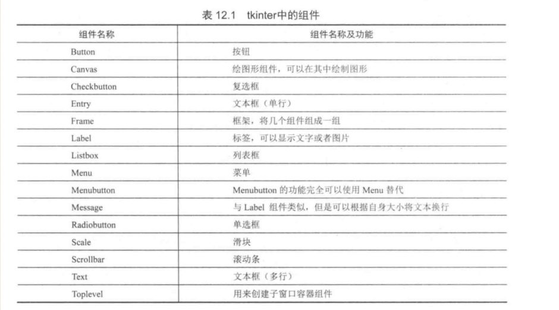


## 创建GUI程序第一步
``` 
#!/usr/bin/env python
#-*- coding:utf8 -*-
# auther; 18793
# Date：2019/7/22 13:31
# filename: 01.创建windows窗口.py
import tkinter      #导入thinter模块
root = tkinter.Tk() #生成root主窗口
root.mainloop()     #进入消息循环
```


## 创建具有标签和按钮组件的主窗口
``` 
#!/usr/bin/env python
#-*- coding:utf8 -*-
# auther; 18793
# Date：2019/7/22 13:35
# filename: 02.具有标签和按钮组件的主窗口.py
import tkinter
root = tkinter.Tk()                                    # 生成root主窗口
label = tkinter.Label(root, text="Hello tkinter")       #生成标签
label.pack()        #将标签添加到root主窗口
button1 = tkinter.Button(root, text="Button1")  #生成button1
button1.pack(side=tkinter.LEFT)     #将button1添加到root主窗口
button1 = tkinter.Button(root, text="Button2")  #生成button2
button1.pack(side=tkinter.RIGHT)     #将button2添加到root主窗口
root.mainloop()             #进入消息循环
```
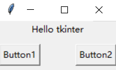


## 在主窗口中创建各种不同的按钮
``` 
#!/usr/bin/env python
#-*- coding:utf8 -*-
# auther; 18793
# Date：2019/7/22 14:43
# filename: 03.在主窗口中创建不同的按钮.py
import tkinter          #导入tkinter模块
root = tkinter.Tk()
button1 = tkinter.Button(root,
                         anchor=tkinter.E,      #指定文本对齐方式
                         text='Button1',            #指定按钮的文本
                         width=40,              #指定按钮的宽度，相当于40个字符
                         height=5)              # 指定按钮的高度，相当于5行字符
button1.pack()          #将按钮添加到窗口

button2 = tkinter.Button(root,
                         text='Button2',
                         bg="blue")         #指定按钮的背景色
button2.pack()


button3 = tkinter.Button(root,
                         text='Button3',            #指定按钮的文本
                         width=14,              #指定按钮的宽度，相当于14个字符
                         height=1)              # 指定按钮的高度，相当于1行字符
button3.pack()          #将按钮添加到窗口


button4 = tkinter.Button(root,
                         text='Button4',            #指定按钮的文本
                         width=60,              #指定按钮的宽度，相当于40个字符
                         height=5,              # 指定按钮的高度，相当于5行字符
                         state=tkinter.DISABLED)            #指定按钮为禁用状态
button4.pack()          #将按钮添加到窗口

root.mainloop()

```

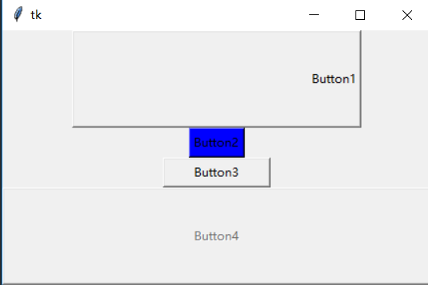

## 文本框

`文本框参数表`
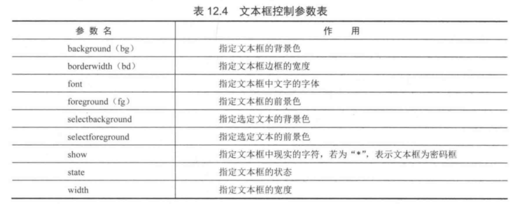

``` 
#!/usr/bin/env python
#-*- coding:utf8 -*-
# auther; 18793
# Date：2019/7/22 14:53
# filename: 04.文本框.py
import tkinter
root = tkinter.Tk()

entry1 = tkinter.Entry(root,                    #生成单行文本框组件
                       show="*",)               #输入文本框中的字符被显示为*
entry1.pack()               #将文本框添加到窗口中

entry2 = tkinter.Entry(root,                    #生成单行文本框组件
                       show="#，",              #输入文本框中的字符被显示为*
                        width = 50)             # 将文本框的宽度设置为50
entry2.pack()

entry3 = tkinter.Entry(root,                    #生成单行文本框组件
                      bg = "red",               # 将文本框中的背景色设置为红色
                      fg = "blue")             # 将文本框中的前景色设置为蓝色
entry3.pack()


entry4 = tkinter.Entry(root,                    #生成单行文本框组件
                      selectbackground = "red",               # 将选中文本的背景色设置为红色
                      selectforeground = "gray")             # 将选中文本的前景色设置为蓝色
entry4.pack()

entry5 = tkinter.Entry(root,
                    state = tkinter.DISABLED)                # 将文本设置为禁用
entry5.pack()

edit1 = tkinter.Text(root,                                  #生成多行文本框组件
                     selectbackground = "red",              #将选中文本的背景色设置为红色
                     selectforeground = "gray")             #将选中文本的前景色设置为蓝色
edit1.pack()

root.mainloop()

```
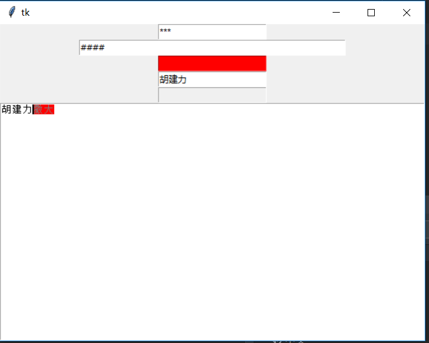

## 标签

`标签控制参数表`


`演示在主窗口中显示创建的各种不同类型的标签组件`

``` 
#!/usr/bin/env python
# -*- coding:utf8 -*-
# auther; 18793
# Date：2019/7/22 23:26
# filename: 05.标签.py
"""
演示在主窗口中显示创建的各种不同类型的标签组件
"""
import tkinter  # 导入tkinter模块

root = tkinter.Tk()
labell = tkinter.Label(root,
                       anchor=tkinter.E,
                       bg="blue",  # 设置文本的位置
                       fg="red",  # 设置标签背景色
                       text="Python",  # 设置标签中的文本
                       width=30,  # 设置标签的宽度为30
                       height=5)  # 设置标签的高度为5
labell.pack()
label2 = tkinter.Label(root,
                       text="Python GUI\n tkinter",  # 设置标签中的文本,在字符串中使用换行符
                       justify=tkinter.LEFT,  # 设置多行文本为左对齐
                       width=30,
                       height=5)
label2.pack()

label3 = tkinter.Label(root,
                       text="Python GUI\n tkinter",  # 设置标签中的文本,在字符串中使用换行符
                       justify=tkinter.RIGHT,  # 设置多行文本为右对齐
                       width=30,
                       height=5)
label3.pack()

label4 = tkinter.Label(root,
                       text="Python GUI\n tkinter",  # 设置标签中的文本,在字符串中使用换行符
                       justify=tkinter.CENTER,  # 设置多行文本为居中对齐
                       width=30,
                       height=5)
label4.pack()

root.mainloop()

```
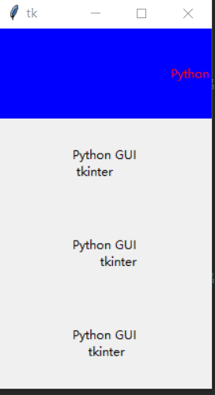

## 菜单
`在tkinter中，菜单组件的添加与其他的组件有所不同。菜单要使用创建的主窗口的config方法添加到窗口中。`

``` 
#!/usr/bin/env python
# -*- coding:utf8 -*-
# auther; 18793
# Date：2019/7/22 23:34
# filename: 06.菜单.py
import tkinter

root = tkinter.Tk()

menu = tkinter.Menu(root)  # 生成菜单
submenu = tkinter.Menu(menu, tearoff=0)  # 生成下拉菜单

submenu.add_command(label="Open")  # 向下拉菜单中添加Open命令
submenu.add_command(label="Save")  # 向下拉菜单中添加Save命令
submenu.add_command(label="Close")  # 向下拉菜单中添加Close命令
menu.add_cascade(label="File", menu=submenu)  # 将下拉菜单添加到菜单中
submenu = tkinter.Menu(menu, tearoff=0)  # 生成下拉菜单

submenu.add_command(label="Copy")  # 向下拉菜单中添加Copy命令
submenu.add_command(label="Paste")  # 向下拉菜单中添加Paste命令
submenu.add_separator()  # 向下拉菜单中添加分隔符
submenu.add_command(label="Cut")  # 向下拉菜单中添加Cut命名
menu.add_cascade(label='Edit', menu=submenu)  # 将下拉菜单添加到菜单中
submenu = tkinter.Menu(menu, tearoff=0)  # 生成下拉菜单

submenu.add_command(label="About")  # 向下拉菜单中添加About命令
menu.add_cascade(label="Help", menu=submenu)  # 将下拉菜单添加到菜单中
root.configure(menu=menu)
root.mainloop()

```
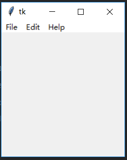


### 添加弹出式菜单
``` 
#!/usr/bin/env python
# -*- coding:utf8 -*-
# auther; 18793
# Date：2019/7/22 23:45
# filename: 07.添加弹出式菜单，绑定到右键.py
import tkinter

root = tkinter.Tk()
menu = tkinter.Menu(root, tearoff=0)  # 创建菜单
menu.add_command(label="Copy")  # 向弹出式菜单中添加Copy命令
menu.add_command(label="Paste")  # 向弹出式菜单中添加Paste命令
menu.add_separator()  # 向弹出式菜单中添加分隔符
menu.add_command(label="Cut")  # 向弹出式菜单中添加Cut命令


def popupmenu(event):           # 定义右键事件处理函数
    menu.post(event.x_root, event.y_root)  # 显示菜单


root.bind("<Button-3>", popupmenu)  # 在主窗口中绑定右键事件
root.mainloop()

```

### 单选框和复选框
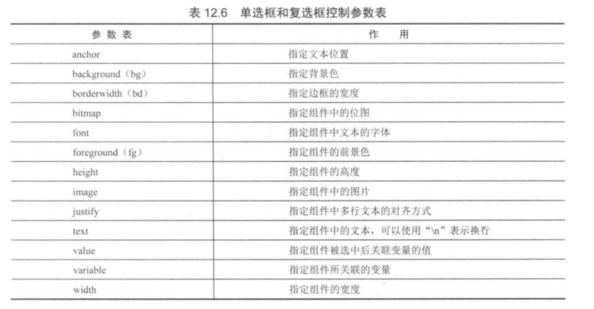

``` 
#!/usr/bin/env python
# -*- coding:utf8 -*-
# auther; 18793
# Date：2019/7/24 18:14
# filename: 08.单选框和复选框.py
import tkinter

root = tkinter.Tk()

r = tkinter.StringVar()  # 使用StringVar生成字符串变量用于单选框组件
r.set('1')  # 初始化变量的值
radio = tkinter.Radiobutton(root,  # 生成单选框组件
                            variable=r,  # 设置单选框关联的变量
                            value="1",  # 设置单选框中关联变量的值，即r的值
                            text="Radio1")  # 设置单选框显示的文本
radio.pack()

radio = tkinter.Radiobutton(root,  # 生成单选框组件
                            variable=r,  # 设置单选框关联的变量
                            value="2",  # 当选中该单选框时，r的值为2
                            text="Radio2")  # 设置单选框显示的文本
radio.pack()

radio = tkinter.Radiobutton(root,  # 生成单选框组件
                            variable=r,  # 设置单选框关联的变量
                            value="3",  # 当选中该单选框时，r的值为3
                            text="Radio3")  # 设置单选框显示的文本
radio.pack()

radio = tkinter.Radiobutton(root,  # 生成单选框组件
                            variable=r,  # 设置单选框关联的变量
                            value="4",  # 当选中该单选框时，r的值为3
                            text="Radio4")  # 设置单选框显示的文本
radio.pack()
c = tkinter.IntVar()  # IntVar生成整型变量用于复选框
c.set(1)
check = tkinter.Checkbutton(root,
                            text="Checkbutton", #设置复选框文本
                            variable=c,         #设置复选框关联变量
                            onvalue=1,          #当选中复选框时，c的值为1
                            offvalue=2)         #当末选中复选框时，c的值为2

check.pack()
root.mainloop()
print(r.get())
print(c.get())

```

运行输出


当indicatoron参数传递值为0时，组件将被绘制成按钮的形式。被选中的组件处于按下状态
`indicatoron=0`
``` 
#!/usr/bin/env python
# -*- coding:utf8 -*-
# auther; 18793
# Date：2019/7/24 19:43
# filename: 09.在窗口显示按钮、单选-复选框.py

import tkinter

root = tkinter.Tk()

r = tkinter.StringVar()  # 使用StringVar生成字符串变量用于单选框组件
r.set('1')  # 初始化变量的值
radio = tkinter.Radiobutton(root,  # 生成单选框组件
                            variable=r,  # 设置单选框关联的变量
                            value="1",  # 设置单选框中关联变量的值，即r的值
                            indicatoron=0,  # 将单选框绘制成按钮样式
                            text="Radio1")  # 设置单选框显示的文本
radio.pack()

radio = tkinter.Radiobutton(root,  # 生成单选框组件
                            variable=r,  # 设置单选框关联的变量
                            value="2",  # 当选中该单选框时，r的值为2
                            indicatoron=0,
                            text="Radio2")  # 设置单选框显示的文本
radio.pack()

radio = tkinter.Radiobutton(root,  # 生成单选框组件
                            variable=r,  # 设置单选框关联的变量
                            value="3",  # 当选中该单选框时，r的值为3
                            indicatoron=0,
                            text="Radio3")  # 设置单选框显示的文本
radio.pack()

radio = tkinter.Radiobutton(root,  # 生成单选框组件
                            variable=r,  # 设置单选框关联的变量
                            value="4",  # 当选中该单选框时，r的值为3
                            indicatoron=0,
                            text="Radio4")  # 设置单选框显示的文本
radio.pack()
c = tkinter.IntVar()  # IntVar生成整型变量用于复选框
c.set(1)
check = tkinter.Checkbutton(root,
                            text="Checkbutton",  # 设置复选框文本
                            variable=c,  # 设置复选框关联变量
                            indicatoron=0,
                            onvalue=1,  # 当选中复选框时，c的值为1
                            offvalue=2)  # 当末选中复选框时，c的值为2

check.pack()
root.mainloop()

```
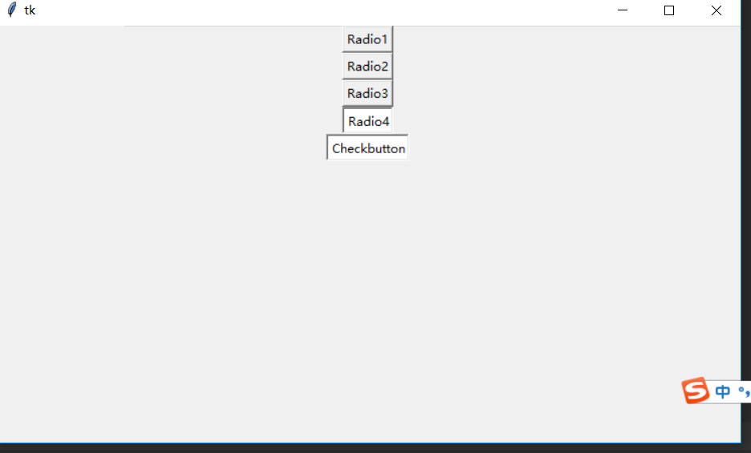

## 绘制图形
`参数可以查阅《21天学通Python》`

``` 
#!/usr/bin/env python
# -*- coding:utf8 -*-
# auther; 18793
# Date：2019/7/24 19:50
# filename: 10.绘制图形.py
import tkinter

root = tkinter.Tk()

canvas = tkinter.Canvas(root,
                        width=600,  # 指定Canvas组件的宽度为600
                        height=480,  # 指定Canvas组件的高度为480
                        bg="white")  # 指定Canvas组件的背景色为白色
im = tkinter.PhotoImage(file="Am.gif")
canvas.create_image(300, 70, image=im)  # 使用create_image将图片添加到Canvas组件中

canvas.create_text(302, 77,  # 使用create_text方法绘制文字
                   text="Use Canvas",  # 所绘制文字的内容
                   fill="gray")  # 所绘制文字的颜色为灰色

canvas.create_text(300, 75,  # 使用create_text方法绘制文字
                   text="Use Canvas",  # 所绘制文字的内容
                   fill="blue")  # 所绘制文字的颜色为蓝色

canvas.create_polygon(290, 114, 316, 114,  # 使用create_polygon绘制六边形
                      330, 130, 310, 146, 284, 146, 270, 130)

canvas.create_oval(280, 120, 320, 140,  # 使用create_oval绘制椭圆
                   fill="white")  # 设置椭圆用白色填充

canvas.create_line(250, 130, 350, 130)  # 使用create_line绘制直线
canvas.create_line(300, 100, 300, 160)

canvas.create_rectangle(90, 190, 510, 410,
                        width=5)  # 使用create_rectangle绘制一个矩形，设置矩形线宽为5像素

canvas.create_arc(100, 200, 500, 400, start=0, extent=240, fill='pink')  # 使用create_arc绘制圆弧，设置圆弧的起止角度
canvas.create_arc(103, 203, 503, 403, start=241, extent=112, fill='red')  # 使用create_arc绘制圆弧，设置圆弧的起止角度
canvas.pack()  # 将Canvas添加到主窗口
root.mainloop()

```
输出信息

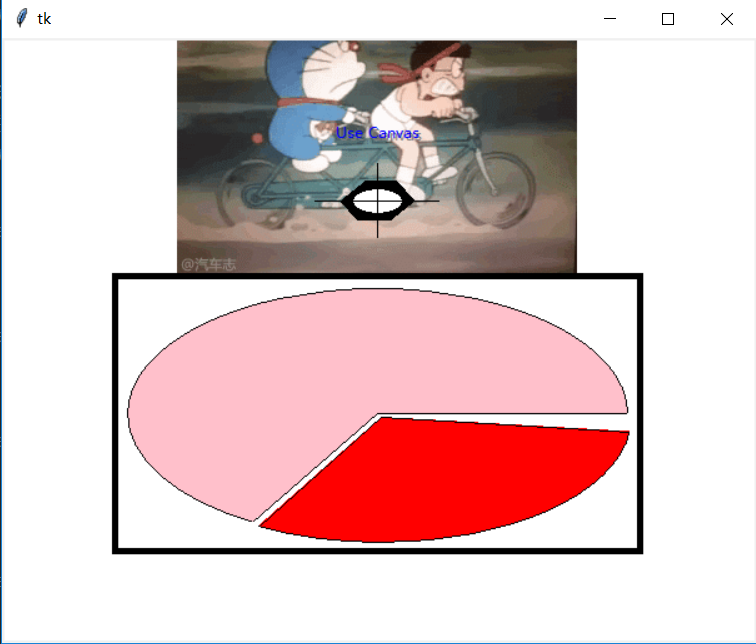

## 响应操作事件
`创建一个简单的绘图实例`

``` 
#!/usr/bin/env python
# -*- coding:utf8 -*-
# auther; 18793
# Date：2019/8/5 17:56
# filename: 11.创建简单的绘图实例.py
import tkinter


class MyButton:
    def __init__(self, root, canvas, label, type):
        self.root = root
        self.canvas = canvas
        self.label = label

        if type == 0:  # 根据类型创建按钮
            button = tkinter.Button(root, text='DrawLine', command=self.DrawLine)
        elif type == 1:
            button = tkinter.Button(root, text='DrawArc', command=self.DrawArc)
        elif type == 2:
            button = tkinter.Button(root, text='DrawRec', command=self.DrawRec)
        else:
            button = tkinter.Button(root, text='DrawOval', command=self.DrawOval)
        button.pack(side='left')

    def DrawLine(self):
        """
        DrawLine按钮事件处理函数
        """
        self.label.text.set('Draw Line')
        self.canvas.SetStatus(0)

    def DrawArc(self):
        """
        DrawArc按钮事件处理函数
        :return:
        """
        self.label.text.set('Draw Arc')
        self.canvas.SetStatus(1)

    def DrawRec(self):
        """
        DrawRec 按钮事件处理函数
        :return:
        """
        self.label.text.set('Draw Rectangle')
        self.canvas.SetStatus(2)

    def DrawOval(self):
        """
        DrawRec 按钮事件处理函数
        :return:
        """
        self.label.text.set('Draw Oval')
        self.canvas.SetStatus(3)


class MyCanvas:
    """
    定义Canvas类
    """

    def __init__(self, root):
        self.status = 0
        self.draw = 0
        self.root = root
        self.canvas = tkinter.Canvas(root, bg='white',
                                     width=600,
                                     height=480)
        self.canvas.pack()
        self.canvas.bind('<ButtonRelease-1>', self.Draw)  # 绑定事件到左键
        self.canvas.bind('<Button-2>', self.Exit)  # 绑定事件到中键
        self.canvas.bind('<Button-3>', self.Del)  # 绑定事件到右键
        self.canvas.bind_all('<Delete>', self.Del)  # 绑定事件到Delete键
        self.canvas.bind_all('<KeyPress-d>', self.Del)  # 绑定事件到d键
        self.canvas.bind_all('<KeyPress-e>', self.Exit)  # 绑定事件到e键

    def Draw(self, event):
        if self.draw == 0:
            self.x = event.x
            self.y = event.y
            self.draw = 1
        else:  # 根据self.status绘制不同的图形
            if self.status == 0:
                self.canvas.create_line(self.x, self.y, event.x, event.y)
                self.draw = 0
            elif self.status == 1:
                self.canvas.create_arc(self.x, self.y, event.x, event.y)
                self.draw = 0
            elif self.status == 2:
                self.canvas.create_rectangle(self.x, self.y, event.x, event.y)
                self.draw = 0
            else:
                self.canvas.create_oval(self.x, self.y, event.x, event.y)
                self.draw = 0

    def Del(self, event):
        """
        按下右键或d键则删除图形
        :param event:
        :return:
        """
        items = self.canvas.find_all()
        for item in items:
            self.canvas.delete(item)

    def Exit(self, event):
        """
        按下中键或e键则退出
        :param event:
        :return:
        """
        self.root.quit()

    def SetStatus(self, status):
        """
        设置绘制的图形
        :param status:
        :return:
        """
        self.status = status


class MyLabel:
    """ 标签类 """

    def __init__(self, root):  # 类初始化
        self.root = root  # 保存引用
        self.canvas = canvas
        self.text = tkinter.StringVar()  # 生成标签引用变量
        self.text.set('Draw Line')
        self.label = tkinter.Label(root, textvariable=self.text, fg='red', width=50)
        self.label.pack(side='left')


root = tkinter.Tk()  # 生成主窗口
canvas = MyCanvas(root)  # 生成绘图组件
label = MyLabel(root)  # 生成标签
MyButton(root, canvas, label, 0)  # 生成按钮
MyButton(root, canvas, label, 1)
MyButton(root, canvas, label, 2)
MyButton(root, canvas, label, 3)
root.mainloop()

```

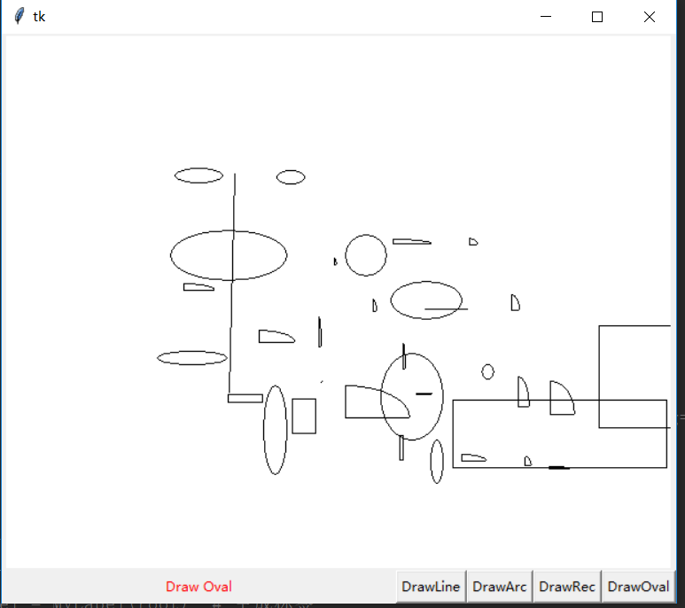


## 对话框

``` 
#!/usr/bin/env python
# -*- coding:utf8 -*-
# auther; 18793
# Date：2019/8/5 18:42
# filename: 12.对话框001.py
import tkinter
import tkinter.messagebox


def cmd():
    global n
    global buttontext
    n = n + 1
    if n == 1:
        tkinter.messagebox.askokcancel('Python tkiner', 'askokcancel')  # 使用askokcancel函数
        buttontext.set('skquestion')  # 更改按钮上的文字
    elif n == 2:
        tkinter.messagebox.askokcancel('Python tkiner', 'skquestion')  # 使用skquestion函数
        buttontext.set('askyeson')
    elif n == 3:
        tkinter.messagebox.askokcancel('Python tkiner', 'askyeson')  # 使用askyeson函数
        buttontext.set('showerror')
    elif n == 4:
        tkinter.messagebox.askokcancel('Python tkiner', 'showerror')  # 使用showerror函数
        buttontext.set('showinfo')
    elif n == 5:
        tkinter.messagebox.askokcancel('Python tkiner', 'showinfo')  # 使用showinfo函数
        buttontext.set('showwarning')
    else:
        n = 0
        tkinter.messagebox.showwarning('Python tkinter', 'showwarning')  # 使用showwarning函数
        buttontext.set('askokcancel')


n = 0
root = tkinter.Tk()
buttontext = tkinter.StringVar()  # 生成关联按钮文字的变量
buttontext.set('askokcancel')  # 设置buttontext值
button = tkinter.Button(root, textvariable=buttontext, command=cmd)  # 设置事件处理函数
button.pack()
button.mainloop()
```


## 3种简单的输入对话框的实例
``` 
#!/usr/bin/env python
# -*- coding:utf8 -*-
# auther; 18793
# Date：2019/8/5 21:40
# filename: 13.具有3种简单的输入对话框.py
import tkinter
import tkinter.simpledialog  # 导入tkSimpleDialog模块


def InStr():
    r = tkinter.simpledialog.askstring('Python tkinter',  # 创建字符串输入对话框
                                       'Input String',  # 指定提示字符
                                       initialvalue='tkinter')  # 指定初始化文本

    print(r)


def InInt():  # 按键事件处理函数
    r = tkinter.simpledialog.askinteger('Python tkinter', 'Input Integer')
    print(r)  # 创建整数输入对话框


def InFlo():  # 按键事件处理函数
    r = tkinter.simpledialog.askfloat('Python tkinter', 'Input Float')
    print(r)  # 创建浮点数输入对话框


root = tkinter.Tk()
buttonl = tkinter.Button(root, text='Input String',    # 创建按钮
                         command=InStr())  # 指定按钮事件处理函数

buttonl.pack(side='left')

button2 = tkinter.Button(root, text='Input Integer',    # 创建按钮
                         command=InInt())  # 指定按钮事件处理函数
button2.pack(side='left')


button3 = tkinter.Button(root, text='Input Float',    # 创建按钮
                         command=InFlo())  # 指定按钮事件处理函数
button3.pack(side='left')

root.mainloop()
```


## 创建文件打开和保存对话框的实例
``` 
#!/usr/bin/env python
# -*- coding:utf8 -*-
# auther; 18793
# Date：2019/8/5 21:53
# filename: 14.创建文件打开和保存对话框的实例.py
import tkinter
import tkinter.filedialog  # 导入tkFileDialog模块


def FileOpen():
    r = tkinter.filedialog.askopenfile(title='Python tkinter',
                                       filetypes=[('Python', '*.py *.pyw'), ('All files', '*')])
    # 指定文件类型为python程序
    # 输出返回值
    print(r)


def FileSave():
    r = tkinter.filedialog.asksaveasfilename(title='Python tkinter',  # 创建保存文件对话框
                                             initialdir=r'D:\GitHub',  # 指定初始化目录
                                             initialfile='test2.py',
                                             )   # 指定初始化文件

    print(r)


root = tkinter.Tk()
button1 = tkinter.Button(root, text="File Open",  # 创建按钮
                         command=FileOpen())  # 指定按钮事件处理函数
button1.pack(side='left')

button2 = tkinter.Button(root, text="File Save",  # 创建按钮
                         command=FileSave())  # 指定按钮事件处理函数
button2.pack(side='left')

root.mainloop()

```


## 创建图片、文字实例

``` 
#绘制图像
from tkinter import *
root=Tk()
root.title("三国名人录")
#root.iconbitmap("souffle.ico")
#窗体尺寸
root.geometry('500x700+600+20') #宽x高+左边距+上边距

def sango_show(event):
    #将图片文件声明为全局变量
    global img1,img2,img3,img4    
    #获取按钮文本
    ID=event.widget['text']
    print(ID)
    #加载图片
    if ID==sango[0]:
        myCanvas.create_image(0,0,anchor=NW,image=img0)
    elif ID==sango[1]:
        myCanvas.create_image(0,0,anchor=NW,image=img1)
    elif ID==sango[2]:
        myCanvas.create_image(0,0,anchor=NW,image=img2)
    elif ID==sango[3]:
        myCanvas.create_image(0,0,anchor=NW,image=img3)

#图片
img0=PhotoImage(file='pictures\\张飞.png')
img1=PhotoImage(file='pictures\\吕布.gif')
img2=PhotoImage(file='pictures\\貂蝉.png')
img3=PhotoImage(file='pictures\\孔明.gif')         

#Frame布局
fm1=Frame(root)
fm1.pack(side=TOP,padx=10,pady=10)
fm2=Frame(root)
fm2.pack()

#创建画布
myCanvas=Canvas(fm2,width=460,height=590,bg='black')
myCanvas.pack()

#文字
myCanvas.create_text(230,245,text='三国名人录',
        font=("隶书",48),fill='red')

#按钮
sango=['张飞','吕布','貂蝉','孔明']
b=[]
for i in range(4):
    b.append(Button(fm1,text=sango[i],font=('KaiTi',32,'bold'),
             width=5,height=1))
    b[i].pack(side=LEFT,anchor=NW)
    b[i].bind('<ButtonRelease-1>',sango_show)

root.mainloop()

```
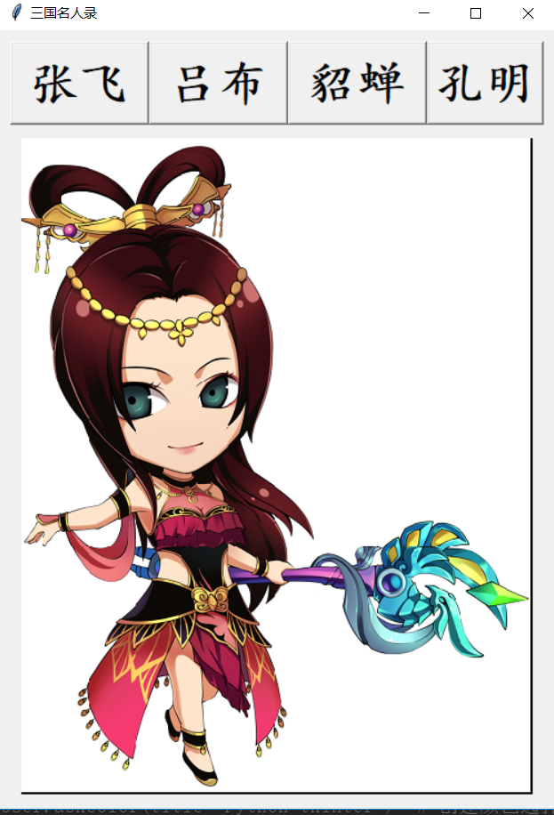


## 创建颜色选择对话框实例
``` 
#!/usr/bin/env python
# -*- coding:utf8 -*-
# auther; 18793
# Date：2019/8/6 8:26
# filename: 15.颜色选择对话框实例.py
import tkinter
import tkinter.colorchooser


def ChooseColor():
    r = tkinter.colorchooser.askcolor(title='Python tkinter')  # 创建颜色选择对话框
    print(r)  # 输出返回值


root = tkinter.Tk()
button = tkinter.Button(root, text='Choose Color',  # 创建按钮
                        command=ChooseColor)  # 指定按钮事件处理函数
button.pack()
root.mainloop()                                 # 进入消息循环

```

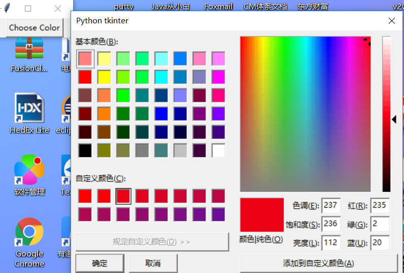

## 自定义对话框
```  
#!/usr/bin/env python
# -*- coding:utf8 -*-
# auther; 18793
# Date：2019/8/6 8:56
# filename: 16.自定义对话框.py
import tkinter
import tkinter.messagebox as tkMessageBox  # 导入tkMesageBox类


class MyDialog:  # 定义对话框类
    def __init__(self, root):  # 对话框初始化
        self.top = tkinter.Toplevel(root)  # 生成Toplevel组件
        label = tkinter.Label(self.top, text='Please Input')  # 生成标签组件
        label.pack()
        self.entry = tkinter.Entry(self.top)  # 生成文本框组件
        self.entry.pack()
        self.entry.focus()  # 让文本框获得焦点
        button = tkinter.Button(self.top, text='Ok',  # 生成按钮
                                command=self.Ok)  # 设置按钮事件处理函数
        button.pack()

    def Ok(self):  # 定义按钮事件处理函数
        self.input = self.entry.get()  # 获取文本框中的内容，保存为input
        self.top.destroy()  # 销毁对话框

    def get(self):  # 返回在文本框输入的内容
        return self.input


class MyButton():
    def __init__(self, root, type):
        self.root = root
        if type == 0:
            self.button = tkinter.Button(root, text='Create', command=self.Create)  # 设置Create按钮处理函数
        else:
            self.button = tkinter.Button(root, text='Quit', command=self.Quit)  # 设置Quit按钮的事件处理函数
        self.button.pack()

    def Create(self):
        d = MyDialog(self.root)  # 生成对话框
        self.button.wait_window(d.top)  # 等待对话框结束
        tkMessageBox.showinfo('Python', 'You input:\n' + d.get())  # 获取对话框中输入值，并输出

    def Quit(self):  # Quit按钮的事件处理函数
        self.root.quit()  # 退出主窗口


root = tkinter.Tk()
MyButton(root, 0)
MyButton(root, 1)
root.mainloop()
```
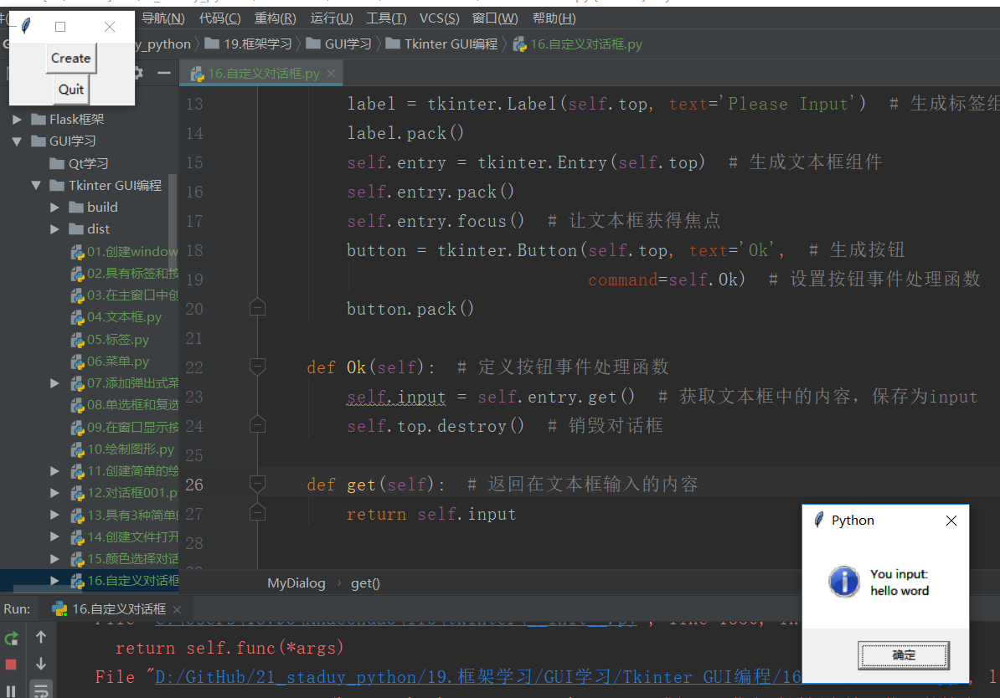
