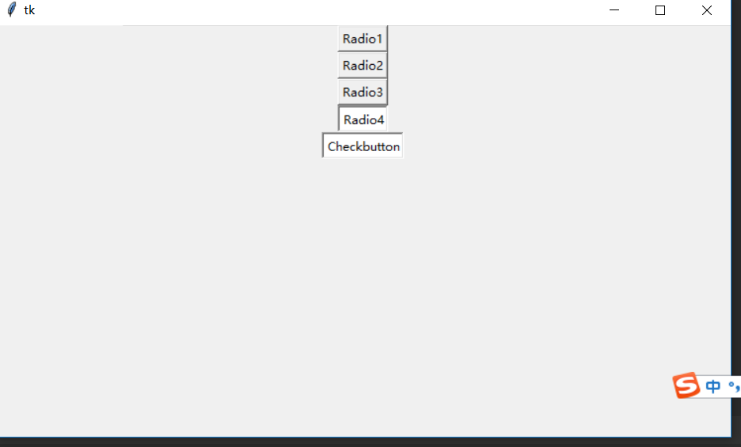

.. contents::
   :depth: 3
..

TkinterGUI模块
==============

thinter核心组件，包括了15种核心组件
-----------------------------------

.. image:: ../../../_static/tkinter-zujian00001.png

创建GUI程序第一步
-----------------

::

   #!/usr/bin/env python
   #-*- coding:utf8 -*-
   # auther; 18793
   # Date：2019/7/22 13:31
   # filename: 01.创建windows窗口.py
   import tkinter      #导入thinter模块
   root = tkinter.Tk() #生成root主窗口
   root.mainloop()     #进入消息循环

创建具有标签和按钮组件的主窗口
------------------------------

::

   #!/usr/bin/env python
   #-*- coding:utf8 -*-
   # auther; 18793
   # Date：2019/7/22 13:35
   # filename: 02.具有标签和按钮组件的主窗口.py
   import tkinter
   root = tkinter.Tk()                                    # 生成root主窗口
   label = tkinter.Label(root, text="Hello tkinter")       #生成标签
   label.pack()        #将标签添加到root主窗口
   button1 = tkinter.Button(root, text="Button1")  #生成button1
   button1.pack(side=tkinter.LEFT)     #将button1添加到root主窗口
   button1 = tkinter.Button(root, text="Button2")  #生成button2
   button1.pack(side=tkinter.RIGHT)     #将button2添加到root主窗口
   root.mainloop()             #进入消息循环

.. image:: ../../../_static/tkinter0001.png

在主窗口中创建各种不同的按钮
----------------------------

::

   #!/usr/bin/env python
   #-*- coding:utf8 -*-
   # auther; 18793
   # Date：2019/7/22 14:43
   # filename: 03.在主窗口中创建不同的按钮.py
   import tkinter          #导入tkinter模块
   root = tkinter.Tk()
   button1 = tkinter.Button(root,
                            anchor=tkinter.E,      #指定文本对齐方式
                            text='Button1',            #指定按钮的文本
                            width=40,              #指定按钮的宽度，相当于40个字符
                            height=5)              # 指定按钮的高度，相当于5行字符
   button1.pack()          #将按钮添加到窗口

   button2 = tkinter.Button(root,
                            text='Button2',
                            bg="blue")         #指定按钮的背景色
   button2.pack()

   button3 = tkinter.Button(root,
                            text='Button3',            #指定按钮的文本
                            width=14,              #指定按钮的宽度，相当于14个字符
                            height=1)              # 指定按钮的高度，相当于1行字符
   button3.pack()          #将按钮添加到窗口

   button4 = tkinter.Button(root,
                            text='Button4',            #指定按钮的文本
                            width=60,              #指定按钮的宽度，相当于40个字符
                            height=5,              # 指定按钮的高度，相当于5行字符
                            state=tkinter.DISABLED)            #指定按钮为禁用状态
   button4.pack()          #将按钮添加到窗口

   root.mainloop()

文本框
------

``文本框参数表`` |image1|

::

   #!/usr/bin/env python
   #-*- coding:utf8 -*-
   # auther; 18793
   # Date：2019/7/22 14:53
   # filename: 04.文本框.py
   import tkinter
   root = tkinter.Tk()

   entry1 = tkinter.Entry(root,                    #生成单行文本框组件
                          show="*",)               #输入文本框中的字符被显示为*
   entry1.pack()               #将文本框添加到窗口中

   entry2 = tkinter.Entry(root,                    #生成单行文本框组件
                          show="#，",              #输入文本框中的字符被显示为*
                           width = 50)             # 将文本框的宽度设置为50
   entry2.pack()

   entry3 = tkinter.Entry(root,                    #生成单行文本框组件
                         bg = "red",               # 将文本框中的背景色设置为红色
                         fg = "blue")             # 将文本框中的前景色设置为蓝色
   entry3.pack()

   entry4 = tkinter.Entry(root,                    #生成单行文本框组件
                         selectbackground = "red",               # 将选中文本的背景色设置为红色
                         selectforeground = "gray")             # 将选中文本的前景色设置为蓝色
   entry4.pack()

   entry5 = tkinter.Entry(root,
                       state = tkinter.DISABLED)                # 将文本设置为禁用
   entry5.pack()

   edit1 = tkinter.Text(root,                                  #生成多行文本框组件
                        selectbackground = "red",              #将选中文本的背景色设置为红色
                        selectforeground = "gray")             #将选中文本的前景色设置为蓝色
   edit1.pack()

   root.mainloop()

.. image:: ../../../_static/tkinter00002.png

标签
----

``标签控制参数表`` |image2|

``演示在主窗口中显示创建的各种不同类型的标签组件``

::

   #!/usr/bin/env python
   # -*- coding:utf8 -*-
   # auther; 18793
   # Date：2019/7/22 23:26
   # filename: 05.标签.py
   """
   演示在主窗口中显示创建的各种不同类型的标签组件
   """
   import tkinter  # 导入tkinter模块

   root = tkinter.Tk()
   labell = tkinter.Label(root,
                          anchor=tkinter.E,
                          bg="blue",  # 设置文本的位置
                          fg="red",  # 设置标签背景色
                          text="Python",  # 设置标签中的文本
                          width=30,  # 设置标签的宽度为30
                          height=5)  # 设置标签的高度为5
   labell.pack()
   label2 = tkinter.Label(root,
                          text="Python GUI\n tkinter",  # 设置标签中的文本,在字符串中使用换行符
                          justify=tkinter.LEFT,  # 设置多行文本为左对齐
                          width=30,
                          height=5)
   label2.pack()

   label3 = tkinter.Label(root,
                          text="Python GUI\n tkinter",  # 设置标签中的文本,在字符串中使用换行符
                          justify=tkinter.RIGHT,  # 设置多行文本为右对齐
                          width=30,
                          height=5)
   label3.pack()

   label4 = tkinter.Label(root,
                          text="Python GUI\n tkinter",  # 设置标签中的文本,在字符串中使用换行符
                          justify=tkinter.CENTER,  # 设置多行文本为居中对齐
                          width=30,
                          height=5)
   label4.pack()

   root.mainloop()

菜单
----

``在tkinter中，菜单组件的添加与其他的组件有所不同。菜单要使用创建的主窗口的config方法添加到窗口中。``

::

   #!/usr/bin/env python
   # -*- coding:utf8 -*-
   # auther; 18793
   # Date：2019/7/22 23:34
   # filename: 06.菜单.py
   import tkinter

   root = tkinter.Tk()

   menu = tkinter.Menu(root)  # 生成菜单
   submenu = tkinter.Menu(menu, tearoff=0)  # 生成下拉菜单

   submenu.add_command(label="Open")  # 向下拉菜单中添加Open命令
   submenu.add_command(label="Save")  # 向下拉菜单中添加Save命令
   submenu.add_command(label="Close")  # 向下拉菜单中添加Close命令
   menu.add_cascade(label="File", menu=submenu)  # 将下拉菜单添加到菜单中
   submenu = tkinter.Menu(menu, tearoff=0)  # 生成下拉菜单

   submenu.add_command(label="Copy")  # 向下拉菜单中添加Copy命令
   submenu.add_command(label="Paste")  # 向下拉菜单中添加Paste命令
   submenu.add_separator()  # 向下拉菜单中添加分隔符
   submenu.add_command(label="Cut")  # 向下拉菜单中添加Cut命名
   menu.add_cascade(label='Edit', menu=submenu)  # 将下拉菜单添加到菜单中
   submenu = tkinter.Menu(menu, tearoff=0)  # 生成下拉菜单

   submenu.add_command(label="About")  # 向下拉菜单中添加About命令
   menu.add_cascade(label="Help", menu=submenu)  # 将下拉菜单添加到菜单中
   root.configure(menu=menu)
   root.mainloop()

.. image:: ../../../_static/caidan00001.PNG

添加弹出式菜单
~~~~~~~~~~~~~~

::

   #!/usr/bin/env python
   # -*- coding:utf8 -*-
   # auther; 18793
   # Date：2019/7/22 23:45
   # filename: 07.添加弹出式菜单，绑定到右键.py
   import tkinter

   root = tkinter.Tk()
   menu = tkinter.Menu(root, tearoff=0)  # 创建菜单
   menu.add_command(label="Copy")  # 向弹出式菜单中添加Copy命令
   menu.add_command(label="Paste")  # 向弹出式菜单中添加Paste命令
   menu.add_separator()  # 向弹出式菜单中添加分隔符
   menu.add_command(label="Cut")  # 向弹出式菜单中添加Cut命令

   def popupmenu(event):           # 定义右键事件处理函数
       menu.post(event.x_root, event.y_root)  # 显示菜单

   root.bind("<Button-3>", popupmenu)  # 在主窗口中绑定右键事件
   root.mainloop()

单选框和复选框
~~~~~~~~~~~~~~

::

   #!/usr/bin/env python
   # -*- coding:utf8 -*-
   # auther; 18793
   # Date：2019/7/24 18:14
   # filename: 08.单选框和复选框.py
   import tkinter

   root = tkinter.Tk()

   r = tkinter.StringVar()  # 使用StringVar生成字符串变量用于单选框组件
   r.set('1')  # 初始化变量的值
   radio = tkinter.Radiobutton(root,  # 生成单选框组件
                               variable=r,  # 设置单选框关联的变量
                               value="1",  # 设置单选框中关联变量的值，即r的值
                               text="Radio1")  # 设置单选框显示的文本
   radio.pack()

   radio = tkinter.Radiobutton(root,  # 生成单选框组件
                               variable=r,  # 设置单选框关联的变量
                               value="2",  # 当选中该单选框时，r的值为2
                               text="Radio2")  # 设置单选框显示的文本
   radio.pack()

   radio = tkinter.Radiobutton(root,  # 生成单选框组件
                               variable=r,  # 设置单选框关联的变量
                               value="3",  # 当选中该单选框时，r的值为3
                               text="Radio3")  # 设置单选框显示的文本
   radio.pack()

   radio = tkinter.Radiobutton(root,  # 生成单选框组件
                               variable=r,  # 设置单选框关联的变量
                               value="4",  # 当选中该单选框时，r的值为3
                               text="Radio4")  # 设置单选框显示的文本
   radio.pack()
   c = tkinter.IntVar()  # IntVar生成整型变量用于复选框
   c.set(1)
   check = tkinter.Checkbutton(root,
                               text="Checkbutton", #设置复选框文本
                               variable=c,         #设置复选框关联变量
                               onvalue=1,          #当选中复选框时，c的值为1
                               offvalue=2)         #当末选中复选框时，c的值为2

   check.pack()
   root.mainloop()
   print(r.get())
   print(c.get())

运行输出 |image3|

当indicatoron参数传递值为0时，组件将被绘制成按钮的形式。被选中的组件处于按下状态
``indicatoron=0``

::

   #!/usr/bin/env python
   # -*- coding:utf8 -*-
   # auther; 18793
   # Date：2019/7/24 19:43
   # filename: 09.在窗口显示按钮、单选-复选框.py

   import tkinter

   root = tkinter.Tk()

   r = tkinter.StringVar()  # 使用StringVar生成字符串变量用于单选框组件
   r.set('1')  # 初始化变量的值
   radio = tkinter.Radiobutton(root,  # 生成单选框组件
                               variable=r,  # 设置单选框关联的变量
                               value="1",  # 设置单选框中关联变量的值，即r的值
                               indicatoron=0,  # 将单选框绘制成按钮样式
                               text="Radio1")  # 设置单选框显示的文本
   radio.pack()

   radio = tkinter.Radiobutton(root,  # 生成单选框组件
                               variable=r,  # 设置单选框关联的变量
                               value="2",  # 当选中该单选框时，r的值为2
                               indicatoron=0,
                               text="Radio2")  # 设置单选框显示的文本
   radio.pack()

   radio = tkinter.Radiobutton(root,  # 生成单选框组件
                               variable=r,  # 设置单选框关联的变量
                               value="3",  # 当选中该单选框时，r的值为3
                               indicatoron=0,
                               text="Radio3")  # 设置单选框显示的文本
   radio.pack()

   radio = tkinter.Radiobutton(root,  # 生成单选框组件
                               variable=r,  # 设置单选框关联的变量
                               value="4",  # 当选中该单选框时，r的值为3
                               indicatoron=0,
                               text="Radio4")  # 设置单选框显示的文本
   radio.pack()
   c = tkinter.IntVar()  # IntVar生成整型变量用于复选框
   c.set(1)
   check = tkinter.Checkbutton(root,
                               text="Checkbutton",  # 设置复选框文本
                               variable=c,  # 设置复选框关联变量
                               indicatoron=0,
                               onvalue=1,  # 当选中复选框时，c的值为1
                               offvalue=2)  # 当末选中复选框时，c的值为2

   check.pack()
   root.mainloop()

绘制图形
--------

``参数可以查阅《21天学通Python》``

::

   #!/usr/bin/env python
   # -*- coding:utf8 -*-
   # auther; 18793
   # Date：2019/7/24 19:50
   # filename: 10.绘制图形.py
   import tkinter

   root = tkinter.Tk()

   canvas = tkinter.Canvas(root,
                           width=600,  # 指定Canvas组件的宽度为600
                           height=480,  # 指定Canvas组件的高度为480
                           bg="white")  # 指定Canvas组件的背景色为白色
   im = tkinter.PhotoImage(file="Am.gif")
   canvas.create_image(300, 70, image=im)  # 使用create_image将图片添加到Canvas组件中

   canvas.create_text(302, 77,  # 使用create_text方法绘制文字
                      text="Use Canvas",  # 所绘制文字的内容
                      fill="gray")  # 所绘制文字的颜色为灰色

   canvas.create_text(300, 75,  # 使用create_text方法绘制文字
                      text="Use Canvas",  # 所绘制文字的内容
                      fill="blue")  # 所绘制文字的颜色为蓝色

   canvas.create_polygon(290, 114, 316, 114,  # 使用create_polygon绘制六边形
                         330, 130, 310, 146, 284, 146, 270, 130)

   canvas.create_oval(280, 120, 320, 140,  # 使用create_oval绘制椭圆
                      fill="white")  # 设置椭圆用白色填充

   canvas.create_line(250, 130, 350, 130)  # 使用create_line绘制直线
   canvas.create_line(300, 100, 300, 160)

   canvas.create_rectangle(90, 190, 510, 410,
                           width=5)  # 使用create_rectangle绘制一个矩形，设置矩形线宽为5像素

   canvas.create_arc(100, 200, 500, 400, start=0, extent=240, fill='pink')  # 使用create_arc绘制圆弧，设置圆弧的起止角度
   canvas.create_arc(103, 203, 503, 403, start=241, extent=112, fill='red')  # 使用create_arc绘制圆弧，设置圆弧的起止角度
   canvas.pack()  # 将Canvas添加到主窗口
   root.mainloop()

输出信息

响应操作事件
------------

``创建一个简单的绘图实例``

::

   #!/usr/bin/env python
   # -*- coding:utf8 -*-
   # auther; 18793
   # Date：2019/8/5 17:56
   # filename: 11.创建简单的绘图实例.py
   import tkinter

   class MyButton:
       def __init__(self, root, canvas, label, type):
           self.root = root
           self.canvas = canvas
           self.label = label

           if type == 0:  # 根据类型创建按钮
               button = tkinter.Button(root, text='DrawLine', command=self.DrawLine)
           elif type == 1:
               button = tkinter.Button(root, text='DrawArc', command=self.DrawArc)
           elif type == 2:
               button = tkinter.Button(root, text='DrawRec', command=self.DrawRec)
           else:
               button = tkinter.Button(root, text='DrawOval', command=self.DrawOval)
           button.pack(side='left')

       def DrawLine(self):
           """
           DrawLine按钮事件处理函数
           """
           self.label.text.set('Draw Line')
           self.canvas.SetStatus(0)

       def DrawArc(self):
           """
           DrawArc按钮事件处理函数
           :return:
           """
           self.label.text.set('Draw Arc')
           self.canvas.SetStatus(1)

       def DrawRec(self):
           """
           DrawRec 按钮事件处理函数
           :return:
           """
           self.label.text.set('Draw Rectangle')
           self.canvas.SetStatus(2)

       def DrawOval(self):
           """
           DrawRec 按钮事件处理函数
           :return:
           """
           self.label.text.set('Draw Oval')
           self.canvas.SetStatus(3)

   class MyCanvas:
       """
       定义Canvas类
       """

       def __init__(self, root):
           self.status = 0
           self.draw = 0
           self.root = root
           self.canvas = tkinter.Canvas(root, bg='white',
                                        width=600,
                                        height=480)
           self.canvas.pack()
           self.canvas.bind('<ButtonRelease-1>', self.Draw)  # 绑定事件到左键
           self.canvas.bind('<Button-2>', self.Exit)  # 绑定事件到中键
           self.canvas.bind('<Button-3>', self.Del)  # 绑定事件到右键
           self.canvas.bind_all('<Delete>', self.Del)  # 绑定事件到Delete键
           self.canvas.bind_all('<KeyPress-d>', self.Del)  # 绑定事件到d键
           self.canvas.bind_all('<KeyPress-e>', self.Exit)  # 绑定事件到e键

       def Draw(self, event):
           if self.draw == 0:
               self.x = event.x
               self.y = event.y
               self.draw = 1
           else:  # 根据self.status绘制不同的图形
               if self.status == 0:
                   self.canvas.create_line(self.x, self.y, event.x, event.y)
                   self.draw = 0
               elif self.status == 1:
                   self.canvas.create_arc(self.x, self.y, event.x, event.y)
                   self.draw = 0
               elif self.status == 2:
                   self.canvas.create_rectangle(self.x, self.y, event.x, event.y)
                   self.draw = 0
               else:
                   self.canvas.create_oval(self.x, self.y, event.x, event.y)
                   self.draw = 0

       def Del(self, event):
           """
           按下右键或d键则删除图形
           :param event:
           :return:
           """
           items = self.canvas.find_all()
           for item in items:
               self.canvas.delete(item)

       def Exit(self, event):
           """
           按下中键或e键则退出
           :param event:
           :return:
           """
           self.root.quit()

       def SetStatus(self, status):
           """
           设置绘制的图形
           :param status:
           :return:
           """
           self.status = status

   class MyLabel:
       """ 标签类 """

       def __init__(self, root):  # 类初始化
           self.root = root  # 保存引用
           self.canvas = canvas
           self.text = tkinter.StringVar()  # 生成标签引用变量
           self.text.set('Draw Line')
           self.label = tkinter.Label(root, textvariable=self.text, fg='red', width=50)
           self.label.pack(side='left')

   root = tkinter.Tk()  # 生成主窗口
   canvas = MyCanvas(root)  # 生成绘图组件
   label = MyLabel(root)  # 生成标签
   MyButton(root, canvas, label, 0)  # 生成按钮
   MyButton(root, canvas, label, 1)
   MyButton(root, canvas, label, 2)
   MyButton(root, canvas, label, 3)
   root.mainloop()

对话框
------

::

   #!/usr/bin/env python
   # -*- coding:utf8 -*-
   # auther; 18793
   # Date：2019/8/5 18:42
   # filename: 12.对话框001.py
   import tkinter
   import tkinter.messagebox

   def cmd():
       global n
       global buttontext
       n = n + 1
       if n == 1:
           tkinter.messagebox.askokcancel('Python tkiner', 'askokcancel')  # 使用askokcancel函数
           buttontext.set('skquestion')  # 更改按钮上的文字
       elif n == 2:
           tkinter.messagebox.askokcancel('Python tkiner', 'skquestion')  # 使用skquestion函数
           buttontext.set('askyeson')
       elif n == 3:
           tkinter.messagebox.askokcancel('Python tkiner', 'askyeson')  # 使用askyeson函数
           buttontext.set('showerror')
       elif n == 4:
           tkinter.messagebox.askokcancel('Python tkiner', 'showerror')  # 使用showerror函数
           buttontext.set('showinfo')
       elif n == 5:
           tkinter.messagebox.askokcancel('Python tkiner', 'showinfo')  # 使用showinfo函数
           buttontext.set('showwarning')
       else:
           n = 0
           tkinter.messagebox.showwarning('Python tkinter', 'showwarning')  # 使用showwarning函数
           buttontext.set('askokcancel')

   n = 0
   root = tkinter.Tk()
   buttontext = tkinter.StringVar()  # 生成关联按钮文字的变量
   buttontext.set('askokcancel')  # 设置buttontext值
   button = tkinter.Button(root, textvariable=buttontext, command=cmd)  # 设置事件处理函数
   button.pack()
   button.mainloop()

3种简单的输入对话框的实例
-------------------------

::

   #!/usr/bin/env python
   # -*- coding:utf8 -*-
   # auther; 18793
   # Date：2019/8/5 21:40
   # filename: 13.具有3种简单的输入对话框.py
   import tkinter
   import tkinter.simpledialog  # 导入tkSimpleDialog模块

   def InStr():
       r = tkinter.simpledialog.askstring('Python tkinter',  # 创建字符串输入对话框
                                          'Input String',  # 指定提示字符
                                          initialvalue='tkinter')  # 指定初始化文本

       print(r)

   def InInt():  # 按键事件处理函数
       r = tkinter.simpledialog.askinteger('Python tkinter', 'Input Integer')
       print(r)  # 创建整数输入对话框

   def InFlo():  # 按键事件处理函数
       r = tkinter.simpledialog.askfloat('Python tkinter', 'Input Float')
       print(r)  # 创建浮点数输入对话框

   root = tkinter.Tk()
   buttonl = tkinter.Button(root, text='Input String',    # 创建按钮
                            command=InStr())  # 指定按钮事件处理函数

   buttonl.pack(side='left')

   button2 = tkinter.Button(root, text='Input Integer',    # 创建按钮
                            command=InInt())  # 指定按钮事件处理函数
   button2.pack(side='left')

   button3 = tkinter.Button(root, text='Input Float',    # 创建按钮
                            command=InFlo())  # 指定按钮事件处理函数
   button3.pack(side='left')

   root.mainloop()

创建文件打开和保存对话框的实例
------------------------------

::

   #!/usr/bin/env python
   # -*- coding:utf8 -*-
   # auther; 18793
   # Date：2019/8/5 21:53
   # filename: 14.创建文件打开和保存对话框的实例.py
   import tkinter
   import tkinter.filedialog  # 导入tkFileDialog模块

   def FileOpen():
       r = tkinter.filedialog.askopenfile(title='Python tkinter',
                                          filetypes=[('Python', '*.py *.pyw'), ('All files', '*')])
       # 指定文件类型为python程序
       # 输出返回值
       print(r)

   def FileSave():
       r = tkinter.filedialog.asksaveasfilename(title='Python tkinter',  # 创建保存文件对话框
                                                initialdir=r'D:\GitHub',  # 指定初始化目录
                                                initialfile='test2.py',
                                                )   # 指定初始化文件

       print(r)

   root = tkinter.Tk()
   button1 = tkinter.Button(root, text="File Open",  # 创建按钮
                            command=FileOpen())  # 指定按钮事件处理函数
   button1.pack(side='left')

   button2 = tkinter.Button(root, text="File Save",  # 创建按钮
                            command=FileSave())  # 指定按钮事件处理函数
   button2.pack(side='left')

   root.mainloop()

创建图片、文字实例
------------------

::

   #绘制图像
   from tkinter import *
   root=Tk()
   root.title("三国名人录")
   #root.iconbitmap("souffle.ico")
   #窗体尺寸
   root.geometry('500x700+600+20') #宽x高+左边距+上边距

   def sango_show(event):
       #将图片文件声明为全局变量
       global img1,img2,img3,img4    
       #获取按钮文本
       ID=event.widget['text']
       print(ID)
       #加载图片
       if ID==sango[0]:
           myCanvas.create_image(0,0,anchor=NW,image=img0)
       elif ID==sango[1]:
           myCanvas.create_image(0,0,anchor=NW,image=img1)
       elif ID==sango[2]:
           myCanvas.create_image(0,0,anchor=NW,image=img2)
       elif ID==sango[3]:
           myCanvas.create_image(0,0,anchor=NW,image=img3)

   #图片
   img0=PhotoImage(file='pictures\\张飞.png')
   img1=PhotoImage(file='pictures\\吕布.gif')
   img2=PhotoImage(file='pictures\\貂蝉.png')
   img3=PhotoImage(file='pictures\\孔明.gif')         

   #Frame布局
   fm1=Frame(root)
   fm1.pack(side=TOP,padx=10,pady=10)
   fm2=Frame(root)
   fm2.pack()

   #创建画布
   myCanvas=Canvas(fm2,width=460,height=590,bg='black')
   myCanvas.pack()

   #文字
   myCanvas.create_text(230,245,text='三国名人录',
           font=("隶书",48),fill='red')

   #按钮
   sango=['张飞','吕布','貂蝉','孔明']
   b=[]
   for i in range(4):
       b.append(Button(fm1,text=sango[i],font=('KaiTi',32,'bold'),
                width=5,height=1))
       b[i].pack(side=LEFT,anchor=NW)
       b[i].bind('<ButtonRelease-1>',sango_show)

   root.mainloop()

.. image:: ../../../_static/tkinter0001_sanguo.png

创建颜色选择对话框实例
----------------------

::

   #!/usr/bin/env python
   # -*- coding:utf8 -*-
   # auther; 18793
   # Date：2019/8/6 8:26
   # filename: 15.颜色选择对话框实例.py
   import tkinter
   import tkinter.colorchooser

   def ChooseColor():
       r = tkinter.colorchooser.askcolor(title='Python tkinter')  # 创建颜色选择对话框
       print(r)  # 输出返回值

   root = tkinter.Tk()
   button = tkinter.Button(root, text='Choose Color',  # 创建按钮
                           command=ChooseColor)  # 指定按钮事件处理函数
   button.pack()
   root.mainloop()                                 # 进入消息循环

自定义对话框
------------

::

   #!/usr/bin/env python
   # -*- coding:utf8 -*-
   # auther; 18793
   # Date：2019/8/6 8:56
   # filename: 16.自定义对话框.py
   import tkinter
   import tkinter.messagebox as tkMessageBox  # 导入tkMesageBox类

   class MyDialog:  # 定义对话框类
       def __init__(self, root):  # 对话框初始化
           self.top = tkinter.Toplevel(root)  # 生成Toplevel组件
           label = tkinter.Label(self.top, text='Please Input')  # 生成标签组件
           label.pack()
           self.entry = tkinter.Entry(self.top)  # 生成文本框组件
           self.entry.pack()
           self.entry.focus()  # 让文本框获得焦点
           button = tkinter.Button(self.top, text='Ok',  # 生成按钮
                                   command=self.Ok)  # 设置按钮事件处理函数
           button.pack()

       def Ok(self):  # 定义按钮事件处理函数
           self.input = self.entry.get()  # 获取文本框中的内容，保存为input
           self.top.destroy()  # 销毁对话框

       def get(self):  # 返回在文本框输入的内容
           return self.input

   class MyButton():
       def __init__(self, root, type):
           self.root = root
           if type == 0:
               self.button = tkinter.Button(root, text='Create', command=self.Create)  # 设置Create按钮处理函数
           else:
               self.button = tkinter.Button(root, text='Quit', command=self.Quit)  # 设置Quit按钮的事件处理函数
           self.button.pack()

       def Create(self):
           d = MyDialog(self.root)  # 生成对话框
           self.button.wait_window(d.top)  # 等待对话框结束
           tkMessageBox.showinfo('Python', 'You input:\n' + d.get())  # 获取对话框中输入值，并输出

       def Quit(self):  # Quit按钮的事件处理函数
           self.root.quit()  # 退出主窗口

   root = tkinter.Tk()
   MyButton(root, 0)
   MyButton(root, 1)
   root.mainloop()

.. image:: ../../../_static/zidingyi_shijianchuli_func.png

.. |image1| image:: ../../../_static/wenbenkuang-args001.png

.. |image3| image:: ../../../_static/tkinter-danxuan-fuxuan001.png
