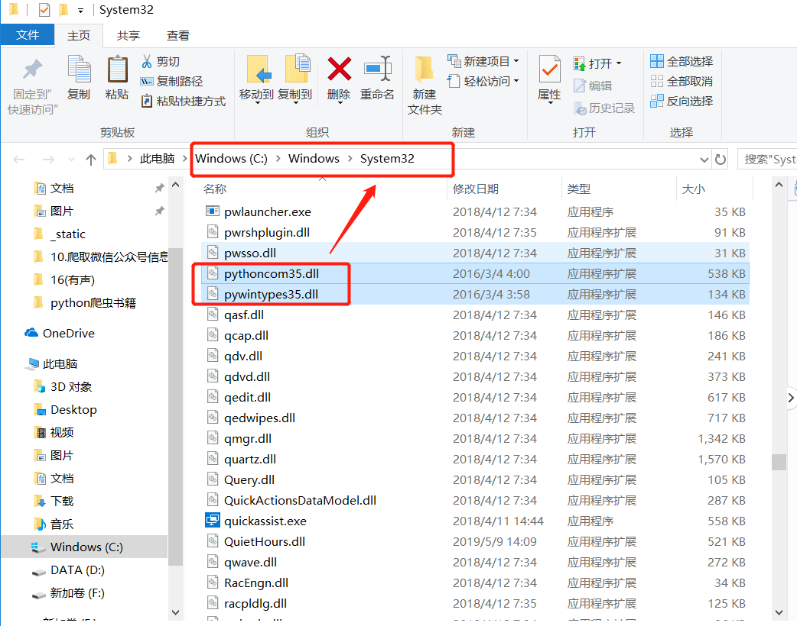
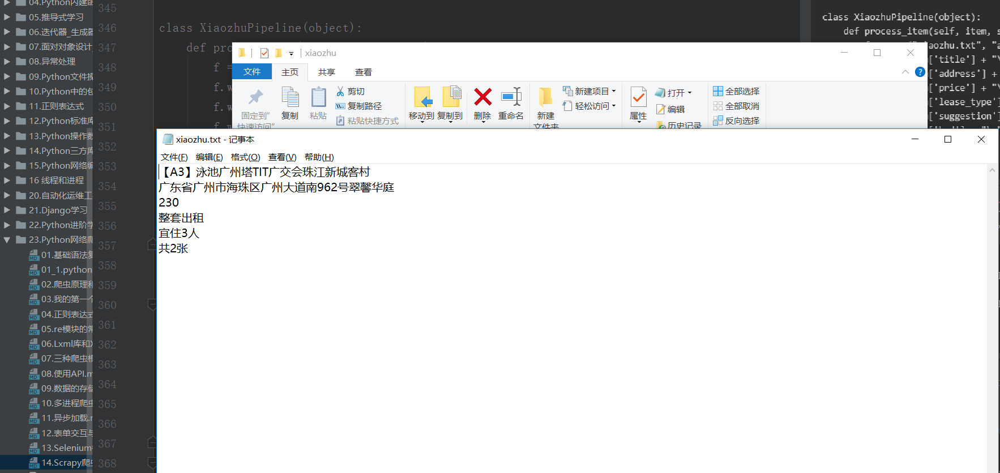
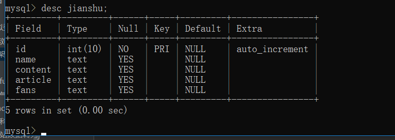

# Scrapy爬虫框架

### Scrapy的安装

1.lxml库
```
pip3 install lxml
```

2.zope.interface库
```
pip3 install zope.interface
```

3.twisted库
```
下载地址：https://www.lfd.uci.edu/~gohlke/pythonlibs/#twisted

下载后的包为：Twisted-19.2.1-cp35-cp35m-win_amd64.whl   本人使用的是python3.5，请下载与本机系统相对于的版本

然后安装
pip3 install Twisted-19.2.1-cp35-cp35m-win_amd64.whl
```


4.pyOpenSSL库安装
```
pip3 install pyOpenSSL
```

5.pywin32库
```
下载地址：https://www.lfd.uci.edu/~gohlke/pythonlibs/
下载后安装。
或者pip安装，pip安装失败就使用下载安装
pip3 install pywin32

```
安装后`import pywin32`会出错，就需要找到pywin32库，将其复制到 `C:/windows/system32`目录中



6.Scrapy库
```
pip3 install scrapy
```

### 明日学院里面给出的环境准备如下
```
# 搭建Scrapy爬虫框架

安装Twistedted模块
(1) 打开(https://www.lfd.uci.edu/~gohlke/pythonlibs/)
(2) 快捷键Ctr + F 搜索"twisted" 模块
(3) 下载"twisted" 模块的二进制文件（ 根据Python 版本和系统位数进行下载）
(4) 以管里员身份运行命令提示符窗口，
(5) 使cmd 命令打开"Twisted" 二进制文件所在的路径
(6) 通过pip 的方式进行安装

安装Scrapy
(1) pip install Scrapy
(2) 安装完成以后在命令行中输入"scrapy" 没有错误异常说明安装成功


安装pywin32模块
(1) 打开命令窗口， 然后输入pip install pywin32" 命令，安装pywin32 模块。
(2) 安装完成以后， 在Python 命令行下输入"import PYWin32 system32" ， 如果没有提示惜误信息， 则表示安装成功。

```

参考文献

https://blog.csdn.net/zwq912318834/article/details/77925220


## 小猪短租网的信息

``` 
Scrapy爬虫框架：一个为了爬取网站信息，提取结构性数据而编写的应用爬虫框架，
该框架集数据字段定义、网络请求和解析、数据获取和处理等为一体，极大地方便了爬虫的编写过程。
```

①在CMD命令窗口中输入信息：
`scrapy startproject xiaozhu`        #建立爬虫项目，名为xiaozhu


②通过pycharm查看xiaozhu项目下的所有文件：


③在spiders文件夹下新建xiaozhuspiders.py，用于编写爬虫代码：


### 2.Scrapy文件介绍

如上图，最顶层的xiaozhu文件夹为项目名，第二层由与项目同名的文件夹xiaozhu和scrapy.cfg组成，其中xiaozhu文件夹就是模块，通常叫包，所有的爬虫代码都在这个包中添加，scrapy是这个项目的设置文件，其中的内容如下：
``` 
# Automatically created by: scrapy startproject
#
# For more information about the [deploy] section see:
# https://scrapyd.readthedocs.io/en/latest/deploy.html

[settings]
default = xiaozhu.settings

[deploy]
#url = http://localhost:6800/
project = xiaozhu
```


* 除了注释部分，这个配置文件声明了两件事：

①【settings】定义设置文件的位置为：xiaozhu模块下面的settings.py

②【deploy】定义项目名称为：xiaozhu


第三层由5个Python文件文件和spiders文件夹构成。spiders文件夹实际上也是一个模块。
而5个Python文件夹中，init.py是空文件，主要用于Python导入使用。

middlewares.py是spiders的中间件，主要负责对Request对象和Response对象进行处理，属于可选件。


-此处着重介绍其他3个Python文件items.py、pipelines.py、settings.py的使用：
①items.py文件：用于定义爬取的字段信息。自动生成的代码如下：
``` 
# -*- coding: utf-8 -*-

# Define here the models for your scraped items
#
# See documentation in:
# https://docs.scrapy.org/en/latest/topics/items.html

import scrapy


class XiaozhuItem(scrapy.Item):
    # define the fields for your item here like:
    # name = scrapy.Field()
    pass

```

②pipelines.py文件：用于爬虫数据的清洗和入库操作。
``` 
# -*- coding: utf-8 -*-

# Define your item pipelines here
#
# Don't forget to add your pipeline to the ITEM_PIPELINES setting
# See: https://docs.scrapy.org/en/latest/topics/item-pipeline.html


class XiaozhuPipeline(object):
    def process_item(self, item, spider):
        return item
```

③settings.py文件:用于对爬虫项目的一些设置，例如请求头的填写，设置pipelines.py爬取爬虫数据等。
``` 
# -*- coding: utf-8 -*-

# Scrapy settings for xiaozhu project
#
# For simplicity, this file contains only settings considered important or
# commonly used. You can find more settings consulting the documentation:
#
#     https://docs.scrapy.org/en/latest/topics/settings.html
#     https://docs.scrapy.org/en/latest/topics/downloader-middleware.html
#     https://docs.scrapy.org/en/latest/topics/spider-middleware.html

BOT_NAME = 'xiaozhu'

SPIDER_MODULES = ['xiaozhu.spiders']
NEWSPIDER_MODULE = 'xiaozhu.spiders'


# Crawl responsibly by identifying yourself (and your website) on the user-agent
#USER_AGENT = 'xiaozhu (+http://www.yourdomain.com)'

# Obey robots.txt rules
ROBOTSTXT_OBEY = True

# Configure maximum concurrent requests performed by Scrapy (default: 16)
#CONCURRENT_REQUESTS = 32

# Configure a delay for requests for the same website (default: 0)
# See https://docs.scrapy.org/en/latest/topics/settings.html#download-delay
# See also autothrottle settings and docs
#DOWNLOAD_DELAY = 3
# The download delay setting will honor only one of:
#CONCURRENT_REQUESTS_PER_DOMAIN = 16
#CONCURRENT_REQUESTS_PER_IP = 16

# Disable cookies (enabled by default)
#COOKIES_ENABLED = False

# Disable Telnet Console (enabled by default)
#TELNETCONSOLE_ENABLED = False

# Override the default request headers:
#DEFAULT_REQUEST_HEADERS = {
#   'Accept': 'text/html,application/xhtml+xml,application/xml;q=0.9,*/*;q=0.8',
#   'Accept-Language': 'en',
#}

# Enable or disable spider middlewares
# See https://docs.scrapy.org/en/latest/topics/spider-middleware.html
#SPIDER_MIDDLEWARES = {
#    'xiaozhu.middlewares.XiaozhuSpiderMiddleware': 543,
#}

# Enable or disable downloader middlewares
# See https://docs.scrapy.org/en/latest/topics/downloader-middleware.html
#DOWNLOADER_MIDDLEWARES = {
#    'xiaozhu.middlewares.XiaozhuDownloaderMiddleware': 543,
#}

# Enable or disable extensions
# See https://docs.scrapy.org/en/latest/topics/extensions.html
#EXTENSIONS = {
#    'scrapy.extensions.telnet.TelnetConsole': None,
#}

# Configure item pipelines
# See https://docs.scrapy.org/en/latest/topics/item-pipeline.html
#ITEM_PIPELINES = {
#    'xiaozhu.pipelines.XiaozhuPipeline': 300,
#}

# Enable and configure the AutoThrottle extension (disabled by default)
# See https://docs.scrapy.org/en/latest/topics/autothrottle.html
#AUTOTHROTTLE_ENABLED = True
# The initial download delay
#AUTOTHROTTLE_START_DELAY = 5
# The maximum download delay to be set in case of high latencies
#AUTOTHROTTLE_MAX_DELAY = 60
# The average number of requests Scrapy should be sending in parallel to
# each remote server
#AUTOTHROTTLE_TARGET_CONCURRENCY = 1.0
# Enable showing throttling stats for every response received:
#AUTOTHROTTLE_DEBUG = False

# Enable and configure HTTP caching (disabled by default)
# See https://docs.scrapy.org/en/latest/topics/downloader-middleware.html#httpcache-middleware-settings
#HTTPCACHE_ENABLED = True
#HTTPCACHE_EXPIRATION_SECS = 0
#HTTPCACHE_DIR = 'httpcache'
#HTTPCACHE_IGNORE_HTTP_CODES = []
#HTTPCACHE_STORAGE = 'scrapy.extensions.httpcache.FilesystemCacheStorage'

```

第4层为spiders模块下的2个Python文件，init.py与前面所述一致，
xiaozhuspider.py是前面新建的Python文件，用于爬虫代码的编写。


综上所述，使用Scrapy爬虫框架相当于往里面填空，把scrapy项目中对应的文件代码补全即可实现爬虫。通常，我们设置以下4个文件即可完成爬虫任务。

```
* items.py： 用于定义字段。
* xiaozhuspider.py：用于爬虫数据的获取。
* pipelines.py：用于爬虫数据的处理。
* settings.py：用于爬虫的设置。
```
3.下面爬取小组短租网的一页住房信息。
爬取字段为：标题、地址、价格、出租类型、居住人数和床位数。

## 开始爬取小猪租房网的信息


①items.py文件：文件开头的注释部分不需要修改，其他部分替换掉，即可完成爬虫的字段信息。
``` 
# -*- coding: utf-8 -*-

# Define here the models for your scraped items
#
# See documentation in:
# https://docs.scrapy.org/en/latest/topics/items.html

import scrapy


class XiaozhuItem(scrapy.Item):
    # define the fields for your item here like:
    # name = scrapy.Field()
    title = scrapy.Field()
    address = scrapy.Field()
    price = scrapy.Field()
    lease_type = scrapy.Field()
    suggestion = scrapy.Field()
    bed = scrapy.Field()

```

②xiaozhuspider.py文件：爬虫代码的编写。

``` 
#!/usr/bin/env python
# -*- coding:utf8 -*-
# auther; 18793
# Date：2019/7/25 20:40
# filename: xiaozhuspider.py
from scrapy.spiders import CrawlSpider  # CrawlSpider作为xiaozhu的父类
from scrapy.selector import Selector  # Selector用于解析请求网页后返回的数据，与Lxml库的用法一样
from xiaozhu.items import XiaozhuItem  # XiaozhuItem是items.py中定义爬虫字段的类


class xiaozhu(CrawlSpider):
    name = "xiaozhu"  # 定义Spider的名字，在Scrapy爬虫运行时会用到：scrapy crawl xiaozhu
    start_urls = ['http://gz.xiaozhu.com/fangzi/112646821103.html']  # 默认情况下，spider会以start_urls中的链接为入口开始爬取

    def parse(self, response):  # response是请求网页返回的数据
        item = XiaozhuItem()  # 初始化item
        html = Selector(response)  # 导入Selector用于解析数据
        title = html.xpath('//div[@class="pho_info"]/h4/em/text()').extract()[0]  # 唯一不同，需要加上.extract()来提取信息
        address = html.xpath('//div[@class="pho_info"]/p/span/text()').extract()[0].strip()
        price = html.xpath('//div[@class="day_l"]/span/text()').extract()[0]
        lease_type = html.xpath('//li[@class="border_none"]/h6/text()').extract()[0]
        suggestion = html.xpath('//h6[@class="h_ico2"]/text()').extract()[0]
        bed = html.xpath('//h6[@class="h_ico3"]/text()').extract()[0]

        item['title'] = title
        item['address'] = address
        item['price'] = price
        item['lease_type'] = lease_type
        item['suggestion'] = suggestion
        item['bed'] = bed

        yield item

```


③pipelines.py文件：将获取的item存入TXT文件中。

``` 
# -*- coding: utf-8 -*-

# Define your item pipelines here
#
# Don't forget to add your pipeline to the ITEM_PIPELINES setting
# See: https://docs.scrapy.org/en/latest/topics/item-pipeline.html


class XiaozhuPipeline(object):
    def process_item(self, item, spider):
        f = open("xiaozhu.txt", "a+",encoding="utf-8")
        f.write(item['title'] + "\n")
        f.write(item['address'] + "\n")
        f.write(item['price'] + "\n")
        f.write(item['lease_type'] + "\n")
        f.write(item['suggestion'] + "\n")
        f.write(item['bed'] + "\n")
        return item

```


或者保存为`Json`格式文件
``` 
# -*- coding: utf-8 -*-

# Define your item pipelines here
#
# Don't forget to add your pipeline to the ITEM_PIPELINES setting
# See: https://docs.scrapy.org/en/latest/topics/item-pipeline.html
import json
import codecs


class XiaozhuPipeline(object):
    def __init__(self):
        self.file = codecs.open('mydata1.json', 'wb', encoding='utf-8')

    # def process_item(self, item, spider):
    #     f = open("xiaozhu.txt", "a+",encoding="utf-8")
    #     f.write(item['title'] + "\n")
    #     f.write(item['address'] + "\n")
    #     f.write(item['price'] + "\n")
    #     f.write(item['lease_type'] + "\n")
    #     f.write(item['suggestion'] + "\n")
    #     f.write(item['bed'] + "\n")
    #     return item

    def process_item(self, item, spider):
        # 通过json模块下的dumps()处理
        i = json.dumps(dict(item), ensure_ascii=False, indent=4)
        line = i + '\n'
        print(line)
        self.file.write(line)
        return item

    def close_spider(self, spider):
        self.file.close()

```

保存到`mydata1.json`中的数据为
``` 
{
    "price": "308",
    "address": "广东省广州市海珠区广州大道南962号翠馨华庭",
    "title": "【广州塔A3】泳池TIT珠江新城地铁客村长隆",
    "lease_type": "整套出租",
    "suggestion": "宜住3人",
    "bed": "共3张"
}
```

④settings.py文件：在原有代码上恢复下述已经生成的代码，用于指定爬取的信息使用pipelines.py处理。
``` 
# Configure item pipelines
# See https://docs.scrapy.org/en/latest/topics/item-pipeline.html
ITEM_PIPELINES = {
   'xiaozhu.pipelines.XiaozhuPipeline': 300,
}

```
4.Scrapy爬虫的运行
在xiaozhu文件夹中，输入以下命令：

`scrapy crawl xiaozhu`


查看`xiaozhu.txt`文件,内容如下：



当然，也可以在xiaozhu文件夹中新建一个main.py的文件，这样直接运行main.py即可运行爬虫程序。
代码如下：
``` 
#!/usr/bin/env python
# -*- coding:utf8 -*-
# auther; 18793
# Date：2019/7/25 20:56
# filename: main.py
from scrapy import cmdline

cmdline.execute("scrapy crawl xiaozhu".split())

```
效果一样，如下所示:


## Scrapy实战-爬取简书网热门专题信息

``` 
爬取网址：https://www.jianshu.com/recommendations/collections?order_by=hot
爬取内容：专题名称、专题介绍、收录文章、关注人数
爬取方式：Scrapy框架
储存方式：csv文件


```

使用F12，观察动态加载的URL，总共37页：

格式为
``` 
https://www.jianshu.com/recommendations/collections?page=1&order_by=hot
https://www.jianshu.com/recommendations/collections?page=2&order_by=hot
https://www.jianshu.com/recommendations/collections?page=3&order_by=hot
https://www.jianshu.com/recommendations/collections?page=4&order_by=hot
```


①在CMD命令窗口中输入信息： `scrapy startproject jianshu`   #建立爬虫项目，名为jianshu

1.items.py文件
``` 
# -*- coding: utf-8 -*-

# Define here the models for your scraped items
#
# See documentation in:
# https://docs.scrapy.org/en/latest/topics/items.html

import scrapy


class JianshuItem(scrapy.Item):
    # define the fields for your item here like:
    # name = scrapy.Field()
    name = scrapy.Field()
    content = scrapy.Field()
    article = scrapy.Field()
    fans = scrapy.Field()

```

2.Jianshuspider.py文件
``` 
#!/usr/bin/env python
# -*- coding:utf8 -*-
# auther; 18793
# Date：2019/7/25 21:08
# filename: Jianshuspider.py
from scrapy.spiders import CrawlSpider
from scrapy.selector import Selector
from scrapy.http import Request
from jianshu.items import JianshuItem


class Jianshu(CrawlSpider):
    name = "Jianshu"
    start_urls = ["https://www.jianshu.com/recommendations/collections?page=1&order_by=hot"]

    def parse(self, response):
        item = JianshuItem()
        selector = Selector(response)
        infos = selector.xpath('//div[@class="collection-wrap"]')
        for info in infos:
            try:
                name = info.xpath('a/h4/text()').extract()[0]
                content = info.xpath('a/p/text()').extract()[0].replace('\n', '')
                article = info.xpath('div[@class="count"]/a/text()').extract()[0]
                fans = info.xpath('div[@class="count"]/text()').extract()[0].strip('· ')

                item["name"] = name
                item["content"] = content
                item["article"] = article
                item["fans"] = fans
                yield item

            except IndexError:
                pass

        # 构造第2页到第37页的‘热门专题’URL，通过Request请求URL，并回调parse()函数
        urls = ['https://www.jianshu.com/recommendations/collections?page={}&order_by=hot'.format(str(i)) for i in
                range(2, 37)]
        for url in urls:
            yield Request(url, callback=self.parse)

```

3.settings.py文件： 此处使用Scrapy自带的存储功能（Feed exports），所以不需要使用pipelines.py进行数据的处理存储。
``` 
# Crawl responsibly by identifying yourself (and your website) on the user-agent
USER_AGENT = 'Mozilla/5.0 (Windows NT 10.0; Win64; x64) AppleWebKit/537.36 (KHTML, like Gecko) Chrome/75.0.3770.142 Safari/537.36'
DOWNLOAD_DELAY = 0.5  # 休眠时间0.5s

#csv格式存储
FEED_URI = 'jianshu.csv'
FEEED_FORMAT = "csv"  # 存入csv文件
FEED_EXPORT_ENCODING = "gb18030"    #设置编码

#json格式存储
# FEED_URI = 'jianshu.json'
# FEEED_FORMAT = "json"  # 存入json文件
# FEED_EXPORT_ENCODING = "utf-8"        #设置中文编码
```

4.main.py文件
``` 
#!/usr/bin/env python
#-*- coding:utf8 -*-
# auther; 18793
# Date：2019/7/25 21:28
# filename: main.py
from scrapy import cmdline
cmdline.execute("scrapy crawl Jianshu".split())
```
运行main.py文件即可得到运行结果
`保存为csv格式`

如果用EXCEL文件打开，为乱码，或者setting中设置`FEED_EXPORT_ENCODING = "gb18030"  `参数
需要先在Notepad+中选择编码“以UTF-8格式编码”,并重新保存即可。

`保存为json格式`


## Scrapy实战 - 简书热门专题之MongoDB


在上一章基础上新建一个jianshu2的Scrapy项目，用MongoDB来存储，其他信息不变。

1.items.py不变

2.jianshu2spider.py：相关内容改成jianshu2。


3.pipelines.py内容如下

``` 
# -*- coding: utf-8 -*-

# Define your item pipelines here
#
# Don't forget to add your pipeline to the ITEM_PIPELINES setting
# See: https://docs.scrapy.org/en/latest/topics/item-pipeline.html
import pymongo


class JianshuPipeline(object):
    def __init__(self):
        client = pymongo.MongoClient('localhost', 27017)
        mydb = client['mydb']
        jianshu = mydb['jianshu']
        self.post = jianshu  # 连接数据库

    def process_item(self, item, spider):
        info = dict(item)
        self.post.insert(info)  # 插入数据库
        return item

```

4.setttings.py文件

``` 
USER_AGENT = 'Mozilla/5.0 (Windows NT 10.0; WOW64) AppleWebKit/537.36 (KHTML, like Gecko) Chrome/65.0.3294.6 Safari/537.36'     #请求头
DOWNLOAD_DELAY = 0.5                 #睡眠时间0.5秒
ITEM_PIPELINES = {
   'zhuanti2.pipelines.Zhuanti2Pipeline': 300,
}
```

其他不变，运行`scrapy crawl Jianshu2`即可在MongoDB中得到结果。

或者

5.新建`main.py`文件作为程序的入口文件
``` 
#!/usr/bin/env python
#-*- coding:utf8 -*-
# auther; 18793
# Date：2019/7/26 10:33
# filename: main.py

from scrapy import cmdline
cmdline.execute("scrapy crawl Jianshu".split())
```


## Scrapy实战 - 简书热门专题之MySQL

在上一章基础上新建一个jianshu3的Scrapy项目，用MySQL来存储，其他信息不变。

1.items.py不变

2.jianshu3spider.py：相关内容改成jianshu3。

在SQLyog中建立数据表，然后选择“执行查询”命令进行代码的运行：

```
CREATE TABLE `jianshu` (
  `id` int(10) NOT NULL AUTO_INCREMENT,
  `name` text,
  `content` text,
  `article` text,
  `fans` text,
  PRIMARY KEY (`id`)
) ENGINE=InnoDB DEFAULT CHARSET=utf8;

```




4.pipelines.py内容如下：
``` 
# -*- coding: utf-8 -*-

# Define your item pipelines here
#
# Don't forget to add your pipeline to the ITEM_PIPELINES setting
# See: https://docs.scrapy.org/en/latest/topics/item-pipeline.html

import pymysql


class Jianshu3Pipeline(object):
    def __init__(self):
        conn = pymysql.connect(host='localhost', user='root', passwd="admin#123",
                               db='jianshu', port=3306, charset='utf8')
        cursor = conn.cursor()
        self.post = cursor  # 连接数据库

    def process_item(self, item, spider):
        cursor = self.post
        cursor.execute("use jianshu")  # 选择数据表
        sql = "INSERT INTO jianshu(name, content, article, fans) VALUES (%s,%s,%s,%s)"
        cursor.execute(sql, (item["name"], item["content"], item["article"], item["fans"]))
        cursor.connection.commit()  # 提交事务，将数据插入数据库
        return item

```

5.setttings.py文件
``` 
USER_AGENT = "Mozilla/5.0 (Windows NT 10.0; Win64; x64) AppleWebKit/537.36 (KHTML, like Gecko) Chrome/75.0.3770.142 Safari/537.36"
DOWNLOAD_DELAY = 0.5
ITEM_PIPELINES = {
   'jianshu3.pipelines.Jianshu3Pipeline': 300,
}
```
6.其他不变.新建`main.py`文件，作为程序的入口。
``` 
#!/usr/bin/env python
#-*- coding:utf8 -*-
# auther; 18793
# Date：2019/7/26 10:33
# filename: main.py
from scrapy import cmdline
cmdline.execute("scrapy crawl Jianshu3".split())
```

7.查看Mysql数据库中数据的内容信息如下


## Scrapy实战 - 简书推荐信息(Mongodb存储)

``` 
爬取网址：https://www.jianshu.com/recommendations/users
爬取内容：作者URL、最近更新文章；作者ID、“关注、粉丝、文章、字数、收获喜欢”
爬取方式：Scrapy框架
储存方式：mongodb
主要目的：实现跨页面爬虫
```


页面规律比较简单，通过F12查看XHR，即可获取翻页信息。

1.items.py文件
``` 
# -*- coding: utf-8 -*-

# Define here the models for your scraped items
#
# See documentation in:
# https://docs.scrapy.org/en/latest/topics/items.html

import scrapy


class JianshumongodbItem(scrapy.Item):
    # define the fields for your item here like:
    # name = scrapy.Field()
    author_url = scrapy.Field()
    new_article = scrapy.Field()
    author_name = scrapy.Field()
    focus = scrapy.Field()
    fans = scrapy.Field()
    article_num = scrapy.Field()
    write_num = scrapy.Field()
    like_num = scrapy.Field()

```

2.JianshumongodbItem.py文件
``` 

#!/usr/bin/env python
# -*- coding:utf8 -*-
# auther; 18793
# Date：2019/7/26 11:01
# filename: Jianshumongospider.py
from scrapy.spiders import CrawlSpider
from scrapy.selector import Selector
from scrapy.http import Request
from jianshumongodb.items import JianshumongodbItem

"""
翻页Ajax异步加载的页面信息：
https://www.jianshu.com/recommendations/users?page=1
https://www.jianshu.com/recommendations/users?page=2
https://www.jianshu.com/recommendations/users?page=3
"""


class Jianshumongodb(CrawlSpider):
    # 定义Spider的名字，在Scrapy爬虫运行时会用到：scrapy crawl jianshumongodb
    name = "jianshumongodb"

    start_urls = ["https://www.jianshu.com/recommendations/users?page=1"]

    def parse(self, response):
        base_url = "https://www.jianshu.com/u/"
        selector = Selector(response)
        infos = selector.xpath('//div[@class="col-xs-8"]')
        for info in infos:
            author_url = base_url + info.xpath('div/a/@href').extract()[0].strip('/users/')
            new_article = info.xpath('div/div[@class="recent-update"]')[0]
            new_article = new_article.xpath('string(.)').extract()[0].strip().replace(' ', '').replace('\n', '')

            yield Request(author_url, meta={'author_url': author_url, 'new_article': new_article},
                          callback=self.parse_item)
            # 通过meta进行爬虫信息参数的传递，并通过Request请求author_url,回调parse_item()函数。

        # 制作翻页功能
        urls = ['https://www.jianshu.com/recommendations/users?page={}'.format(i) for i in range(2, 30)]
        for url in urls:
            yield Request(url, callback=self.parse)  # 回调parse()函数

    def parse_item(self, response):  # 定义parse_item()爬取详细页面的信息
        item = JianshumongodbItem()
        item['author_url'] = response.meta['author_url']  # 取出传递的参数meta
        item['new_article'] = response.meta['new_article']

        try:
            selector = Selector(response)
            focus = selector.xpath('//div[@class="info"]/ul/li[1]/div/a/p/text()').extract()[0]
            fans = selector.xpath('//div[@class="info"]/ul/li[2]/div/a/p/text()').extract()[0]
            article_num = selector.xpath('//div[@class="info"]/ul/li[3]/div/a/p/text()').extract()[0]
            write_num = selector.xpath('//div[@class="info"]/ul/li[4]/div/p/text()').extract()[0]
            like_num = selector.xpath('//div[@class="info"]/ul/li[5]/div/p/text()').extract()[0]

            item['focus'] = focus
            item['fans'] = fans
            item['article_num'] = article_num
            item['write_num'] = write_num
            item['like_num'] = like_num
            yield item

        except IndexError:
            pass


# /html/body/div[1]/div/div[1]/div[1]/div[2]/
# /html/body/div[1]/div/div[1]/div[1]/div[2]/ul/li[2]/div/a/p
# /html/body/div[1]/div/div[1]/div[1]/div[2]/ul/li[3]/div/a/p
# 字数： /html/body/div[1]/div/div[1]/div[1]/div[2]/ul/li[4]/div/p
# like数：/html/body/div[1]/div/div[1]/div[1]/div[2]/ul/li[5]/div/p

```

3.pipelines.py文件
``` 
# -*- coding: utf-8 -*-

# Define your item pipelines here
#
# Don't forget to add your pipeline to the ITEM_PIPELINES setting
# See: https://docs.scrapy.org/en/latest/topics/item-pipeline.html

import pymongo


class JianshumongodbPipeline(object):
    def __init__(self):
        client = pymongo.MongoClient('localhost', 27017)
        mydb = client['mydb']
        author = mydb['author']
        self.post = author  ##连接数据库

    def process_item(self, item, spider):
        info = dict(item)
        self.post.insert(info)  ##插入数据库
        return item
```

4.settings.py文件
``` 
USER_AGENT = "Mozilla/5.0 (Windows NT 10.0; Win64; x64) AppleWebKit/537.36 (KHTML, like Gecko) Chrome/75.0.3770.142 Safari/537.36"
DOWNLOAD_DELAY = 0.5

ITEM_PIPELINES = {
   'jianshumongodb.pipelines.JianshumongodbPipeline': 300,
}
```

5.新建`main.py`文件，作为程序的入口。
``` 
#!/usr/bin/env python
#-*- coding:utf8 -*-
# auther; 18793
# Date：2019/7/26 12:46
# filename: mian.py

from scrapy import cmdline
cmdline.execute("scrapy crawl jianshumongodb".split())
```

查看mongodb中存储的数据如下

