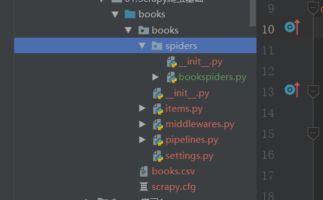
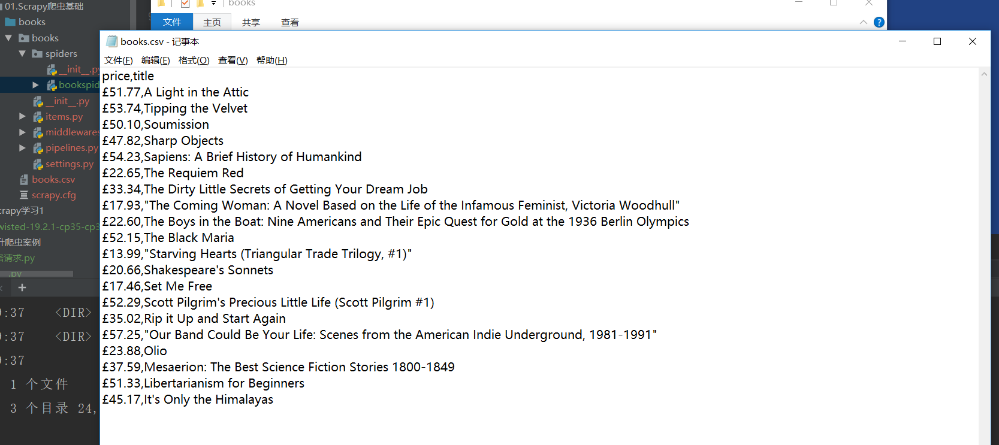
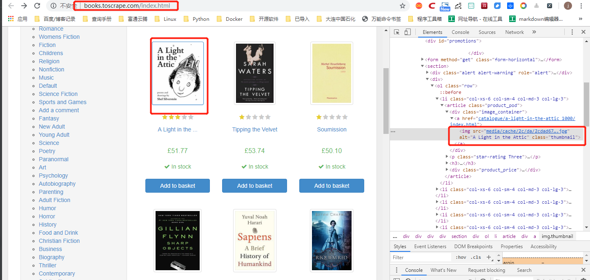
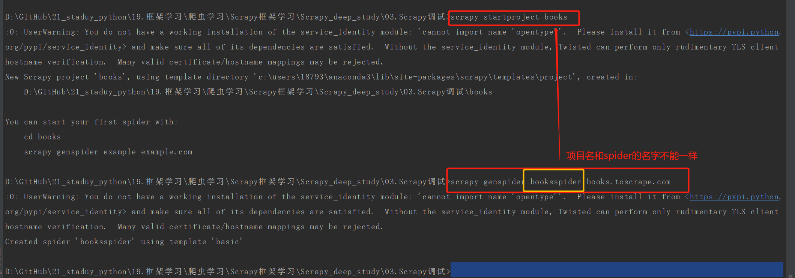
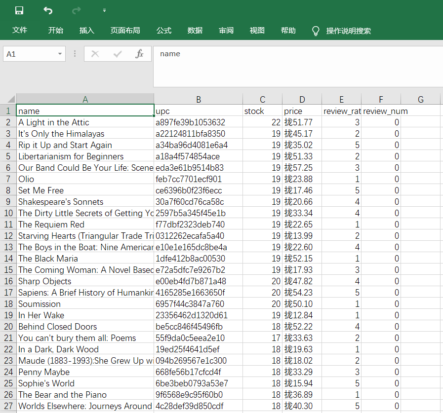

# Scrapy框架深入学习
## 最简单的Scrapy爬虫程序：

①在CMD命令窗口中输入信息： `scrapy startproject books`



注意： 通过`scrapy startproject books` 会输出很多日志信息，可以通过`--nolog`参数控制不显示日志信息

`scrapy startproject books --nolog`


`bookspiders.py`

``` 
#!/usr/bin/env python
# -*- coding:utf8 -*-
# auther; 18793
# Date：2019/8/1 9:27
# filename: bookspiders.py
import scrapy


class Books(scrapy.Spider):
    name = 'books'  # 建立唯一爬虫名，调用CMD命令时会用到
    start_urls = ['http://books.toscrape.com/']  # 爬取开始地址

    def parse(self, response):  # 默认解析函数
        infos = response.xpath('//article')  # 直接使用response.xpath来解析信息
        for info in infos:
            title = info.xpath("h3/a/@title").extract()  # 最终提取信息时，加上.extract()
            price = info.xpath('div/p[@class="price_color"]/text()').extract()

            yield {'title': title, 'price': price}  # 生成器返回数据信息

```

运行命令 `scrapy crawl books -o books.csv`

查看结果如下



当然，如果要爬取下一页的页面，共计50页，可以在parse()函数下添加以下代码，然后运行上述代码即可获取每页20条，

共计1000条的图书标题以及价格信息：

``` 
        next_url = response.xpath('//li[@class="next"]/a/@href').extract()[0]
        if next_url:
            next_url = response.urljoin(next_url)
            yield Request(next_url, callback=self.parse)
```


## 新闻供稿爬虫的Scrapy实现
``` 
scrapy startproject chinanews_crawler
```


``` 
$ tree chinanews_crawler
chinanews_crawler
├── chinanews_crawler
│   ├── __init__.py      # 包定义
│   ├── __pycache__
│   ├── items.py         #模型定义
│   ├── middlewares.py   
│   ├── pipelines.py     #管道定义
│   ├── settings.py      #配置文件
│   └── spiders          #蜘蛛文件夹
│       ├── __init__.py  #默认的蜘蛛代码文件
│       └── __pycache__
└── scrapy.cfg           # Scrapy的运行配置文件
```

快速生成蜘蛛命令工具：

`scrapy genspider chinanews chanews.com`

#### 构建模型
`items.py` 构建模型的方式编写一个`ChinanewsCrawlerItem`类，用于承载爬取回来的数据内容。


``` 
# -*- coding: utf-8 -*-

# Define here the models for your scraped items
#
# See documentation in:
# https://docs.scrapy.org/en/latest/topics/items.html

from scrapy.item import Item, Field


class ChinanewsCrawlerItem(Item):
    # define the fields for your item here like:
    # name = scrapy.Field()
    title = Field()  # 标题
    link = Field()  # 新闻详情链接
    desc = Field()  # 新闻综述
    pub_date = Field()  # 发布日期

```


#### 编写爬虫程序
`chinanews.py`

``` 
# -*- coding: utf-8 -*-
from scrapy.spiders import Spider
from bs4 import BeautifulSoup
from scrapy.http import Request
from chinanews_crawler.items import ChinanewsCrawlerItem


class ChinanewsSpider(Spider):
    name = 'chinanews'  # 项目名称
    allowed_domains = ['chanews.com']  # 只爬取该域内的内容，自动过滤链接到其他域的内容,此项可以不声明
    start_urls = ('http://www.chinanews.com/rss/rss_2.html',)  # 蜘蛛被启动并产生第一批请求时的URL数组

    def parse(self, response):
        rss_page = BeautifulSoup(response.body, 'html.parser')
        rss_links = set([item['href'] for item in rss_page.find_all('a')])

        for link in rss_links:
            yield Request(url=link, callback=self.parse_feed, dont_filter=True)     #忽略打开异常的网页，打不开的网页直接跳过

    def parse_feed(self, response):
        rss = BeautifulSoup(response.body, 'lxml')

        for item in rss.find_all('item'):
            feed_item = ChinanewsCrawlerItem()
            feed_item['title'] = item.title.text,
            feed_item['link'] = item.link.text,
            feed_item['desc'] = item.description.text,
            feed_item['pub_date'] = item.pubdate.text

            yield feed_item


# 导入CrawlerProcess类
from scrapy.crawler import CrawlerProcess

# 获取项目的设置信息
from scrapy.utils.project import get_project_settings

if __name__ == '__main__':
    # 创建CrawlerProcess类对象，并将获取的设置信息传入
    process = CrawlerProcess(get_project_settings())
    # 设置需要启动的爬虫名称
    process.crawl('chinanews')
    # 启动爬虫
    process.start()


```

设置数据输出的保存格式，可以利用Scrapy的配置让Scrapy默认输出到JSON文件，配置`setting.py`文件如下：
``` 
USER_AGENT = 'Mozilla/5.0 (Macintosh; Intel Mac OS X 10_8_3) AppleWebKit/536.5 (KHTML, like Gecko) Chrome/19.0.1084.54 Safari/536.5'
DOWNLOAD_DELAY = 0.5  # 休眠时间0.5s

# # csv格式存储
# FEED_URI = 'chinanews.csv'
# FEEED_FORMAT = "csv"  # 存入csv文件
# FEED_EXPORT_ENCODING = "gb18030"    #设置编码
# # Obey robots.txt rules

ROBOTSTXT_OBEY = False

#json格式存储
FEED_URI = 'chinanews.json'
FEEED_FORMAT = "json"  # 存入json文件
FEED_EXPORT_ENCODING = "utf-8"        #设置中文编码

```

然后启动爬虫
 
 `scrapy crawl chinanews`
 输出结果如下：
 
 


#### 导入CrawlerProcess类

在文件`chinanews.py`中导入CrawlerProcess类，可以直接以主程序的方式运行爬虫蜘蛛程序。

``` 
# 导入CrawlerProcess类
from scrapy.crawler import CrawlerProcess

# 获取项目的设置信息
from scrapy.utils.project import get_project_settings

if __name__ == '__main__':
    # 创建CrawlerProcess类对象，并将获取的设置信息传入
    process = CrawlerProcess(get_project_settings())
    # 设置需要启动的爬虫名称
    process.crawl('chinanews')
    # 启动爬虫
    process.start()

```


## Scrapy常用函数及方法

1.spider开发流程：

最简单的Spider只需4个步骤：

`1).继承scrapy.Spider；`

`2).为Spider取名；`

`3).设置爬取的起始点；`

`4).实现页面解析函数。`

其中，Spider是一个基类，后面我们使用到的所有其他爬虫都需要继承这个Spider基类，

例如：CrawlSpider，XMLFeedSpider，CSVFeedSpider，SitemapSpider等，这些类全部位于scrapy\spiders目录之下。

实际上设置完爬取起始点后，默认由start_reqeusts()方法构建Request对象，然后默认指定由parse方法作为页面解析函数。如果我们希望为Request添加特定的请求头部或想为Request指定特定的页面解析函数，可以考虑在构建的Spider类中实现start_requests方法，即可覆盖基类Spider的start_requests方法。
例如，在第一章的基础上进行修改：


``` 
import scrapy

class Books(scrapy.Spider):
    name = 'books'
    #start_urls = ['http://books.toscrape.com/']

    #实现start_requests方法，替代start_urls这个类属性
    def start_requests(self):
        yield scrapy.Request(url="http://books.toscrape.com/",
                             callback=self.parse_book,    #此时改用parse_book作为回调函数
                             headers={'User-Agent':'Mozilla/5.0'},
                             dont_filter=True)

    def parse_book(self,response):
        infos = response.xpath('//article')
        for info in infos:
            title = info.xpath("h3/a/@title").extract()[0]
            price = info.xpath('div/p[@class="price_color"]/text()').extract()[0]

            yield {'title': title, 'price': price}   
```


所以，设置爬取的起爬点有两种方法：

* 定义start_urls属性
* 改写start_requests方法

而第四个步骤，页面解析函数需要完成以下两个工作：

1).提取数据，将数据封装后（Item或字典）提交给Scrapy引擎；

2).提取链接，并用链接构造新的Request对象提交给Scrapy引擎；其中，提取链接的方法包括使用选择器或使用LinkExtractor。


### 2.常用方法

1)提取常用方法
```
.extract() 对结果以列表的形式进行返回
.extract_first() 对extract()返回的结果列表取第一个元素。
.re() #对结果使用正则表达式进行再提取
.re_first() #返回第一个re()结果。
```
2)调用selector的方法
selector类的实现位于scrapy.selector模块，通过创建对象即可使用css或xpath解析方法。

``` 
from scrapy.selector import Selector

class Book(scrapy.Spider):
    ...
    
    def parse(self,response):
        selector = Selector(response)
        infos = selector.xpath("//h1")
        ...
```

当然，实际开发中，我们无需创建Selector对象，因为当我们第一次访问Response对象的selector属性时，
Response对象会自动创建Selector对象，同时在Response对象中内置了selector对象的css和xpath方法以供使用。

``` 
class Book(scrapy.Spider):
    ...

    def parse(self,response):
        infos = response.xpath("//h1")
```


3)使用Item封装数据（items.py）
相对于使用字典来维护数据信息，使用item封装数据，有以下好处：

①清楚了解数据中包含哪些字段；

②包含对字段名字的检测；

③方便携带元数据，用于传递给其他组件的信息；

* 数据段的基类：Item基类
* 描述数据包含哪些字段的类：FIeld类

在items.py中这样写：

``` 
from scrapy import Item,Field

class BooksItem(Item):
    title = Field()
    price = Field()
```

在project为books，spiders文件夹下的books.py下这样写：
``` 
from books.items import BooksItem     #引入items.py中创建的对象

    def parse_book(self,response):
        infos = response.xpath('//article')
        book = BooksItem()   #实例化BooksItem()
        
        for info in infos:
            book['title'] = info.xpath("h3/a/@title").extract()[0]
            book['price'] = info.xpath('div/p[@class="price_color"]/text()').extract()[0]

            yield book      #返回book
```

4)使用Item Pipeline处理数据（pipelines.py）
Item Pipeline的几种典型应用：

* 清洗数据
* 验证数据的有效性
* 过滤重复的数据
* 将数据存入数据库

①Item Pipeline不需要继承特定基类，只需要实现特定方法，例如：process_item、open_spider、close_spider。

②一个Item Pipeline必须实现一个process_item(item,spider)方法，该方法用来处理每一项由Spider爬取到的数据，其中两个参数：
item: 爬取到的一项数据（Item或字典）
spider:爬取此项数据的Spider对象

`例如将Sharp Objects,£47.82中的英镑转换成人民币Sharp Objects,¥406.47。`

代码为：
``` 
class PriceConverterPipeline(object):
    
    exchange_rate = 8.5  #英镑对人民币汇率
    
    def process_item(self, item, spider):
        price = item['price'][1:] * self.exchange_rate
        item['price'] = price
        
        return item

```
写入MongoDB的代码，方式一：
``` 
import pymongo

class MongoDBPipeline(object):
    def __init__(self):
        client = pymongo.MongoClient('localhost',27017)
        test = client['test']
        book = test['book']
        self.post = book
        
    def process_item(self,item,spider):
        info = dict(item)
        self.post.insert(info)
        return item
```


写入MongoDB的代码，方式二：

``` 
import pymongo

class MongoDBPipeline(object):
    DB_URI = 'mongodb://localhost:27017/'
    DB_NAME = 'test'
    
    def open_spider(self,spider):
        self.client = pymongo.MongoClient(self.DB_URI)
        self.db = self.client[self.DB_NAME]
        
    def close_spider(self,spider):
        self.client.close()

    def process_item(self, item, spider):
        collection = self.db['book']
        post = dict(item)
        collection.insert_one(post)
        return item
```

过滤重复数据，这里以书名作为主键判断重复项，实际上应该以ISBN编号为主键，只是前面仅爬取了书名和价格。
``` 
from scrapy.exceptions import DropItem

class DuplicatesPipeline(object):
    def __init__(self):
        self.book_set = set()
        
    def process_item(self,item,spider):
        name = item['name']
        if name in self.book_set:
            raise DropItem('Duplicate book found:%s' %item)
        self.book_set.add(name)
        return item
```

由于Item Pipeline是可选的组件，想要启用某个Item Pipeline，需要在`settings.py`中可对`Item` `Pipeline`进行设置。

``` 
ITEM_PIPELINES = {
   'books.pipelines.PriceConverterPipeline': 300,
   'books.pipelines.MongoDBPipeline': 500,
   'books.pipelines.DuplicatesPipeline': 400,
}
```
其中，字典中的key为导入路径，后面的value是0~1000的数字。如果同时启动多个Pipeline，优先处理数字最小的Pipeline。

5)使用LinkExtractor提取链接
提取链接信息有两种方法，简单少量的链接使用Selector就足够了，而对于大量的链接或者复杂规则的链接，使用LinkExtractor更方便。
下面是代码的比较

* Selector()
``` 
next_url = response.xpath('//li[@class="next"]/a/@href').extract()[0]
if next_url:
    next_url = response.urljoin(next_url)
    yield scrapy.Request(next_url,callback=self.parse)
```

* LinkExtractor()
``` 
from scrapy.linkextractors import LinkExtractor
next = LinkExtractor(restrict_xpaths='//li[@class="next"]')  #LinkExtractor中添加限制条件，如果为空会提取页面的所有链接
links = next.extract_links(response)  #返回一个Link对象的列表，里面包含链接。

if links:
    next_url = links[0].url   #next_url[0]可获取Link对象，Link对象的url属性就是绝对地址，无需自己构建相对地址。
    yield scrapy.Request(next_url,callback=self.parse)
```


6)使用Exporter导出数据（settings.py）

* 可以使用命令行参数指定
* 通过配置文件指定

命令行：
 
 `scrapy crawl -o books.csv`

`scrapy crawl -o books.csv -t csv` ## -t可以省略


配置文件：

```
| 选项  |      含义      |  示例 |
|----------|:-------------:|------:|
| FEED_URI |  导出文件路径 | FEED_URI = 'books.csv' |
| FEED_FORMAT|    导出数据格式   |   FEED_FORMAT = 'csv' |
| FEED_EXPORT_ENCODING | 导出文件编码方式 |    FEED_EXPORT_ENCODING='gbk' |
| FEED_EXPORT_FIELDS| 指定导出哪些字段并排序 |    FEED_EXPORT_FIELDS={'title','price'} |
| FEED_EXPORTERS| 用户自定义Exporter字典，一般用于添加新的导出数据格式 |    FEED_EXPORTERS ={‘excel’:'项目名.新设置的py文件名.ExcelItemExporter'} |
```


## Scrapy项目调试

``` 
爬取网址：http://books.toscrape.com/index.html
爬取信息：书名，价格，评价等级，产品编码，库存量，评价数量
爬取方式：scrapy框架
存储方式：csv文件
```

1. 除了可以使用Chrome的开发者工具，还可以使用scrapy shell命令，在交互式环境下调试。
```
cd 03.Scrapy调试
scrapy shell


# 获取请求信息
In [2]: fetch("http://books.toscrape.com/index.html")
2019-08-01 13:55:07 [scrapy.core.engine] DEBUG: Crawled (200) <GET http://books.toscrape.com/index.html> (referer: None)

* 也可以采用下列带URL的命令：
scrapy shell http://books.toscrape.com/index.html
```


* 如果请求成功，可以看到：


2. 使用view(response)查看respone包含的页面：

`view(response)`

* view函数是scrapy爬虫下载的页面，比直接打开浏览器下载的页面更靠谱，因为有时这两个页面是不同的，常规操作下有时还必须借助查看网页源代码来确认元素的位置。

-由于response包含的页面也是用浏览器打开，接下来我们使用chrome进行元素审查。




3.提取信息

1）由于我们需要获取的信息都在详细页面里面，我们需要先`提取链接`，可以使用`LinkExtractor`：

用三条语句就可以获取到链接信息了，而且使用LinkExtractor时不需要告诉链接的具体位置，只需要告诉链接所在的范围，非常方便。


此处提取信息，以下几条命令提取出来的信息是一样的，请看：
```
le = LinkExtractor(restrict_css='article.product_pod')
le = LinkExtractor(restrict_css='article.product_pod div a')
le = LinkExtractor(restrict_xpaths='//article[@class="product_pod"]')
le = LinkExtractor(restrict_xpaths='//article[@class="product_pod"]/div/a')
```


2)获取下一页的链接地址


3)提取书的详细信息
使用fetch()命令，然后用view(response)即可看到请求页面。

```
In [61]: fetch("http://books.toscrape.com/catalogue/a-light-in-the-attic_1000/index.html")
2019-08-01 14:49:04 [scrapy.core.engine] DEBUG: Crawled (200) <GET http://books.toscrape.com/catalogue/a-light-in-the-attic_1000/index.html> (referer: None)

In [63]: view(response)
Out[63]: True
```


``` 
In [72]: info = response.xpath('//article/div[1]/div[2]/h1/text()').extract()[0]

In [73]: info
Out[73]: 'A Light in the Attic'


In [74]: price = response.xpath('//article/div[1]/div[2]/p[1]/text()').extract()[0]

In [75]: price
Out[75]: '£51.77'

```


当然，由于书名，价格，评价等级以及库存量均在一处，可以先找出大范围，然后再确定具体信息：
``` 
# 先抓大再抓小
In [87]: all = response.xpath('//*[@id="content_inner"]/article')


In [86]: all.xpath('div[1]/div[2]/h1/text()').extract()[0]
Out[86]: 'A Light in the Attic'

In [91]: price = all.xpath('div[1]/div[2]/p[1]/text()').extract()[0]
In [92]: price
Out[92]: '£51.77'


In [165]: all = response.xpath('//table[@class="table table-striped"]')

In [166]: all.re('((\d+) available)')[0]
Out[166]: '22 available'


In [173]: all.xpath('div[1]/div[2]/p[3]/@class')
Out[173]: [<Selector xpath='div[1]/div[2]/p[3]/@class' data='star-rating Three'>]


In [175]: all.xpath('div[1]/div[2]/p[3]/@class').extract()[0]
Out[175]: 'star-rating Three'


In [178]: all.xpath('div[1]/div[2]/p[3]/@class').extract()[0].split()[1]
Out[178]: 'Three'


```

4)scrapy shell的退出：`exit()`
``` 
exit()
```


4.编码实现

1)创建项目

`scrapy startproject books`

* 新建项目`scrapy startproject books`

```
cd  books
```

* 利用模板生成spider文件`scrapy genspider booksspider books.toscrape.com`




上述生成的booksspider.py文件：
``` 
# -*- coding: utf-8 -*-
import scrapy


class BooksspiderSpider(scrapy.Spider):
    name = 'booksspider'
    allowed_domains = ['books.toscrape.com']
    start_urls = ['http://books.toscrape.com/']

    def parse(self, response):
        pass
```

2)items.py
``` 
import scrapy

class BooksItem(scrapy.Item):
    name = scrapy.Field()            #书名
    price = scrapy.Field()           #价格
    review_rating = scrapy.Field()   #评价等级（1-5星）
    review_num = scrapy.Field()      #评价数量
    upc = scrapy.Field()             #产品编码
    stock = scrapy.Field()           #库存量
```


3)booksspider.py
``` 
# -*- coding: utf-8 -*-
import scrapy
from books.items import BooksItem
from scrapy.linkextractors import LinkExtractor


class BooksspiderSpider(scrapy.Spider):
    name = 'booksspider'
    allowed_domains = ['books.toscrape.com']
    start_urls = ['http://books.toscrape.com/']

    def parse(self, response):
        ##提取每本书的链接
        le = LinkExtractor(restrict_xpaths='//article[@class="product_pod"]')  ##具体位置在//article/div/a的标签中
        detail_urls = le.extract_links(response)
        for detail_url in detail_urls:
            yield scrapy.Request(detail_url.url, callback=self.parse_book)  ##记得使用.url提取出extract_links里面的链接。

        ##提取下一页的链接
        le2 = LinkExtractor(restrict_xpaths='//li[@class="next"]')
        next_url = le2.extract_links(response)[0].url
        yield scrapy.Request(next_url, callback=self.parse)

    def parse_book(self, response):
        ##提取每本书的具体信息
        item = BooksItem()
        info = response.xpath('//article[@class="product_page"]')
        item['name'] = info.xpath('div[1]/div[2]/h1/text()').extract()[0]
        item['price'] = info.xpath('div[1]/div[2]/p[1]/text()').extract()[0]
        item['review_rating'] = info.xpath('div[1]/div[2]/p[3]/@class').re('star-rating (\w+)')[0]

        info2 = response.xpath('//table[@class="table table-striped"]')
        item['upc'] = info2.re('<td>.*?</td>')[0].strip('<td>').strip('</td>')
        item['stock'] = info2.re_first('((\d+) available)').split()[0]
        # item['stock'] = info2.xpath('//tr[last()-1]/td/text()').re_first('\d+')  #使用last()获取标签的最后一个数字
        item['review_num'] = info2.re('<td>.*?</td>')[-1].strip('<td>').strip('</td>')
        # item['review_num'] = info2.xpath('//tr[last()]/td/text()').extract_first()
        yield item

```

运行`scrapy crawl booksspider -o books.csv`，结果为：


4)改进点
①`指定各列的次序`
在settings.py中加入以下代码：

②将评价等级中的One，Two，Three转变成1,2,3
在pipelines.py中加入以下代码：

``` 
# -*- coding: utf-8 -*-

# Define your item pipelines here
#
# Don't forget to add your pipeline to the ITEM_PIPELINES setting
# See: https://docs.scrapy.org/en/latest/topics/item-pipeline.html


class BooksPipeline(object):
    review_rating_map = {
        "One": 1,
        "Two": 2,
        "Three": 3,
        "Four": 4,
        "Five": 5
    }

    def process_item(self, item, spider):
        # rating = item.get('review_rating')  #获取review_rating的数据
        rating = item['review_rating']  # 与上面的语句等价
        item['review_rating'] = self.review_rating_map[rating]

        return item

```

在setttings.py中加入：
``` 
ITEM_PIPELINES = {
   'books.pipelines.BooksPipeline': 300,
}
```

结果为：



修改为`main.py`文件的方式运行

main.py
``` 
#!/usr/bin/env python
#-*- coding:utf8 -*-
# auther; 18793
# Date：2019/8/1 19:35
# filename: main.py

from scrapy import cmdline
cmdline.execute("scrapy crawl booksspider -o books.csv".split())
```

直接执行`main.py`文件即可运行程序。


~~修改`setting.py` 文件，修改存储格式为csv文件格式~~

~~setting.py~~


``` 

USER_AGENT = 'Mozilla/5.0 (Windows NT 10.0; Win64; x64) AppleWebKit/537.36 (KHTML, like Gecko) Chrome/75.0.3770.142 Safari/537.36'
DOWNLOAD_DELAY = 0.5  # 休眠时间0.5s

#csv格式存储
FEED_URI = 'books.csv'
FEEED_FORMAT = "csv"  # 存入csv文件
FEED_EXPORT_ENCODING = "gb18030"    #设置编码
```

`setting.py` 文件 中的设置

## 1.禁止Cookie
若要禁用Cookie的代码，只需要把`# COOKIES_ENABLED = False` 的注释去掉即可，
修改为 `COOKIES_ENABLED = False`
这样就可以禁用本地的Cookie，让那些通过用户的Cookie信息对用户进行识别和分析的网站无法识别我们，即无法禁止我们爬取。
``` 
# Disable cookies (enabled by default)
# COOKIES_ENABLED = False

COOKIES_ENABLED = False
```

## 2.设置下载延迟

`设置爬虫下载网页的时间间隔为0.5秒，将对于的值改为0.5即可。`

``` 
DOWNLOAD_DELAY = 0.5  # 休眠时间0.5s
```

## 3.使用IP池

直接编辑爬虫项目中的`setting.py`文件并添加如下信息：

```
#(2)
#IP池设置
IPPOOL=[
    {"ipaddr":"121.33.226.167:3128"},
    {"ipaddr":"118.187.10.11:80"},
    {"ipaddr":"123.56.245.138:808"},
    {"ipaddr":"139.196.108.68:80"},
    {"ipaddr":"36.250.87.88:47800"},
    {"ipaddr":"123.57.190.51:7777"},
    {"ipaddr":"171.39.26.176:8123"}
]
```
IPPOOL就是对于的代理服务器的IP池，外层通过列表的形式存储，里层通过字典的形式存储


当网站对IP进行封禁的时候，我们可以使用代理IP。
在项目核心目录下建立一个下载中间件，创建文件`middlewares.py`，可以将该文件作为下载中间件文件使用。

`middlewares.py`
``` 
#(3)
#middlewares下载中间件
#导入随机数模块，目的是随机挑选一个IP池中的ip
import random
#从settings文件（myfirstpjt.settings为settings文件的地址）中导入设置好的IPPOOL
from myfirstpjt.settings import IPPOOL
#导入官方文档中HttpProxyMiddleware对应的模块
from scrapy.contrib.downloadermiddleware.httpproxy import HttpProxyMiddleware

class IPPOOLS(HttpProxyMiddleware):
#初始化方法
    def __init__(self,ip=''):
        self.ip=ip
#process_request()方法，主要进行请求处理
    def process_request(self,request,spider):
#先随机选择一个IP
        thisip=random.choice(IPPOOL)
#输出当前选择的IP，便于调试观察
        print("当前使用的IP是："+thisip["ipaddr"])
#将对应的IP实际添加为具体的代理，用该IP进行爬取
        request.meta["proxy"]="http://"+thisip["ipaddr"]
```

编写好下载中间件之后，此时在Scrapy项目中，middlewares.py文件只是一个普通的python程序，并不会默认为下载中间件。
如果想让middlewares.py文件作为项目的下载中间件文件，还需要在`setting.py`文件中，与下载中间件相关的配置信息默认如下：

`setting.py`
``` 

#(4)
DOWNLOADER_MIDDLEWARES = {
    #'myfirstpjt.middlewares.MyCustomDownloaderMiddleware': 543,
    'scrapy.contrib.downloadermiddleware.httpproxy.HttpProxyMiddleware':123,
    'myfirstpjt.middlewares.IPPOOLS':125
}
```


随后我们可以运行该Scrapy项目下的爬虫文件了。
`Scrapy crawl weisuen --nolog`


## 4.使用用户代理池
网站服务器可以识别爬行时候的用户代理（User-Agent）信息，通过用户信息可以判断出我们使用的是什么浏览器、什么形式的客户端。

作为爬虫方，显然不希望这样被封禁，为了避免这一类的禁止，我们可以使用用户代理池进行处理。

这一种处理方式与IP代理池的处理方式类似，我们可以收集多种浏览器的信息，以此建立一个用户代理池，然后建立一个下载中间件，
在下载中间件中设置每次随机认识用户代理池中的一个用户代理进行爬行。

IP代理池中使用的下载中间件类型为`HttpProxyMiddleware`

用户代理池中使用的下载中间件类型为`UserAgentMiddleware`


①需要在`setting.py`配置文件中设置好用户代理池。代理池名称可以自定义，如下所示：
``` 
#用户代理（user-agent）池设置
UAPOOL=[
    "Mozilla/5.0 (Windows NT 6.1; WOW64) AppleWebKit/537.36 (KHTML, like Gecko) Chrome/49.0.2623.22 Safari/537.36 SE 2.X MetaSr 1.0",
    "Mozilla/5.0 (Windows NT 6.1; WOW64; rv:48.0) Gecko/20100101 Firefox/48.0",
    "Mozilla/5.0 (Windows NT 6.1) AppleWebKit/536.5"
]

```

②创建一个下载中间件文件`uamid.py`
``` 
#uamid下载中间件
import random
from myfirstpjt.settings import UAPOOL
from scrapy.contrib.downloadermiddleware.useragent import UserAgentMiddleware

class Uamid(UserAgentMiddleware):
    def __init__(self,ua=''):
        self.ua=ua
    def process_request(self,request,spider):
        thisua=random.choice(UAPOOL)
        print("当前使用的user-agent是："+thisua)
        request.headers.setdefault('User-Agent',thisua)

```

③ 需要在`setting.py`文件中将该Python文件设置为Scrapy中的下载中间件。打开`setting.py`文件，找到有关下载中间件设置的地方
(DOWNLOADER_MIDDLEWARES),修改为如下代码：
``` 
# Enable or disable downloader middlewares
# See http://scrapy.readthedocs.org/en/latest/topics/downloader-middleware.html
DOWNLOADER_MIDDLEWARES = {
    #'myfirstpjt.middlewares.MyCustomDownloaderMiddleware': 543,
    'scrapy.contrib.downloadermiddleware.useragent.UserAgentMiddleware':2,
    'myfirstpjt.uamid.Uamid':1
}
```


随后我们可以运行该Scrapy项目下的爬虫文件了。
`Scrapy crawl weisuen --nolog`


### 注意！：
如果要对爬取的网站进行爬取，默认遵守`robots.txt`爬虫协议,需要爬取，则让爬虫项目不遵循`robots.txt`规则即可。

打开爬虫项目下的`setting.py`文件，找到ROBOTSTXT部分的设置，默认设置如下所示：
```
# Obey robots.txt rules
ROBOTSTXT_OBEY = True
```

我们可以修改为：
``` 
# Obey robots.txt rules
ROBOTSTXT_OBEY = False
```
