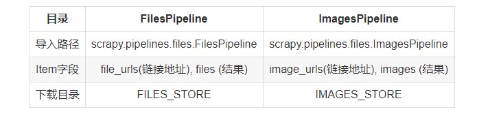

# Scrapy下载文件和图片

1.FilesPipeline 下载文件

2.ImagesPipeline 下载图片

这两个Item Pipeline可以看作特殊的下载器，使用时只需将链接传递给特定的字段（file_urls,image_urls）,即可处理下载任务。



* 文件下载例子：
① 在settings.py中启用FilesPipeline，通常排在其他Item Pipeline前面;

`ITEM_PIPELINES = {'scrapy.pipelines.files.FilesPipeline': 1,}`

②在settings.py中设置下载地址;

`FILES_STORE = '/filedownloads'`

③将解析后的链接传入file_urls字段。
``` 
def parse(self,response):
    ...
    item = BooksItem()
    item['file_urls'] = [download_urls]      #以列表形式传给file_urls
    #item['file_urls'].append(download_url)  #单个链接添加到列表中  
```


* 图片下载例子：
与上述例子差不多，只不过是传给‘image_urls’字段。同时针对图片提供了一些特有功能。

a. 为图片生成缩略图：开启次功能，只需在settings.py中进行设置IMAGES_THUMBS。

它是一个字典，上面可设置缩略图的尺寸，这样子的话，下载一张图片，本地会出现3张图（1张原图片，2张缩略图）：

``` 
IMAGES_THUMBS = {
    'small':(50,50),
    'big':(270,270),
}
```

b. 过滤掉尺寸过小的照片：在settings.py中设置IMAGES_MIN_WIDTH和IMAGES_MIN_HEIGHT：
``` 
IMAGES_MIN_WIDTH = 110
IMAGES_MIN_HEIGHT = 110
```

