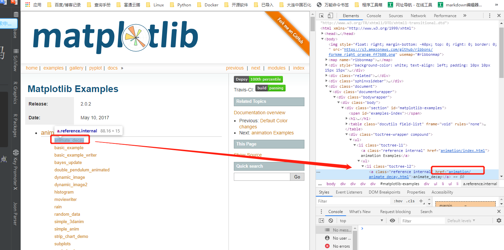
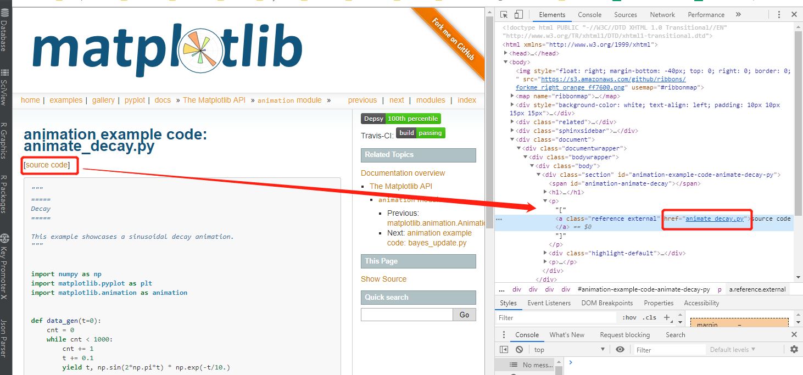

# 项目实战：爬取matplotlib源码文件

``` 
爬取网址：https://matplotlib.org/examples/
爬取信息：爬取所有例子源码
爬取方式：scrapy框架
存储方式：FilesPipeline

```

matplotlib是著名的python绘图库，通过例子列表进入页面阅读代码，点击‘source code’按钮即可下载源码文件。


1.用scrapy shell 分析页面：

`scrapy shell https://matplotlib.org/examples/index.html`


`view(response)`






* 获取了每个例子的详情链接

```

In [8]: link = response.xpath('//div[@class="toctree-wrapper compound"]/ul/li/ul/li/a/@href')

In [9]: len(link)
Out[9]: 506

In [10]: link.extract_first()
Out[10]: 'animation/animate_decay.html' 


In [2]:  from scrapy.linkextractors import LinkExtractor

In [3]: le = LinkExtractor(restrict_xpaths='//li[@class="toctree-l2"]/a')

In [4]: link = le.extract_links(response)

In [5]: link
Out[5]:
[Link(url='https://matplotlib.org/examples/animation/animate_decay.html', text='animate_decay', fragment='', nofollow=False),
 Link(url='https://matplotlib.org/examples/animation/basic_example.html', text='basic_example', fragment='', nofollow=False),

In [7]: link[0].url
Out[7]: 'https://matplotlib.org/examples/animation/animate_decay.html'


```

* -获取例子详情中source code的下载链接。

``` 

In [29]: fetch('https://matplotlib.org/examples/animation/animate_decay.html')
2019-08-02 15:28:11 [scrapy.core.downloader.tls] WARNING: Remote certificate is not valid for hostname "matplotlib.org"; 'ssl391862.cloudflaressl.com'!='matplotlib.org'
2019-08-02 15:28:12 [scrapy.core.engine] DEBUG: Crawled (200) <GET https://matplotlib.org/examples/animation/animate_decay.html> (referer: None)

In [30]: view(response)
Out[30]: True

In [31]: le = LinkExtractor(restrict_xpaths='//div[@class="section"]/p[1]/a')
In [32]: s_link = le.extract_links(response)

In [33]: s_link
Out[33]: [Link(url='https://matplotlib.org/examples/animation/animate_decay.py', text='source code', fragment='', nofollow=False)]

In [35]: s_link[0].url
Out[35]: 'https://matplotlib.org/examples/animation/animate_decay.py'
```

css 选择详细链接方式如下：
``` 

fetch('https://matplotlib.org/examples/index.html')


In [34]: le = LinkExtractor(restrict_css='#matplotlib-examples > div > ul > li > ul > li > a')

In [35]: links = le.extract_links(response)

In [40]: [ link.url for link in links ]
['https://matplotlib.org/examples/animation/animate_decay.html',
 'https://matplotlib.org/examples/animation/basic_example.html',
 'https://matplotlib.org/examples/animation/basic_example_writer.html',
 'https://matplotlib.org/examples/animation/bayes_update.html',
 'https://matplotlib.org/examples/animation/double_pendulum_anim
 
```

css 获取详下载链接面的方式:
``` 
fetch('https://matplotlib.org/examples/animation/animate_decay.html')

In [49]: le = LinkExtractor(restrict_css='#animation-example-code-animate-decay-py > p:nth-child(3) > a')

In [50]: link_urls = le.extract_links(response)

In [51]: [url.url for url in link_urls]
Out[51]: ['https://matplotlib.org/examples/animation/animate_decay.py']
```


2.实现代码：

`1)创建matplotlib项目，并根据genspider创建spider。`

`2)配置FilesPipeline，并指定下载目录。`

`3)实现Item`

`4)实现spider文件`


步骤01首先创建Scrapy项目,取名为`matplotlib_examples`，再使用`scrapy genspider`命令创建Spider


``` 
$ scrapy startproject matplotlib_examples
$ cd matplotlib_examples
$ scrapy genspider examples matplotlib.org
```


* 在settings.py中进行设置，并制定下载目录：

``` 
USER_AGENT = 'Mozilla/5.0 (Windows NT 10.0; Win64; x64) AppleWebKit/537.36 (KHTML, like Gecko) Chrome/75.0.3770.142 Safari/537.36'
DOWNLOAD_DELAY = 0.01

### 存储格式，可选项
#json格式存储
# FEED_URI = 'examples_src.json'
# FEEED_FORMAT = "json"  # 存入json文件
# FEED_EXPORT_ENCODING = "utf-8"        #设置中文编


# Obey robots.txt rules
ROBOTSTXT_OBEY = False

ITEM_PIPELINES = {
'scrapy.pipelines.files.FilesPipeline': 1,
}
FILES_STORE = 'examples_src

```


* 在item.py添加file_urls和files两个字段。
``` 
# -*- coding: utf-8 -*-

# Define here the models for your scraped items
#
# See documentation in:
# https://docs.scrapy.org/en/latest/topics/items.html

import scrapy


class MatplotlibDownloadItem(scrapy.Item):
    file_urls = scrapy.Field()
    files = scrapy.Field()
```


* 实现\spiders\matplot.py文件

``` 
# -*- coding: utf-8 -*-
import scrapy
from scrapy.linkextractors import LinkExtractor
from matplotlib_examples.items import MatplotlibDownloadItem


class MatplotSpider(scrapy.Spider):
    name = 'matplot'
    allowed_domains = ['matplotlib.org']
    start_urls = ['https://matplotlib.org/examples/index.html']

    def parse(self, response):
        le = LinkExtractor(restrict_xpaths='//li[@class="toctree-l2"]/a')
        detail_links = le.extract_links(response)
        for detail_link in detail_links:
            yield scrapy.Request(detail_link.url, callback=self.parse_url)

    def parse_url(self, response):
        item = MatplotlibDownloadItem()
        le2 = LinkExtractor(restrict_xpaths='//div[@class="section"]/p[1]/a')
        download_link = le2.extract_links(response)[0].url
        item['file_urls'] = [download_link]
        yield item


# # 导入CrawlerProcess类
# from scrapy.crawler import CrawlerProcess
#
# # 获取项目的设置信息
# from scrapy.utils.project import get_project_settings
#
# if __name__ == '__main__':
#     # 创建CrawlerProcess类对象，并将获取的设置信息传入
#     process = CrawlerProcess(get_project_settings())
#     # 设置需要启动的爬虫名称
#     process.crawl('matplot')
#     # 启动爬虫
#     process.start()

```


* 运行代码: `scrapy crawl matplot -o matplot.json`

或者 创建`main.py`文件。
``` 
#!/usr/bin/env python
#-*- coding:utf8 -*-
# auther; 18793
# Date：2019/8/2 17:10
# filename: main.py

from scrapy import cmdline
cmdline.execute("scrapy crawl matplot -o examples.json".split())
```


下载的文件目录被安置在：`source_download/full`目录下，
而且文件名字是长度相等的奇怪数字，这些数字是下载文件urlde sha1散列值，

虽然这样能避免名字重复，但是文件名不直观，很难对应文件内容，所以需要重新写一个脚本，
依据matplot.json文件中的信息进行重命名。


下面生成FilesPipeline的子类，对file_path方法中的命名规则进行重写。以具体文件为例：
`https://matplotlib.org/examples/animation/animate_decay.py`

animation为类别，

animate_decay.py为文件名，

animation/animate_decay.py为文件路径。


在`pipelines.py`中添加代码如下：

``` 
from scrapy.pipelines.files import FilesPipeline
import os

class MyFilesPipeline(FilesPipeline):

    def file_path(self, request, response=None, info=None):
        folder = request.url.split('/')[-2]
        filename = request.url.split('/')[-1]
        return os.path.join(folder,filename)

```

在settings.py中添加代码如下：
``` 
ITEM_PIPELINES = {
    # 'scrapy.pipelines.files.FilesPipeline': 1,
    'matplotlib_examples.pipelines.MyFilesPipeline': 1,
}
FILES_STORE = 'examples_src'
```


结果如下：


https://www.jianshu.com/p/b35f9722b031