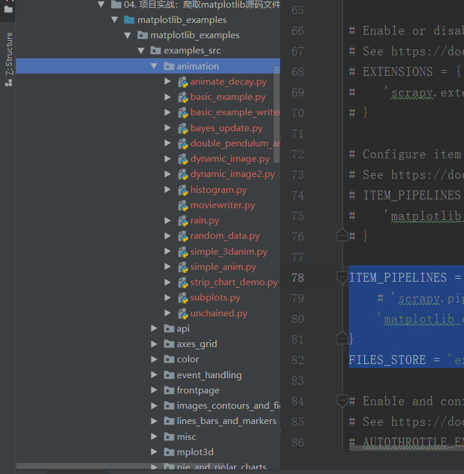

.. role:: raw-latex(raw)
   :format: latex
..

.. contents::
   :depth: 3
..

项目实战：爬取matplotlib源码文件
================================

::

   爬取网址：https://matplotlib.org/examples/
   爬取信息：爬取所有例子源码
   爬取方式：scrapy框架
   存储方式：FilesPipeline

matplotlib是著名的python绘图库，通过例子列表进入页面阅读代码，点击‘source
code’按钮即可下载源码文件。

1.用scrapy shell 分析页面：

``scrapy shell https://matplotlib.org/examples/index.html``

``view(response)``

.. image:: ../../../_static/scrapy-matp00001.png

-  获取了每个例子的详情链接

::

   In [8]: link = response.xpath('//div[@class="toctree-wrapper compound"]/ul/li/ul/li/a/@href')

   In [9]: len(link)
   Out[9]: 506

   In [10]: link.extract_first()
   Out[10]: 'animation/animate_decay.html' 

   In [2]:  from scrapy.linkextractors import LinkExtractor

   In [3]: le = LinkExtractor(restrict_xpaths='//li[@class="toctree-l2"]/a')

   In [4]: link = le.extract_links(response)

   In [5]: link
   Out[5]:
   [Link(url='https://matplotlib.org/examples/animation/animate_decay.html', text='animate_decay', fragment='', nofollow=False),
    Link(url='https://matplotlib.org/examples/animation/basic_example.html', text='basic_example', fragment='', nofollow=False),

   In [7]: link[0].url
   Out[7]: 'https://matplotlib.org/examples/animation/animate_decay.html'

-  -获取例子详情中source code的下载链接。

::

   In [29]: fetch('https://matplotlib.org/examples/animation/animate_decay.html')
   2019-08-02 15:28:11 [scrapy.core.downloader.tls] WARNING: Remote certificate is not valid for hostname "matplotlib.org"; 'ssl391862.cloudflaressl.com'!='matplotlib.org'
   2019-08-02 15:28:12 [scrapy.core.engine] DEBUG: Crawled (200) <GET https://matplotlib.org/examples/animation/animate_decay.html> (referer: None)

   In [30]: view(response)
   Out[30]: True

   In [31]: le = LinkExtractor(restrict_xpaths='//div[@class="section"]/p[1]/a')
   In [32]: s_link = le.extract_links(response)

   In [33]: s_link
   Out[33]: [Link(url='https://matplotlib.org/examples/animation/animate_decay.py', text='source code', fragment='', nofollow=False)]

   In [35]: s_link[0].url
   Out[35]: 'https://matplotlib.org/examples/animation/animate_decay.py'

css 选择详细链接方式如下：

::

   fetch('https://matplotlib.org/examples/index.html')

   In [34]: le = LinkExtractor(restrict_css='#matplotlib-examples > div > ul > li > ul > li > a')

   In [35]: links = le.extract_links(response)

   In [40]: [ link.url for link in links ]
   ['https://matplotlib.org/examples/animation/animate_decay.html',
    'https://matplotlib.org/examples/animation/basic_example.html',
    'https://matplotlib.org/examples/animation/basic_example_writer.html',
    'https://matplotlib.org/examples/animation/bayes_update.html',
    'https://matplotlib.org/examples/animation/double_pendulum_anim
    

css 获取详下载链接面的方式:

::

   fetch('https://matplotlib.org/examples/animation/animate_decay.html')

   In [49]: le = LinkExtractor(restrict_css='#animation-example-code-animate-decay-py > p:nth-child(3) > a')

   In [50]: link_urls = le.extract_links(response)

   In [51]: [url.url for url in link_urls]
   Out[51]: ['https://matplotlib.org/examples/animation/animate_decay.py']

2.实现代码：

``1)创建matplotlib项目，并根据genspider创建spider。``

``2)配置FilesPipeline，并指定下载目录。``

``3)实现Item``

``4)实现spider文件``

步骤01首先创建Scrapy项目,取名为\ ``matplotlib_examples``\ ，再使用\ ``scrapy genspider``\ 命令创建Spider

::

   $ scrapy startproject matplotlib_examples
   $ cd matplotlib_examples
   $ scrapy genspider examples matplotlib.org

-  在settings.py中进行设置，并制定下载目录：

::

   USER_AGENT = 'Mozilla/5.0 (Windows NT 10.0; Win64; x64) AppleWebKit/537.36 (KHTML, like Gecko) Chrome/75.0.3770.142 Safari/537.36'
   DOWNLOAD_DELAY = 0.01

   ### 存储格式，可选项
   #json格式存储
   # FEED_URI = 'examples_src.json'
   # FEEED_FORMAT = "json"  # 存入json文件
   # FEED_EXPORT_ENCODING = "utf-8"        #设置中文编

   # Obey robots.txt rules
   ROBOTSTXT_OBEY = False

   ITEM_PIPELINES = {
   'scrapy.pipelines.files.FilesPipeline': 1,
   }
   FILES_STORE = 'examples_src

-  在item.py添加file_urls和files两个字段。

::

   # -*- coding: utf-8 -*-

   # Define here the models for your scraped items
   #
   # See documentation in:
   # https://docs.scrapy.org/en/latest/topics/items.html

   import scrapy

   class MatplotlibDownloadItem(scrapy.Item):
       file_urls = scrapy.Field()
       files = scrapy.Field()

-  实现:raw-latex:`\spiders`:raw-latex:`\matplot`.py文件

::

   # -*- coding: utf-8 -*-
   import scrapy
   from scrapy.linkextractors import LinkExtractor
   from matplotlib_examples.items import MatplotlibDownloadItem

   class MatplotSpider(scrapy.Spider):
       name = 'matplot'
       allowed_domains = ['matplotlib.org']
       start_urls = ['https://matplotlib.org/examples/index.html']

       def parse(self, response):
           le = LinkExtractor(restrict_xpaths='//li[@class="toctree-l2"]/a')
           detail_links = le.extract_links(response)
           for detail_link in detail_links:
               yield scrapy.Request(detail_link.url, callback=self.parse_url)

       def parse_url(self, response):
           item = MatplotlibDownloadItem()
           le2 = LinkExtractor(restrict_xpaths='//div[@class="section"]/p[1]/a')
           download_link = le2.extract_links(response)[0].url
           item['file_urls'] = [download_link]
           yield item

   # # 导入CrawlerProcess类
   # from scrapy.crawler import CrawlerProcess
   #
   # # 获取项目的设置信息
   # from scrapy.utils.project import get_project_settings
   #
   # if __name__ == '__main__':
   #     # 创建CrawlerProcess类对象，并将获取的设置信息传入
   #     process = CrawlerProcess(get_project_settings())
   #     # 设置需要启动的爬虫名称
   #     process.crawl('matplot')
   #     # 启动爬虫
   #     process.start()

-  运行代码: ``scrapy crawl matplot -o matplot.json``

或者 创建\ ``main.py``\ 文件。

::

   #!/usr/bin/env python
   #-*- coding:utf8 -*-
   # auther; 18793
   # Date：2019/8/2 17:10
   # filename: main.py

   from scrapy import cmdline
   cmdline.execute("scrapy crawl matplot -o examples.json".split())

.. image:: ../../../_static/full_download0001.png

下载的文件目录被安置在：\ ``source_download/full``\ 目录下，
而且文件名字是长度相等的奇怪数字，这些数字是下载文件urlde sha1散列值，

虽然这样能避免名字重复，但是文件名不直观，很难对应文件内容，所以需要重新写一个脚本，
依据matplot.json文件中的信息进行重命名。

下面生成FilesPipeline的子类，对file_path方法中的命名规则进行重写。以具体文件为例：
``https://matplotlib.org/examples/animation/animate_decay.py``

animation为类别，

animate_decay.py为文件名，

animation/animate_decay.py为文件路径。

在\ ``pipelines.py``\ 中添加代码如下：

::

   from scrapy.pipelines.files import FilesPipeline
   import os

   class MyFilesPipeline(FilesPipeline):

       def file_path(self, request, response=None, info=None):
           folder = request.url.split('/')[-2]
           filename = request.url.split('/')[-1]
           return os.path.join(folder,filename)

在settings.py中添加代码如下：

::

   ITEM_PIPELINES = {
       # 'scrapy.pipelines.files.FilesPipeline': 1,
       'matplotlib_examples.pipelines.MyFilesPipeline': 1,
   }
   FILES_STORE = 'examples_src'

结果如下： |image1|

https://www.jianshu.com/p/b35f9722b031

